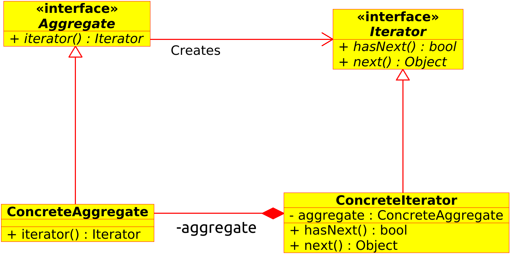

# 设计模式 𝘾 语言描述

## Iterator 模式

::: tip
Iterator 模式用于在数据集合中按照顺序遍历集合，Iterator 模式的优势在于将遍历与实现分离开。
:::

### 类图

::: tip
**next**：返回当前元素，并指向下一个元素。

**hasNext**：确认接下来是否可以调用 next 方法。
:::

### 示例程序

[将书放置到书架中，并将书的名字按顺序显示出来](https://github.com/suda-morris/CDesignPattern/blob/master/Iterator/)

### 与 Vistor 模式的差别
Iterator 模式是从集合中一个一个取出元素进行遍历，但是并没有在 Iterator 接口中声明对取出的元素进行何种处理。
Vistor 模式则是在便利元素集合的过程中，对元素进行相同的处理。
