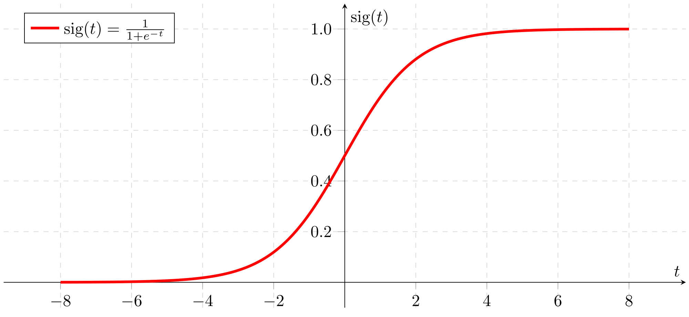

# 逻辑回归

:::tip
Logistic 回归虽然是名字中带有“回归”，但实际上它是一种**分类算法**，主要应用与**二分类**问题(输出只有两种结果，比如 0 和 1 )，其实质可以看作是一种简单的**神经网络**。
:::


## 数学公式推导

假设神经元的突触的权重向量为**w**，线性偏置为**b**(标量)，对于第i个样本$x^{(i)}$来说：

$$z^{(i)} = w^T x^{(i)} + b$$

得到的$z^{(i)}$需要进一步输入激活函数，激活函数的选择有很多种，考虑到Logistic回归的输出只有0和1两种情况，因此选用sigmoid函数会比较符合要求：

$$\hat{y}^{(i)}=a^{(i)}=sigmoid(z^{(i)})$$

sigmoid函数的导数：

$$\frac{da}{dz}=a(1-a)$$



如何衡量预测结果的好坏，需要定义损失函数**L**：

$$L(a^{(i)},y^{(i)})=- y^{(i)}\ln(a^{(i)})-(1-y^{(i)})\ln(1-a^{(i)})$$

那么价值函数**J**就是所有样本的损失值的平均：

$$J=\frac{1}{m}\sum_{i=1}^mL(a^{(i)}, y^{(i)})$$

我们的目标是通过多次的迭代，求得使得**J**最小的自变量参数w和b，这里使用的优化算法为梯度下降法，其中α称为学习率，是0~1之间的浮点数：

$$\theta=\theta-\alpha d\theta$$

我们把求解价值函数的过程称为**正向传播**，把求解梯度的过程称为**反向传播**

价值函数对于第j个突触$w_j$的梯度：

$$\frac{\partial J}{\partial w_j}=\frac{1}{m}\sum_{i=1}^m\frac{\partial}{\partial w_j}[-y^{(i)}\ln{(a^{(i)})}-(1-y^{(i)})\ln{(1-a^{(i)})}]\\
=\frac{1}{m}\sum_{i=1}^{m}[\frac{-y^{(i)}}{a^{(i)}}\cdot\frac{\partial{a^{(i)}}}{\partial{w_j}}+\frac{(1-y^{i})}{1-a^{(i)}}\cdot\frac{\partial{a^{i}}}{\partial{w_j}}]\\
=\frac{1}{m}\sum_{i=1}^{m}[\frac{\partial{a^{(i)}}}{\partial{w_j}}\cdot(\frac{1-y^{(i)}}{1-a^{(i)}}-\frac{y^{(i)}}{a^{(i)}})]\\
=\frac{1}{m}\sum_{i=1}^{m}[\frac{d{a^{(i)}}}{d{z^{(i)}}}\cdot\frac{\partial{z^{(i)}}}{\partial{w_j}}\cdot(\frac{1-y^{(i)}}{1-a^{(i)}}-\frac{y^{(i)}}{a^{(i)}})]\\
=\frac{1}{m}\sum_{i=1}^{m}[a^{(i)}\cdot(1-a^{(i)})\cdot x_j^{(i)}\cdot\frac{a^{(i)}-y^{(i)}}{a^{(i)}\cdot(1-a^{(i)})}]\\
=\frac{1}{m}\sum_{i=1}^{m}[x_j^{(i)}\cdot(a^{(i)}-y^{(i)})]$$

价值函数**J**对于所有突触的权重向量**w**的梯度：

$$\frac{\partial J}{\partial w}=\frac{1}{m}X(A-Y)^T$$

价值函数**J**对偏置**b**的梯度：

$$\frac{\partial J}{\partial b}=\frac{1}{m}\sum_{i=1}^m (a^{(i)}-y^{(i)})$$

所以，每一次迭代的过程中，对w和b的**更新规则**为：

$$w:=w-\alpha\frac{\partial{J}}{\partial{w}}$$

$$b:=b-\alpha\frac{\partial{J}}{\partial{b}}$$

## Python程序编写

```python
# -*- coding: utf-8 -*-
import matplotlib.pyplot as plt
import numpy as np
import pandas as pd


def sigmoid(z):
    """
    Compute the sigmoid of z
    :param z: A scalar or numpy array of any size.
    :return: sigmoid(z)
    """
    s = 1.0 / (1 + np.exp(-1 * z))
    return s


class LogisticRegression(object):
    def __init__(self, num_iterations=2000, learning_rate=0.001, print_cost=False):
        """
        Builds the logistic regression model
        :param num_iterations: hyperparameter representing the number of iterations to optimize the parameters
        :param learning_rate: hyperparameter representing the learning rate when update the parameters
        :param print_cost: Set to true to print the cost every 100 iterations
        """
        self.n_iter = num_iterations
        self.learn_rate = learning_rate
        self.print_cost = print_cost
        self.w = None  # weights, a numpy array of size
        self.b = None  # bias, a scalar

    def __initialize_with_zeros(self, dim):
        """
        This function creates a vector of zeros of shape (dim, 1) for w and initializes b to 0.
        :param dim: size of the w vector we want
        :return: w -- initialized vector of shape (dim, 1); b -- initialized scalar (corresponds to the bias)
        """
        w = np.zeros((dim, 1))
        b = 0
        assert (w.shape == (dim, 1))
        assert (isinstance(b, float) or isinstance(b, int))

        return w, b

    def __propagate(self, X, Y):
        """
        Implement the cost function and its gradient for the propagation
        :param X: input data
        :param Y: label vector
        :return: grads --- results of backward propagation; cost --- results of forward propagation
        """
        m = X.shape[1]
        # FORWARD PROPAGATION (FROM X TO COST)
        Z = np.dot(self.w.T, X) + self.b
        A = sigmoid(Z)  # compute activation
        cost = -1 / m * (np.dot(Y, np.log(A).T) + np.dot(1 - Y, np.log((1 - A)).T))  # compute cost

        # BACKWARD PROPAGATION (TO FIND GRAD)
        dw = 1 / m * (np.dot(X, (A - Y).T))  # gradient of the loss with respect to w, thus same shape as w
        db = np.sum(A - Y) / m  # gradient of the loss with respect to b, thus same shape as b

        assert (dw.shape == self.w.shape)
        assert (db.dtype == float)
        cost = np.squeeze(cost)
        assert (cost.shape == ())

        grads = {"dw": dw,
                 "db": db}
        return grads, cost

    def fit(self, X_train, Y_train):
        """
        This function optimizes w and b by running a gradient descent algorithm
        :param X_train: input data
        :param Y_train: label vector
        :return: costs -- list of all the costs computed during the optimization
        """
        # initialize parameters with zeros
        self.w, self.b = self.__initialize_with_zeros(X_train.shape[0])
        costs = []
        for i in range(self.n_iter):
            grads, cost = self.__propagate(X_train, Y_train)  # Cost and gradient calculation
            dw = grads["dw"]
            db = grads["db"]
            # update rule
            self.w -= self.learn_rate * dw
            self.b -= self.learn_rate * db
            # Record the costs
            if i % 100 == 0:
                costs.append(cost)
            # Print the cost every 100 training examples
            if self.print_cost and i % 100 == 0:
                print("Cost after iteration %i: %f" % (i, cost))

        return costs

    def predict(self, X_test):
        """
        Predict whether the label is 0 or 1 using learned logistic regression parameters (w, b)
        :param X_test: input data
        :return: Y_prediction -- a numpy array (vector) containing all predictions (0/1) for the examples in X_test
        """
        m = X_test.shape[1]
        Y_prediction = np.zeros((1, m))
        w = self.w.reshape(X_test.shape[0], 1)
        # Compute vector "A" predicting the probabilities
        A = sigmoid(np.dot(w.T, X_test) + self.b)
        # Convert probabilities A[0,i] to actual predictions p[0,i]
        Y_prediction = np.where(A > 0.5, [1], [0])
        assert (Y_prediction.shape == (1, m))
        return Y_prediction


if __name__ == "__main__":
    train_size = 150
    df = pd.read_csv("iris.csv", header=None)
    Y_train = df.loc[0:train_size - 1, 4].values
    Y_train = np.where(Y_train == "Iris-setosa", [1], [0])
    Y_train = Y_train.reshape((1, train_size))
    X_train = df.loc[0:train_size - 1, [0, 2]].values
    feature1_min, feature1_max = X_train[:, 0].min() - 1, X_train[:, 0].max() + 1
    feature2_min, feature2_max = X_train[:, 1].min() - 1, X_train[:, 1].max() + 1
    X_train = X_train.T.reshape((2, train_size))
    clf = LogisticRegression(num_iterations=2000, learning_rate=0.001, print_cost=True)
    clf.fit(X_train, Y_train)

    # 将向量扩充为二维矩阵，作为测试样本
    xx1, xx2 = np.meshgrid(np.arange(feature1_min, feature1_max, 0.02), np.arange(feature2_min, feature2_max, 0.02))
    X_test = np.array([xx1.ravel(), xx2.ravel()])
    # 预测结果
    Y_prediction = clf.predict(X_test)
    Y_prediction = Y_prediction.reshape(xx1.shape)
    # 数据可视化
    markers = ('s', 'x')
    colors = ("red", "blue")
    plt.contourf(xx1, xx2, Y_prediction, c="gray")
    plt.xlim(feature1_min, feature1_max)
    plt.ylim(feature2_min, feature2_max)
    for idx, y_train in enumerate(np.unique(Y_train)):
        plt.scatter(x=X_train[0, np.squeeze(Y_train == y_train)], y=X_train[1, np.squeeze(Y_train == y_train)],
                    alpha=0.8, c=colors[idx],
                    marker=markers[idx], label=y_train)
    plt.xlabel(u"花瓣长度", fontproperties='SimHei')
    plt.ylabel(u"花茎长度", fontproperties='SimHei')
    plt.legend(loc="upper left")
    plt.show()
```

