# 𝙇𝙬𝙄𝙋 基础

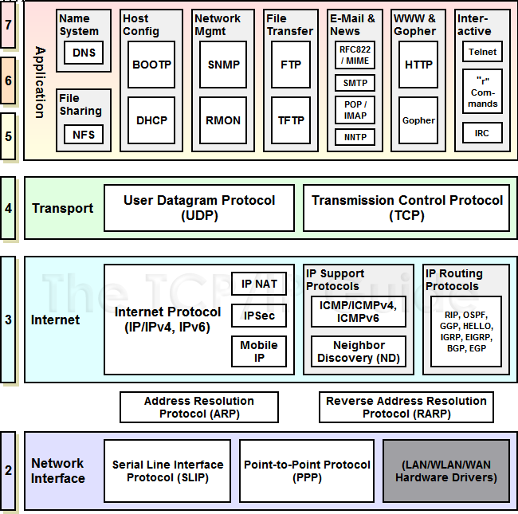

## 标准以太网数据帧格式

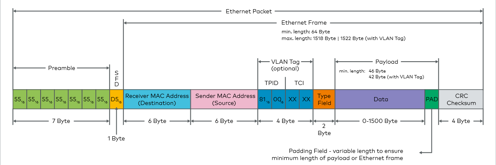

:::tip

MAC 地址可以分成三类：

1. 单播地址：第一个字节的 bit0 必须是 0
2. 组播地址：第一个字节的 bit- 必须是 1
3. 广播地址：FF-FF-FF-FF-FF-FF

:::

## LwIP 的网络接口管理

LwIP 使用 **netif** 结构体来描述硬件网络接口，并通过 `netif_add` 函数将其挂载到全局 **netif 链表**中。

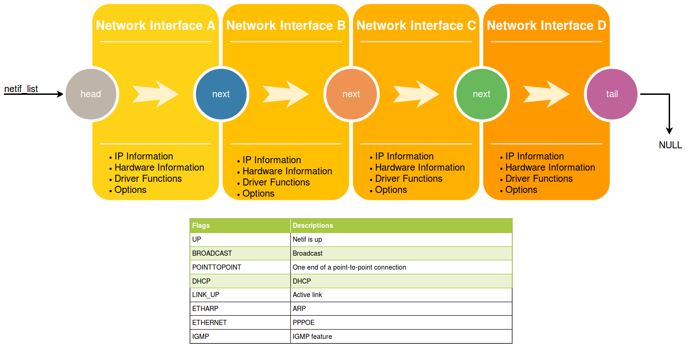

### netif 结构体

```c
/* struct netif 用于描述不同类型的网卡，在网卡初始化方法中，用户需要指定如下成员：
** hwaddr_len, hwaddr[], mtu, flags
*/
struct netif
{
    /* 如果支持多网卡，则使用单向链表来管理同一设备的多个网卡 */
#if !LWIP_SINGLE_NETIF
    struct netif *next;
#endif

#if LWIP_IPV4
    /* 网络字节序表示的 IPv4 地址，子网掩码，默认网关 */
    ip_addr_t ip_addr;
    ip_addr_t netmask;
    ip_addr_t gw;
#endif /* LWIP_IPV4 */
#if LWIP_IPV6
    /* 数组保存多个 IPv6 地址 */
    ip_addr_t ip6_addr[LWIP_IPV6_NUM_ADDRESSES];
    /* 每个 IPv6 地址的状态：临时的还是首选的 */
    u8_t ip6_addr_state[LWIP_IPV6_NUM_ADDRESSES];
#if LWIP_IPV6_ADDRESS_LIFETIMES
    /* 每个 IPv6 地址的剩余有效时间以及总共有效时间，单位：秒 */
    /* IP6_ADDR_LIFE_STATIC 表示这个地址是静态分配的 */
    u32_t ip6_addr_valid_life[LWIP_IPV6_NUM_ADDRESSES];
    u32_t ip6_addr_pref_life[LWIP_IPV6_NUM_ADDRESSES];
#endif /* LWIP_IPV6_ADDRESS_LIFETIMES */
#endif /* LWIP_IPV6 */
    /* 此函数由以太网设备驱动程序调用，将数据包传递给 TCP/IP 协议栈 */
    /* 对于以太网设备，通常是 ethernet_input() */
    netif_input_fn input;
#if LWIP_IPV4
    /* 此函数由 IPv4 模块调用，该函数会解析得到硬件地址，然后发送数据包 */
    /* 对于以太网设备，通常是 etharp_output() */
    netif_output_fn output;
#endif /* LWIP_IPV4 */
    /* 此函数由 ARP 模块调用，用于实现在数据链路层发送数据 */
    netif_linkoutput_fn linkoutput;
#if LWIP_IPV6
    /* 此函数由 IPv6 模块调用，该函数会解析得到硬件地址，然后发送数据包 */
    /* 对于以太网设备，通常是 ethip6_output() */
    netif_output_ip6_fn output_ip6;
#endif /* LWIP_IPV6 */
#if LWIP_NETIF_STATUS_CALLBACK
    /* 当网卡状态设置为 up 或者 down 时，此函数会被调用 */
    netif_status_callback_fn status_callback;
#endif /* LWIP_NETIF_STATUS_CALLBACK */
#if LWIP_NETIF_LINK_CALLBACK
    /* 当网卡的数据链路设置为 up 或者 down 时，此函数会被调用 */
    netif_status_callback_fn link_callback;
#endif /* LWIP_NETIF_LINK_CALLBACK */
#if LWIP_NETIF_REMOVE_CALLBACK
    /* 当网卡被移除时，此函数会被调用 */
    netif_status_callback_fn remove_callback;
#endif /* LWIP_NETIF_REMOVE_CALLBACK */
    /* 用于将网卡的私有数据传递给上层 */
    void *state;
#ifdef netif_get_client_data
    void *client_data[LWIP_NETIF_CLIENT_DATA_INDEX_MAX + LWIP_NUM_NETIF_CLIENT_DATA];
#endif
#if LWIP_NETIF_HOSTNAME
    /* 网卡的主机名，设置为 NULL 也合法 */
    const char *hostname;
#endif /* LWIP_NETIF_HOSTNAME */
#if LWIP_CHECKSUM_CTRL_PER_NETIF
    u16_t chksum_flags;
#endif /* LWIP_CHECKSUM_CTRL_PER_NETIF*/
    /* 最大传输单元（以字节为单位），对于以太网，一般设为 1500 */
    /* IP 层会根据该字段来决定是否需要对数据包进行分片处理 */
    u16_t mtu;
#if LWIP_IPV6 && LWIP_ND6_ALLOW_RA_UPDATES
    /* 最大传输单元（以字节为单位），由 RA 来更新 */
    u16_t mtu6;
#endif /* LWIP_IPV6 && LWIP_ND6_ALLOW_RA_UPDATES */
    /* 数据链路层的硬件地址 */
    u8_t hwaddr[NETIF_MAX_HWADDR_LEN];
    /* 硬件地址长度，以太网是 6 字节 */
    u8_t hwaddr_len;
    /* 网卡状态信息标志位，包括网卡功能使能、广播使能、ARP 使能等 */
    u8_t flags;
    /* 网卡的名字，蓝牙设备的网卡名字可以使 bt，WLAN 设备的名字可以是 wl */
    /* 如果网卡具有相同的名字，需要通过 num 字段来进一步区分 */
    char name[2];
    /* 网卡的标号，可用来标志同种类型的不同网卡 */
    u8_t num;
#if LWIP_IPV6_AUTOCONFIG
    /* 是否使能 IPv6 自动配置 */
    u8_t ip6_autoconfig_enabled;
#endif /* LWIP_IPV6_AUTOCONFIG */
#if LWIP_IPV6_SEND_ROUTER_SOLICIT
    /* 剩余待发送的路由请求消息的数量 */
    u8_t rs_count;
#endif /* LWIP_IPV6_SEND_ROUTER_SOLICIT */
#if MIB2_STATS
    /* 链路类型 */
    u8_t link_type;
    /* 预估的链路层速率 */
    u32_t link_speed;
    /* 最近一次链路层状态变化的时间（建立或者断开链接）*/
    u32_t ts;
    /* 计数器 */
    struct stats_mib2_netif_ctrs mib2_counters;
#endif /* MIB2_STATS */
#if LWIP_IPV4 && LWIP_IGMP
    /* 可以调用此函数来向以太网 MAC 的组播过滤表中添加或删除条目 */
    netif_igmp_mac_filter_fn igmp_mac_filter;
#endif /* LWIP_IPV4 && LWIP_IGMP */
#if LWIP_IPV6 && LWIP_IPV6_MLD
    /* 可以调用此函数来向以太网 MAC 的 IPv6 组播过滤表中添加或删除条目 */
    netif_mld_mac_filter_fn mld_mac_filter;
#endif /* LWIP_IPV6 && LWIP_IPV6_MLD */
#if LWIP_NETIF_USE_HINTS
    struct netif_hint *hints;
#endif /* LWIP_NETIF_USE_HINTS */
#if ENABLE_LOOPBACK
    /* 待发送给自己的数据包列表 */
    struct pbuf *loop_first;
    struct pbuf *loop_last;
#if LWIP_LOOPBACK_MAX_PBUFS
    u16_t loop_cnt_current;
#endif /* LWIP_LOOPBACK_MAX_PBUFS */
#endif /* ENABLE_LOOPBACK */
};
```

### netif_add 函数

在调用 `netif_add` 函数之前需要初始化主机的 IP 地址，子网掩码，网关等信息：

`IP4_ADDR(&ipaddr,192,168,1,100)`

`ip_addr_set_zero_ip4(&ipaddr)`

```c
/**
 * @brief 向 LwIP 中添加新的网卡
 *
 * @param netif：netif 结构体（调用函数之前需要为该结构体分配好内存）
 * @param ipaddr：该网卡的 IP 地址
 * @param netmask：该网卡的子网掩码
 * @param gw：该网卡的默认网关
 * @param state： 该网卡的私有数据（LwIP 无法得知该数据的具体含义）
 * @param init：初始化该网卡时的回调函数
 * @param input： 将数据包传递给 LwIP 上层协议的回调函数。如果没有操作系统，建议使用 netif_input，它会将数据包直接传给协议栈；如果有操作系统，建议使用 tcpip_input，它会向 TCPIP 线程发送一个通知。这两个函数会根据网卡的 NETIF_FLAG_ETHARP 和 NETIF_FLAG_ETHERNET 标志来决定将数据包转发给 ethernet_input 函数还是 ip_input 函数。
 */
struct netif * netif_add(struct netif *netif,
#if LWIP_IPV4
          const ip4_addr_t *ipaddr, const ip4_addr_t *netmask, const ip4_addr_t *gw,
#endif /* LWIP_IPV4 */
          void *state, netif_init_fn init, netif_input_fn input)
{
#if LWIP_IPV6
  s8_t i;
#endif
  LWIP_ASSERT_CORE_LOCKED();

#if LWIP_SINGLE_NETIF
  if (netif_default != NULL) {
    LWIP_ASSERT("single netif already set", 0);
    return NULL;
  }
#endif

  LWIP_ERROR("netif_add: invalid netif", netif != NULL, return NULL);
  LWIP_ERROR("netif_add: No init function given", init != NULL, return NULL);

#if LWIP_IPV4
  if (ipaddr == NULL) {
    ipaddr = ip_2_ip4(IP4_ADDR_ANY);
  }
  if (netmask == NULL) {
    netmask = ip_2_ip4(IP4_ADDR_ANY);
  }
  if (gw == NULL) {
    gw = ip_2_ip4(IP4_ADDR_ANY);
  }

  /* 清空网卡之前的 IP 地址，子网掩码，默认网关等字段的信息 */
  ip_addr_set_zero_ip4(&netif->ip_addr);
  ip_addr_set_zero_ip4(&netif->netmask);
  ip_addr_set_zero_ip4(&netif->gw);
  netif->output = netif_null_output_ip4;
#endif /* LWIP_IPV4 */
#if LWIP_IPV6
  for (i = 0; i < LWIP_IPV6_NUM_ADDRESSES; i++) {
    ip_addr_set_zero_ip6(&netif->ip6_addr[i]);
    netif->ip6_addr_state[i] = IP6_ADDR_INVALID;
#if LWIP_IPV6_ADDRESS_LIFETIMES
    netif->ip6_addr_valid_life[i] = IP6_ADDR_LIFE_STATIC;
    netif->ip6_addr_pref_life[i] = IP6_ADDR_LIFE_STATIC;
#endif /* LWIP_IPV6_ADDRESS_LIFETIMES */
  }
  netif->output_ip6 = netif_null_output_ip6;
#endif /* LWIP_IPV6 */
  NETIF_SET_CHECKSUM_CTRL(netif, NETIF_CHECKSUM_ENABLE_ALL);
  netif->mtu = 0;
  netif->flags = 0;
#ifdef netif_get_client_data
  memset(netif->client_data, 0, sizeof(netif->client_data));
#endif /* LWIP_NUM_NETIF_CLIENT_DATA */
#if LWIP_IPV6
#if LWIP_IPV6_AUTOCONFIG
  /* 默认不会自动配置 IPv6 地址 */
  netif->ip6_autoconfig_enabled = 0;
#endif /* LWIP_IPV6_AUTOCONFIG */
  nd6_restart_netif(netif);
#endif /* LWIP_IPV6 */
#if LWIP_NETIF_STATUS_CALLBACK
  netif->status_callback = NULL;
#endif /* LWIP_NETIF_STATUS_CALLBACK */
#if LWIP_NETIF_LINK_CALLBACK
  netif->link_callback = NULL;
#endif /* LWIP_NETIF_LINK_CALLBACK */
#if LWIP_IGMP
  netif->igmp_mac_filter = NULL;
#endif /* LWIP_IGMP */
#if LWIP_IPV6 && LWIP_IPV6_MLD
  netif->mld_mac_filter = NULL;
#endif /* LWIP_IPV6 && LWIP_IPV6_MLD */
#if ENABLE_LOOPBACK
  netif->loop_first = NULL;
  netif->loop_last = NULL;
#endif /* ENABLE_LOOPBACK */

  /* 记录网卡的信息 */
  netif->state = state;
  netif->num = netif_num;
  netif->input = input;

  NETIF_RESET_HINTS(netif);
#if ENABLE_LOOPBACK && LWIP_LOOPBACK_MAX_PBUFS
  netif->loop_cnt_current = 0;
#endif /* ENABLE_LOOPBACK && LWIP_LOOPBACK_MAX_PBUFS */

#if LWIP_IPV4
  /* 设置网卡的 IP 地址，子网掩码，默认网关 */
  netif_set_addr(netif, ipaddr, netmask, gw);
#endif /* LWIP_IPV4 */

  /* 调用用户自定义的网卡初始化函数 */
  if (init(netif) != ERR_OK) {
    return NULL;
  }
#if LWIP_IPV6 && LWIP_ND6_ALLOW_RA_UPDATES
  /* Initialize the MTU for IPv6 to the one set by the netif driver.
     This can be updated later by RA. */
  netif->mtu6 = netif->mtu;
#endif /* LWIP_IPV6 && LWIP_ND6_ALLOW_RA_UPDATES */

/* 为当前网卡确定唯一的 num */
#if !LWIP_SINGLE_NETIF
  {
    struct netif *netif2;
    int num_netifs;
    do {
      if (netif->num == 255) {
        netif->num = 0;
      }
      num_netifs = 0;
      for (netif2 = netif_list; netif2 != NULL; netif2 = netif2->next) {
        LWIP_ASSERT("netif already added", netif2 != netif);
        num_netifs++;
        LWIP_ASSERT("too many netifs, max. supported number is 255", num_netifs <= 255);
        if (netif2->num == netif->num) {
          netif->num++;
          break;
        }
      }
    } while (netif2 != NULL);
  }
  if (netif->num == 254) {
    netif_num = 0;
  } else {
    netif_num = (u8_t)(netif->num + 1);
  }

  /* 将当前网卡插入到全局的 netif_list 链表中，插入方式：头插 */
  netif->next = netif_list;
  netif_list = netif;
#endif /* "LWIP_SINGLE_NETIF */
  mib2_netif_added(netif);

#if LWIP_IGMP
  /* IGMP 开始工作 */
  if (netif->flags & NETIF_FLAG_IGMP) {
    igmp_start(netif);
  }
#endif /* LWIP_IGMP */

  LWIP_DEBUGF(NETIF_DEBUG, ("netif: added interface %c%c IP",
                            netif->name[0], netif->name[1]));
#if LWIP_IPV4
  LWIP_DEBUGF(NETIF_DEBUG, (" addr "));
  ip4_addr_debug_print(NETIF_DEBUG, ipaddr);
  LWIP_DEBUGF(NETIF_DEBUG, (" netmask "));
  ip4_addr_debug_print(NETIF_DEBUG, netmask);
  LWIP_DEBUGF(NETIF_DEBUG, (" gw "));
  ip4_addr_debug_print(NETIF_DEBUG, gw);
#endif /* LWIP_IPV4 */
  LWIP_DEBUGF(NETIF_DEBUG, ("\n"));

  netif_invoke_ext_callback(netif, LWIP_NSC_NETIF_ADDED, NULL);

  return netif;
}
```

### 初始化 LwIP 的一般流程

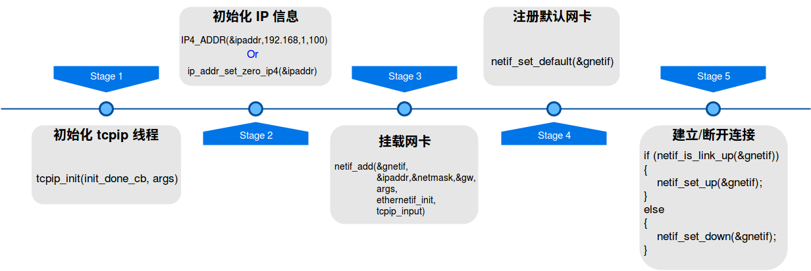

## LwIP 的内存管理

LwIP 的内存管理机制大致上可以分成三种：

1. C 标准库自带的内存分配策略（即使用 malloc、free等函数，这些函数的**执行时间是不确定的**）
2. LwIP 的**动态内存堆**分配策略
3. LwIP 的**动态内存池**分配策略

::: tip LwIP 使用动态内存池的原因

LwIP 中有很多固定的数据结构空间，比如 TCP 首部，UDP 首部，IP 首部，Ethernet 首部等。采用内存池策略分配这些固定大小的内存空间，可以大大提升效率，还不会产生内存碎片。

:::

### 动态内存池

#### LWIP_MEMPOOL

在 LwIP 内核初始化时，会根据具体配置在内存中初始化相应的内存池，如定义了 `LWIP_UDP`，在初始化的时候， UDP 协议控制块需要的内存池就会被初始化。`lwip/priv/memp_std.h` 中使用 `LWIP_MEMPOOL` 宏定义了许多数据，但是这些数据的具体含义要取决于具体的 `LWIP_MEMPOOL` 。

```c
/*
 * A list of internal pools used by LWIP.
 *
 * LWIP_MEMPOOL(pool_name, number_elements, element_size, pool_description)
 *     creates a pool name MEMP_pool_name. description is used in stats.c
 */
#if LWIP_RAW
LWIP_MEMPOOL(RAW_PCB,        MEMP_NUM_RAW_PCB,         sizeof(struct raw_pcb),        "RAW_PCB")
#endif /* LWIP_RAW */

#if LWIP_UDP
LWIP_MEMPOOL(UDP_PCB,        MEMP_NUM_UDP_PCB,         sizeof(struct udp_pcb),        "UDP_PCB")
#endif /* LWIP_UDP */

#if LWIP_TCP
LWIP_MEMPOOL(TCP_PCB,        MEMP_NUM_TCP_PCB,         sizeof(struct tcp_pcb),        "TCP_PCB")
LWIP_MEMPOOL(TCP_PCB_LISTEN, MEMP_NUM_TCP_PCB_LISTEN,  sizeof(struct tcp_pcb_listen), "TCP_PCB_LISTEN")
LWIP_MEMPOOL(TCP_SEG,        MEMP_NUM_TCP_SEG,         sizeof(struct tcp_seg),        "TCP_SEG")
#endif /* LWIP_TCP */

#if LWIP_IGMP
LWIP_MEMPOOL(IGMP_GROUP,     MEMP_NUM_IGMP_GROUP,      sizeof(struct igmp_group),     "IGMP_GROUP")
#endif /* LWIP_IGMP */

/*
 * A list of pools of pbuf's used by LWIP.
 *
 * LWIP_PBUF_MEMPOOL(pool_name, number_elements, pbuf_payload_size, pool_description)
 *     creates a pool name MEMP_pool_name. description is used in stats.c
 *     This allocates enough space for the pbuf struct and a payload.
 *     (Example: pbuf_payload_size=0 allocates only size for the struct)
 */
LWIP_MEMPOOL(PBUF,           MEMP_NUM_PBUF,            sizeof(struct pbuf),           "PBUF_REF/ROM")
LWIP_PBUF_MEMPOOL(PBUF_POOL, PBUF_POOL_SIZE,           PBUF_POOL_BUFSIZE,             "PBUF_POOL")


/*
 * Allow for user-defined pools; this must be explicitly set in lwipopts.h
 * since the default is to NOT look for lwippools.h
 */
#if MEMP_USE_CUSTOM_POOLS
#include "lwippools.h"
#endif /* MEMP_USE_CUSTOM_POOLS */

/*
 * REQUIRED CLEANUP: Clear up so we don't get "multiply defined" error later
 * (#undef is ignored for something that is not defined)
 */
#undef LWIP_MEMPOOL
#undef LWIP_MALLOC_MEMPOOL
#undef LWIP_MALLOC_MEMPOOL_START
#undef LWIP_MALLOC_MEMPOOL_END
#undef LWIP_PBUF_MEMPOOL
```

#### 定义内存池类型

```c
/** Create the list of all memory pools managed by memp. MEMP_MAX represents a NULL pool at the end */
typedef enum {
#define LWIP_MEMPOOL(name,num,size,desc)  MEMP_##name,
#include "lwip/priv/memp_std.h"
  MEMP_MAX
} memp_t;
```

#### 声明内存池

```c
#define LWIP_MEMPOOL(name,num,size,desc) LWIP_MEMPOOL_DECLARE(name,num,size,desc)
#include "lwip/priv/memp_std.h"

const struct memp_desc *const memp_pools[MEMP_MAX] = {
#define LWIP_MEMPOOL(name,num,size,desc) &memp_ ## name,
#include "lwip/priv/memp_std.h"
};
```

每种内存池经过编译器编译都会得到一个结构体，比如`const struct memp_desc memp_RAW_PCB`，里面记录了内存块的数量，大小，起始地址等信息。

#### 内存池初始化

```c
/**
 * Initializes lwIP built-in pools.
 * Related functions: memp_malloc, memp_free
 *
 * Carves out memp_memory into linked lists for each pool-type.
 */
void memp_init(void)
{
  u16_t i;

  /* for every pool: */
  for (i = 0; i < LWIP_ARRAYSIZE(memp_pools); i++) {
    memp_init_pool(memp_pools[i]);
  }
}
/**
 * Initialize custom memory pool.
 * Related functions: memp_malloc_pool, memp_free_pool
 *
 * @param desc pool to initialize
 */
void memp_init_pool(const struct memp_desc *desc)
{
  int i;
  struct memp *memp;

  *desc->tab = NULL;
  memp = (struct memp *)LWIP_MEM_ALIGN(desc->base);
  /* force memset on pool memory */
  memset(memp, 0, (size_t)desc->num * (MEMP_SIZE + desc->size));

  /* create a linked list of memp elements */
  for (i = 0; i < desc->num; ++i) {
    memp->next = *desc->tab;
    *desc->tab = memp;
    /* cast through void* to get rid of alignment warnings */
    memp = (struct memp *)(void *)((u8_t *)memp + MEMP_SIZE + desc->size);
  }
}
```


#### 内存分配

```c
/**
 * Get an element from a specific pool.
 *
 * @param type the pool to get an element from
 *
 * @return a pointer to the allocated memory or a NULL pointer on error
 */
void *memp_malloc(memp_t type)
{
  void *memp;
  LWIP_ERROR("memp_malloc: type < MEMP_MAX", (type < MEMP_MAX), return NULL;);

  memp = do_memp_malloc_pool(memp_pools[type]);

  return memp;
}
/**
 * Get an element from a custom pool.
 *
 * @param desc the pool to get an element from
 *
 * @return a pointer to the allocated memory or a NULL pointer on error
 */
void *memp_malloc_pool(const struct memp_desc *desc)
{
  LWIP_ASSERT("invalid pool desc", desc != NULL);
  if (desc == NULL) {
    return NULL;
  }
  return do_memp_malloc_pool(desc);
}
static void *do_memp_malloc_pool(const struct memp_desc *desc)
{
  struct memp *memp;
  SYS_ARCH_PROTECT(old_level);

  memp = *desc->tab; // 得到对应内存块中的第一个空闲内存块
  if (memp != NULL) {
    *desc->tab = memp->next; // 移动tab指针，指向下一个空闲内存块
    LWIP_ASSERT("memp_malloc: memp properly aligned",
                ((mem_ptr_t)memp % MEM_ALIGNMENT) == 0);
    SYS_ARCH_UNPROTECT(old_level);
    /* cast through u8_t* to get rid of alignment warnings */
    return ((u8_t *)memp + MEMP_SIZE);
  } else {
    SYS_ARCH_UNPROTECT(old_level);
    LWIP_DEBUGF(MEMP_DEBUG | LWIP_DBG_LEVEL_SERIOUS, ("memp_malloc: out of memory in pool %s\n", desc->desc));
  }
  return NULL;
}
```

#### 内存释放

```c
static void do_memp_free_pool(const struct memp_desc *desc, void *mem)
{
  struct memp *memp;
  SYS_ARCH_DECL_PROTECT(old_level);

  LWIP_ASSERT("memp_free: mem properly aligned",
              ((mem_ptr_t)mem % MEM_ALIGNMENT) == 0);

  /* cast through void* to get rid of alignment warnings */
  memp = (struct memp *)(void *)((u8_t *)mem - MEMP_SIZE);

  SYS_ARCH_PROTECT(old_level);

  memp->next = *desc->tab;
  *desc->tab = memp;

  SYS_ARCH_UNPROTECT(old_level);
}

/**
 * Put a custom pool element back into its pool.
 *
 * @param desc the pool where to put mem
 * @param mem the memp element to free
 */
void memp_free_pool(const struct memp_desc *desc, void *mem)
{
  LWIP_ASSERT("invalid pool desc", desc != NULL);
  if ((desc == NULL) || (mem == NULL)) {
    return;
  }
  do_memp_free_pool(desc, mem);
}

/**
 * Put an element back into its pool.
 *
 * @param type the pool where to put mem
 * @param mem the memp element to free
 */
void memp_free(memp_t type, void *mem)
{
  LWIP_ERROR("memp_free: type < MEMP_MAX", (type < MEMP_MAX), return;);

  if (mem == NULL) {
    return;
  }

  do_memp_free_pool(memp_pools[type], mem);
}
```

### 动态内存堆

LwIP 中的动态内存堆管理可以分为两种：一种是 C 标准库自带的内存管理策略，另一种是 LwIP 自身实现的内存堆管理策略。这两者的选择需要通过 `MEM_LIBC_MALLOC` 宏来选择。

#### 内存堆的组织结构

```c
/**
 * The heap is made up as a list of structs of this type.
 * This does not have to be aligned since for getting its size,
 * we only use the macro SIZEOF_STRUCT_MEM, which automatically aligns.
 */
struct mem {
  /** index (-> ram[next]) of the next struct */
  mem_size_t next;
  /** index (-> ram[prev]) of the previous struct */
  mem_size_t prev;
  /** 1: this area is used; 0: this area is unused */
  u8_t used;
#if MEM_OVERFLOW_CHECK
  /** this keeps track of the user allocation size for guard checks */
  mem_size_t user_size;
#endif
};

/** All allocated blocks will be MIN_SIZE bytes big, at least!
 * MIN_SIZE can be overridden to suit your needs. Smaller values save space,
 * larger values could prevent too small blocks to fragment the RAM too much. */
#ifndef MIN_SIZE
#define MIN_SIZE             12
#endif /* MIN_SIZE */

/** the heap. we need one struct mem at the end and some room for alignment */
LWIP_DECLARE_MEMORY_ALIGNED(ram_heap, MEM_SIZE_ALIGNED + (2U * SIZEOF_STRUCT_MEM));
#define LWIP_RAM_HEAP_POINTER ram_heap

/** pointer to the heap (ram_heap): for alignment, ram is now a pointer instead of an array */
static u8_t *ram;
/** the last entry, always unused! */
static struct mem *ram_end;

/** pointer to the lowest free block, this is used for faster search */
static struct mem * LWIP_MEM_LFREE_VOLATILE lfree;
```

#### 内存堆初始化

```c
/**
 * Zero the heap and initialize start, end and lowest-free
 */
void mem_init(void)
{
  struct mem *mem;

  LWIP_ASSERT("Sanity check alignment",
              (SIZEOF_STRUCT_MEM & (MEM_ALIGNMENT - 1)) == 0);

  /* align the heap */
  ram = (u8_t *)LWIP_MEM_ALIGN(LWIP_RAM_HEAP_POINTER);
  /* initialize the start of the heap */
  mem = (struct mem *)(void *)ram;
  mem->next = MEM_SIZE_ALIGNED;
  mem->prev = 0;
  mem->used = 0;
  /* initialize the end of the heap */
  ram_end = ptr_to_mem(MEM_SIZE_ALIGNED);
  ram_end->used = 1;
  ram_end->next = MEM_SIZE_ALIGNED;
  ram_end->prev = MEM_SIZE_ALIGNED;
  MEM_SANITY();

  /* initialize the lowest-free pointer to the start of the heap */
  lfree = (struct mem *)(void *)ram;

  MEM_STATS_AVAIL(avail, MEM_SIZE_ALIGNED);

  if (sys_mutex_new(&mem_mutex) != ERR_OK) {
    LWIP_ASSERT("failed to create mem_mutex", 0);
  }
}
```

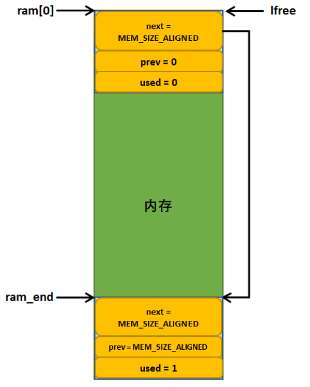

#### 内存分配

```c
/**
 * Allocate a block of memory with a minimum of 'size' bytes.
 *
 * @param size_in is the minimum size of the requested block in bytes.
 * @return pointer to allocated memory or NULL if no free memory was found.
 *
 * Note that the returned value will always be aligned (as defined by MEM_ALIGNMENT).
 */
void *mem_malloc(mem_size_t size_in)
{
  mem_size_t ptr, ptr2, size;
  struct mem *mem, *mem2;
  LWIP_MEM_ALLOC_DECL_PROTECT();
  if (size_in == 0) {
    return NULL;
  }
  /* 将用户申请的内存大小进行对齐操作 */
  size = (mem_size_t)LWIP_MEM_ALIGN_SIZE(size_in);
  if (size < MIN_SIZE_ALIGNED) {
    /* every data block must be at least MIN_SIZE_ALIGNED long */
    size = MIN_SIZE_ALIGNED;
  }
  if ((size > MEM_SIZE_ALIGNED) || (size < size_in)) {
    return NULL;
  }
  /* 互斥访问 */
  sys_mutex_lock(&mem_mutex);
  LWIP_MEM_ALLOC_PROTECT();
    /* 遍历空闲内存块链表，直到找到第一个合适的内存块 */
    for (ptr = mem_to_ptr(lfree); ptr < MEM_SIZE_ALIGNED - size;
         ptr = ptr_to_mem(ptr)->next) {
      mem = ptr_to_mem(ptr);
      if ((!mem->used) &&
          (mem->next - (ptr + SIZEOF_STRUCT_MEM)) >= size) {
        /* 内存块可能很大，判断是否需要切开 */
        if (mem->next - (ptr + SIZEOF_STRUCT_MEM) >= (size + SIZEOF_STRUCT_MEM + MIN_SIZE_ALIGNED)) {
          ptr2 = (mem_size_t)(ptr + SIZEOF_STRUCT_MEM + size);
          LWIP_ASSERT("invalid next ptr",ptr2 != MEM_SIZE_ALIGNED);
          /* create mem2 struct */
          mem2 = ptr_to_mem(ptr2);
          mem2->used = 0;
          mem2->next = mem->next;
          mem2->prev = ptr;
          /* and insert it between mem and mem->next */
          mem->next = ptr2;
          mem->used = 1;
          if (mem2->next != MEM_SIZE_ALIGNED) {
            ptr_to_mem(mem2->next)->prev = ptr2;
          }
          MEM_STATS_INC_USED(used, (size + SIZEOF_STRUCT_MEM));
        } else {
          mem->used = 1;
          MEM_STATS_INC_USED(used, mem->next - mem_to_ptr(mem));
        }
        if (mem == lfree) {
          struct mem *cur = lfree;
          /* Find next free block after mem and update lowest free pointer */
          while (cur->used && cur != ram_end) {
            cur = ptr_to_mem(cur->next);
          }
          lfree = cur;
          LWIP_ASSERT("mem_malloc: !lfree->used", ((lfree == ram_end) || (!lfree->used)));
        }
        LWIP_MEM_ALLOC_UNPROTECT();
        sys_mutex_unlock(&mem_mutex);
        LWIP_ASSERT("mem_malloc: allocated memory not above ram_end.",
                    (mem_ptr_t)mem + SIZEOF_STRUCT_MEM + size <= (mem_ptr_t)ram_end);
        LWIP_ASSERT("mem_malloc: allocated memory properly aligned.",
                    ((mem_ptr_t)mem + SIZEOF_STRUCT_MEM) % MEM_ALIGNMENT == 0);
        LWIP_ASSERT("mem_malloc: sanity check alignment",
                    (((mem_ptr_t)mem) & (MEM_ALIGNMENT - 1)) == 0);
        MEM_SANITY();
        return (u8_t *)mem + SIZEOF_STRUCT_MEM + MEM_SANITY_OFFSET;
      }
    }
  MEM_STATS_INC(err);
  LWIP_MEM_ALLOC_UNPROTECT();
  sys_mutex_unlock(&mem_mutex);
  LWIP_DEBUGF(MEM_DEBUG | LWIP_DBG_LEVEL_SERIOUS, ("mem_malloc: could not allocate %"S16_F" bytes\n", (s16_t)size));
  return NULL;
}
```

#### 内存释放

```c
/**
 * Put a struct mem back on the heap
 *
 * @param rmem is the data portion of a struct mem as returned by a previous
 *             call to mem_malloc()
 */
void mem_free(void *rmem)
{
  struct mem *mem;
  LWIP_MEM_FREE_DECL_PROTECT();

  if (rmem == NULL) {
    LWIP_DEBUGF(MEM_DEBUG | LWIP_DBG_TRACE | LWIP_DBG_LEVEL_SERIOUS, ("mem_free(p == NULL) was called.\n"));
    return;
  }
  if ((((mem_ptr_t)rmem) & (MEM_ALIGNMENT - 1)) != 0) {
    LWIP_MEM_ILLEGAL_FREE("mem_free: sanity check alignment");
    LWIP_DEBUGF(MEM_DEBUG | LWIP_DBG_LEVEL_SEVERE, ("mem_free: sanity check alignment\n"));
    /* protect mem stats from concurrent access */
    MEM_STATS_INC_LOCKED(illegal);
    return;
  }

  /* Get the corresponding struct mem: */
  /* cast through void* to get rid of alignment warnings */
  mem = (struct mem *)(void *)((u8_t *)rmem - (SIZEOF_STRUCT_MEM + MEM_SANITY_OFFSET));

  if ((u8_t *)mem < ram || (u8_t *)rmem + MIN_SIZE_ALIGNED > (u8_t *)ram_end) {
    LWIP_MEM_ILLEGAL_FREE("mem_free: illegal memory");
    LWIP_DEBUGF(MEM_DEBUG | LWIP_DBG_LEVEL_SEVERE, ("mem_free: illegal memory\n"));
    /* protect mem stats from concurrent access */
    MEM_STATS_INC_LOCKED(illegal);
    return;
  }
  /* protect the heap from concurrent access */
  LWIP_MEM_FREE_PROTECT();
  /* mem has to be in a used state */
  if (!mem->used) {
    LWIP_MEM_ILLEGAL_FREE("mem_free: illegal memory: double free");
    LWIP_MEM_FREE_UNPROTECT();
    LWIP_DEBUGF(MEM_DEBUG | LWIP_DBG_LEVEL_SEVERE, ("mem_free: illegal memory: double free?\n"));
    /* protect mem stats from concurrent access */
    MEM_STATS_INC_LOCKED(illegal);
    return;
  }
  /* 检查内存块在链表中的连接是否正常 */
  if (!mem_link_valid(mem)) {
    LWIP_MEM_ILLEGAL_FREE("mem_free: illegal memory: non-linked: double free");
    LWIP_MEM_FREE_UNPROTECT();
    LWIP_DEBUGF(MEM_DEBUG | LWIP_DBG_LEVEL_SEVERE, ("mem_free: illegal memory: non-linked: double free?\n"));
    /* protect mem stats from concurrent access */
    MEM_STATS_INC_LOCKED(illegal);
    return;
  }

  /* mem is now unused. */
  mem->used = 0;

  if (mem < lfree) {
    /* the newly freed struct is now the lowest */
    lfree = mem;
  }

  MEM_STATS_DEC_USED(used, mem->next - (mem_size_t)(((u8_t *)mem - ram)));

  /* 尝试进行内存块合并（只要新释放的内存块与上一个或者下一个空闲内存块在地址上是连续的，则进行合并 */
  plug_holes(mem);
  MEM_SANITY();
  LWIP_MEM_FREE_UNPROTECT();
}
```

### LwIP 中关于内存管理的配置

| 宏配置          | 说明                                                         |
| --------------- | ------------------------------------------------------------ |
| MEM_LIBC_MALLOC | 设置为 1 表示使用 C 标准库自带的分配策略；设置为 0 表示使用 LwIP 自己实现的动态内存管理策略。LwIP 的动态内存管理策略又分为两种实现形式：一种通过内存堆（HEAP）管理策略实现内存管理（大数组），另一种通过内存池（POOL）管理策略实现内存管理（事先开辟好的内存池） |
| MEMP_MEM_MALLOC | 是否使用 LwIP 内存堆分配策略实现内存池分配（从内存池中获取内存时，实际是从内存堆中分配） |
| MEM_USE_POOLS   | 是否使用 LwIP 内存池分配策略实现内存堆的分配（从内存堆中获取内存时，实际是从内存池中分配） |

## 网络数据包

::: tip

LwIP 极力避免在层与层之间进行数据拷贝，所以并没有采取很明确的分层结构，各层之间的部分数据在其它层是可见的，各层之间存在交叉存取数据的现象。

:::

### pbuf 结构体

**pbuf** 是一个描述协议栈中数据包的数据结构。

```c
/** Main packet buffer struct */
struct pbuf {
  /** 网络中的数据包可能很大，所以采用链表的形式将所有 pbuf 包连接起来，构成一个完整的数据包 */
  struct pbuf *next;
  /** 指向实际数据区域 */
  void *payload;
  /** 当前 pbuf 及其后续 pbuf 所有数据的长度
   *  如果当前是链表上的第一个pbuf，则记录着整个 pbuf 链表中所有的pbuf中的数据长度
   */
  u16_t tot_len;
  /** 当前pbuf中有效的数据长度 */
  u16_t len;
  /** pbuf的类型
    */
  u8_t type_internal;
  /** misc flags */
  u8_t flags;
  /**
   * 当前 pbuf 的引用计数，初始化一个 pbuf 的时候，会将其设置为1；当有其它指针指向当前pbuf的时候会加1
   */
  LWIP_PBUF_REF_T ref;
  /** 记录传入的数据包中netif的索引，也就是netif中的num字段 */
  u8_t if_idx;
  /** In case the user needs to store data custom data on a pbuf */
  LWIP_PBUF_CUSTOM_DATA
};
```

### pbuf 的类型

```c
typedef enum {
  /** pbuf data is stored in RAM, used for TX mostly, struct pbuf and its payload
      are allocated in one piece of contiguous memory (so the first payload byte
      can be calculated from struct pbuf).
      pbuf_alloc() allocates PBUF_RAM pbufs as unchained pbufs (although that might
      change in future versions).
      This should be used for all OUTGOING packets (TX).*/
  PBUF_RAM = (PBUF_ALLOC_FLAG_DATA_CONTIGUOUS | PBUF_TYPE_FLAG_STRUCT_DATA_CONTIGUOUS | PBUF_TYPE_ALLOC_SRC_MASK_STD_HEAP),
  /** pbuf data is stored in ROM, i.e. struct pbuf and its payload are located in
      totally different memory areas. Since it points to ROM, payload does not
      have to be copied when queued for transmission. */
  PBUF_ROM = PBUF_TYPE_ALLOC_SRC_MASK_STD_MEMP_PBUF,
  /** pbuf comes from the pbuf pool. Much like PBUF_ROM but payload might change
      so it has to be duplicated when queued before transmitting, depending on
      who has a 'ref' to it. */
  PBUF_REF = (PBUF_TYPE_FLAG_DATA_VOLATILE | PBUF_TYPE_ALLOC_SRC_MASK_STD_MEMP_PBUF),
  /** pbuf payload refers to RAM. This one comes from a pool and should be used
      for RX. Payload can be chained (scatter-gather RX) but like PBUF_RAM, struct
      pbuf and its payload are allocated in one piece of contiguous memory (so
      the first payload byte can be calculated from struct pbuf).
      Don't use this for TX, if the pool becomes empty e.g. because of TCP queuing,
      you are unable to receive TCP acks! */
  PBUF_POOL = (PBUF_ALLOC_FLAG_RX | PBUF_TYPE_FLAG_STRUCT_DATA_CONTIGUOUS | PBUF_TYPE_ALLOC_SRC_MASK_STD_MEMP_PBUF_POOL)
} pbuf_type;
```

#### PBUF_RAM 类型的 pbuf

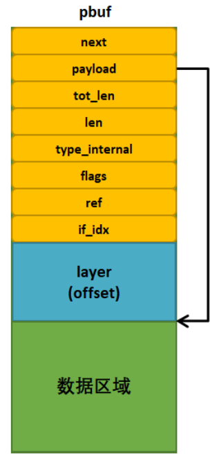

PBUF_RAM 类型的 pbuf 是通过内存堆分配得到，是一个连续的内存区域，其中的 layer(offset) 就是各层协议的首部，比如 TCP 报文首部、IP 首部、以太网帧首部等。LwIP 协议栈中的发送数据包都会采用这种形式。

#### PBUF_POOL 类型的 pbuf

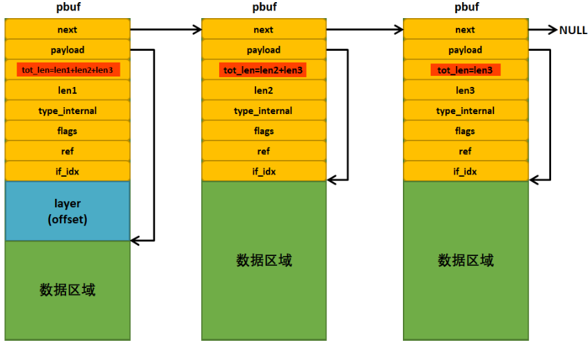

PBUF_POOL 类型的 pbuf 是通过内存池分配得到，与 PBUF_RAM 类似，其 pbuf 结构体与数据缓冲区也是存在于连续的内存块中。这种类型的 pbuf 可以快速完成分配，在网卡接收数据时，LwIP 一般就使用这种类型的 pbuf 来存储接收到的数据。

#### PBUF_ROM 和 PBUF_REF 类型的 pbuf

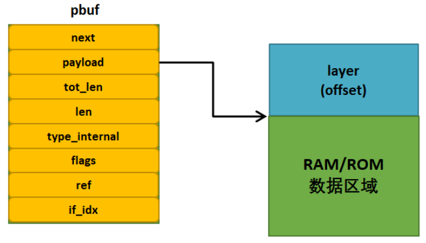

PBUF_REF 和 PBUF_ROM 类型的 pbuf 基本相同，它们都是从内存池中申请分配 pbuf 结构首部空间，而不申请数据区的空间。两者的区别在于，前者指向 RAM 空间内的某段数据，后者指向 ROM 空间内的某段数据。

### 各层协议首部大小

不同的协议其首部大小是不同的，申请 pbuf 时，协议栈中各层首部的大小都会被预留出来，LwIP 采用枚举变量记录各层的首部大小。

```c
typedef enum {
  /** Includes spare room for transport layer header, e.g. UDP header.
   * Use this if you intend to pass the pbuf to functions like udp_send().
   */
  PBUF_TRANSPORT = PBUF_LINK_ENCAPSULATION_HLEN + PBUF_LINK_HLEN + PBUF_IP_HLEN + PBUF_TRANSPORT_HLEN,
  /** Includes spare room for IP header.
   * Use this if you intend to pass the pbuf to functions like raw_send().
   */
  PBUF_IP = PBUF_LINK_ENCAPSULATION_HLEN + PBUF_LINK_HLEN + PBUF_IP_HLEN,
  /** Includes spare room for link layer header (ethernet header).
   * Use this if you intend to pass the pbuf to functions like ethernet_output().
   * @see PBUF_LINK_HLEN
   */
  PBUF_LINK = PBUF_LINK_ENCAPSULATION_HLEN + PBUF_LINK_HLEN,
  /** Includes spare room for additional encapsulation header before ethernet
   * headers (e.g. 802.11).
   * Use this if you intend to pass the pbuf to functions like netif->linkoutput().
   * @see PBUF_LINK_ENCAPSULATION_HLEN
   */
  PBUF_RAW_TX = PBUF_LINK_ENCAPSULATION_HLEN,
  /** Use this for input packets in a netif driver when calling netif->input()
   * in the most common case - ethernet-layer netif driver. */
  PBUF_RAW = 0
} pbuf_layer;
```

### pbuf 相关 API

| API               | 说明                                                         |
| ----------------- | ------------------------------------------------------------ |
| pbuf_alloc        | 申请 pbuf 数据包。                                           |
| pbuf_realloc      | 在 pbuf 尾部释放一定的空间，将数据包 pbuf 中的数据长度**减少**为某个长度值。 |
| pbuf_ref          | 增加 pbuf 的引用计数。                                       |
| pbuf_free         | 释放 pbuf 数据包。                                           |
| pbuf_clen         | 返回 pbuf 链中的 pbuf 数量。                                 |
| pbuf_cat          | 将两个 pbuf 链接在一起（但不会改变末尾 pbuf 链的引用计数）。 |
| pbuf_chain        | 将两个 pbuf 链接在一起（增减尾链的引用计数）。               |
| pbuf_dechain      | 缉拿个第一个 pbuf 与链中后续的 pbuf 断开连接。               |
| pbuf_header       | 调整 pbuf 的 payload 指针（向前或向后移动一定字节数），这为各层对数据包首部的操作提供了方便，进行这个操作的时候，len 和 tot_len 字段值也会随之更新。 |
| pbuf_copy_partial | 将部分 pbuf 中的内容复制到缓存中。                           |
| pbuf_take         | 将用户数据复制到 pbuf 中。                                   |
| pbuf_coalesce     | 从一个 pbuf 队列中创建单个 pbuf。                            |
| pbuf_memcmp       | 将指定偏移地址处的 pbuf 内容与其它内存比较                   |
| pbuf_memfind      | 从某个偏移地址开始，在 pbuf 中查找某内存                     |
| pbuf_strstr       | 从某个偏移地址开始，在 pbuf 中查找某字符串                   |
| pbuf_copy         | 将任何类型的 pbuf 中的数据拷贝到一个 PBUF_RAM 类型的 pbuf 中。 |

#### pbuf_alloc 函数

:::tip

数据包申请函数有两个重要的参数：数据包 pbuf 的类型和数据包在哪一层被申请。

```c
struct pbuf * pbuf_alloc(pbuf_layer layer, u16_t length, pbuf_type type);
```

:::

假设 TCP 协议需要申请一个 pbuf 数据包，则调用如下函数创建 pbuf：

```c
struct pbuf *p = pbuf_alloc(PBUF_TRANSPORT, 1472, PBUF_RAM);
```

内核会分配一个 PBUF_RAM 类型的 pbuf， 其数据区域大小是 1472 字节，并且因为是在传输层，所以内核需要预留 54 字节空间（以太网首部14字节，IPv4首部20字节，TCP首部20字节）。当数据报往下层递交的时候，其它层直接填充对应的协议首部即可。

#### pbuf_free 函数

在申请 pbuf 的时候，ref 字段就被初始化为1,当释放 pbuf 的时候，先将 ref 减 1,如果 ref 减 1 后为 0,则表示能释放 pbuf 数据包。

* 假设有 4 个 pbuf 链表如下

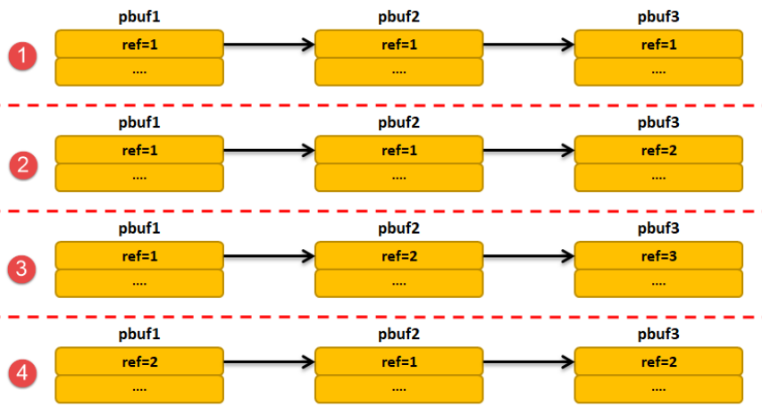

* 删除第一个节点后的 pbuf 链表如下

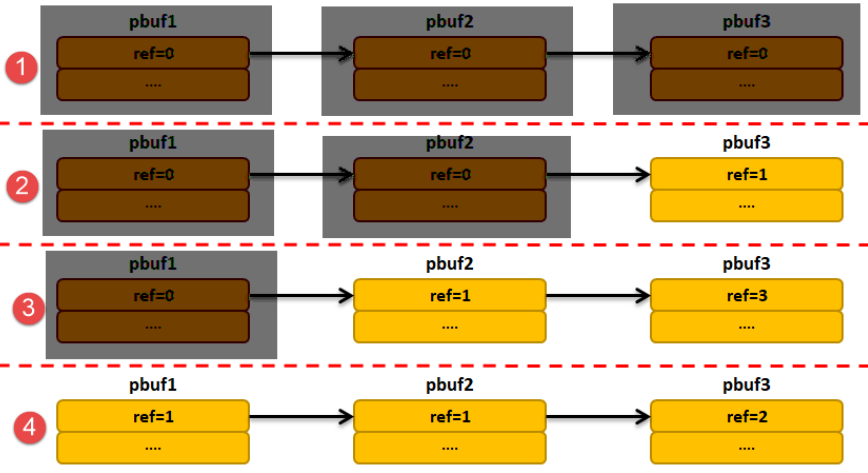

:::warning

传递给 pbuf_free() 的参数必须是链表头指针。

:::

## 网卡接收数据的一般流程

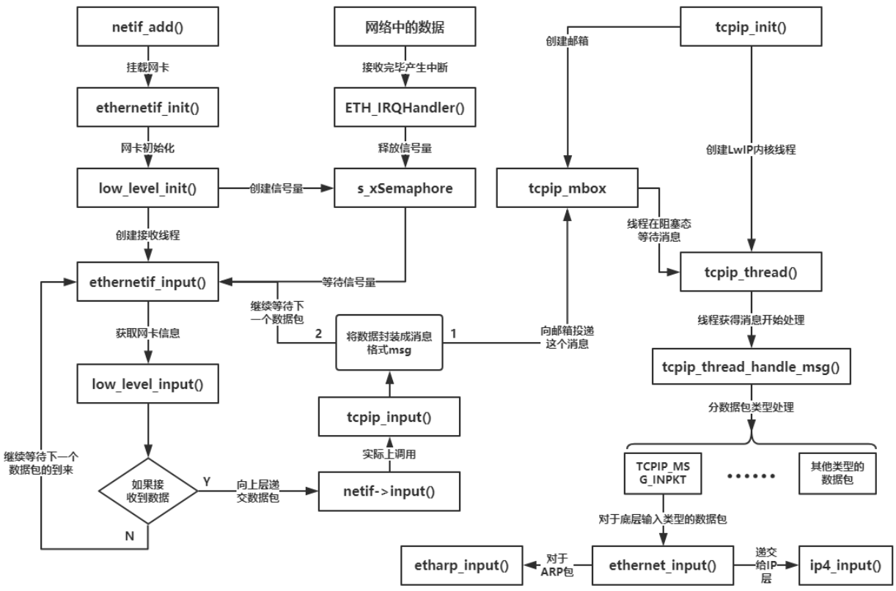

## LwIP 内核超时处理

LwIP 中很多时候都需要超时处理，例如 ARP 缓存表的内容的时间管理、IP 分片数据报的重装等待超时、TCP 中的建立连接超时、重传超时机制等等。LwIP 采用软件定时器对这些超时进行处理，移植的时候需要提供一个较为准确的时基。

### sys_timeo 结构体

LwIP 通过一个 sys_timeo 类型的数据结构管理与超时链表相关的所有超时事件。LwIP 使用这个结构体记录下内核中所有被注册的超时事件，这些结构体会以链表的形式一个个连接在超时链表中。

```c
struct sys_timeo {
  struct sys_timeo *next; // 下一个超时事件
  u32_t time; 			  // 发生超时的时间
  sys_timeout_handler h;  // 超时的回调函数
  void *arg;              // 向回调函数传入的参数
};

/** The one and only timeout list */
static struct sys_timeo *next_timeout; // 指向超时链表的第一个超时事件
```

### 注册超时事件

```c
void sys_timeout(u32_t msecs, sys_timeout_handler handler, void *arg)
{
  u32_t next_timeout_time;
  next_timeout_time = (u32_t)(sys_now() + msecs);  // 根据当前时间计算超时时间
  sys_timeout_abs(next_timeout_time, handler, arg);
}

static void sys_timeout_abs(u32_t abs_time, sys_timeout_handler handler, void *arg)
{
  struct sys_timeo *timeout, *t;

  timeout = (struct sys_timeo *)memp_malloc(MEMP_SYS_TIMEOUT);
  if (timeout == NULL) {
    return;
  }

  timeout->next = NULL;
  timeout->h = handler;
  timeout->arg = arg;
  timeout->time = abs_time;

  if (next_timeout == NULL) {
    next_timeout = timeout;
    return;
  }
  // 根据超时事件的时间，升序排列
  if (TIME_LESS_THAN(timeout->time, next_timeout->time)) {
    timeout->next = next_timeout;
    next_timeout = timeout;
  } else {
    for (t = next_timeout; t != NULL; t = t->next) {
      if ((t->next == NULL) || TIME_LESS_THAN(timeout->time, t->next->time)) {
        timeout->next = t->next;
        t->next = timeout;
        break;
      }
    }
  }
}
```

### LwIP 内部使用的循环超时事件

```c
/** This struct contains information about a stack-internal timer function
 that has to be called at a defined interval */
struct lwip_cyclic_timer {
  u32_t interval_ms;
  lwip_cyclic_timer_handler handler;
};

const struct lwip_cyclic_timer lwip_cyclic_timers[] = {
#if LWIP_TCP
  /* The TCP timer is a special case: it does not have to run always and
     is triggered to start from TCP using tcp_timer_needed() */
  {TCP_TMR_INTERVAL, HANDLER(tcp_tmr)},
#endif /* LWIP_TCP */
#if LWIP_IPV4
#if IP_REASSEMBLY
  {IP_TMR_INTERVAL, HANDLER(ip_reass_tmr)},
#endif /* IP_REASSEMBLY */
#if LWIP_ARP
  {ARP_TMR_INTERVAL, HANDLER(etharp_tmr)},
#if ESP_GRATUITOUS_ARP
  {GARP_TMR_INTERVAL, HANDLER(garp_tmr)},
#endif /* ESP_GRATUITOUS_ARP */
#endif /* LWIP_ARP */
#if LWIP_DHCP
  {DHCP_COARSE_TIMER_MSECS, HANDLER(dhcp_coarse_tmr)},
  {DHCP_FINE_TIMER_MSECS, HANDLER(dhcp_fine_tmr)},
#endif /* LWIP_DHCP */
#if ESP_DHCPS_TIMER
  {DHCP_COARSE_TIMER_MSECS, HANDLER(dhcps_coarse_tmr)},
#endif
#if LWIP_AUTOIP
  {AUTOIP_TMR_INTERVAL, HANDLER(autoip_tmr)},
#endif /* LWIP_AUTOIP */
#if LWIP_IGMP && !ESP_LWIP_IGMP_TIMERS_ONDEMAND
  {IGMP_TMR_INTERVAL, HANDLER(igmp_tmr)},
#endif /* LWIP_IGMP */
#endif /* LWIP_IPV4 */
#if LWIP_DNS
  {DNS_TMR_INTERVAL, HANDLER(dns_tmr)},
#endif /* LWIP_DNS */
#if LWIP_IPV6
  {ND6_TMR_INTERVAL, HANDLER(nd6_tmr)},
#if LWIP_IPV6_REASS
  {IP6_REASS_TMR_INTERVAL, HANDLER(ip6_reass_tmr)},
#endif /* LWIP_IPV6_REASS */
#if LWIP_IPV6_MLD && !ESP_LWIP_MLD6_TIMERS_ONDEMAND
  {MLD6_TMR_INTERVAL, HANDLER(mld6_tmr)},
#endif /* LWIP_IPV6_MLD */
#if LWIP_IPV6_DHCP6
  {DHCP6_TIMER_MSECS, HANDLER(dhcp6_tmr)},
#endif /* LWIP_IPV6_DHCP6 */
#endif /* LWIP_IPV6 */
};
```

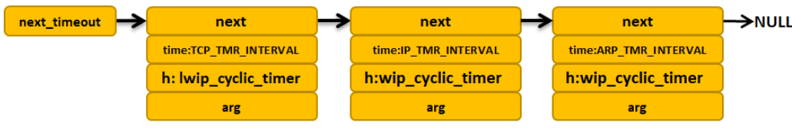

## tcpip_thread 线程

* 标准 TCP/IP 协议栈的各个层次都独立成为一个线程，在这种模式下，各个层次有着严格的分层结构，各个层次的 API 接口也是分层清晰的。但是数据包在向其它层递交的时候，都需要进行拷贝以及切换线程，这是一个很大的开销，会导致系统没法处理大量的数据。
* 协议栈可以驻留在操作系统内核中，应用程序通过系统调用与 TCP/IP 协议栈通信。这种情况让协议栈各层之间与用户线程没有很严格的分层结构，各层之间能交叉存取，从而提高效率。
* LwIP 让协议栈内核与操作系统相互隔离，协议栈仅仅作为操作系统的一个独立线程存在，用户程序能驻留在协议栈内部，协议栈通过回调函数实现用户与协议栈之间的数据交互；也可以让用户程序单独实现一个线程，通过信号量和邮箱等机制与协议栈线程通信。

```c
static void tcpip_thread(void *arg)
{
  struct tcpip_msg *msg;
  LWIP_UNUSED_ARG(arg);

  LWIP_MARK_TCPIP_THREAD();

  LOCK_TCPIP_CORE();
  if (tcpip_init_done != NULL) {
    tcpip_init_done(tcpip_init_done_arg);
  }

  while (1) {
    LWIP_TCPIP_THREAD_ALIVE();
    /* 等待消息，并且处理超时事件 */
    // #define TCPIP_MBOX_FETCH(mbox, msg) tcpip_timeouts_mbox_fetch(mbox, msg)
    TCPIP_MBOX_FETCH(&tcpip_mbox, (void **)&msg);
    if (msg == NULL) {
      LWIP_DEBUGF(TCPIP_DEBUG, ("tcpip_thread: invalid message: NULL\n"));
      LWIP_ASSERT("tcpip_thread: invalid message", 0);
      continue;
    }
    // 等待到消息，对消息进行处理
    tcpip_thread_handle_msg(msg);
  }
}
```

## LwIP 中的消息

### 消息结构

tcpip_thread 线程是通过 `tcpip_msg` 描述消息的，tcpip_thread 线程接收到消息后，根据消息的类型进行不同的处理。

```c
enum tcpip_msg_type {
  TCPIP_MSG_API,
  TCPIP_MSG_API_CALL,    	// API 函数调用
  TCPIP_MSG_INPKT,			// 底层数据包输入
  TCPIP_MSG_TIMEOUT,		// 注册超时事件
  TCPIP_MSG_UNTIMEOUT,		// 删除超时事件
  TCPIP_MSG_CALLBACK,
  TCPIP_MSG_CALLBACK_STATIC	// 执行回调函数
};

struct tcpip_msg {
  enum tcpip_msg_type type;
  union {
    struct {
      tcpip_callback_fn function;	// 内核执行的 API 函数
      void* msg;					// 执行函数时候的参数，记录在 api_msg 中
    } api_msg;
    struct {
      tcpip_api_call_fn function;
      struct tcpip_api_call_data *arg;
      sys_sem_t *sem;
    } api_call;
    struct {
      struct pbuf *p;				// 指向接收到的数据包
      struct netif *netif;			// 接收到数据包的网卡
      netif_input_fn input_fn;		// 输入的函数接口
    } inp;
    struct {
      tcpip_callback_fn function;
      void *ctx;
    } cb;
    struct {
      u32_t msecs;					// 超时的时间
      sys_timeout_handler h;		// 超时回调函数
      void *arg;
    } tmo;
  } msg;
};
```

### 数据包消息

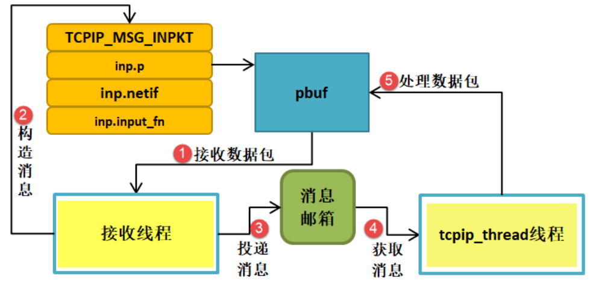

### API 消息

用户使用 NETCONN API 接口时，LwIP 会将对应 API 函数与参数构造成消息传递到 tcpip_thread 线程中，然后根据对应的 API 函数执行对应的操作。用户的应用线程与内核也是相互独立的，依赖操作系统的 IPC 通信机制进行数据交互与同步（邮箱、信号量等）。

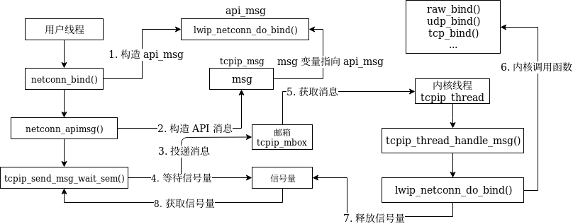

## ARP 协议

ARP 协议是 TCP/IP 协议的基础，通过解析 IP 地址得到数据链路层的地址。ARP 协议的核心是 ARP 缓存表，而ARP 协议的实质就是对缓存表的建立、更新、查询等操作。ARP 缓存表是由若干缓存表项组成，在 LwIP 中，描述缓存表项的数据结构叫 `etharp_entry`。


:::tip

Hardware Type：值 1 表示以太网地址，其它的还可能有令牌环地址

Protocol Type：值 `0x0800` 表示 IPv4 协议，其它还可能是 ICMP/IGMP 等

Hardware Address Length：硬件地址长度，以太网是 6

Protocol Address Length：协议地址长度，对于 ARP 请求和应答包来说，该值是 4

Opcode：ARP 操作的类型

	* ARP 请求，值1
	* ARP 应答，值2
	* RARP请求，值3
	* RARP应答，值4

:::

```c
struct etharp_entry {
#if ARP_QUEUEING
  /** Pointer to queue of pending outgoing packets on this ARP entry. */
  struct etharp_q_entry *q;
#else /* ARP_QUEUEING */
  /** Pointer to a single pending outgoing packet on this ARP entry. */
  struct pbuf *q;
#endif /* ARP_QUEUEING */
  ip4_addr_t ipaddr;		// IP 地址
  struct netif *netif;		// 网卡
  struct eth_addr ethaddr;	// 物理地址
  u16_t ctime;				// 生存时间，当大于最大生存值时，该表项会被删除
  u8_t state;				// 缓存项状态
};
```

### 缓存表超时处理

```c
/**
 * Clears expired entries in the ARP table.
 *
 * This function should be called every ARP_TMR_INTERVAL milliseconds (1 second),
 * in order to expire entries in the ARP table.
 */
void
etharp_tmr(void)
{
  int i;

  LWIP_DEBUGF(ETHARP_DEBUG, ("etharp_timer\n"));
  /* 遍历 ARP 表，删除过期的表项 */
  for (i = 0; i < ARP_TABLE_SIZE; ++i) {
    u8_t state = arp_table[i].state;
    if (state != ETHARP_STATE_EMPTY
#if ETHARP_SUPPORT_STATIC_ENTRIES
        && (state != ETHARP_STATE_STATIC)
#endif /* ETHARP_SUPPORT_STATIC_ENTRIES */
       ) {
      arp_table[i].ctime++;
        // 一下情形表示ARP表项过期：
        // 1. 表项处于 STABLE 状态，并且ctime超过了最大生存时间（5分钟）
        // 2. 表项处于 PENDING 状态，并且ctime超过了最大等待时间（5秒）
      if ((arp_table[i].ctime >= ARP_MAXAGE) ||
          ((arp_table[i].state == ETHARP_STATE_PENDING)  &&
           (arp_table[i].ctime >= ARP_MAXPENDING))) {
        LWIP_DEBUGF(ETHARP_DEBUG, ("etharp_timer: expired %s entry %d.\n",
                                   arp_table[i].state >= ETHARP_STATE_STABLE ? "stable" : "pending", i));
        /* clean up entries that have just been expired */
        etharp_free_entry(i);
      } else if (arp_table[i].state == ETHARP_STATE_STABLE_REREQUESTING_1) {
        /* Don't send more than one request every 2 seconds. */
        arp_table[i].state = ETHARP_STATE_STABLE_REREQUESTING_2;
      } else if (arp_table[i].state == ETHARP_STATE_STABLE_REREQUESTING_2) {
        /* Reset state to stable, so that the next transmitted packet will
           re-send an ARP request. */
        arp_table[i].state = ETHARP_STATE_STABLE;
      } else if (arp_table[i].state == ETHARP_STATE_PENDING) {
        /* still pending, resend an ARP query */
        etharp_request(arp_table[i].netif, &arp_table[i].ipaddr);
      }
    }
  }
}
```

### ARP 数据包接收流程

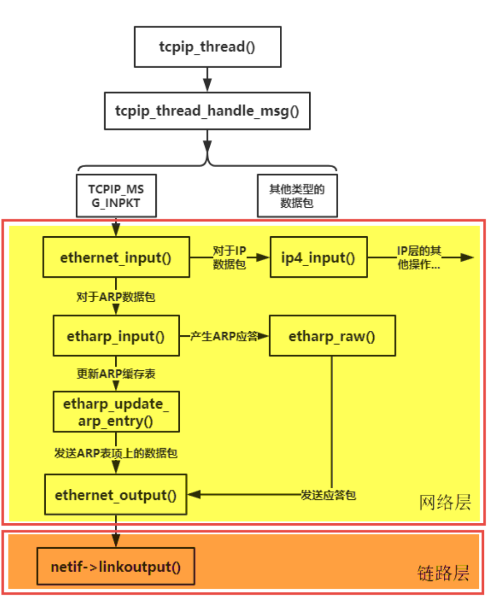

### ARP 数据包发送流程

IP 数据包通过 `ip4_output` 函数将上层数据包传递到 ARP 协议处理，ARP 通过 `etharp_output` 函数接收到 IP 数据包后就会进行发送，ARP 会先从数据包中进行分析，判断这个 IP 数据报是单播数据包还是多播或者是广播数据包，然后进行不同的处理：

* 对于对播或者是广播数据包，直接将数据包丢给网卡（调用 `ethernet_output` 函数）
* 对于单播包，首先判断目标 IP 地址是否和主机处于同一子网上，如果不是，则修改 IP 地址，IP 地址为网关的 IP 地址
* 对于单播包，ARP 协议需要根据 IP 地址找到对应的 MAC 地址，如果找不到 MAC 地址的话，还需要延迟发送数据包，ARP 协议首先会创建一个 ARP 表项，然后将数据包挂到 ARP 表项对应的缓存队列上，于此同时会发出一个 ARP 请求包，等待目标主机的回应后再发送 IP 数据包

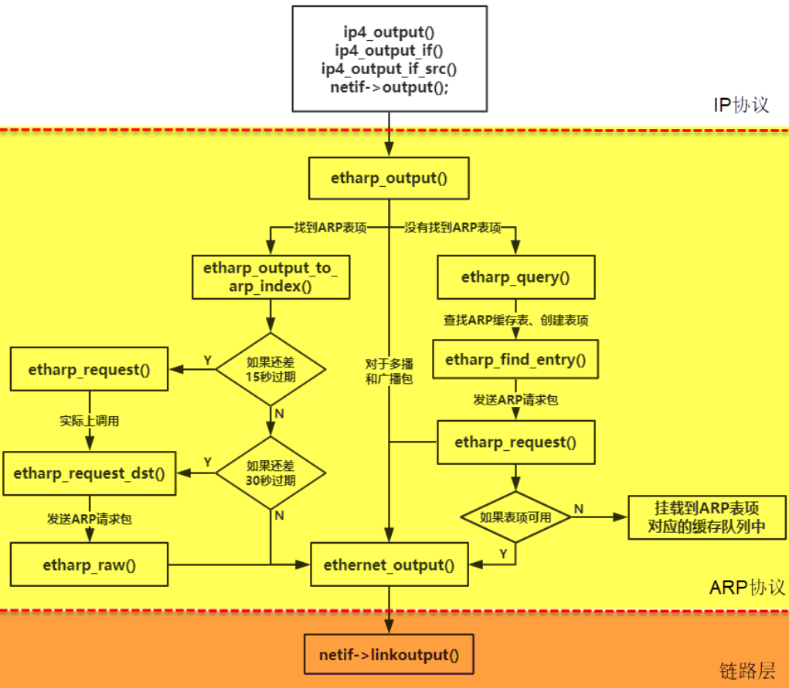

### 抓包

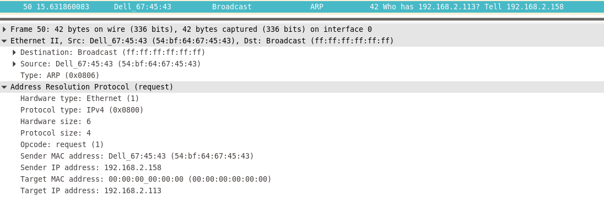

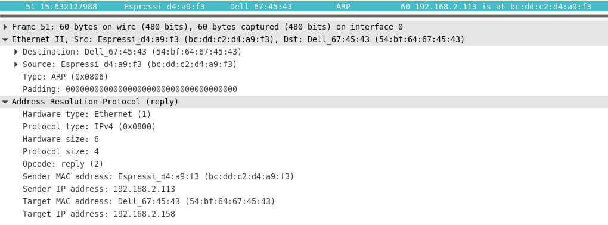

## IP 协议

IP 协议负责将数据包从源主机发送到目标主机，通过 IP 地址作为唯一识别码，在发送数据包的过程中，IP 协议还可能对数据包进行分片处理，同时在接收数据包的时候还可能需要对分片的数据包进行重装。

### IP 首部

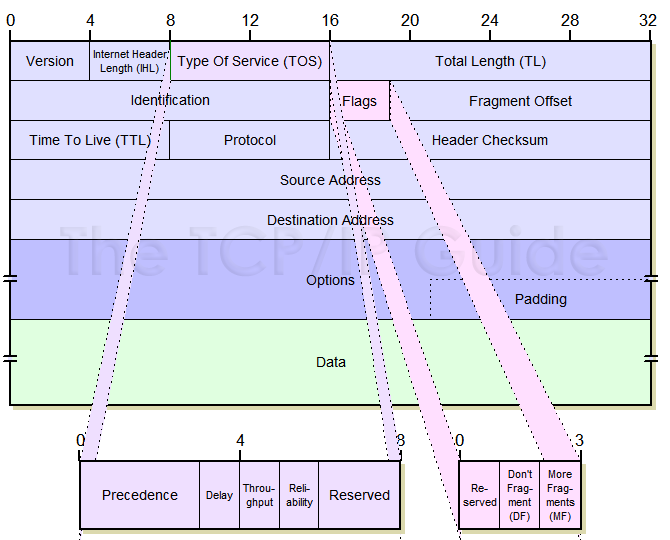

**LwIP 定义了一个 `ip_hdr` 结构体来描述 IP 数据包的首部**

:::tip

IHL：协议头的长度，单位是**字**，所以最大可以记录 60 字节的协议头部

TOS：服务类性，用以区分不同类型的 IP 数据包（例如一些特别要求低时延、高吞吐的数据包），路由器会根据这个字段的值来为数据包提供最合理的路径

TL：总长度，首部加上数据区域，单位是字节。整个 IP 数据包的理论最大长度为 65535 字节

Identification：标识字段用于表示 IP 层发送出去的每一份 IP 数据包，在发送每一份报文时，该值会加 1,在分片的时候，该字段会被复制到每个分片数据包中，目标接收主机会根据该字段判断这些数据是否属于同一个 IP 数据包

Fragment Offset：分片偏移量，使用 8 的整数倍记录，所以每个数据包中的分片数据大小也必须是 8 的整数倍

TTL：生存时间，每当 IP 数据包由一台路由器处理时，该字段的值减1,若 TTL 字段减为0,则该数据包必须丢弃，同时返回一个 ICMP 差错报文给源主机

Protocol：值为 6 表明数据部分要交给 TCP，值为 17 表明数据要交给 UDP

Header Checksum：IP 数据包在到达每个路由器上都必须重新计算校验和并再次存放到原处，因为 TTL 字段以及可能的选项字段会改变

Data：数据区域包含传输层的报文，或者也可以是 ICMP 报文

:::

:::warning

* IPv6 不允许数据包分片
* IPv6 不支持 Options 选项

:::

### IP 数据报分片

:::tip

一个链路层帧能承载的最大数据量叫做最大传输单元（MTU），以太网帧的 MTU 为 1500 字节。发送方与目的地路径上的每段链路可能使用不同的链路层协议，且每种协议可能具有不同的 MTU，为此需要对 IP 数据报进行分片处理。IP 数据包的重装由目标 IP 地址的主机来完成，每个数据分片到达目标 IP 地址主机的时间是不一样的。

:::

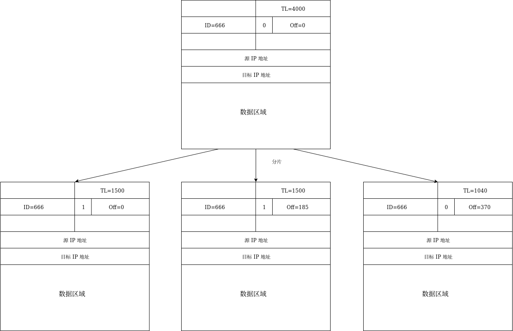

### IP 数据报发送

`ip4_output` 使用 `ip4_route_src` 函数查找目标网络接口 netif 来发送 IP 数据包。当网络接口 netif 确定后，IP 数据包通过函数 `ip4_output_if` 发送出去。若 `ip4_route_src` 没有找到合适的网络接口，则丢弃该报文，终止本次发送。

函数 `ip4_route_src` 通过遍历网络接口链表 netif_list，查找与目的 IP 地址在同一个子网中的网络接口，并将该网络接口返回给变量 netif。

`ip4_output_if`填写 IP 数据报首部对应的各个字段，最后在 IP 层通过回调函数 `netif->output`（即 `etharp_output` 函数）将 IP 数据报投递给 ARP 协议，再调用网卡底层发送函数进行发送。

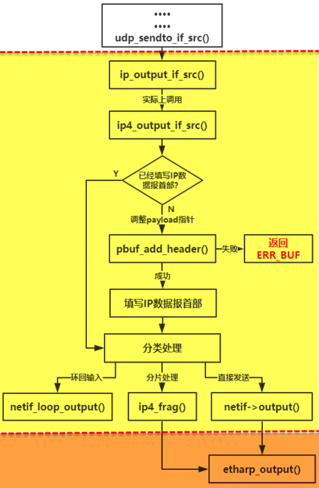

### IP 数据报接收

`ip4_input` 会做各项检查，包括协议版本号，IP 首部的校验值，源 IP 地址是否有效等，然后检测 IP 数据包中的目的 IP 地址是否与本节点的 IP 地址相符，如果是本节点的 IP 地址，则根据该 IP 数据包首部的协议字段判断该数据包应该被递交到哪个上层协议，并调用相应的函数。

如果是 UDP 协议，则调用 `udp_input` 函数；如果是 TCP协议，则调用 `tcp_input` 函数；如果是 ICMP 协议，则调用 `icmp_input` 函数；如果是 IGMP 协议，则调用`igmp_input` 函数；如果都不是，则调用函数 `icmp_dest_unreach` 返回一个协议不可达 `ICMP` 数据包给源主机。

如果不是本节点的 IP 地址，则通过调用函数 `ip_forward` 对数据包进行转发。需要注意，由于一个节点可能含有多个 IP 地址，因此 `ip4_input` 函数会遍历网络接口链表 netif_list上 的 netif 结构变量，来查找与 IP 数据包中相匹配的 IP 地址。

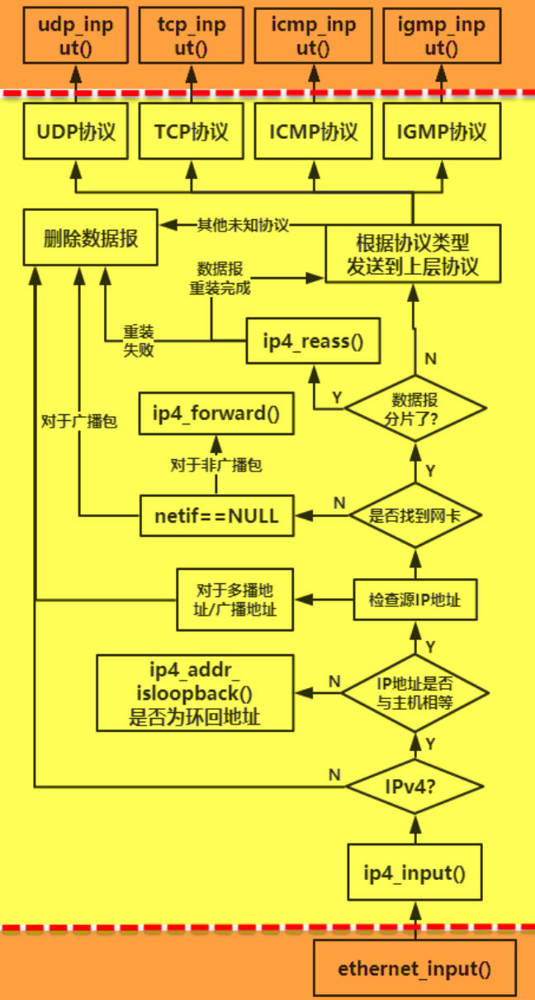

### 几个重要的 IP 地址相关的数据结构

#### IPv4 相关

```c
struct in_addr
{
    in_addr_t s_addr;  //表示32位的IP地址，32位无符号整型
}

struct sockaddr_in
{
    uint8_t            sin_len;     //表示该结构体的长度，8位无符号整型
    sa_family_t        sin_family;  //表示套接口使用的协议族，8位无符号整型
    in_port_t          sin_port;    //表示套接口使用的端口号，16位无符号整型
    struct in_addr     sin_addr;    //表示IP地址，32位无符号整型
    char               sin_zero[8]; //该成员基本不使用，总是置为0
}
```

* `sin_len` 成员是不要求一定存在的，即便这个成员存在，也无需设置它或者检查它
* `sin_family` 的类型与 `sin_len` 成员有关，如果结构体中定义了成员 `sin_len`，那么 `sin_family` 一般就是8位无符号整型；如果结构体中没有定义成员 `sin_len`，那么 `sin_family` 一般就是16位无符号整型

#### IPv6 相关

```c
struct in6_addr
{
    unit8_t s6_addr[16]; //表示128位的IP地址，这里采用数组的形式  
}

struct sockaddr_in6
{
    uint8_t         sin6_len;      //表示该结构体的长度，8位无符号整型
    sa_family_t     sin6_family;   //表示套接口使用的协议族，8位无符号整型
    in_port_t       sin_port;      //表示套接口使用的端口号，16位无符号整型
    uint32_t        sin_flowinfo;  //低序20位是流标签，高序12位保留
    struct in6_addr sin6_addr      //表示128位的IP地址
    uint32_t        sin6_scope_id; //标识对于具备范围的地址而言有意义的范围
}
```

#### 通用套接字地址结构

```c
struct sockaddr
{
    uint8_t     sa_len;
    sa_family_t sa_family;
    char        sa_data[14]; //表示14字节的协议地址
}
```

#### 新的通用套接字接口地址结构

```c
struct sockaddr_storage
{
    uint8_t              ss_len;    //表示该结构的长度
    sa_family_t          ss_family; //表示协议族
    char __ss_padding[_SS_PADSIZE];          
}
```

* 原有的通用数据结构 `sockaddr` 只有 16 字节，无法兼容 IPv6 格式，`sockaddr_storage` 足够大，可以容纳任何套接字接口地址

#### inet_pton 和 inet_ntop 函数

```c
int inet_pton(int family, const char *strptr, void *addrstr); //成功返回1，strptr格式错误返回0，失败返回-1
const char *inet_ntop(int family, const void *addrstr, char *strptr, size_t len); //成功则返回指向结果的指针，失败返回NULL
```

* `family` 参数根据协议族的不同，选择 `AF_INET` 或 `AF_INET6`

* `inet_pton` 将 `strptr` 指向的字符串，转为数值，存放在 `addstr` 指向的内存中

* `inet_ntop` 做相反的运算，`len` 参数是 `strptr` 单元的大小，防止溢出。为有助于指定大小，C语言中有做如下定义:

  ```c
  #incldue <arpa/inet.h>
  #define INET_ADDRSTRLEN    16
  #define INET6_ADDRSTRLEN   46
  ```

## ICMP 协议

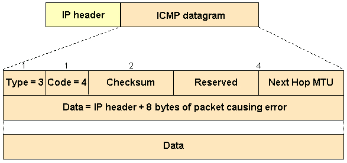

:::tip

ICMP 报文有两大类型，可以划分为**差错报告**报文和**查询**报文。

差错报告报文主要是用来向 IP 数据报源主机返回一个差错报告信息，而这个差错报告信息产生的原因是路由器或者主机不能对当前数据报进行正常的处理。

查询报文是用于一台主机向另一台主机发起一个请求，如果目标主机收到这个查询的请求后，就会按照查询报文的格式想源主机作出应答。`ping ` 命令本质上就是一个 ICMP 查询报文。

:::

<table>
  <tr>
    <th>ICMP 报文类型</th>
    <th>具体类型</th>
    <th>描述<br></th>
  </tr>
  <tr>
    <td rowspan="5">差错报告报文<br></td>
    <td>3</td>
    <td>目的不可达</td>
  </tr>
  <tr>
    <td>4</td>
    <td>源站抑制</td>
  </tr>
  <tr>
    <td>5</td>
    <td>重定向</td>
  </tr>
  <tr>
    <td>11</td>
    <td>超时</td>
  </tr>
  <tr>
    <td>12</td>
    <td>参数错误报文</td>
  </tr>
  <tr>
    <td rowspan="5">查询报文</td>
    <td>0或8</td>
    <td>回显请求或回显应答</td>
  </tr>
  <tr>
    <td>9或10</td>
    <td>路由器询问或通告</td>
  </tr>
  <tr>
    <td>13或14</td>
    <td>事件戳请求或应答</td>
  </tr>
  <tr>
    <td>15或16</td>
    <td>信息请求或应答</td>
  </tr>
  <tr>
    <td>17或18</td>
    <td>掩码请求或应答</td>
  </tr>
</table>

:::warning

ICMP 回显请求报文和回显应答报文是 LwIP 中唯一实现的查询报文，其它几种查询报文用于主机确定自己的 IP 地址、掩码、路由等信息，已经被 DHCP 协议取代了。

:::

### 发送差错报文

如果 IP 数据报无法递交到传输层时，就会调用 `icmp_dest_unreach()` 函数返回一个 ICMP 协议不可达报文。

如果在传输层中，UDP 协议无法向应用层递交数据报，那么将调用该函数返回一个 ICMP 端口不可达报文。

在转发数据报的时候，如果数据报中 TTL 为 0,或者在分片数据报重装的时候超时，LwIP 将调用 `icmp_time_exceeded()` 函数发送一个 ICMP 超时报文到源主机中。

`icmp_time_exceeded` 和 `icmp_dest_unreach` 都会调用 `icmp_send_response` 函数发送 ICMP 应答报文。

```c
/**
 * Send an icmp packet in response to an incoming packet.
 *
 * @param p the input packet for which the 'unreachable' should be sent,
 *          p->payload pointing to the IP header
 * @param type Type of the ICMP header
 * @param code Code of the ICMP header
 */
static void
icmp_send_response(struct pbuf *p, u8_t type, u8_t code)
{
  struct pbuf *q;
  struct ip_hdr *iphdr;
  struct icmp_echo_hdr *icmphdr;
  ip4_addr_t iphdr_src;
  struct netif *netif;

  /* 申请 pbuf 内存块，大小为 ICMP 首部 + IP 首部 + 8 字节数据 */
  q = pbuf_alloc(PBUF_IP, sizeof(struct icmp_echo_hdr) + IP_HLEN +                                          ICMP_DEST_UNREACH_DATASIZE,PBUF_RAM);
  if (q == NULL) {
    return;
  }
  // 指向 IP 数据报首部
  iphdr = (struct ip_hdr *)p->payload;
  // 指向 pbuf 数据区域，并强制转化为 ICMP 报文首部
  icmphdr = (struct icmp_echo_hdr *)q->payload;
  icmphdr->type = type;
  icmphdr->code = code;
  icmphdr->id = 0;
  icmphdr->seqno = 0;
  // 从原始数据包中复制字段，IP 数据报首部 + 8 字节的数据区域
  SMEMCPY((u8_t *)q->payload + sizeof(struct icmp_echo_hdr), (u8_t *)p->payload,
          IP_HLEN + ICMP_DEST_UNREACH_DATASIZE);
  // 得到源 IP 地址
  ip4_addr_copy(iphdr_src, iphdr->src);
  // 根据路由表查询底层网卡接口
  netif = ip4_route(&iphdr_src);
  if (netif != NULL) {
    /* calculate checksum */
    icmphdr->chksum = 0;
#if CHECKSUM_GEN_ICMP
    IF__NETIF_CHECKSUM_ENABLED(netif, NETIF_CHECKSUM_GEN_ICMP) {
      icmphdr->chksum = inet_chksum(icmphdr, q->len);
    }
#endif
    ip4_output_if(q, NULL, &iphdr_src, ICMP_TTL, 0, IP_PROTO_ICMP, netif);
  }
  pbuf_free(q);
}
```

### 处理 ICMP 报文

:::tip

LwIP 对 ICMP 报文中很多类型的报文都不做处理，LwIP 会将这些不处理的报文丢弃，但是对 ICMP 回显请求报文会做出处理。

:::

`icmp_input` 在 `ip_input` 中被调用，它处理接收到的 ICMP 请求报文。首先判断该数据包是否为广播或者组播包，如果是，则直接返回，不再继续处理；如果不是，则继续判断该数据包长度是否小于 ICMP 回显请求头部长度，如果是则丢弃数据包；如果不是则将该 ICMP 报文类型字段变为 0，重新计算校验和，并将 IP 报文首部的源 IP 地址和目的 IP 地址交换位置，并通过调用函数 `ip_output_if` 将数据包发送出去。

## UDP 协议


* 函数udp_input将检查报文的UDP校验，最终调用函数recv，将收到的报文传递给应用层程序
* 当应用层程序要通过UDP协议向外发送IP报文时，将通过调用函数udp_send实现，函数udp_send通过调用IP层的函数ip_output_if实现报文的发送
* LwIP使用链表结构体udp_pcb来保存每一个UDP会话的状态

```c
struct udp_pcb {
/* Common members of all PCB types */
  IP_PCB;

/* Protocol specific PCB members */

  struct udp_pcb *next;

  u8_t flags;
  /** ports are in host byte order */
  u16_t local_port, remote_port;

#if LWIP_MULTICAST_TX_OPTIONS
  /** outgoing network interface for multicast packets */
  ip_addr_t multicast_ip;
  /** TTL for outgoing multicast packets */
  u8_t mcast_ttl;
#endif /* LWIP_MULTICAST_TX_OPTIONS */

#if LWIP_UDPLITE
  /** used for UDP_LITE only */
  u16_t chksum_len_rx, chksum_len_tx;
#endif /* LWIP_UDPLITE */

  /** receive callback function */
  udp_recv_fn recv;
  /** user-supplied argument for the recv callback */
  void *recv_arg;
};
```

## TCP 协议


* TCP的滑动窗口协议是用于实现流量控制的
* TCP的超时和重传机制提高了数据传输的可靠性
* 拥塞控制是通过慢启动算法和拥塞避免算法来实现的
* LwIP中含有两个定时器函数：tcp_fasttmr和tcp_slowtmr，tcp_fasttmr每250ms调用一次，tcp_slowtmr每500ms调用一次。快速定时器主要做两个方面的事情：向上层递交上层一直未接收的数据，二是发送该连接上的延迟ACK请求数据段。慢速定时器参与了较多功能，如超时与重传、拥塞控制等。


## LwIP 的三种编程接口

::: tip RAW/Callback API

直接调用协议栈各模块的函数（它们是使用**回调函数**的 API 接口，也称为 RAW API）。

优点：

* 无需操作系统支持。
* LwIP 内核把数据交给应用程序的过程只是一次简单的 API 调用，非常节省时间和空间。
* 应用程序和内核程序处于同一线程之中，节省了任务间通信和任务切换的开销。

缺点：

* 应用程序的执行会制约内核程序的执行，不同的应用程序之间也会互相制约。在应用程序执行的过程中，内核程序将不能得到运行，这会影响网络数据包的处理效率，严重地还会造成数据包堵塞而发生丢包现象。

:::

::: tip Netconn API

使用 LwIP 提供的专用 API，也称为 Sequential API，程序的执行过程基于 **open-read-write-close** 模型。Netconn API 是基于操作系统的 IPC 机制实现的，它将 LwIP 内核代码和网络应用程序分离成独立的线程。

优点：

* LwIP 线程只负责数据包的 TCP/IP 封装和拆封，不用进行数据的应用层处理，提高了系统对网络数据包的处理效率。
* 相较于 Socket API，Netconn API 避免了内核程序和网络应用程序之间的数据拷贝，提高了数据传递的效率。

缺点：

* 依赖操作系统。
* 内核程序和网络应用程序之间的数据包传递需要依靠操作系统的信号量和邮箱机制完成，耗费了更多的时间和内存。

:::

::: tip BSD Socket API

Socket 对网络连接进行了高级的抽象，使得用户可以像操作文件一样操作网络连接。LwIP 的 Socket API 是基于 Netconn API 实现的。

优点：

* 使用 Socket 编写的网络应用程序具有很好的可移植性。

缺点：

* Socket API 在内核程序和应用程序之间存在数据拷贝，降低了数据传递的效率。

:::

::: warning

LwIP 并没有实现全部的 BSD Socket API。

:::

### TCP RAW API


| 函数                                                         | 说明                                                         |
| ------------------------------------------------------------ | ------------------------------------------------------------ |
| struct tcp_pcb* tcp_new()                                    | 新建tcp协议控制块                                            |
| ert_t tcp_bind(struct tcp_pcb* pcb,struct ip_addr* ipaddr,u16_t port) | 绑定本地IP地址和端口号，如果ipaddr为IP_ADDR_ANY，则将连接绑定到所有的本地IP地址上 |
| struct tcp_pcb* tcp_listen(struct tcp_pcb* pcb)              | 使指定的连接开始进入监听状态，如果监听成功，就返回一个新的连接控制块pcb |
| void tcp_accepted(struct tcp_pcb* pcb)                       | 通知LwIP一个新来的连接已经被接收，这个函数通常在由tcp_accept指定的回调函数中被调用 |
| void tcp_accept(struct tcp_pcb\* pcb,err_t (\*accept)(void\* arg,struct tcp_pcb\* newpcb,err_t err)) | 指定处于监听状态的连接，在成功建立连接后要调用的回调方法     |
| err_t tcp_connect(struct tcp_pcb\* pcb,struct ip_addr\* ipaddr,u16_t port,err_t (\* connected)(void\* arg,struct tcp_pcb\* tpcb,err_t err)) | 请求连接到执行的远程主机                                     |
| err_t tcp_write(struct tcp_pcb\* pcb,void\* dataptr,u16_t len,u8_t copy) | 发送TCP数据，将要发送的数据放入发送队列中，由协议栈内核发送，copy为0则不会为发送的数据分配新的内存空间 |
| void tcp_sent(struct tcp_pcb\* pcb,err_t (\*sent)(void\* arg,struct tcp_pcb\* tpcb,u16_t len)) | 指定当远程主机成功接收数据后，应用程序调用的回调函数         |
| void tcp_recv(struct tcp_pcb\* pcb,err_t (\* recv)(void\* arg,struct tcp_pcb\* tpcb,struct pbuf\* p,err_t err)) | 指定接收数据时调用的回调函数                                 |
| void tcp_recved(struct tcp_pcb\* pcb,u16_t len)              | 用于获取接收到的数据的长度，必须在tcp_recv指定的回调函数中被调用 |
| err_t tcp_close(struct tcp_pcb\* pcb)                        | 关闭一个指定的TCP连接，调用该函数后将会释放pcb控制块所占用的内存空间 |
| void tcp_abort(struct tcp_pcb\* pcb)                         | 终止一个指定的连接，调用该函数后，pcb控制块所占用的内存空间将被释放 |
| void tcp_err(struct tcp_pcb\* pcb,void (\*err)(void\* arg,err_t err)) | 指定处理错误的回调函数                                       |


### TCP RAW API


### Netconn API

* 数据结构netconn描述了应用程序要使用API函数机那里一个连接的各种属性，包括了连接的类型、最近的故障代码、回调函数等。

```c
/** A netconn descriptor */
struct netconn {
  /** type of the netconn (TCP, UDP or RAW) */
  enum netconn_type type;
  /** current state of the netconn */
  enum netconn_state state;
  /** the lwIP internal protocol control block */
  union {
    struct ip_pcb  *ip;
    struct tcp_pcb *tcp;
    struct udp_pcb *udp;
    struct raw_pcb *raw;
  } pcb;
  /** the last error this netconn had */
  err_t last_err;
  
#if !LWIP_NETCONN_SEM_PER_THREAD
  /** sem that is used to synchronously execute functions in the core context */
  sys_sem_t op_completed;

#endif

  /** mbox where received packets are stored until they are fetched
      by the netconn application thread (can grow quite big) */
  sys_mbox_t recvmbox;
#if LWIP_TCP
  /** mbox where new connections are stored until processed
      by the application thread */
  sys_mbox_t acceptmbox;
#endif /* LWIP_TCP */
  /** only used for socket layer */
#if LWIP_SOCKET
  int socket;
#endif /* LWIP_SOCKET */
#if LWIP_SO_SNDTIMEO
  /** timeout to wait for sending data (which means enqueueing data for sending
      in internal buffers) in milliseconds */
  s32_t send_timeout;
#endif /* LWIP_SO_RCVTIMEO */
#if LWIP_SO_RCVTIMEO
  /** timeout in milliseconds to wait for new data to be received
      (or connections to arrive for listening netconns) */
  int recv_timeout;
#endif /* LWIP_SO_RCVTIMEO */
#if LWIP_SO_RCVBUF
  /** maximum amount of bytes queued in recvmbox
      not used for TCP: adjust TCP_WND instead! */
  int recv_bufsize;
  /** number of bytes currently in recvmbox to be received,
      tested against recv_bufsize to limit bytes on recvmbox
      for UDP and RAW, used for FIONREAD */
  int recv_avail;
#endif /* LWIP_SO_RCVBUF */
#if LWIP_SO_LINGER
   /** values <0 mean linger is disabled, values > 0 are seconds to linger */
  s16_t linger;
#endif /* LWIP_SO_LINGER */
  /** flags holding more netconn-internal state, see NETCONN_FLAG_* defines */
  u8_t flags;
#if LWIP_TCP
  /** TCP: when data passed to netconn_write doesn't fit into the send buffer,
      this temporarily stores how much is already sent. */
  size_t write_offset;
  /** TCP: when data passed to netconn_write doesn't fit into the send buffer,
      this temporarily stores the message.
      Also used during connect and close. */
  struct api_msg_msg *current_msg;
#endif /* LWIP_TCP */
  /** A callback function that is informed about events for this netconn */
  netconn_callback callback;
};
```


| 函数                                                         | 说明                                                         |
| ------------------------------------------------------------ | ------------------------------------------------------------ |
| struct netconn\* netconn_new_with_proto_and_callback(enum netconn_type t,u8_t proto,netconn_callback callback) | 建立一个新的netconn连接                                      |
| err_t netconn_delete(struct netconn\* conn)                  | 删除netconn所指向的连接                                      |
| err_t netconn_getaddr(struct netconn\* conn,struct ip_addr\* addr,u16_t\* port,u8_t local) | 获取conn连接的主机IP地址和端口号                             |
| err_t netconn_bind(struct netconn\* conn,struct ip_addr\* addr,u16_t port) | 将一个IP地址及端口号与conn指向的而连接绑定                   |
| err_t netconn_connect(struct netconn\* conn,struct ip_addr\* addr,u16_t port) | 将服务器端的IP地址和端口号与conn指向的连接绑定               |
| err_t netconn_disconnect(struct netconn\* conn)              | 断开conn指向的连接                                           |
| err_t netconn_listen_with_backlog(struct netconn\* conn，u8_t backlog) | 将conn指向的连接设定为监听状态                               |
| struct netconn\* netconn_accept(struct netconn\* conn)       | 接收客户端的连接，该函数会阻塞在acceptmbox邮箱上             |
| struct netbuf\* netconn_recv(struct netconn\* conn)          | 接收数据，接收到的数据被封装为netbuf结构                     |
| err_t netconn_sendto(struct netconn\* conn,struct netbuf\* buf,struct ip_addr\* addr,u16_t port) | 向一个指定的IP地址和端口号发送数据，这个函数只能用在conn类型为UDP或者RAW的连接中 |
| err_t netconn_write(struct netconn\* conn,const void\* dataptr,size_t size,u8_t apiflag) | 向相应的TCP连接上发送数据，这个函数只能用于发送TCP的报文     |
| err_t nnetconn_close(struct netconn\* conn)                  | 关闭conn指向的连接                                           |

* netconn_new_with_proto_and_callback首先调用netconn_alloc函数分配并初始化一个netconn结构，接下来该函数会构建一个api_msg消息，该消息要求内核执行函数do_newconn，最后调用函数tcpip_apimsg来将消息包装成tcpip_msg结构并发送出去。tcpip_thread函数解析该消息并调用函数do_newconn，do_newconn根据参数的类型调用函数tcp_new创建一个TCP控制块
* tcpip_thread是处理TCP/IP的内核协议栈进程，它只接收tcpip_msg结构封装的消息，并根据消息的类型来判定该消息来自物理网卡或应用层程序。如果接收到网卡的IP报文，则将该报文递交给ip_input函数；如果是应用层程序发送的消息，则通过调用消息指定的内核处理函数来完成相应的功能

### Socket API

> LwIP提供了标准BSD套接字API，它也是有序API，在内存构建于Netconn API之上。所谓“有序”是指其执行模型基于典型的阻塞式打开-读-写-关闭机制。


::: warning HTTP 协议在物联网系统中的劣势

1. HTTP 是一种同步协议，客户端需要等待服务器的响应才可以进行下一步工作（在客户端数量多、网络不可靠的场景下，实现同步通信很困难）
2. HTTP 是单向的，客户端只能主动向服务器发出数据，无法被动接收来自网络的数据（不适用于实时控制的场合）
3. HTTP 有许多帧头和规则，是一种重量级的协议（实现在物联网设备中需要耗费大量的系统资源）

:::