# 正则表达式


## 元字符


## 量词与贪婪


### 贪婪模式（Greedy）

正则中，表示次数的量词默认是贪婪的，在贪婪模式下，会尝试尽可能最大长度去匹配。

在字符串`aaabb`中使用正则`a*`的匹配过程：


### 非贪婪模式（Lazy）

非贪婪模式下，正则会找出长度最小且满足要求的结果。将贪婪模式变成非贪婪模式的方法是：**在量词后面加上`?`**


### 贪婪和非贪婪的对比


```python
>>> import re
>>> re.findall(r'a*', 'aaabb')  # 贪婪模式
['aaa', '', '', '']
>>> re.findall(r'a*?', 'aaabb') # 非贪婪模式
['', 'a', '', 'a', '', 'a', '', '', '']
```

## 分组与引用


括号在正则中可以用于分组，被括号括起来的部分“子表达式”会被保存成一个子组，简单来说，第几个括号就是第几个分组。

如果正则中出现了括号，那么就会认为，这个子表达式在后续可能会再次被引用，如果我们不打算去引用，建议将其声明为**不保存**子组，以提高正则的性能。实现方法是，在括号里面使用`?:`进行声明。

|            | 正则     | 示例             |
| ---------- | -------- | ---------------- |
| 保存子组   | (正则)   | \d{15}(\d{3})?   |
| 不保存子组 | (?:正则) | \d{15}(?:\d{3})? |


### 分组的编号

如果要看某个括号里面的内容是第一个分组，该怎么办？我们只需要数左括号（开括号）是第几个，就可以确定是第几个子组。


### 命名分组

有些语言提供了命名分组，这比数字更有辨识度，不容易出错。格式为：`(?P<group-name>regular-expression)`

### 分组引用

| 编程语言   | 查找时引用方式 | 替换时引用方式 |
| ---------- | -------------- | -------------- |
| Python     | \number        | \number        |
| Java       | \number        | $number        |
| JavaScript | \number        | $number        |


## 匹配模式

匹配模式，指的是正则中一些**改变元字符匹配行为**的方式。常见的匹配模式有 4 种：不区分大小写模式、点号通配模式、多行模式和注释模式。

具体做法是，将**模式修饰符 (? 模式标识)**放在整个正则前面。


### 不区分大小写模式（Case-Insensitive）

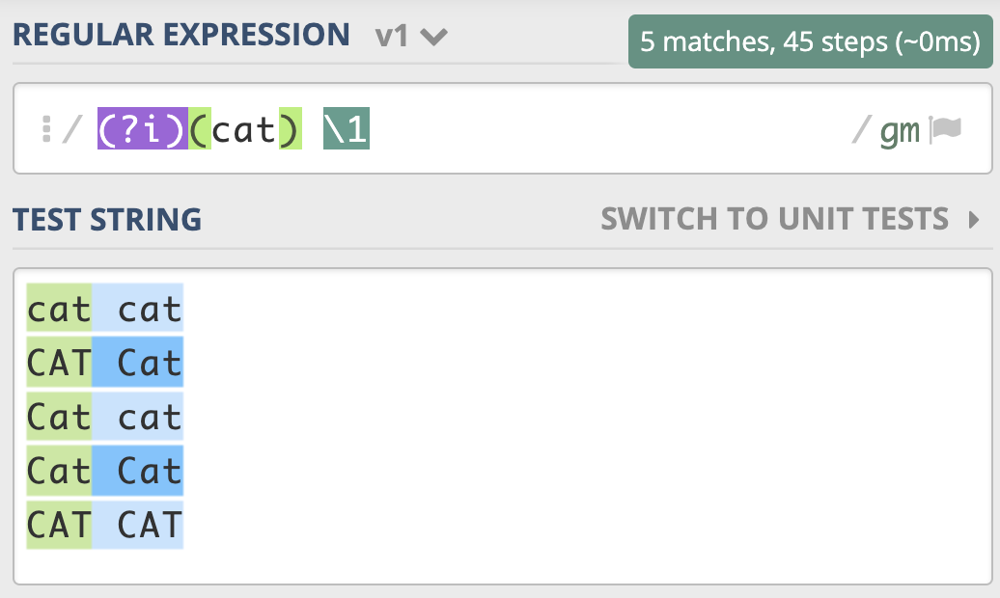

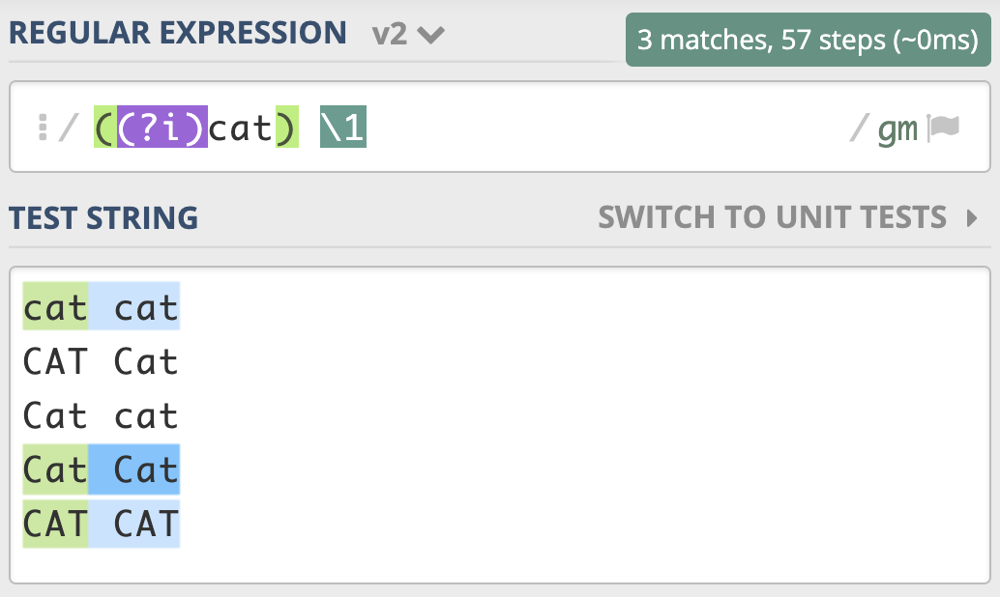

Python 代码中如何使用不区分大小写的匹配模式

```python
>>> import re
>>> re.findall(r"cat", "CAT Cat cat", re.IGNORECASE)
['CAT', 'Cat', 'cat']
```

### 点号通配模式（Dot All）

正则中提供了一种模式，让英文的点（.）可以匹配上包括换行的任何字符。

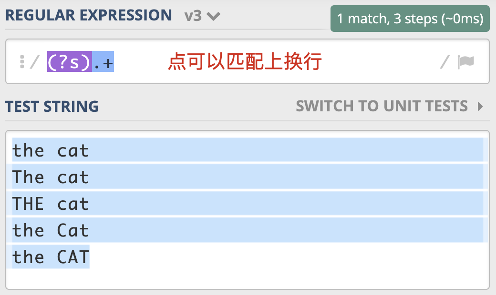

### 多行匹配模式（Multiline）

通常情况下，^匹配整个字符串的开头，$ 匹配整个字符串的结尾。

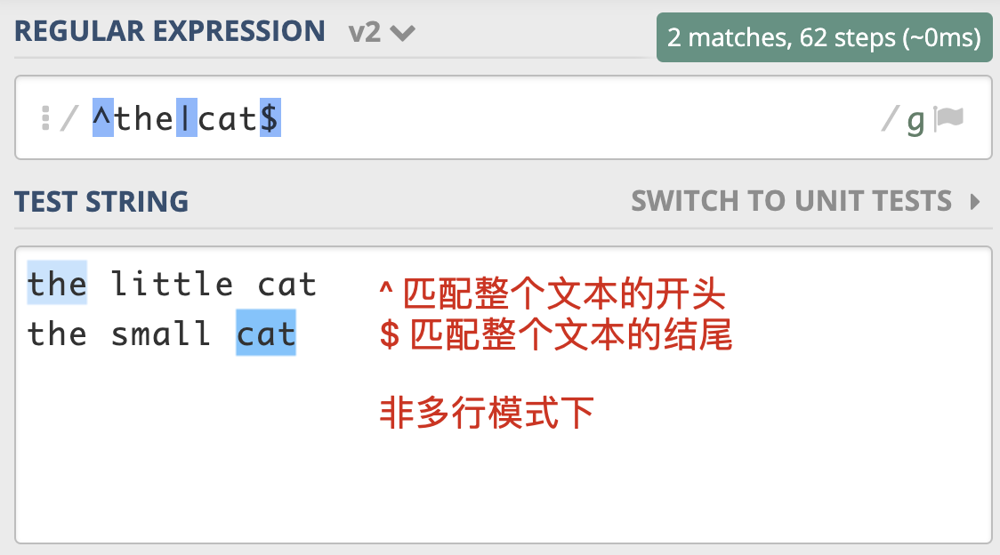

多行模式的作用在于，使  ^ 和 $ 能匹配上每行的开头或结尾。

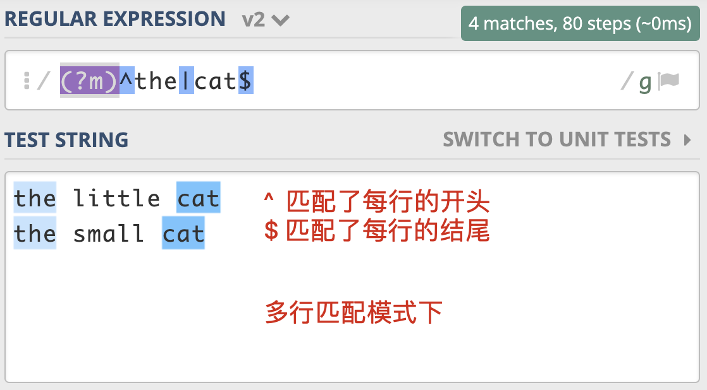

正则中还有 `\A` 和 `\z`（Python 中是 `\Z`） 这两个元字符容易混淆，`\A` 仅匹配整个字符串的开始，`\z` 仅匹配整个字符串的结束，在多行匹配模式下，它们的匹配行为不会改变，如果只想匹配整个字符串，而不是匹配每一行，用这个更严谨一些。

### 注释模式（Comment）

```sh
(\w+)(?#word) \1(?#word repeat again)
```

```python
import re

regex = r'''(?mx)  # 使用多行模式和x模式
^          # 开头
(\d{4})    # 年
(\d{2})    # 月
$          # 结尾
'''

re.findall(regex, '202006\n202007')
# 输出结果 [('2020', '06'), ('2020', '07')]
```

## 断言

断言是指对匹配到的文本位置有要求，常见的断言有三种：单词边界、行的开始或结束以及环视。

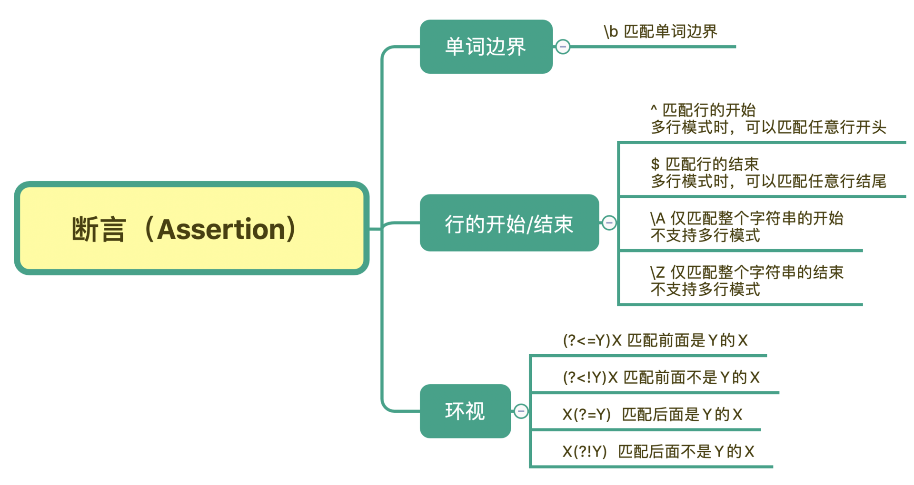

### 单词边界（Word Boundary）

正则中使用 `\b` 来表示单词的边界。

|          | tom<br />单词包含tom | \btom<br />以tom开头的单词 | tom\b<br />以tom结尾的单词 | \btom\b<br />只能是tom |
| -------- | -------------------- | -------------------------- | -------------------------- | ---------------------- |
| tom      | ✔️                    | ✔️                          | ✔️                          | ✔️                      |
| tomorrow | ✔️                    | ✔️                          | ✖️                          | ✖️                      |
| atom     | ✔️                    | ✖️                          | ✔️                          | ✖️                      |
| atomic   | ✔️                    | ✖️                          | ✖️                          | ✖️                      |

### 行的开始或结束

在多行模式下，`^` 和 `$` 符号可以匹配每一行的开头或结尾。大部分实现默认不是多行匹配模式，但也有例外，比如 Ruby 中默认是多行模式。所以对于校验输入数据来说，一种更严谨的做法是，使用 `\A` 和 `\z` （Python 中使用 `\Z`）  来匹配整个文本的开头或结尾。

### 环视（Look Around）

环视就是要求匹配部分的前面或后面要满足（或不满足）某种规则，有些地方也称环视为**零宽断言**。

环视中虽然也有括号，但不会保存成子组。

| 正则   | 名称                                  | 含义      | 示例                                      |
| ------ | ------------------------------------- | --------- | ----------------------------------------- |
| (?<=Y) | 肯定逆序环视<br />positive-lookbehind | 左边是Y   | (?<=\d)th 左边是数字的 th,能匹配 9th      |
| (?<!Y) | 否定逆序环视<br />negative-lookbehind | 左边不是Y | (?<!\d)th 左边不是数字的 th,能匹配 health |
| (?=Y)  | 肯定顺序环视<br />positive-lookahead  | 右边是Y   | six(?=\d) 右边是数字的 six,能匹配 six6    |
| (?!Y)  | 否定顺序环视<br />negative-lookahead  | 右边不是Y | hi(?!\d) 右边不是数字的 hi,能匹配 high    |

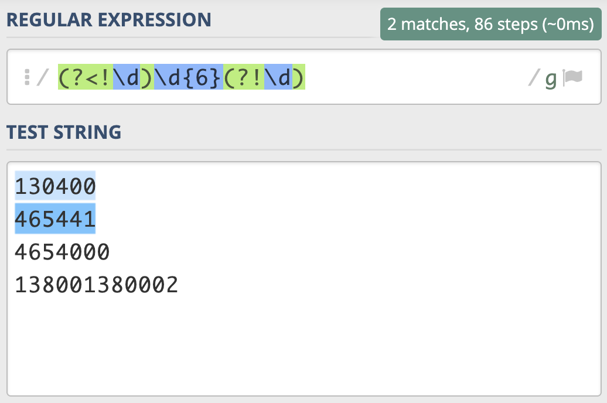

## 转义

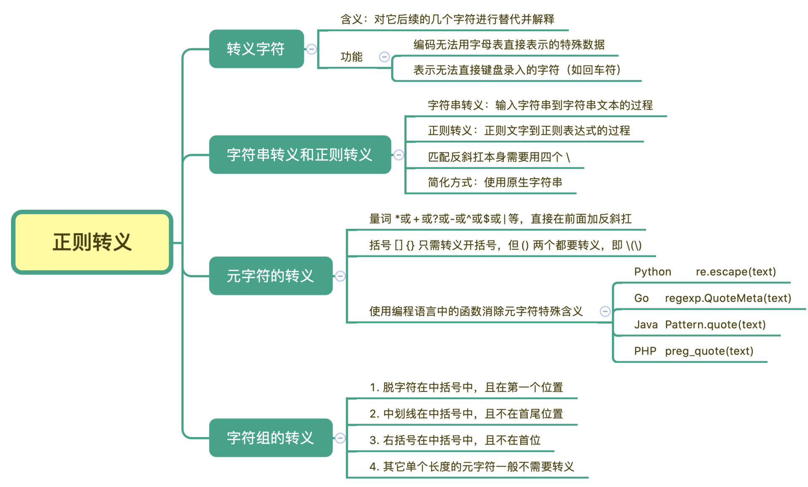

正则中转义有些情况下会比较复杂，从录入的字符串文本，到最终的正则表达式，经过了**字符串转义**和**正则转义**两个步骤。

一般来说如果我们要想将元字符（.*+?() 之类）表示成它字面上本来的意思，是需要对其进行转义的，但如果它们出现在字符组中括号里，可以不转义。但如果在中括号中出现 \d 或 \w 等符号时，他们还是元字符本身的含义。

```python
>>> import re
>>> re.findall(r'[.*+?()]', '[.*+?()]')  # 单个长度的元字符
['.', '*', '+', '?', '(', ')']
>>> re.findall(r'[\d]', 'd12\\')  # \w，\d等在中括号中还是元字符的功能
['1', '2']  # 匹配上了数字，而不是反斜杠\和字母d
```

```python
>>> import re
>>> re.findall('\n', '\\n\n\\')
['\n']  # 找到了换行符
>>> re.findall('\\n', '\\n\n\\')
['\n']  # 找到了换行符
>>> re.findall('\\\n', '\\n\n\\')
['\n']  # 找到了换行符
>>> re.findall('\\\\n', '\\n\n\\')
['\\n'] # 找到了反斜杠和字母n
```

## 流派

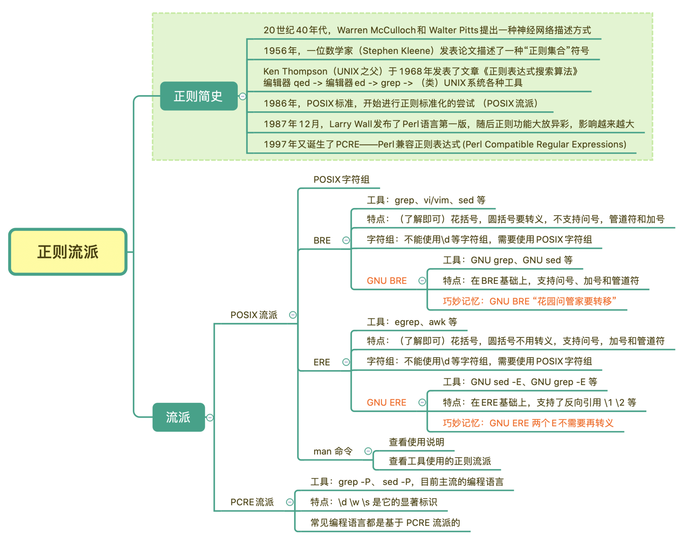

### POSIX 字符组

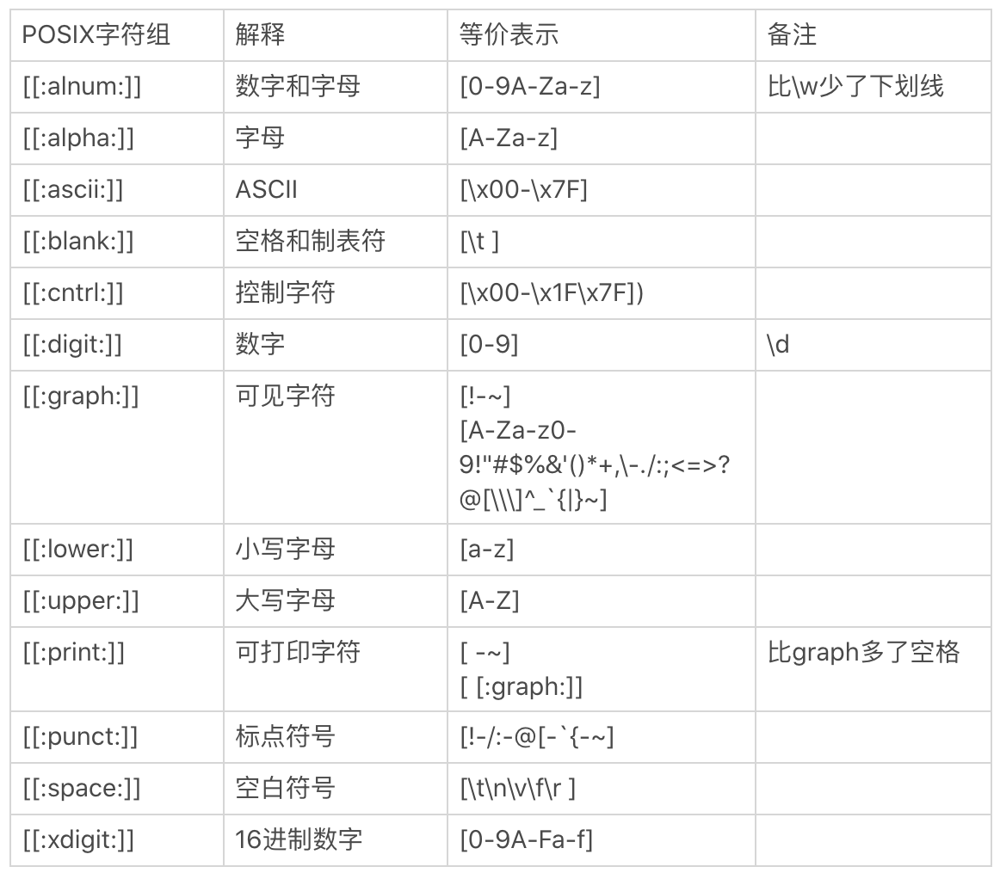

### POSIX 和 PCRE 的主要用法区别

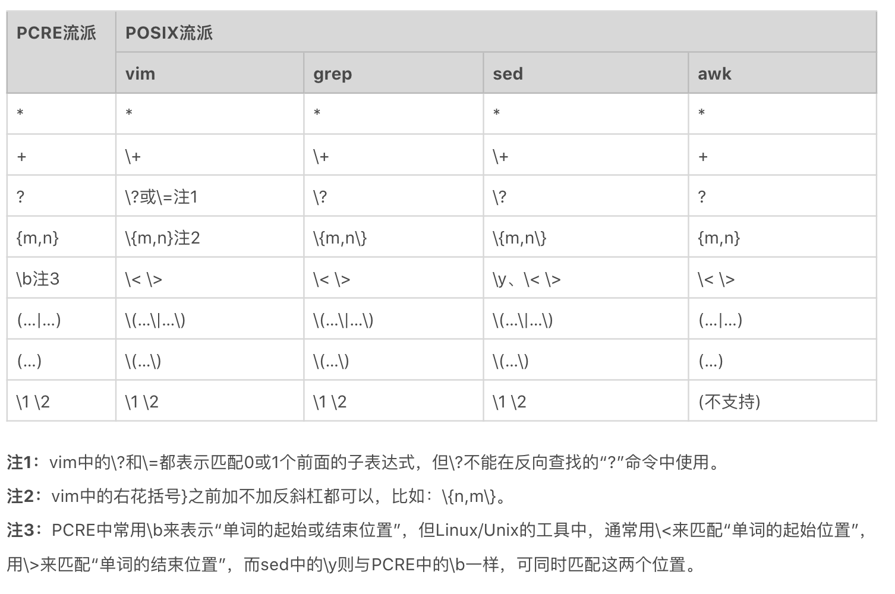

### Linux 工具中选择不同的正则流派

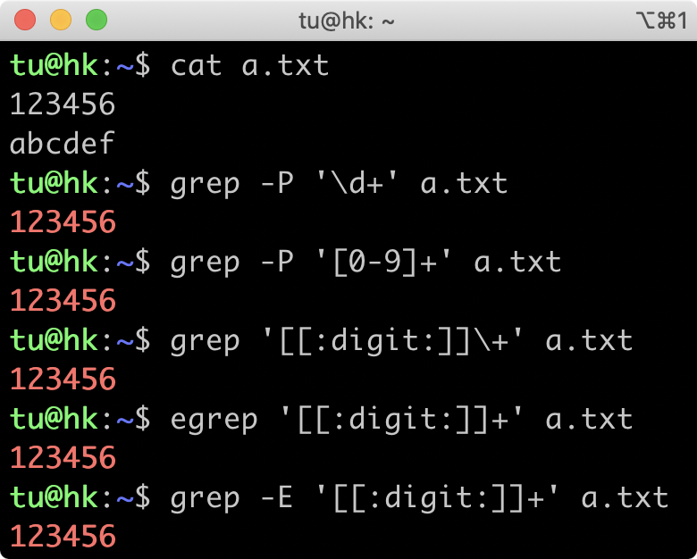

## 处理 Unicode

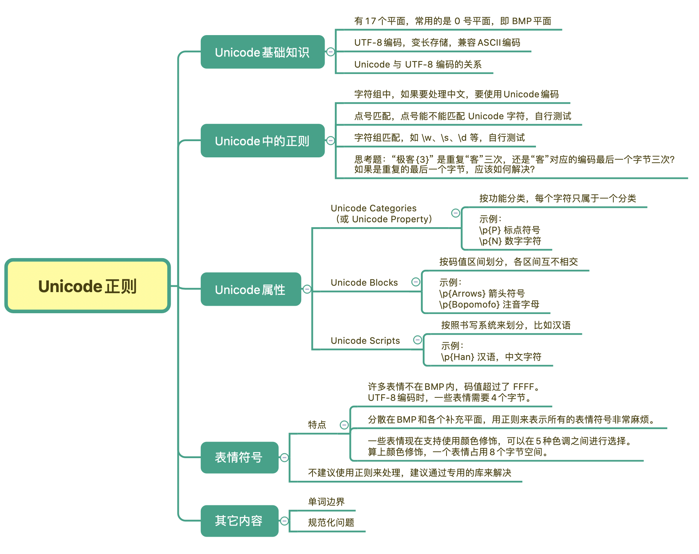

Unicode  规定了字符对应的码值，这个码值得编码成字节的形式去传输和存储。最常见的编码方式是 `UTF-8`，另外还有 `UTF-16`，`UTF-32`  等。`UTF-8` 之所以能够流行起来，是因为其编码比较巧妙，采用的是变长的方法。也就是一个 Unicode 字符，在使用 UTF-8  编码表示时占用 `1` 到 `4` 个字节不等。最重要的是 Unicode 兼容 ASCII 编码，在表示纯英文时，并不会占用更多存储空间。而汉字，在 UTF-8 中，通常是用`3`个字节来表示。

```python
>>> u'正'.encode('utf-8')
b'\xe6\xad\xa3'
>>> u'则'.encode('utf-8')
b'\xe5\x88\x99'
```

### Unicode 属性

Unicode 属性把 Unicode 字符集划分成不同的字符小集合。

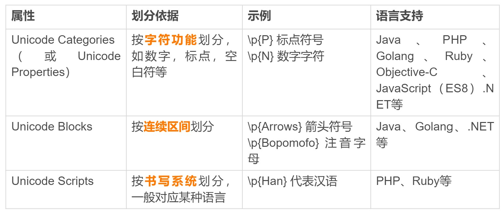

```bash
➤ echo "汉字123" | grep -P "\p{Han}"                                                                                   00:05:59
汉字123
```

## 常见 IDE 对正则表达式的支持

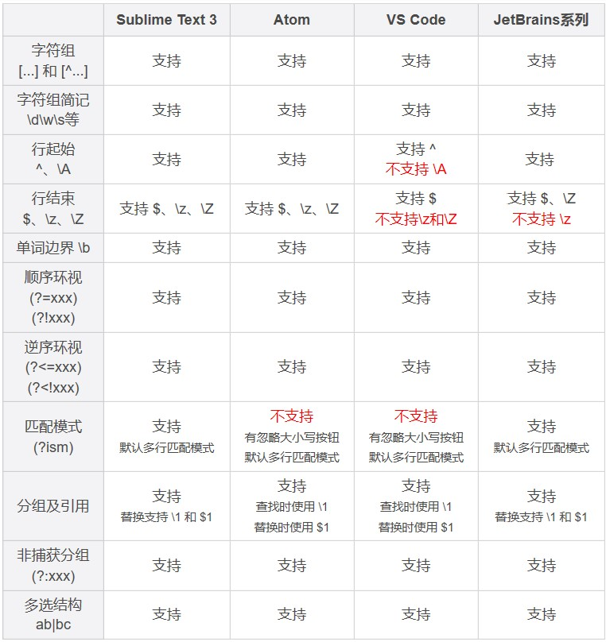
