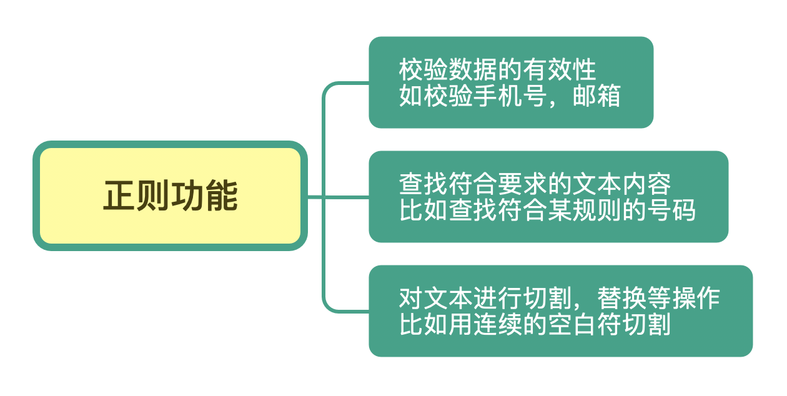
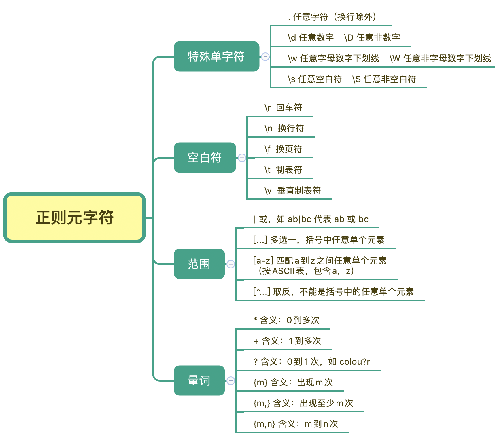
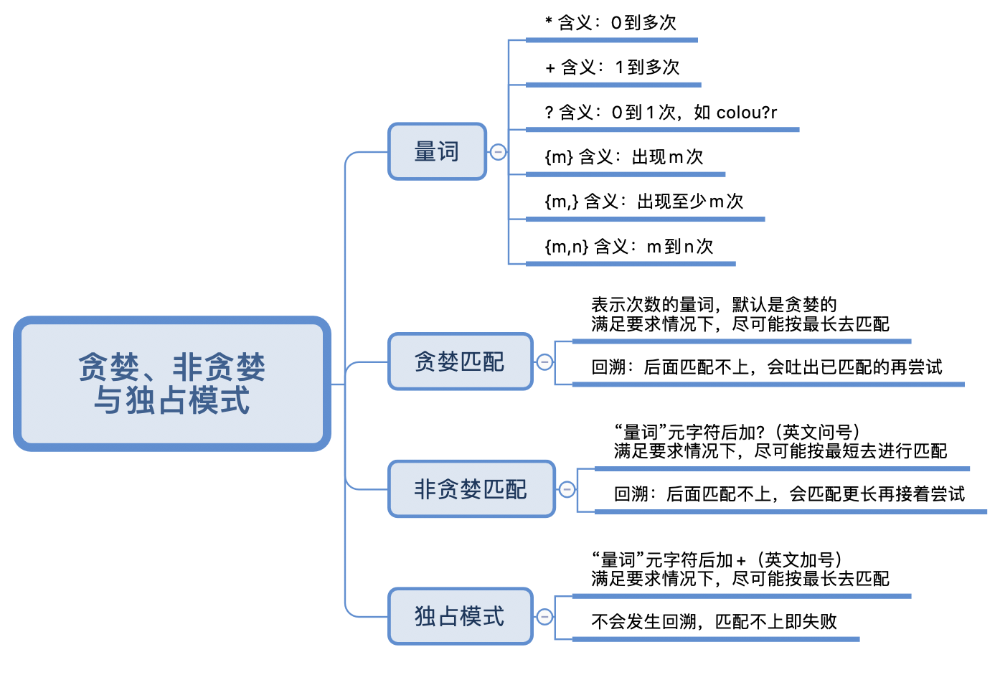
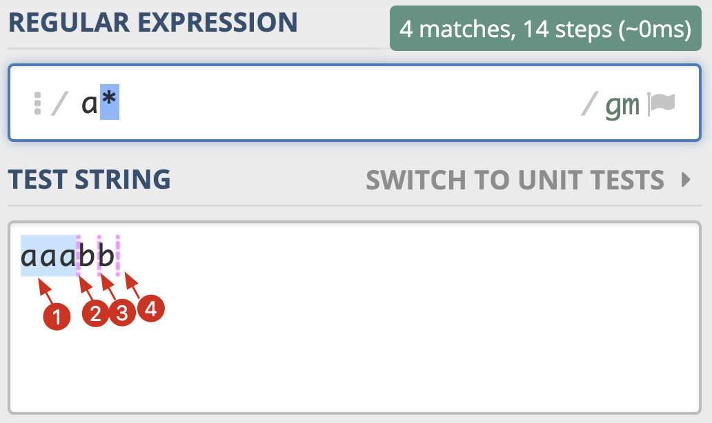
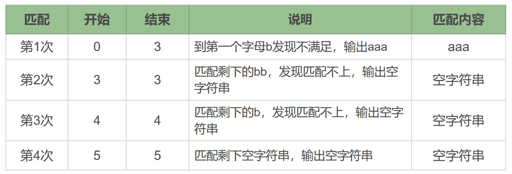
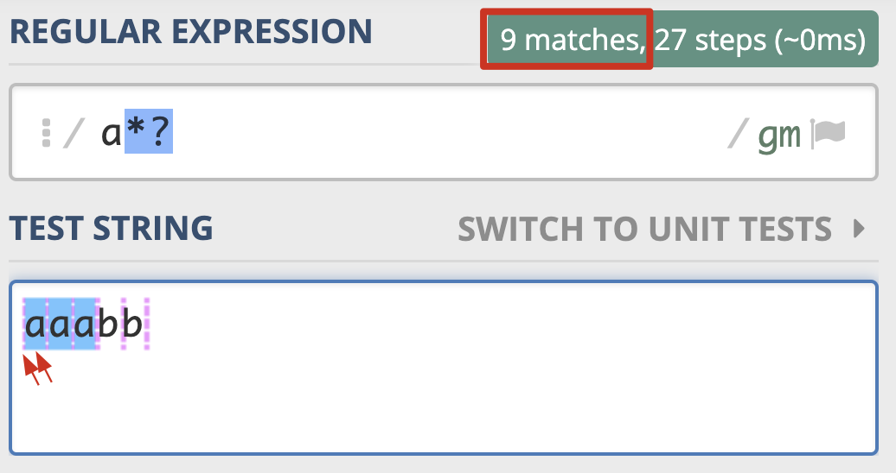
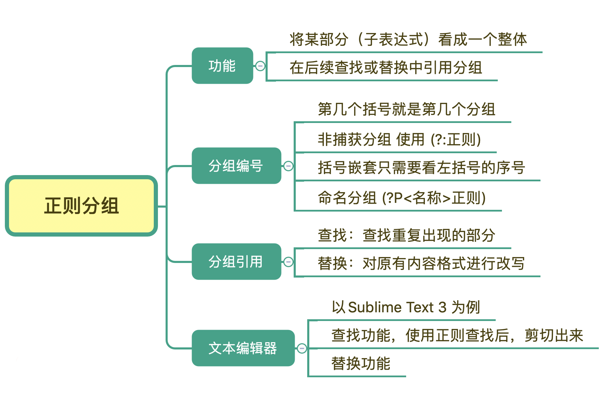
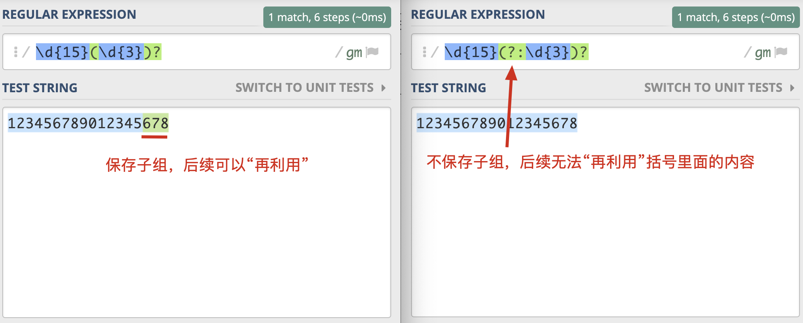
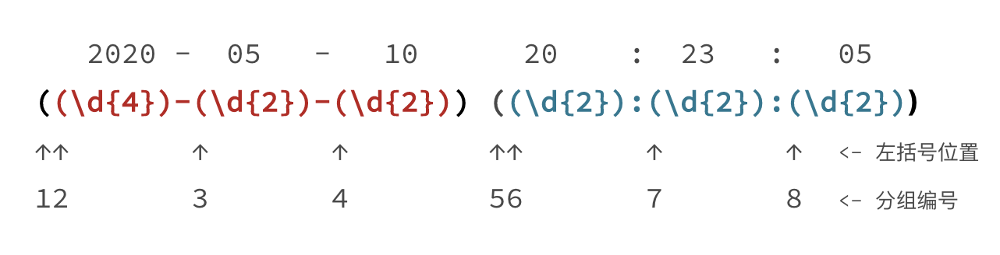
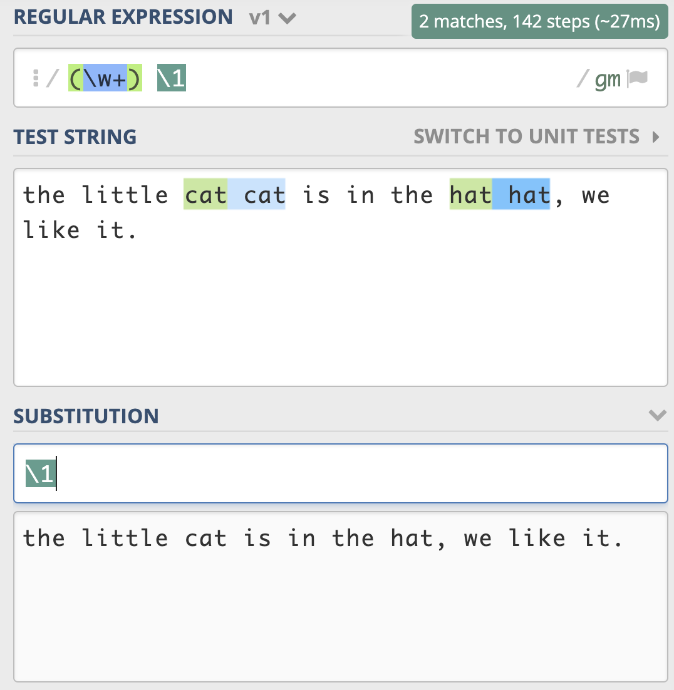

# 正则表达式



## 元字符



## 量词与贪婪



### 贪婪模式（Greedy）

正则中，表示次数的量词默认是贪婪的，在贪婪模式下，会尝试尽可能最大长度去匹配。

在字符串`aaabb`中使用正则`a*`的匹配过程：





### 非贪婪模式（Lazy）

非贪婪模式下，正则会找出长度最小且满足要求的结果。将贪婪模式变成非贪婪模式的方法是：**在量词后面加上`?`**



### 贪婪和非贪婪的对比


```python
>>> import re
>>> re.findall(r'a*', 'aaabb')  # 贪婪模式
['aaa', '', '', '']
>>> re.findall(r'a*?', 'aaabb') # 非贪婪模式
['', 'a', '', 'a', '', 'a', '', '', '']
```

## 分组与引用



括号在正则中可以用于分组，被括号括起来的部分“子表达式”会被保存成一个子组，简单来说，第几个括号就是第几个分组。

如果正则中出现了括号，那么就会认为，这个子表达式在后续可能会再次被引用，如果我们不打算去引用，建议将其声明为**不保存**子组，以提高正则的性能。实现方法是，在括号里面使用`?:`进行声明。

|            | 正则     | 示例             |
| ---------- | -------- | ---------------- |
| 保存子组   | (正则)   | \d{15}(\d{3})?   |
| 不保存子组 | (?:正则) | \d{15}(?:\d{3})? |



### 分组的编号

如果要看某个括号里面的内容是第一个分组，该怎么办？我们只需要数左括号（开括号）是第几个，就可以确定是第几个子组。



### 命名分组

有些语言提供了命名分组，这比数字更有辨识度，不容易出错。格式为：`(?P<group-name>regular-expression)`

### 分组引用

| 编程语言   | 查找时引用方式 | 替换时引用方式 |
| ---------- | -------------- | -------------- |
| Python     | \number        | \number        |
| Java       | \number        | $number        |
| JavaScript | \number        | $number        |

