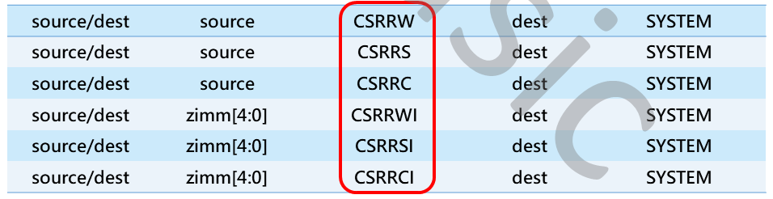
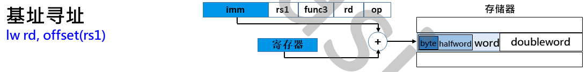
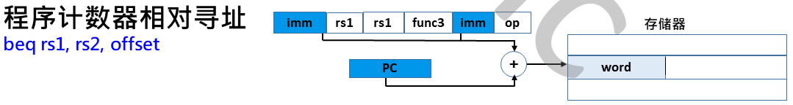

# 𝑹𝑰𝑺𝑪-𝑽 基础

## 数据通路与 ALU


## 指令集划分

| 基本指令集 | 指令数 | 描述                                               |
| ---------- | ------ | -------------------------------------------------- |
| RV32I      | 47     | 32位地址空间与整数指令,支持32个通用整数寄存器      |
| RV32E      | 47     | 仅支持16个通用整数寄存器                           |
| RV64I      | 59     | 64位地址空间与整数指令,以及一部分64位和32位的指令  |
| RV128I     | 71     | 128位地址空间与整数指令,以及一部分64位和32位的指令 |

| 扩展指令集 | 指令数 | 描述                                                |
| ---------- | ------ | --------------------------------------------------- |
| M          | 8      | 整数乘法与除法指令                                  |
| A          | 11     | 存储器原子操作和Load-Reserved/Store-Conditional指令 |
| F          | 26     | 单精度(32bit)浮点指令                               |
| D          | 26     | 双精度(32bit)浮点指令,必须支持F扩展指令             |
| C          | 46     | 压缩指令,指令长度为16位                             |

## 基本指令集类型


### R(Register)型指令


#### 指令汇编格式

##### 加法

```assembly
add rd, rs1, rs2
```

##### 减法

```assembly
sub rd, rs1, rs2
```

##### 逻辑与

```assembly
and rd, rs1, rs2
```

##### 逻辑或

```assembly
or rd, rs1, rs2
```

##### 逻辑异或

```assembly
xor rd, rs1, rs2
```

##### 有符号小于比较

```assembly
slt rd, rs1, rs2
```

##### 无符号小于比较

```assembly
sltu rd, rs1, rs2
```

##### 逻辑左移

```assembly
sll rd, rs1, rs2
```

##### 逻辑右移

```assembly
srl rd, rs1, rs2
```

##### 算数右移

```assembly
sra rd, rs1, rs2
```

### I(Immediate)型指令


#### 指令汇编格式

##### 立即数加法

```assembly
addi rd, rs1, imm[11:0]
```

##### 立即数逻辑与

```assembly
andi rd, rs1, imm[11:0]
```

##### 立即数逻辑或

```assembly
ori rd, rs1, imm[11:0]
```

##### 立即数逻辑异或

```assembly
xori rd, rs1, imm[11:0]
```

##### 立即数有符号小于比较

```assembly
slti rd, rs1, imm[11:0]
```

##### 立即数无符号小于比较

```assembly
sltui rd, rs1, imm[11:0]
```

##### 立即数逻辑左移

```assembly
slli rd, rs1, shamt[4:0]
```

##### 立即数逻辑右移

```assembly
srli rd, rs1, shamt[4:0]
```

##### 立即数算数右移

```assembly
srai rd, rs1, shamt[4:0]
```

### Load/Store 指令


#### 指令汇编格式

##### 字加载

```assembly
lw rd, offset[11:0](rs1)
```

##### 半字加载

```assembly
lh rd, offset[11:0](rs1)
```

##### 无符号半字加载

```assembly
lhu rd, offset[11:0](rs1)
```

##### 字节加载

```assembly
lb rd, offset[11:0](rs1)
```

##### 无符号字节加载

```assembly
lbu rd, offset[11:0](rs1)
```

##### 字存储

```assembly
sw rs2, offset[11:0](rs1)
```

##### 半字存储

```assembly
sh rs2, offset[11:0](rs1)
```

##### 字节存储

```assembly
sb rs2, offset[11:0](rs1)
```

### B(Branch)型指令


#### 指令汇编格式

##### 相等跳转

```assembly
beq rs1, rs2, label
```

##### 不等跳转

```assembly
bne rs1, rs2, label
```

##### 小于跳转

```assembly
blt rs1, rs2, label
```

##### 无符号小于跳转

```assembly
bltu rs1, rs2, label
```

##### 大于跳转

```assembly
bge rs1, rs2, label
```

##### 无符号大于跳转

```assembly
bgeu rs1, rs2, label
```

### J(Jump)型指令


#### 指令汇编格式

##### 无条件跳转

```assembly
jal rd, label
```

##### 无条件相对跳转

```assembly
jalr rd, rs1, imm
```

### U(Upper immediate)型指令


#### 指令汇编格式

##### lui 指令

```assembly
lui rs, imm # 将 20 位的立即数左移12位，低 12 位补零，并写回寄存器 rd 中
```

##### auipc 指令

```assembly
auipc rd, imm # 将 20 位的立即数左移12位，低 12 位补零，将得到的 32 位数与 pc 的值相加，最后写回寄存器 rd 中
```

## ALU 的设计


### 加法运算的实现

```verilog
module adder #(
parameter N = 8
) (
	input [N - 1 : 0] a,
	input [N - 1 : 0] b,
	input			  cin,
   
	output [N - 1 : 0] sum,
	output 			   cout
);
	assign {cout, sum} = a + b + cin;
endmodule
```

### 减法运算的实现

```verilog
module subtractor #(
parameter N = 8
) (
    input [N - 1 : 0] a,
    input [N - 1 : 0] b,
    
    output [N - 1 : 0] y
);
    assign y = a - b;
endmodule
```

### 比较运算的实现

#### 相等比较

用异或门检查 A 和 B 中对应的位是否相等

#### 量值比较（减法）

首先计算A-B的值，然后检查结果的符号位

```verilog
module comparator #(
parameter N = 8
) (
    input [N - 1 : 0] a,
    input [N - 1 : 0] b
	
    output eq,
    output neq,
    output lt,
    output lte,
    output gt,
    output gte
);
    assign eq = (a == b);
    assign neq = (a != b);
    assign lt = (a < b);
    assign lte = (a <= b);
    assign gt = (a > b);
    assign gte = (a >= b);
endmodule
```

## 通用寄存器组

| 寄存器  | ABI名字 | 描述                | 调用     |
| ------- | ------- | ------------------- | -------- |
| x0      | zero    | 硬件连线0           | -        |
| x1      | ra      | 返回地址            | 调用者   |
| x2      | sp      | 栈指针              | 被调用者 |
| x3      | gp      | 全局指针            | -        |
| x4      | tp      | 线程指针            | -        |
| x5-x7   | t0-t2   | 临时变量            | 调用者   |
| x8      | s0/fp   | 保存的寄存器/帧指针 | 被调用者 |
| x9      | s1      | 保存的寄存器        | 被调用者 |
| x10-x11 | a0-a1   | 函数参数/返回值     | 调用者   |
| x12-x17 | a2-a7   | 函数参数            | 调用者   |
| x18-x27 | s2-s11  | 保存的寄存器        | 被调用者 |
| x28-x31 | t3-t6   | 临时变量            | 调用者   |

## CSR 寄存器组

### 独立的12位地址编码空间




## RISC-V 的存储访问

* **不支持地址自增/自减模式**
  * 降低处理器设计难度
* 采用松散的存储器模型
  * 可结合存储器屏蔽指令
* 仅仅支持小端格式

## RISC-V 的寻址方式

### 立即数寻址


### 寄存器寻址


### 基址寻址



### 程序计数器相对寻址



## RISC-V 的中断


