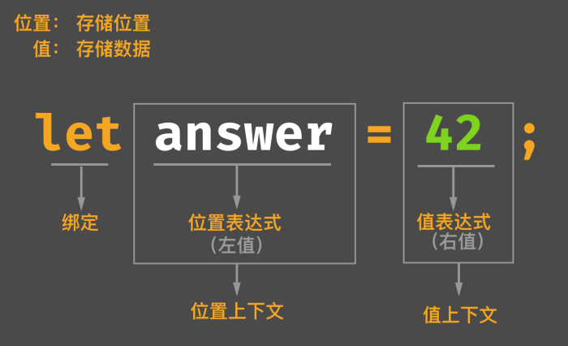
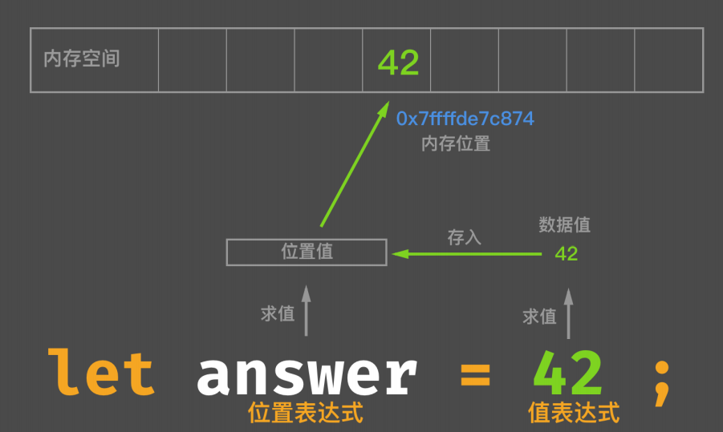

# Rust 基础

## 语言基础

### 词法结构

#### 关键字

* 严格关键字 (Strict)，比如 `as`, `crate`, `fn`, `let`, `impl`, `mod`, `match`, `move`, `mut`, `pub`, `ref`, `async`, `await`等等
* 保留字 (Reserved)，比如 `do`, `final`, `override`, `priv`, `typeof`, `virtual`, `yield`, `abstract` 等等
* 弱关键字 (Weak)，比如 `union` 只在声明联合体的时候才被当作关键字

#### 标识符

变量名、函数名、类型名、参数名都属于标识符，只能以字母或者下划线开头 （未来可能会支持非 ascii 字符）。

#### 注释

* 模块级文档注释: `//!`
* 语言项（方法、函数）级文档注释: `///`

#### 空白

Rust 中的空白字符只用作分隔标记，没有语意

#### 词条

语言项，块，语句，表达式，模式，关键字，标识符，字面量，生命周期，可见性，标点符号，分隔符，词条树，属性

#### 路径

路径分隔符`::`

范型函数 *turbofish* 操作符`::<>`，给范型函数指定具体的数据类型

### 表达式

#### Rust 语法的“骨架”

* 属性，类似于 `#![...]`
* 分号 `;`，行分隔符
* 花括号`{...}`，块分隔符

#### 分号表达式

* 分号表达式返回值永远是自身的单元类型：`()`
* 分号表达式只有在块表达式最后一行才会进行求值，其他时候只作为“连接符”存在

#### 块表达式

块表达式只对其最后一行表达式进行求值

### 编译期计算

1. 过程宏 + Build 脚本 (build.rs)
2. 类似于 Cpp 中 constexpr 的 CTFE 功能

#### 常量上下文

**常量上下文是编译器唯一进行编译期求值的地方**

1. 常量值初始化位置
2. 静态数组的长度表达式
3. 重复的长度表达式
4. 静态变量、枚举判别式的初始化位置

**常量传播和编译期计算不同**

1. 常量传播是编译器的一种优化
2. 常量传播并不能改变程序的任何行为，并且对开发者是隐藏的
3. 编译期计算则是编译时执行的代码，必须知道其结果才能继续执行

```rust
const X: u32 = 3 + 4; // CTFE (compile time function evaluation)
let x: uew = 4 + 3; // 不是 CTFE，因为它不在常量上下文，但是可能会被编译器做常量传播优化
```

**常量长下文可接受的常量表达式**

1. const fn 函数
2. 元组结构体
3. 元组的值

```rust
// String 是一个在堆上分配内存的智能指针类型，无法在编译期进行计算
const fn hello() -> String {
    "Hello".to_string()
}

// Error
const S: String = hello();
```

#### 常量安全子类型系统

1. 普通的 fn 关键字定义的函数，是 Safe Rust 主类型系统保证安全。
2. const fn 定义的函数，是 Safe Rust 主类型系统下有一个专门用于常量计算的子类型系统来保证常量安全

#### 编译期计算是如何实现的

Rust 编译器内置 MIR （中级中间语言）的解释器——Miri，它可以执行 MIR 代码，**编译期计算就是通过 Miri 执行 MIR 中 const 上下文相关的 const 代码**。

#### 为什么需要常量泛型

在Rust中，`let arr: [u32; 3] = [1, 2, 3];` 和 `let arr: [u32; 5] = [1, 2, 3, 4, 5];` 属于不同类型，所以无法使用一个泛型来统一定义不同长度的数组。

#### 表达式的分类





##### 位置表达式

| 位置表达式     | 举例                        |
| -------------- | --------------------------- |
| 静态变量初始化 | static mut LEVELS: u32 = 0; |
| 解引用表达式   | *expr                       |
| 数组索引表达式 | expr[expr]                  |
| 字段表达式     | expr.field                  |
