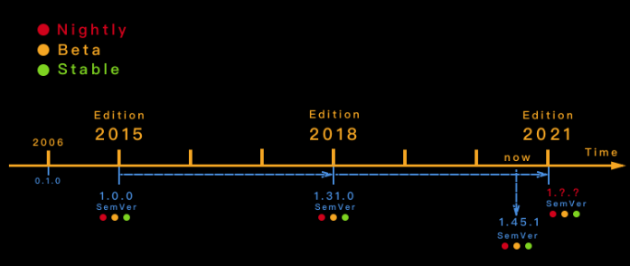
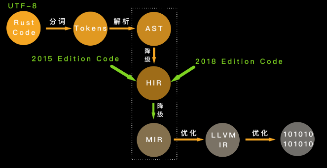

# Rust 基础

## 语言基础

### 语言版本说明



```toml
[package]
name = "learning-rust"
version = "0.1.0"
authors = ["morris"]
edition = "2018"
```

### 编译过程



1. 分词：把词法结构处理成词条流
2. 词条流经过语法解析形成抽象语法树
3. 抽象语法树简化成高级中间语言 (HIR)，编译器对 HIR 进行类型检查、方法查找等工作
4. HIR 进一步简化形成中级中间语言 (MIR)，编译器对 MIR 进行借用检查、优化等工作，在 MIR 中已经看不到 Rust 各版次的差异了
5. 产生 LLVM 中间语言
6. LLVM 后端会对 LLVM 中间语言进行优化，最终生成机器代码

### 词法结构

#### 关键字

* 严格关键字 (Strict)，比如 `as`, `crate`, `fn`, `let`, `impl`, `mod`, `match`, `move`, `mut`, `pub`, `ref`, `async`, `await`等等
* 保留字 (Reserved)，比如 `do`, `final`, `override`, `priv`, `typeof`, `virtual`, `yield`, `abstract` 等等
* 弱关键字 (Weak)，比如 `union` 只在声明联合体的时候才被当作关键字

#### 标识符

变量名、函数名、类型名、参数名都属于标识符，只能以字母或者下划线开头 （未来可能会支持非 ascii 字符）。

#### 注释


