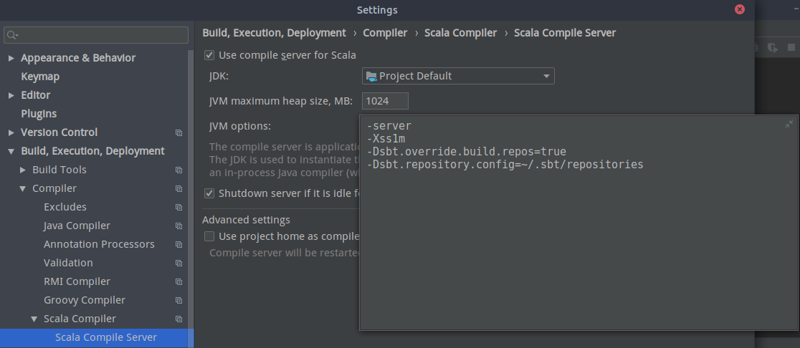

# 𝙎𝙘𝙖𝙡𝙖 基础

## 安装

### 全局安装 Scala 编译器

```bash
sudo apt-get install scala
```

### 全局安装 sbt 构建系统

```bash
echo "deb https://dl.bintray.com/sbt/debian /" | sudo tee -a /etc/apt/sources.list.d/sbt.list
sudo apt-key adv --keyserver hkp://keyserver.ubuntu.com:80 --recv 2EE0EA64E40A89B84B2DF73499E82A75642AC823
sudo apt-get update
sudo apt-get install sbt
```

### 设置 sbt 代理仓库

::: tip

[设置代理仓库官方指南](http://www.scala-sbt.org/1.x/docs/Proxy-Repositories.html)

:::

新建 `$HOME/.sbt/repositories` 文件

```bash
[repositories]
local
aliyun: http://maven.aliyun.com/nexus/content/groups/public
typesafe-ivy-releases: http://repo.typesafe.com/typesafe/ivy-releases/, [organization]/[module]/[revision]/[type]s/[artifact](-[classifier]).[ext], bootOnly
sonatype-oss-releases
maven-central
sonatype-oss-snapshots
```

### 在 IDEA 中给 JVM 添加额外的选项



```bash
-Dsbt.override.build.repos=true
-Dsbt.repository.config=~/.sbt/repositories
```

## sbt 基础

### 流程控制中的 break 和 continue

scala 语言中没有 **break** 和 **continue** 关键字，但是可以通过**异常捕获**或者**循环守卫**的方式来达到类似效果。

#### breakable

```scala
import scala.util.control.Breaks.{break, breakable}

// break
breakable {
    for (i <- 1 to 10) {
        if (i == 8) {
            break()
        }
        println("i = " + i)
    }
}

// continue
for (i <- 1 to 10) {
    breakable {
        if (i == 3 || i == 8) {
            break()
        }
        println("i = " + i)
    }
}
```

#### 循环守卫

```scala
// break
var loop = true
for (i <- 1 to 10 if loop == true) {
	if (i == 8) {
		loop = false
	}
  	println("i = " + i)
}

// continue
for (i <- 1 to 10 if i != 8) {
	println("i = " + i)
}
```

### 函数式编程
