# 𝙀𝙎𝙋 32 功能介绍

## 芯片参数

* 双核 CPU ，型号：Xtensa LX6，哈佛架构（数据总线和指令总线分别拥有 4GB 的寻址空间），主频最高 240MHz（600 MIPS），支持 DSP 指令（32 位乘法，32 位除法，40 位乘加运算），数据总线支持字节、半字、字对齐（或者非对齐）的方式访问数据（小端序），指令总线只能以字对齐的方式访问数据（小端序）
* 两个 CPU 各有一组大小为 32KB 的 cache，用于访问外部存储器
* 最大支持 16MB SPI Nor Flash 与 8MB SPI RAM（PSRAM）
* 内部集成 8MHz 高速振荡器和低速 RC 谐振器 （通常是150KHz，可调）
* 集成 Wi-Fi（802.11bgn）和双模蓝牙（经典蓝牙 + BLE）

## 系统结构

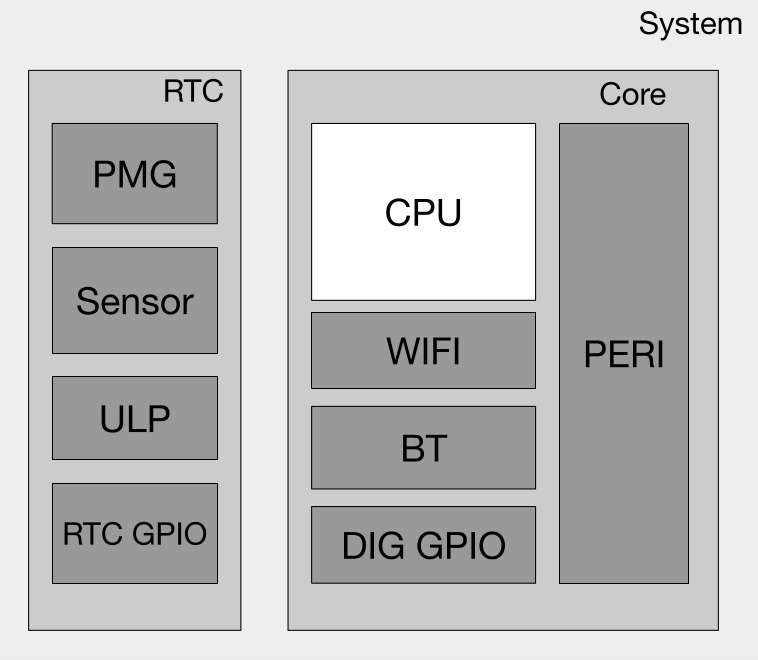

## 内存地址映射

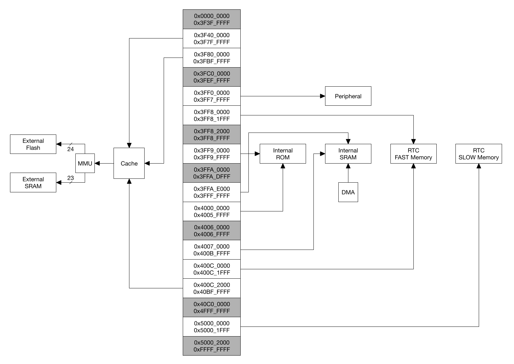

> 地址 `0x4000_0000` 以下的部分属于数据总线的地址范围,地址 `0x4000_0000 ~ 0x4FFF_FFFF` 部分为指令总线的地址范围,地址 `0x5000_0000` 及以上的部分是数据总线与指令总线共用的地址范围。

:::tip

CPU 可以通过数据总线按照**字节**、**半字**、**字**进行对齐与非对齐的数据访问。

CPU 可以通过指令总线按照**字对齐**的方式进行数据访问，非对齐访问会导致 CPU 工作异常。

:::

### 片上内存地址映射

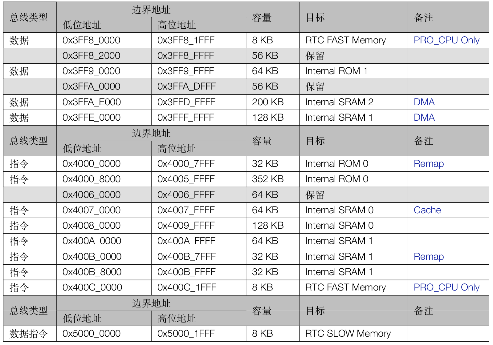

:::tip

Internal SRAM1 的容量为 128KB，既可以被两个 CPU 通过数据总线 0x3FFE_0000~0x3FFF_FFFF 读写，也可以被两个 CPU 通过指令总线 0x400A_0000~0x400B_FFFF 读写。**指令总线地址和数据总线地址访问的 word 是逆序的**。

RTC FAST Memory 只能被 PRO_CPU 通过数据总线 0x3FF8_0000~0x3FF8_1FFF 读写，或被 PRO_CPU 通过指令总线 0x400C_0000~0x400C_1FFF 读写。**指令总线地址和数据总线地址访问的 word 是同序的**。

:::

### 片外内存地址映射

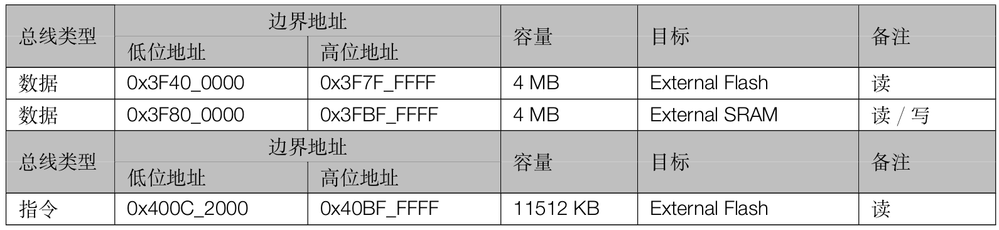

:::tip

两个 CPU 通过 Cache 与 MMU 对片外存储器进行访问时，Cache 将根据 MMU 中的设置把 CPU 的地址变换为 External Flash 与 External SRAM 的物理地址，经过变换之后的物理地址最大支持 16MB 的 External Flash 和 8MB 的 External SRAM。

:::

### Cache 系统

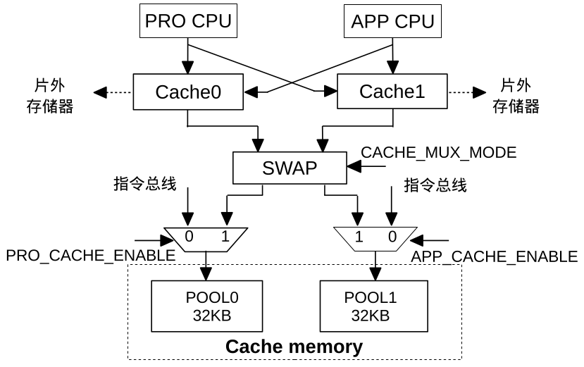

当只有 PRO CPU 使用 Cache 或只有 APP CPU 使用 Cache 时，可以选择使用 Internal SRAM0 的 POOL0 或 POOL1 作为 Cache Memory;当 PRO CPU 和 APP CPU 都使用 Cache 时，Internal SRAM0 的 POOL0 和 POOL1 可以复用作为 Cache Memory。

:::warning

开启 Cache 功能后，POOL0 或者 POOL1 只能作为 cache memory 使用，不能复用作为指令总线的访问区域。

:::

### 一张图看清 ESP32 的内存映射

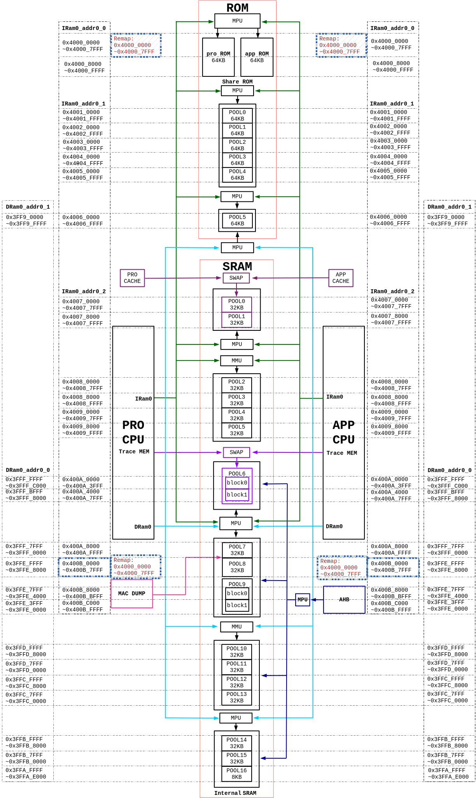

### 内存布局与总线

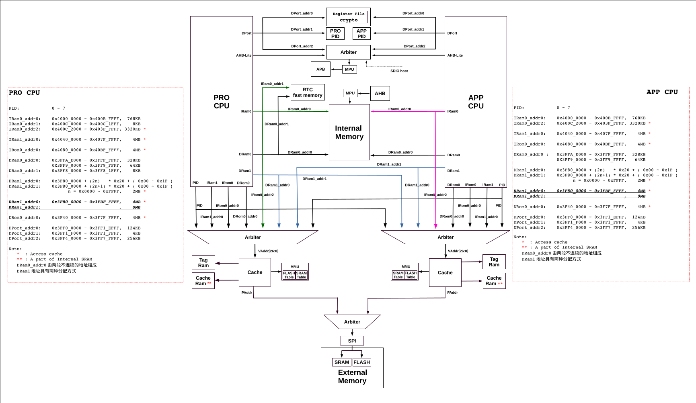

## 镜像结构

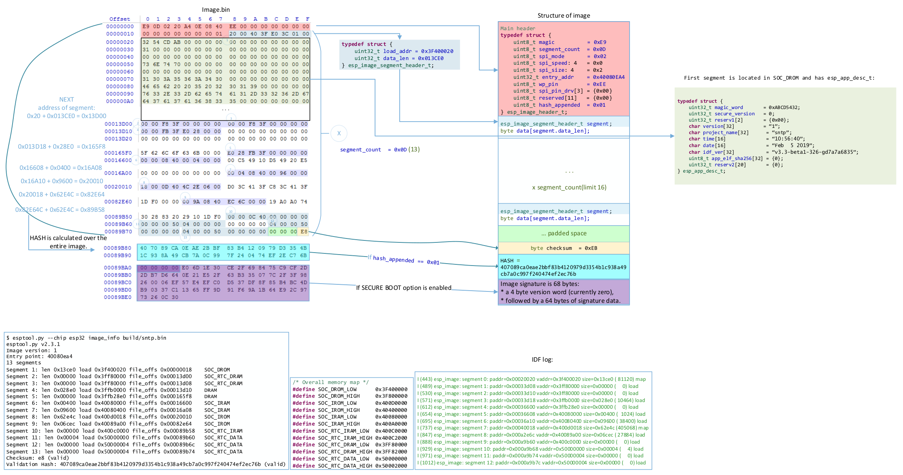

## 中断矩阵

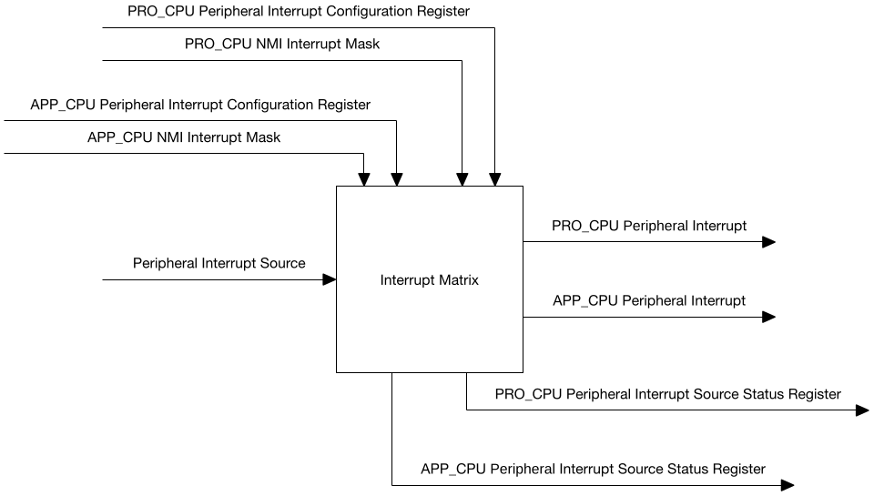

* 输入端可以接收多达 71 个**外部中断源信号**（其中有 67 个可以分配给任意一个 CPU，`GPIO_INTERRUPT_PRO` 和 `GPIO_INTERRUPT_PRO_NMI` 只能分配给 PRO_CPU，`GPIO_INTERRUPT_APP` 和 `GPIO_INTERRUPT_APP_NMI` 只能分配给 APP_CPU。
* 每个 CPU 各有 32 个中断，其中仅有 26 个可以接收外部中断源信号，且这 26 个 CPU 中断**可以被多个外设中断源共享**。
* CPU 中断种类包括：电平触发，边沿触发，NMI，软件触发，定时器触发。
* 通过配置中断矩阵，可以屏蔽掉 CPU 的 NMI 中断。

## 系统复位

系统提供 3 种级别的复位方式，分别是 CPU 复位，内核复位，系统复位。**所有的复位都不会影响 MEM 中的数据**。

* CPU 复位：只复位 CPU 的内部寄存器
* 内核复位：除了 RTC 子系统，所有的数字寄存器全部复位，包括 CPU、外设和数字 GPIO
* 系统复位：复位芯片的所有寄存器，包括 RTC 子系统

### 获取复位信息

`PRO_CPU` 和 `APP_CPU` 可分别读取寄存器 `RTC_CNTL_RESET_CAUSE_PROCPU` 和 `RTC_CNTL_RESET_CAUSE_APPCPU` 来获取复位源。

| PRO  | APP  | 复位源         | 复位级别 | 备注                   |
| ---- | ---- | -------------- | -------- | ---------------------- |
| 0x01 | 0x01 | 上电复位       | 系统复位 | -                      |
| 0x10 | 0x10 | RWDT 系统复位  | 系统复位 | RTC 看门狗复位         |
| 0x0F | 0x0F | 欠压复位       | 系统复位 | -                      |
| 0x03 | 0x03 | 软件系统复位   | 内核复位 | RTC_CNTL_SW_SYS_RST    |
| 0x05 | 0x05 | 深度睡眠复位   | 内核复位 | -                      |
| 0x07 | 0x07 | MWDT0 全局复位 | 内核复位 | -                      |
| 0x08 | 0x08 | MWDT1 全局复位 | 内核复位 | -                      |
| 0x09 | 0x09 | RWDT 内核复位  | 内核复位 | -                      |
| 0x0B | -    | MWDT0 CPU 复位 | CPU 复位 | -                      |
| 0x0C | -    | 软件 CPU 复位  | CPU 复位 | RTC_CNTL_SW_PROCPU_RST |
| -    | 0x0B | MWDT1 CPU 复位 | CPU 复位 | -                      |
| -    | 0x0C | 软件 CPU 复位  | CPU 复位 | RTC_CNTL_SW_APPCPU_RST |
| 0x0D | 0x0D | RWDT CPU 复位  | CPU 复位 | -                      |
| -    | 0x0E | PRO CPU 复位   | CPU 复位 | DPORT_APPCPU_RESETTING |

## 系统时钟

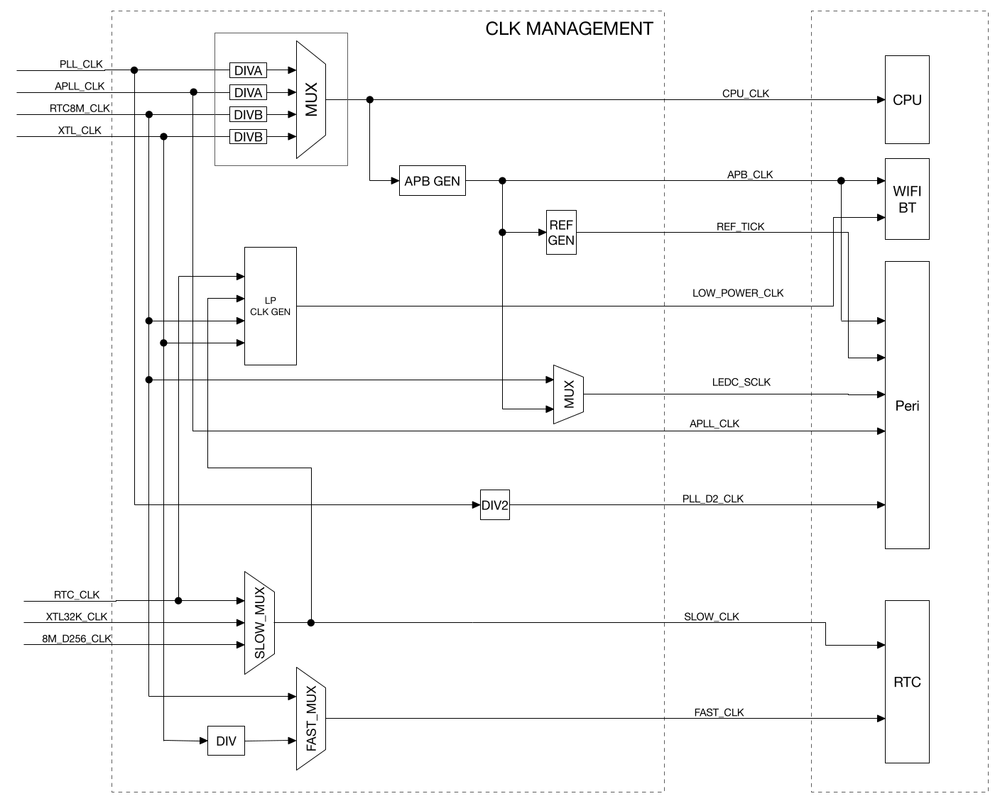

### 时钟源

* PLL_CLK：320MHz 内部 PLL 时钟
* XTL_CLK：2～40MHz 外部晶振时钟
* XTL32K_CLK：32KHz 外部晶振时钟
* RTC8M_CLK：8MHz 内部时钟，频率可调
* RTC8M_D256_CLK：由 RTC8M_CLK 经过 256 分频所得
* RTC_CLK：150KHz 内部低功耗时钟，频率可调
* APLL_CLK：16～128MHz 内部 Audio PLL 时钟

### 外设时钟

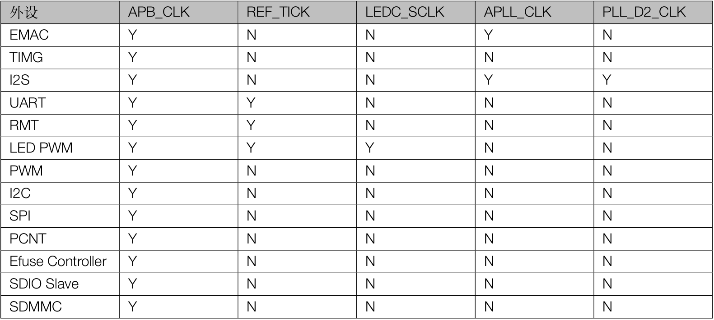

:::tip

* REF_TICK 可以在 APB_CLK 时钟切换时维持频率不变
* SLOW_CLK 允许选择 RTC_CLK，XTL32K_CLK，或 RTC8M_D256_CLK，用于驱动 Power Management 模块
* FAST_CLK 允许选择 XTL_CLK 的分频时钟或者 RTC8M_CLK ，用于驱动片上传感器模块

:::

### APLL

音频应用和其它对数据传输时效性要求很高的应用都需要一个高度可配值、低抖动并且精确的时钟源。ESP32 集成了专门用于 I2S 外设的 APLL。

$$f_{out} = \frac{f_{xtal}(sdm2 + \frac{sdm1}{2^8} + \frac{sdm0}{2^{16}} + 4)}{2(odiv + 2)}$$

其中：

* $f_{xtal}$：晶振频率，通常为 40MHz
* $sdm0 \in [0,255]$
* $sdm1 \in [0,255]$
* $sdm2 \in [0,63]$
* $odiv \in [0,31]$
* $350MHz < f_{xtal}(sdm2 + \frac{sdm1}{2^8} + \frac{sdm0}{2^{16}} + 4) < 500MHz$

## GPIO

###  IO_MUX 和 GPIO Matrix

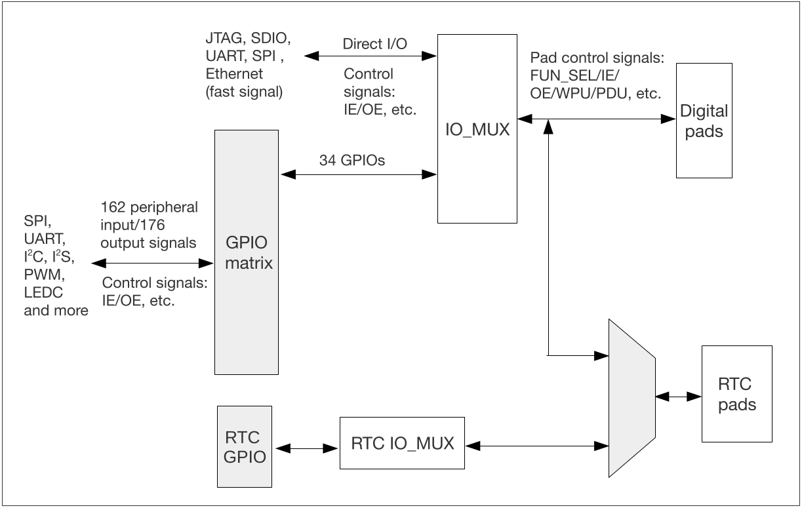

::: tip

* ESP32 的每个物理 GPIO Pad 都可用作一个通用 IO，或者连接至内部的某个外设信号
* RTC IO_MUX 用于控制 GPIO pad 的低功耗和模拟功能，只有部分 GPIO pad 具有这些功能。当这些管脚被配置为 RTC GPIO时，作为输出管脚时仍然能够在芯片处于 Deep-sleep 睡眠模式下保持输出电平值或者作为输入管脚使用时可以将芯片从 Deep-sleep 中唤醒
* GPIO 34-39 仅用作输入管脚，其余的既可以作为输入也可以作为输出
* 快速信号如以太网、SDIO、SPI、JTAG、UART等会旁路 GPIO 交换矩阵以实现更好的高频数字特性

:::

### 信号从 GPIO pad 输入给外设

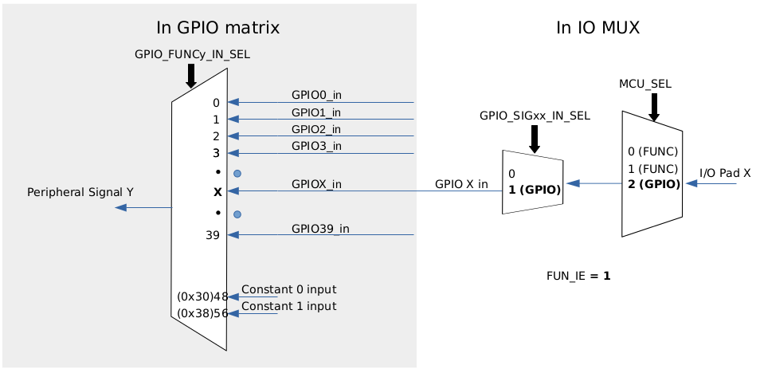

#### 将 RMT 外设通道 0 的输入信号 RMT_SIG_IN0_IDX (信号索引值为 83) 绑定到 GPIO15

1. 将 GPIO_FUNC83_IN_SEL_CFG_REG 寄存器的 GPIO_FUNC83_IN_SEL 字段设置为 15
2. 置位 GPIO_FUNC15_OUT_SEL_CFG_REG 寄存器的 GPIO_FUNC15_OEN_SEL 位
3. 清零 GPIO_ENABLE_REG 寄存器的 Bit 15
4. 配置 IO_MUX_GPIO15_REG 寄存器的 MCU_SEL 字段为 2 (GPIO function)，同时置位 FUN_IE

### 信号从外设输出到 GPIO pad

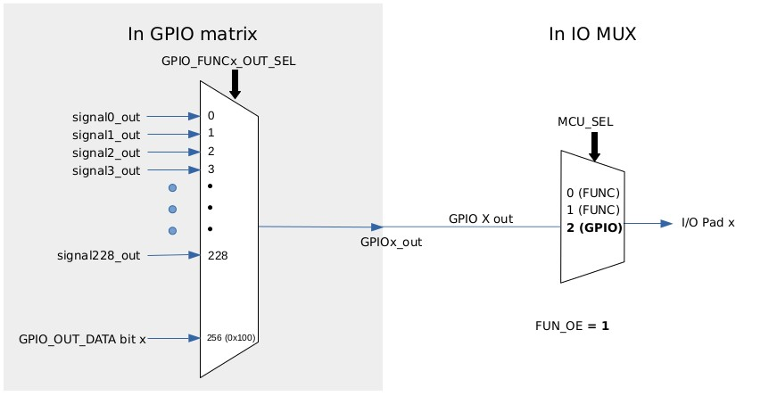

### IO_MUX Pad 列表

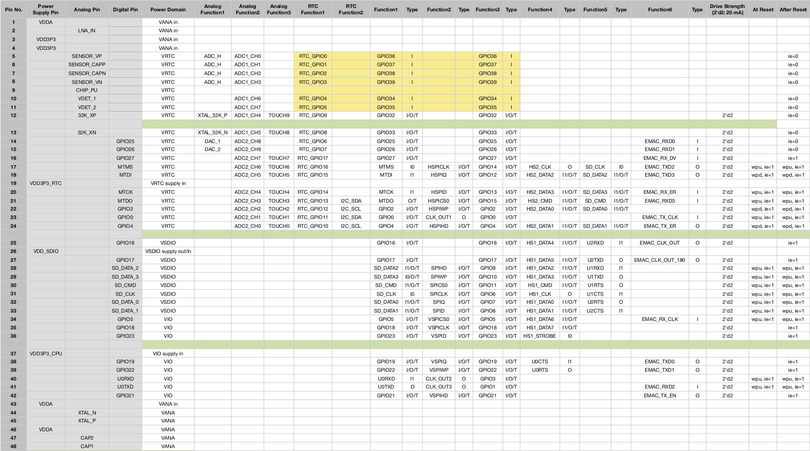

### Strapping 管脚

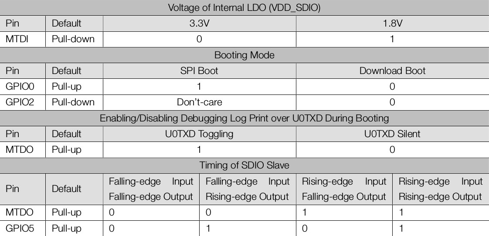

## DPort

通过 DPort 寄存器控制时钟门控，管理功耗，配置外设可以使系统在保持最佳新能的同时将功耗降到最低。

DPort 寄存器包含了多个外设和模块的寄存器：

* 系统和存储器：cache 配置和存储器映射
* 时钟和复位
* 中断矩阵
* DMA
* PID/MPU/MMU
* APP CPU：暂停任务的执行，设置从 ROM code 启动后的跳转地址 (DPORT_APPCPU_BOOT_ADDR)
* 外设时钟门控和复位

## DMA

DMA 控制器与 CPU 的数据总线使用相同的地址空间访问内部 RAM。

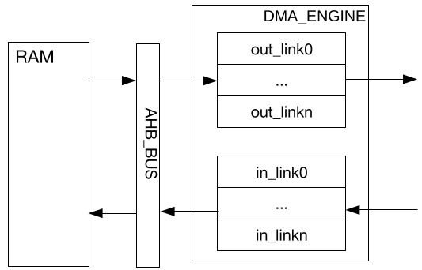

软件可以通过挂载链表的方式来使用 DMA 引擎，引擎会根据 out_link 中内容将相应 RAM 中的数据发送出去，也可根据 in_link 中的内容将接收的数据存取指定 RAM 地址空间。

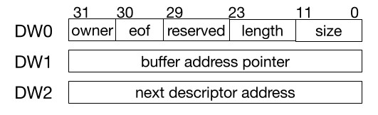

* owner
  * 0 表示当前链表对应的 buffer 由 CPU 操作
  * 1 表示当前链表对应的 buffer 由 DMA 操作
* eof
  * 0 表示当前链表不是最后一个链表
  * 1 表示当前链表为数据包的最后一个链表
* length
  * 当前链表对应的 buffer 中的有效字节数
* size
  * 当前链表对应的 buffer 的大小（字对齐）
* buffer address pointer
  * buffer 地址指针（字对齐）
* next descriptor address
  * 指向下一个描述符链表，当 eof 为 1 时，该值也应为0

## PID

* 在 ESP32 中，PID 控制器充当指示器，向 MMU/MPU 通知当前运行代码的程序的 PID。
* OS 每次将上下文切换到另一个应用时，会更新 PID 控制器中的 PID。
* OS 和应用程序运行时，分别配有一个进程号（即 PID），用于区分彼此。
* PRO_CPU 和 APP_CPU 各有 8 个进程号。
* ESP32 的每个 CPU 各有一个 PID 控制器，能够在需要时允许不同的 CPU 上运行不同的进程。

## MPU，MMU

* ESP32 中的每个外设和存储器通过 MMU 或者 MPU 被访问。
* MPU/MMU 基于进程的 PID 对片上存储器、片外存储器、外设进行管理。
* 片上存储器由 MPU/MMU 管理
* 片外存储器由 MMU 管理
* 外设由 MPU 管理

## SPI

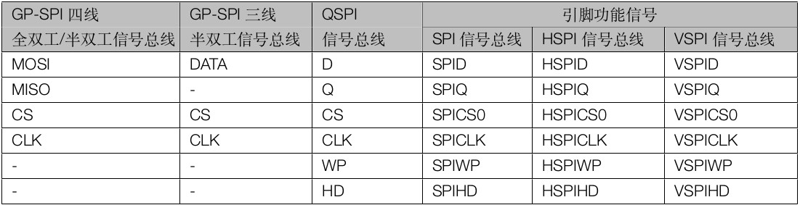
