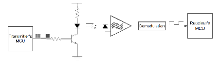
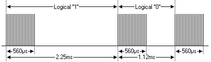
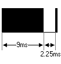
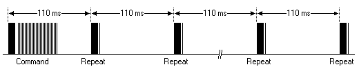
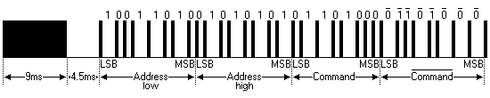

# 𝙄𝙣𝙛𝙧𝙖𝙧𝙚𝙙 𝙍𝙚𝙢𝙤𝙩𝙚 基础

## 树莓派安装 ir-keytable

Linux 内核已经原生支持了红外遥控器设备驱动，该类驱动会被注册为 `/dev/event/inputX`。

### 系统信息 (树莓派 3 Model B)

```bash
pi@idf-morris:~ $ screenfetch
    .',;:cc;,'.    .,;::c:,,.    pi@idf-morris
   ,ooolcloooo:  'oooooccloo:    OS: Raspbian 10 buster
   .looooc;;:ol  :oc;;:ooooo'    Kernel: armv7l Linux 4.19.50-v7+
     ;oooooo:      ,ooooooc.     Uptime: 5m
       .,:;'.       .;:;'.       Packages: 1698
       .... ..'''''. ....        Shell: 767
     .''.   ..'''''.  ..''.      CPU: ARMv7 rev 4 (v7l) @ 4x 1.2GHz
     ..  .....    .....  ..      GPU:
    .  .'''''''  .''''''.  .     RAM: 63MiB / 874MiB
  .'' .''''''''  .'''''''. ''.
  '''  '''''''    .''''''  '''
  .'    ........... ...    .'.
    ....    ''''''''.   .''.
    '''''.  ''''''''. .'''''
     '''''.  .'''''. .'''''.
      ..''.     .    .''..
            .'''''''
             ......
pi@idf-morris:~ $ uname -a
Linux idf-morris 4.19.50-v7+ #896 SMP Thu Jun 20 16:11:44 BST 2019 armv7l GNU/Lin
pi@idf-morris:~ $ pinout
,--------------------------------.
| oooooooooooooooooooo J8     +====
| 1ooooooooooooooooooo        | USB
|                             +====
|      Pi Model 3B  V1.2         |
|      +----+                 +====
| |D|  |SoC |                 | USB
| |S|  |    |                 +====
| |I|  +----+                    |
|                   |C|     +======
|                   |S|     |   Net
| pwr        |HDMI| |I||A|  +======
`-| |--------|    |----|V|-------'

Revision           : a22082
SoC                : BCM2837
RAM                : 1024Mb
Storage            : MicroSD
USB ports          : 4 (excluding power)
Ethernet ports     : 1
Wi-fi              : True
Bluetooth          : True
Camera ports (CSI) : 1
Display ports (DSI): 1

J8:
   3V3  (1) (2)  5V
 GPIO2  (3) (4)  5V
 GPIO3  (5) (6)  GND
 GPIO4  (7) (8)  GPIO14
   GND  (9) (10) GPIO15
GPIO17 (11) (12) GPIO18
GPIO27 (13) (14) GND
GPIO22 (15) (16) GPIO23
   3V3 (17) (18) GPIO24
GPIO10 (19) (20) GND
 GPIO9 (21) (22) GPIO25
GPIO11 (23) (24) GPIO8
   GND (25) (26) GPIO7
 GPIO0 (27) (28) GPIO1
 GPIO5 (29) (30) GND
 GPIO6 (31) (32) GPIO12
GPIO13 (33) (34) GND
GPIO19 (35) (36) GPIO16
GPIO26 (37) (38) GPIO20
   GND (39) (40) GPIO21
```

### 配置设备树

修改 `/boot/config.txt` 文件，开启 **gpio-ir** 内核模块

```bash
dtoverlay=gpio-ir,gpio_pin=24
dtoverlay=gpio-ir-tx,gpio_pin=25
```

保存，重启，检查系统启动日志

```bash
[    4.066420] rc rc0: GPIO IR Bit Banging Transmitter as /devices/platform/gpio-ir-transmitter@19/rc/rc0
[    4.066992] rc rc0: lirc_dev: driver gpio-ir-tx registered at minor = 0, no receiver, raw IR transmitter
[    4.072278] Registered IR keymap rc-rc6-mce
[    4.097488] IR RC6 protocol handler initialized
[    4.132106] rc rc1: gpio_ir_recv as /devices/platform/ir-receiver@18/rc/rc1
[    4.132381] input: gpio_ir_recv as /devices/platform/ir-receiver@18/rc/rc1/input0
[    4.133016] rc rc1: lirc_dev: driver gpio_ir_recv registered at minor = 1, raw IR receiver, no transmitter
```

### 安装 ir-keytable

```bash
sudo apt-get install ir-keytable
```

### 验证安装

```bash
pi@idf-morris:~ $ ir-keytable
Found /sys/class/rc/rc1/ (/dev/input/event0) with:
	Name: gpio_ir_recv
	Driver: gpio_ir_recv, table: rc-rc6-mce
	LIRC device: /dev/lirc1
	Attached BPF protocols: Function not implemented
	Supported kernel protocols: lirc rc-5 rc-5-sz jvc sony nec sanyo mce_kbd rc-6 sharp xmp imon
	Enabled kernel protocols: lirc rc-6
	bus: 25, vendor/product: 0001:0001, version: 0x0100
	Repeat delay = 500 ms, repeat period = 125 ms
```

### 查看 udev 规则

```bash
pi@idf-morris:/lib/udev/rules.d $ cat 60-ir-keytable.rules
# Automatically load the proper keymaps after the Remote Controller device
# creation.
# The keycode tables rules should be at /etc/rc_maps.cfg

ACTION=="add", SUBSYSTEM=="rc", RUN+="/usr/bin/ir-keytable -a /etc/rc_maps.cfg -s $name"
```

### 查看红外控制器的能力

```bash
pi@idf-morris:~ $ ir-ctl -f -d /dev/lirc0
Receive features /dev/lirc0:
 - Device cannot receive
Send features /dev/lirc0:
 - Device can send raw IR
 - IR scancode encoder
 - Set carrier
 - Set duty cycle
pi@idf-morris:~ $ ir-ctl -f -d /dev/lirc1
Receive features /dev/lirc1:
 - Device can receive raw IR
 - Can report decoded scancodes and protocol
 - Can set receiving timeout min:1 microseconds max:1250000 microseconds
Send features /dev/lirc1:
 - Device cannot send
```

### 查看已经支持的红外遥控器键码表

```bash
pi@idf-morris:/lib/udev/rc_keymaps $ ls
adstech_dvb_t_pci.toml      digittrade.toml          kworld_315u.toml              rc6_mce.toml
af9005.toml                 digitv.toml              kworld_pc150u.toml            real_audio_220_32_keys.toml
alink_dtu_m.toml            dm1105_nec.toml          kworld_plus_tv_analog.toml    reddo.toml
anysee.toml                 dntv_live_dvbt_pro.toml  leadtek_y04g0051.toml         snapstream_firefly.toml
apac_viewcomp.toml          dntv_live_dvb_t.toml     lme2510.toml                  streamzap.toml
astrometa_t2hybrid.toml     dtt200u.toml             manli.toml                    su3000.toml
asus_pc39.toml              dvbsky.toml              medion_x10_digitainer.toml    tango.toml
asus_ps3_100.toml           dvico_mce.toml           medion_x10_or2x.toml          tbs_nec.toml
ati_tv_wonder_hd_600.toml   dvico_portable.toml      medion_x10.toml               technisat_ts35.toml
ati_x10.toml                em_terratec.toml         megasky.toml                  technisat_usb2.toml
avermedia_a16d.toml         encore_enltv2.toml       msi_digivox_iii.toml          terratec_cinergy_c_pci.toml
avermedia_cardbus.toml      encore_enltv_fm53.toml   msi_digivox_ii.toml           terratec_cinergy_s2_hd.toml
avermedia_dvbt.toml         encore_enltv.toml        msi_tvanywhere_plus.toml      terratec_cinergy_xs.toml
avermedia_m135a.toml        evga_indtube.toml        msi_tvanywhere.toml           terratec_slim_2.toml
avermedia_m733a_rm_k6.toml  eztv.toml                nebula.toml                   terratec_slim.toml
avermedia_rm_ks.toml        flydvb.toml              nec_terratec_cinergy_xs.toml  tevii_nec.toml
avermedia.toml              flyvideo.toml            norwood.toml                  tivo.toml
avertv_303.toml             fusionhdtv_mce.toml      npgtech.toml                  total_media_in_hand_02.toml
az6027.toml                 gadmei_rm008z.toml       opera1.toml                   total_media_in_hand.toml
azurewave_ad_tu700.toml     geekbox.toml             pctv_sedna.toml               trekstor.toml
behold_columbus.toml        genius_tvgo_a11mce.toml  pinnacle310e.toml             tt_1500.toml
behold.toml                 gotview7135.toml         pinnacle_color.toml           tvwalkertwin.toml
budget_ci_old.toml          hauppauge.toml           pinnacle_grey.toml            twinhan_dtv_cab_ci.toml
cec.toml                    haupp.toml               pinnacle_pctv_hd.toml         twinhan_vp1027_dvbs.toml
cinergy_1400.toml           hisi_poplar.toml         pixelview_002t.toml           videomate_k100.toml
cinergyt2.toml              hisi_tv_demo.toml        pixelview_mk12.toml           videomate_s350.toml
cinergy.toml                imon_mce.toml            pixelview_new.toml            videomate_tv_pvr.toml
d680_dmb.toml               imon_pad.toml            pixelview.toml                vp702x.toml
delock_61959.toml           imon_rsc.toml            powercolor_real_angel.toml    winfast.toml
dib0700_nec.toml            iodata_bctv7e.toml       proteus_2309.toml             winfast_usbii_deluxe.toml
dib0700_rc5.toml            it913x_v1.toml           protocols                     zx_irdec.toml
dibusb.toml                 it913x_v2.toml           purpletv.toml
digitalnow_tinytwin.toml    kaiomy.toml              pv951.toml
```

### 测试 ir-keytable 接收 NEC 编码红外信号

```bash
pi@idf-morris:~ $ sudo ir-keytable -s rc1 -p nec -t
Protocols changed to nec
Testing events. Please, press CTRL-C to abort.
50431.570038: lirc protocol(nec): scancode = 0x1807
50431.570072: event type EV_MSC(0x04): scancode = 0x1807
50431.570072: event type EV_SYN(0x00).
50431.670039: lirc protocol(nec): scancode = 0x1908
50431.670069: event type EV_MSC(0x04): scancode = 0x1908
50431.670069: event type EV_SYN(0x00).
50431.770038: lirc protocol(nec): scancode = 0x1a09
50431.770062: event type EV_MSC(0x04): scancode = 0x1a09
50431.770062: event type EV_SYN(0x00).
```

### 清除红外接收器的键码表，并使用新的键码表

```bash
pi@idf-morris:~ $ sudo ir-keytable -c -w /lib/udev/rc_keymaps/nec_terratec_cinergy_xs.toml -s rc1
Old keytable cleared
Wrote 85 keycode(s) to driver
Protocols changed to nec
```

### 读取红外接收器的键码表

```bash
pi@idf-morris:~ $ ir-keytable -r -s rc1
scancode 0x1401 = KEY_POWER2 (0x164)
scancode 0x1402 = KEY_1 (0x02)
scancode 0x1403 = KEY_2 (0x03)
scancode 0x1404 = KEY_3 (0x04)
scancode 0x1405 = KEY_4 (0x05)
scancode 0x1406 = KEY_5 (0x06)
scancode 0x1407 = KEY_6 (0x07)
scancode 0x1408 = KEY_7 (0x08)
scancode 0x1409 = KEY_8 (0x09)
scancode 0x140a = KEY_9 (0x0a)
scancode 0x140b = KEY_TUNER (0x182)
scancode 0x140c = KEY_0 (0x0b)
scancode 0x140d = KEY_MODE (0x175)
scancode 0x140f = KEY_EPG (0x16d)
scancode 0x1410 = KEY_UP (0x67)
scancode 0x1411 = KEY_LEFT (0x69)
scancode 0x1412 = KEY_OK (0x160)
scancode 0x1413 = KEY_RIGHT (0x6a)
scancode 0x1414 = KEY_DOWN (0x6c)
scancode 0x1416 = KEY_INFO (0x166)
scancode 0x1417 = KEY_RED (0x18e)
scancode 0x1418 = KEY_GREEN (0x18f)
scancode 0x1419 = KEY_YELLOW (0x190)
scancode 0x141a = KEY_BLUE (0x191)
scancode 0x141b = KEY_CHANNELUP (0x192)
scancode 0x141c = KEY_VOLUMEUP (0x73)
scancode 0x141d = KEY_MUTE (0x71)
scancode 0x141e = KEY_VOLUMEDOWN (0x72)
scancode 0x141f = KEY_CHANNELDOWN (0x193)
scancode 0x1440 = KEY_PAUSE (0x77)
scancode 0x1441 = KEY_HOME (0x66)
scancode 0x1442 = KEY_MENU (0x8b)
scancode 0x1443 = KEY_SUBTITLE (0x172)
scancode 0x1444 = KEY_TEXT (0x184)
scancode 0x1445 = KEY_DELETE (0x6f)
scancode 0x1446 = KEY_TV (0x179)
scancode 0x1447 = KEY_DVD (0x185)
scancode 0x1448 = KEY_STOP (0x80)
scancode 0x1449 = KEY_VIDEO (0x189)
scancode 0x144a = KEY_RADIO (0x181)
scancode 0x144b = KEY_CAMERA (0xd4)
scancode 0x144c = KEY_PLAY (0xcf)
scancode 0x144d = KEY_BACKSPACE (0x0e)
scancode 0x144e = KEY_REWIND (0xa8)
scancode 0x144f = KEY_FASTFORWARD (0xd0)
scancode 0x1454 = KEY_LAST (0x195)
scancode 0x1458 = KEY_RECORD (0xa7)
scancode 0x145c = KEY_NEXT (0x197)
scancode 0x4eb01 = KEY_POWER2 (0x164)
scancode 0x4eb02 = KEY_1 (0x02)
scancode 0x4eb03 = KEY_2 (0x03)
scancode 0x4eb04 = KEY_3 (0x04)
scancode 0x4eb05 = KEY_4 (0x05)
scancode 0x4eb06 = KEY_5 (0x06)
scancode 0x4eb07 = KEY_6 (0x07)
scancode 0x4eb08 = KEY_7 (0x08)
scancode 0x4eb09 = KEY_8 (0x09)
scancode 0x4eb0a = KEY_9 (0x0a)
scancode 0x4eb0b = KEY_TEXT (0x184)
scancode 0x4eb0c = KEY_0 (0x0b)
scancode 0x4eb0d = KEY_REFRESH (0xad)
scancode 0x4eb0e = KEY_HOME (0x66)
scancode 0x4eb0f = KEY_EPG (0x16d)
scancode 0x4eb10 = KEY_UP (0x67)
scancode 0x4eb11 = KEY_LEFT (0x69)
scancode 0x4eb12 = KEY_OK (0x160)
scancode 0x4eb13 = KEY_RIGHT (0x6a)
scancode 0x4eb14 = KEY_DOWN (0x6c)
scancode 0x4eb15 = KEY_BACKSPACE (0x0e)
scancode 0x4eb16 = KEY_INFO (0x166)
scancode 0x4eb17 = KEY_RED (0x18e)
scancode 0x4eb18 = KEY_GREEN (0x18f)
scancode 0x4eb19 = KEY_YELLOW (0x190)
scancode 0x4eb1a = KEY_BLUE (0x191)
scancode 0x4eb1b = KEY_CHANNELUP (0x192)
scancode 0x4eb1c = KEY_VOLUMEUP (0x73)
scancode 0x4eb1d = KEY_MUTE (0x71)
scancode 0x4eb1e = KEY_VOLUMEDOWN (0x72)
scancode 0x4eb1f = KEY_CHANNELDOWN (0x193)
scancode 0x4eb40 = KEY_RECORD (0xa7)
scancode 0x4eb48 = KEY_STOP (0x80)
scancode 0x4eb4c = KEY_PLAY (0xcf)
scancode 0x4eb54 = KEY_REWIND (0xa8)
scancode 0x4eb58 = KEY_PAUSE (0x77)
scancode 0x4eb5c = KEY_NEXT (0x197)
Enabled kernel protocols: lirc nec
```

### 发送红外信号

```bash
# 该命令指定以 NEC 协议格式发送数据 0x1e01, 即设备地址 0x1e, 数据内容 0x01
pi@idf-morris:~ $ ir-ctl -S nec:0x1e01
```

```bash
# 在红外接收器端，收到的原始数据可能如下
receive IR signal(length=34):
Level	Duration	Level	Duration
0		9010		1		4605
0		466			1		571
0		559			1		1688
0		567			1		1768
0		475			1		1694
0		561			1		1691
0		533			1		596
0		559			1		589
0		530			1		573
0		557			1		1751
0		502			1		590
0		529			1		595
0		511			1		594
0		556			1		569
0		558			1		1690
0		564			1		1690
0		557			1		1692
0		534			1		1716
0		560			1		569
0		562			1		563
0		562			1		565
0		557			1		574
0		553			1		572
0		555			1		570
0		557			1		592
0		534			1		570
0		557			1		1691
0		558			1		1695
0		557			1		1695
0		552			1		1696
0		554			1		1697
0		557			1		1695
0		560			1		1692
0		559			1		0
```

## NEC 协议

## 红外调制与解调

::: tip 调制的意义

红外调制可以帮助接收端更容易从环境噪声（低频）中提取出有效信号。

:::













## 参考文献

[LibreELEC Infrared Remotes](https://wiki.libreelec.tv/infrared_remotes#infrared_remotes)

[ir-keytable on the Orange Pi Zero](https://www.sigmdel.ca/michel/ha/opi/ir_03_en.html)
