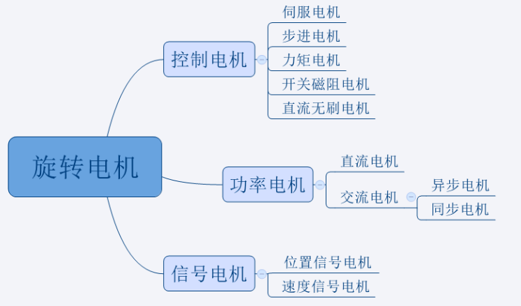
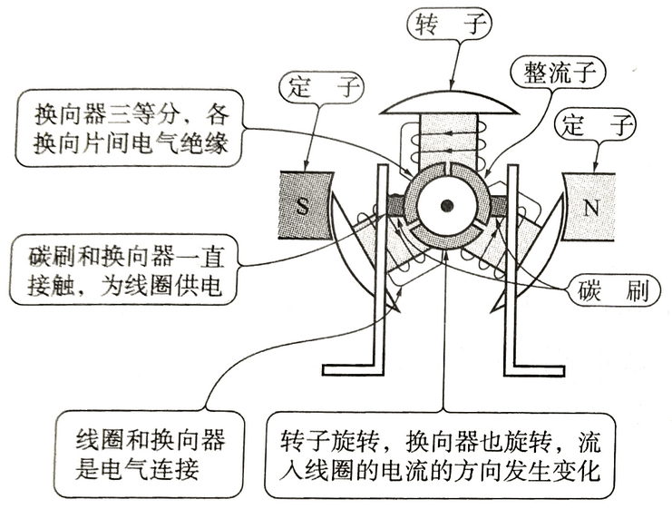
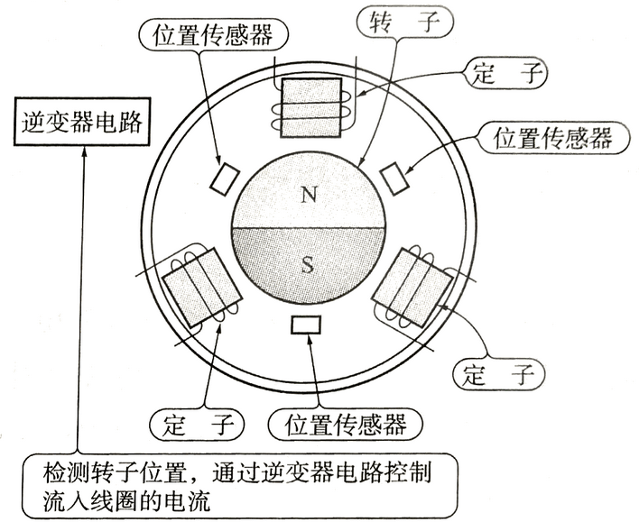

# 电机控制基础

## 三个基本定则

1. 左手定则：通电导体在磁场中会受到力的作用，力的方向可按左手定则确定。$F=BIL sin\theta$
2. 右手定则：运动的导体切割磁力线会感生出电动势。$E=vBL sin\theta$
3. 安培定则：右手握住通电螺线管，四指弯曲与电流方向一致，大拇指所指的那端即 N 极。

## 电机的简单分类

### 伺服电机

将电压信号转换为电机轴上的机械输出量，拖动被控元件。主要应用于各种运动控制系统中。

:::tip

直流伺服电机控制精度不高，目前绝大多数的伺服电机是`交流永磁同步伺服电机`或者`直流无刷电机`。

:::

### 步进电机

将电脉冲信号转换为角位移的执行机构，通过控制脉冲数量来控制电机的角位移量，通过控制脉冲频率来控制电机转动的速度和加速度。主要应用于数控机床制造领域。

:::warning

步进电机在控制精度、速度变化范围、低速性能方面都不如传统闭环控制的直流伺服电机。

步进电机存在**空载启动频率**，当高于一定速度时无法启动并伴随啸叫。

步进电机低速转动时有较大的振动和噪声。

:::

### 直流无刷电机

调速范围广，寿命长，噪声小，重量和体积比有刷直流电机小。主要应用于飞行器。

### 舵机

舵机实际上是一个电机系统，由直流电机、减速齿轮组、传感器和控制电路组成。通过发送信号，可以指定输出轴的旋转角度。主要用于机器人的关节。

##  影响电机转速的因素

$$U=C_e\phi n+I_aR_a$$

$C_e$为电机常数，与电机结构有关。$\phi$为电机气隙磁通。

$n$为转速，$U$为电机两端电压，$I_a$为电枢电流，$R_a$为电枢绕组电阻。

一般认为，**电机的转速和电压成正比**，**电机的扭矩和电流成正比**。