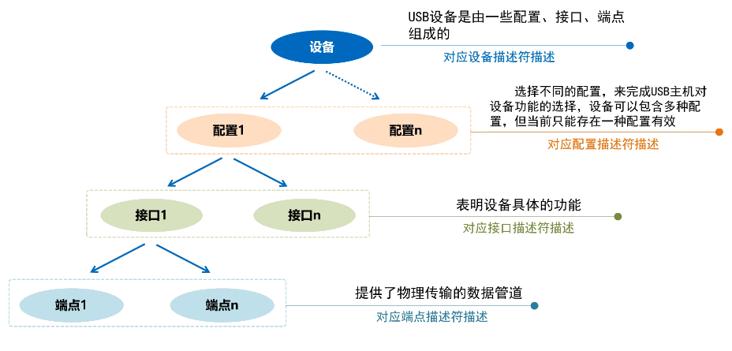
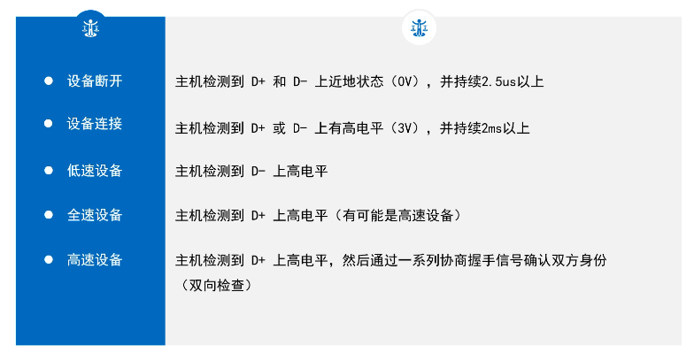
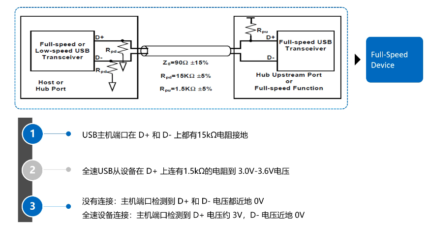
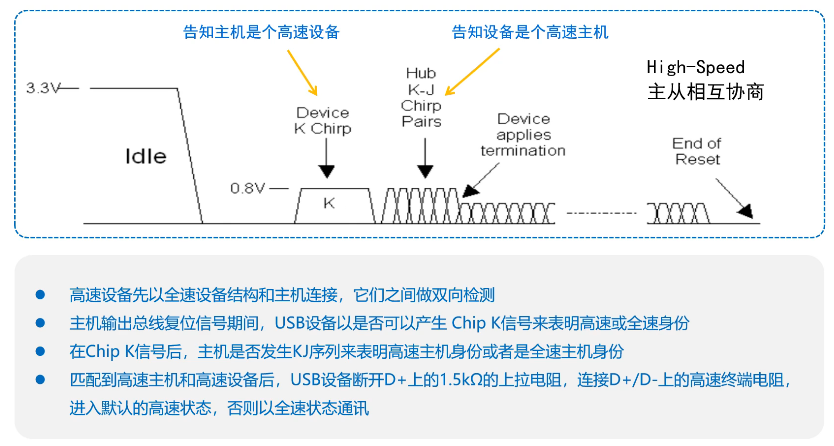
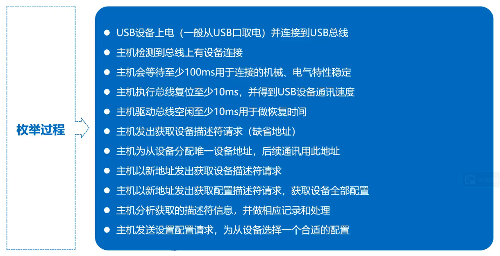
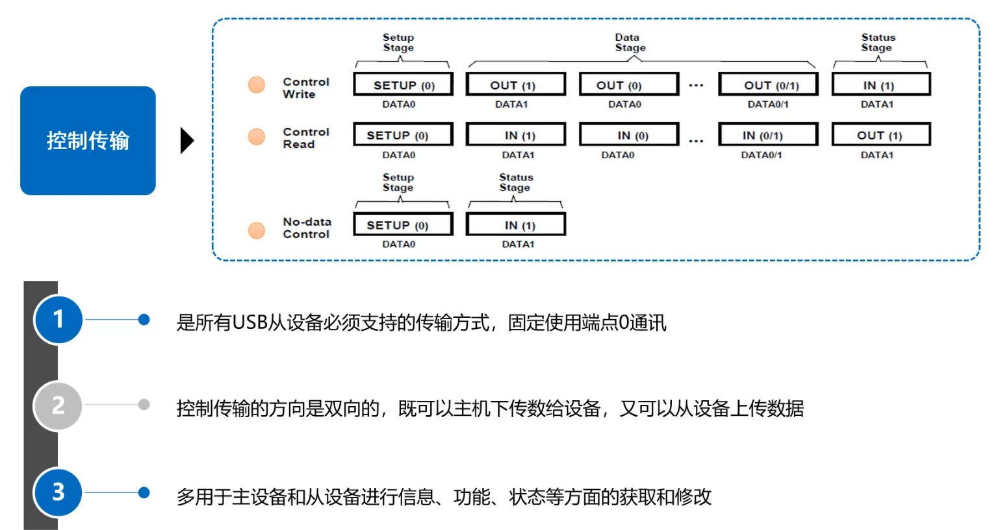
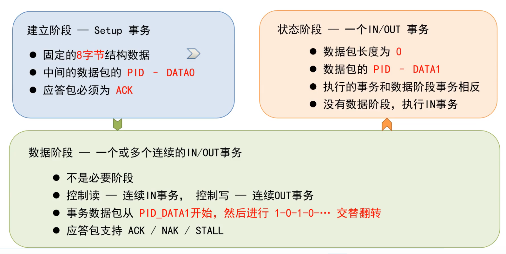
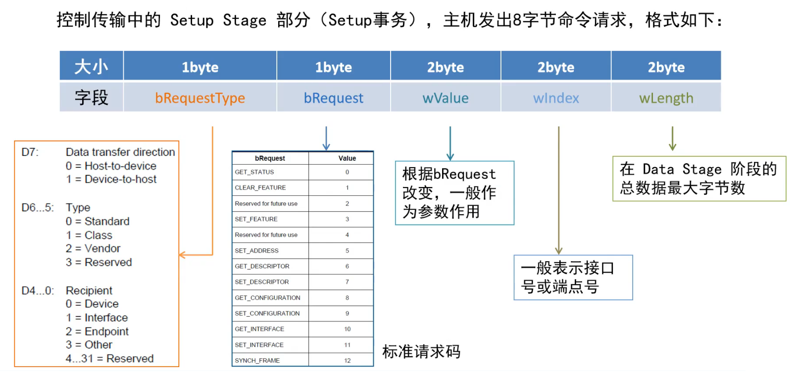
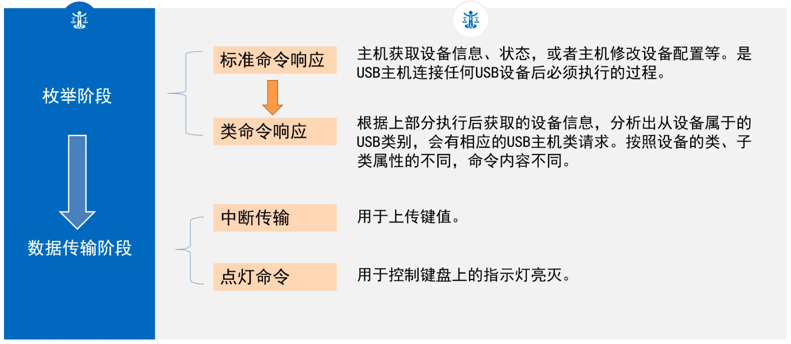
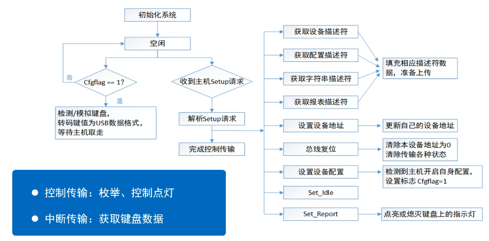

# 𝑼𝑺𝑩 基础

## USB 基本概念

### USB 协议标准

| USB 协议标准                             | 主要特点                                                     | 速度等级         |
| ---------------------------------------- | ------------------------------------------------------------ | ---------------- |
| USB 2.0 Full Speed （旧称 USB 1.1） | 规范了 USB 低全速传输                                        | 1.5 Mbps~12 Mbps |
| USB 2.0 High Speed （旧称 USB 2.0） | 规范了 USB 高速传输                                          | 480 Mbps         |
| USB 3.2 gen1 （旧称 USB 3.0）       | 采用 8b/10b 编码，增加一对超高速差分线，供电 5V/0.9A         | 5 Gbps           |
| USB 3.2 gen2 （旧称 USB 3.1）       | 采用 128b/132b 编码，速度提高 1 倍，供电 20V/5A，同时增加了 A/V 影音传输标准 | 10 Gbps          |
| USB 3.2 gen2*2 （旧称 USB 3.2）     | 增加一对超高速传输通道，速度再次翻倍，只能在 C 型接口上运行  | 20 Gbps          |

### 通讯接口

### 编码方式

这种编码方式也称为**反向不归零编码（NRZI）**

**位填充**：在数据进行 NRZI 编码前，每 6 个连续的 **1** 信号之后都会插入 1 个 **0** 信号，以避免长时间电平保持不变带来的同步漂移。

### 信号传输状态

### 帧

帧是一个时间单位，固定为**1ms**（低/全速），高速-微帧为 **125us**

### 通讯过程划分

**事务**是最基本的传输单位。

### 四种传输

::: tip 控制传输
主机获取设备信息、状态，选择设备配置等一系列命令式工作。
:::

::: tip 中断传输

收发数据量少、周期性传输。

:::

::: tip 批量传输

利用任何可获得的总线带宽进行数据传输。

:::

::: tip 等时传输

恒定速率、没有差错控制的传输。

:::

### 其他术语

#### 上传/下传

USB 主机接收 USB 设备的数据称为上传，USB 主机发送数据给 USB 设备称为下传。

#### 地址

主机管理设备，而为每一个连接的设备分配一个地址，主机最多可以分配 127 个地址。

#### 端点

USB 设备中实际的物理单元，端点和地址决定了主机和设备之间通讯的物理通道。

#### USB 传输特点

物理传输双方角色一定是主机和设备，一问一答传输方式，永远是主机先发起包请求。

## 主设备和从设备

### 主设备

* 检测 USB 设备的插拔动作
* 管理主从通讯之间的控制流
* 管理主从通讯之间的数据流
* 记录主机状态和设备动作信息
* 控制主控制器和 USB 设备间的电气接口

### 集线器

* 扩展 USB 主机和 USB 端口
* 结构上有一个上行端口，多个下行端口
* 支持级联，系统中最多 5 个集线器（不包括主机的根集线器）
* 支持速度切换

### 功能设备

* 一个独立的外围设备，可以是单一功能，也可以是多功能的合成设备
* 内部包含有描述自身功能和资源需求的配置信息

## USB 系统分层

## 连接与检测

### 总线的状态

| 常见的总线状态 | 描述                      |
| -------------- | ------------------------- |
| 正常工作       | 总线上存在周期性 SOF 包   |
| 总线复位       | 总线维持 SE0 状态  > 10ms |
| 总线挂起       | 总线无活动 > 3ms          |

| 常见的几种变化       | 触发点                        |
| -------------------- | ----------------------------- |
| 无连接 -> 连接       | D+/D- 上出现高电平 > 2ms      |
| 正常 -> 挂起         | J 状态保持 > 3ms              |
| 挂起 -> 正常（唤醒） | 出现 K 状态信号并持续一段时间 |

## 枚举

:::tip 枚举的定义

USB 主设备向 USB 从设备通过获取各种描述符，从而了解设备属性，知道是什么样的设备，并加载对应的 USB 类、功能驱动程序，然后进行后续一系列的数据通信。

:::

* 主设备连接识别从设备必须的过程
* 由多个控制传输构成
* 经过地址0 （缺省地址）到其他地址（主设备分配地址）的通讯
* 对于挂载多个 USB 从设备的系统，主设备是逐一进行枚举操作

### 设备描述符

第一个需要获取的描述符，长度固定 18 字节。

### 配置描述符

描述了设备特定的配置，提供了当前配置下设备的功能接口，供电方式，耗电等信息。是一个配置的集合，集合长度不固定，包含了配置描述符、接口描述符、类定义描述符、端点描述符。

## 控制传输

### 建立阶段

## USB 键盘

##  参考文献

* [USB 协会官网](https://www.usb.org)
