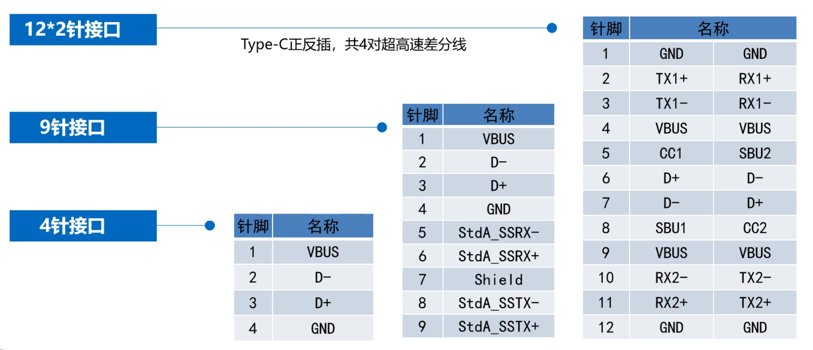
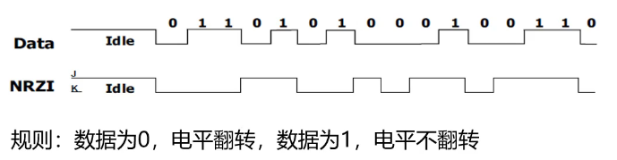
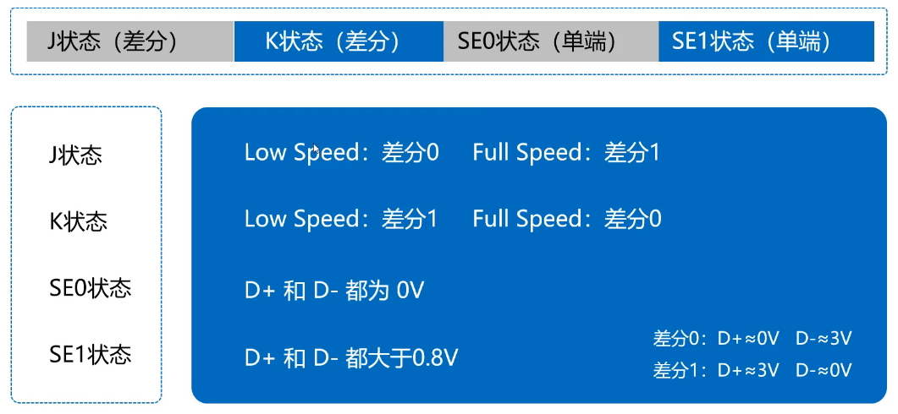
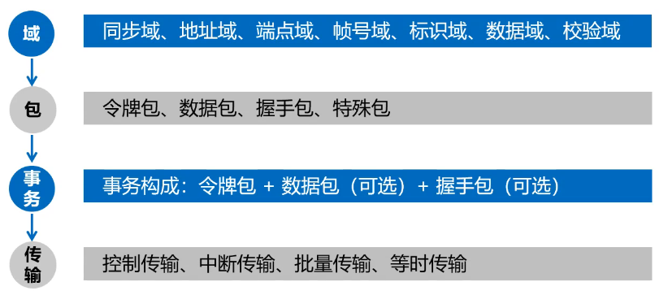

# 𝑼𝑺𝑩 基础

## USB 基本概念

### USB 协议标准

| USB 协议标准                             | 主要特点                                                     | 速度等级         |
| ---------------------------------------- | ------------------------------------------------------------ | ---------------- |
| USB 2.0 Full Speed （旧称 USB 1.1） | 规范了 USB 低全速传输                                        | 1.5 Mbps~12 Mbps |
| USB 2.0 High Speed （旧称 USB 2.0） | 规范了 USB 高速传输                                          | 480 Mbps         |
| USB 3.2 gen1 （旧称 USB 3.0）       | 采用 8b/10b 编码，增加一对超高速差分线，供电 5V/0.9A         | 5 Gbps           |
| USB 3.2 gen2 （旧称 USB 3.1）       | 采用 128b/132b 编码，速度提高 1 倍，供电 20V/5A，同时增加了 A/V 影音传输标准 | 10 Gbps          |
| USB 3.2 gen2*2 （旧称 USB 3.2）     | 增加一对超高速传输通道，速度再次翻倍，只能在 C 型接口上运行  | 20 Gbps          |

### 通讯接口

### 编码方式

这种编码方式也称为**反向不归零编码（NRZI）**

**位填充**：在数据进行 NRZI 编码前，每 6 个连续的 **1** 信号之后都会插入 1 个 **0** 信号，以避免长时间电平保持不变带来的同步漂移。

### 信号传输状态

### 帧

帧是一个时间单位，固定为**1ms**（低/全速），高速-微帧为 **125us**

### 通讯过程划分

**事务**是最基本的传输单位。

## 参考文献

* [USB 协会官网](https://www.usb.org)