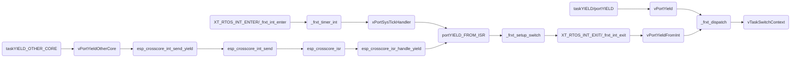

title: FreeRTOS Introduction---Based on ESP32
tags:
  - FreeRTOS
categories:
  - Geek Hobbies
author: suda-morris
date: 2018-05-30 20:56:00
---
## FreeRTOS系统配置

> FreeRTOS的系统配置文件为FreeRTOSConfig.h，在此配置文件中可以完成FreeRTOS的裁剪和配置。FreeRTOS中的裁剪和配置使用条件编译的方式来实现。

* "INCLUDE_"开始的宏，用来表示使能或者失能FreeRTOS中的相应API函数，比如`INCLUDE_vTaskPrioritySet`用来决定是否可以使用vTaskPrioritySet函数
* "config"开始的宏也用来对FreeRTOS的进行裁剪和配置，比如
  * `configAPPLICATION_ALLOCATED_HEAP`宏，如果不开启，那么FreeRTOS的堆内存由编译器分配，开启后，堆内存将由用户自行设置
    * 
  * `configCHECK_FOR_STACK_OVERFLOW`宏如果不为零，用户必须提供一个钩子函数`vApplicationStackOverflowHook`
    * 
    * 当堆栈溢出太严重时可能会损毁该函数的两个参数，这时可以通过查看变量pxCurrentTCB来确定哪个任务发生了堆栈溢出
    * `vApplicationStackOverflowHook( ( TaskHandle_t ) pxCurrentTCB[ xPortGetCoreID() ], pxCurrentTCB[ xPortGetCoreID() ]->pcTaskName );`
    * 堆栈溢出有两种检测方法：
      * 方法1：上下文切换的时候需要保存现场，现场是保存在堆栈中的，这个时候任务堆栈使用率很可能达到最大值，方法1就是不断检测任务堆栈指针是否指向有效空间，如果指向了无效空间，则调用钩子函数。该方法的特点是快，缺点是不能检测所有的堆栈溢出
      * 方法2：在创建任务的时候向任务堆栈填充一个已知的标记值，然后检测堆栈后面的几个字节是否被改写，如果被改写，则调用钩子函数，方法2几乎能够检测到所有的堆栈溢出
  * `configMAX_PRIORITIES`设置任务的优先级数量，设置好后任务就可以使用从0～configMAX_PRIORITIES-1的优先级，其中0是最低优先级
    * 
  * `configMINIMAL_STACK_SIZE`设置空闲任务的最小任务堆栈大小，以**字**为单位
    * 
  * `configTOTAL_HEAP_SIZE`设置堆的大小，如果使用了动态内存管理，则FreeRTOS在创建任务、信号量、队列等的时候就会从用户指定的内存中获取空间
    * 
  * `configKERNEL_INTERRUPT_PRIORITY`设置了内核中断系统中systick中断的优先级(FreeRTOS中systick的中断优先级是最低的)
    * 
  * `configMAX_SYSCALL_INTERRUPT_PRIORITY`设置了FreeRTOS系统可管理的最大优先级，这里实际值为*3*，高于此优先级的中断是不会被FreeRTOS内核屏蔽的，对实时性要求严格的任务就可以使用这些优先级，中断服务函数也不能调用FreeRTOS的API函数；低于（包括本身）此优先级的中断可以安全地调用以FromISR结尾的API函数
    * 


## FreeRTOS中的Task

* 任务控制块

  * > xTaskCreate()创建任务的时候，会自动给每个任务分配一个任务控制块

  * ```c
    /*
     * Task control block.  A task control block (TCB) is allocated for each task,
     * and stores task state information, including a pointer to the task's context
     * (the task's run time environment, including register values)
     */
    typedef struct tskTaskControlBlock
    {
    	volatile StackType_t	*pxTopOfStack;	//任务堆栈栈顶
    	#if ( portUSING_MPU_WRAPPERS == 1 )
    		xMPU_SETTINGS	xMPUSettings;		//MPU相关的设置
    	#endif
    	ListItem_t			xGenericListItem;	//状态列表项
    	ListItem_t			xEventListItem;		//事件列表项
    	UBaseType_t			uxPriority;			//任务优先级
    	StackType_t			*pxStack;			//任务堆栈起始地址
    	char				pcTaskName[ configMAX_TASK_NAME_LEN ];//任务名字
    	BaseType_t			xCoreID;			//执行任务的处理器核ID
    	#if ( portSTACK_GROWTH > 0 || configENABLE_TASK_SNAPSHOT == 1 )
    		StackType_t		*pxEndOfStack;		//任务堆栈栈底
    	#endif
    	#if ( portCRITICAL_NESTING_IN_TCB == 1 )
    		UBaseType_t 	uxCriticalNesting; 	//临界区嵌套深度
    		uint32_t		uxOldInterruptState; /*< Interrupt state before the outer taskEnterCritical was called */
    	#endif

    	#if ( configUSE_TRACE_FACILITY == 1 )
    		UBaseType_t		uxTCBNumber;		/*< Stores a number that increments each time a TCB is created.  It allows debuggers to determine when a task has been deleted and then recreated. */
    		UBaseType_t  	uxTaskNumber;		/*< Stores a number specifically for use by third party trace code. */
    	#endif

    	#if ( configUSE_MUTEXES == 1 )
    		UBaseType_t 	uxBasePriority;		//任务基础优先级
    		UBaseType_t 	uxMutexesHeld;		//任务获取到的互斥信号量个数
    	#endif

    	#if ( configUSE_APPLICATION_TASK_TAG == 1 )
    		TaskHookFunction_t pxTaskTag;
    	#endif

    	#if( configNUM_THREAD_LOCAL_STORAGE_POINTERS > 0 )
    		void *pvThreadLocalStoragePointers[ configNUM_THREAD_LOCAL_STORAGE_POINTERS ];
    	#if ( configTHREAD_LOCAL_STORAGE_DELETE_CALLBACKS )
    		TlsDeleteCallbackFunction_t pvThreadLocalStoragePointersDelCallback[ configNUM_THREAD_LOCAL_STORAGE_POINTERS ];
    	#endif
    	#endif

    	#if ( configGENERATE_RUN_TIME_STATS == 1 )
    		uint32_t		ulRunTimeCounter;	//记录任务运行总时间
    	#endif

    	#if ( configUSE_NEWLIB_REENTRANT == 1 )
    		/* Allocate a Newlib reent structure that is specific to this task.
    		Note Newlib support has been included by popular demand, but is not
    		used by the FreeRTOS maintainers themselves.  FreeRTOS is not
    		responsible for resulting newlib operation.  User must be familiar with
    		newlib and must provide system-wide implementations of the necessary
    		stubs. Be warned that (at the time of writing) the current newlib design
    		implements a system-wide malloc() that must be provided with locks. */
    		struct 	_reent xNewLib_reent;
    	#endif

    	#if ( configUSE_TASK_NOTIFICATIONS == 1 )
    		volatile uint32_t ulNotifiedValue;	//任务通知值
    		volatile eNotifyValue eNotifyState;	//任务通知状态
    	#endif

    	/* See the comments above the definition of
    	tskSTATIC_AND_DYNAMIC_ALLOCATION_POSSIBLE. */
    	#if( tskSTATIC_AND_DYNAMIC_ALLOCATION_POSSIBLE != 0 )
    		uint8_t	ucStaticallyAllocated; 		//如果任务是静态创建的，该变量就为pdTRUE
    	#endif

    } tskTCB;
    typedef tskTCB TCB_t;
    ```

* 任务堆栈

  * > 任务调度器在进行任务切换的时候，会将当前任务的现场(CPU寄存器值等等)保存在此任务的任务堆栈中；此任务下次运行的时候就会先用堆栈中保存的值来恢复现场，之后任务就会接着从上次中断的地方开始运行。使用动态的方法创建任务时，任务堆栈会自动创建；使用静态的方法创建任务时，任务堆栈需要用户自行定义。任务堆栈的数据类型为`StackType_t`，其大小为4字节，所以动态创建的任务，其堆栈大小是传入数值4倍

    ```c
    #define portSTACK_TYPE uint32_t
    typedef portSTACK_TYPE StackType_t
    ```


#### 尾调用 调度任务创建和删除API函数

| 函数                    | 描述                                                    |
| ----------------------- | ------------------------------------------------------- |
| xTaskCreate()           | 使用动态的方法创建一个任务                              |
| xTaskCreateStatic()     | 使用静态的方法创建一个任务                              |
| xTaskCreateRestricted() | 创建一个使用MPU进行限制的任务，相关内存使用动态内存分配 |
| vTaskDelete()           | 删除一个任务                                            |

#### 任务挂起和恢复API函数

| 函数                 | 描述                                                         |
| -------------------- | ------------------------------------------------------------ |
| vTaskSuspend()       | 挂起一个任务，传入某个任务的句柄，NULL表示当前任务           |
| vTaskResume()        | 恢复一个任务的运行                                           |
| xTaskResumeFromISR() | 中断服务函数中恢复一个任务的运行。返回pdTRUE表示恢复运行的任务的优先级等于或者高于正在运行的任务（被中断打断的任务），这意味着在退出中断服务函数的时候必须进行一次上下文切换（调用*portYIELD_FROM_ISR*）。返回pdFALSE表示恢复运行的任务的优先级低于当前正在运行的任务（被中断打断的任务），这意味着在退出中断服务函数的以后不需要进行上下文切换 |

#### 其他常用API函数(部分函数需要在配置文件中开启相关的宏)

| 函数                                           | 描述                                                         |
| ---------------------------------------------- | ------------------------------------------------------------ |
| xTaskGetHandle()                               | 根据任务名字获取某个任务的任务句柄                           |
| vTaskStartScheduler()                          | 开启任务调度                                                 |
| vTaskSuspendAll()                              | 挂起任务调度器，支持嵌套                                     |
| vTaskResumeAll()                               | 恢复调度器                                                   |
| vTaskDelay()                                   | 任务延时，单位是时钟节拍                                     |
| uxTaskPriorityGet()                            | 获取指定任务的优先级                                         |
| vTaskPrioritySet()                             | 改变一个任务的任务优先级                                     |
| uxTaskGetSystemState()                         | 获取系统中所有任务的任务状态                                 |
| vTaskGetInfo()                                 | 获取单个任务的状态                                           |
| xTaskGetCurrentTaskHandle()                    | 获取当前任务的任务句柄                                       |
| xTaskGetHandle()                               | 根据任务名字获取任务的任务句柄                               |
| xTaskGetIdleTaskHandle()                       | 返回空闲任务的任务句柄                                       |
| uxTaskGetStackHighWaterMark()                  | 检查任务从创建好到现在的历史剩余最小值，FreeRTOS把这个历史剩余最小值叫“高水位线” |
| eTaskGetState()                                | 查询某个任务的运行状态                                       |
| pcTaskGetName()                                | 根据某个任务的任务句柄来查询这个任务对应的任务名             |
| xTaskGetTickCount()/xTaskGetTickCountFromISR() | 查询任务调度器从启动到现在的时间计数器xTickCount的值，每个滴答定时器中断时xTickCount就会加1 |
| xTaskGetSchedulerState()                       | 获取FreeRTOS的任务调度器运行情况：运行、关闭还是挂起         |
| uxTaskGetNumberOfTasks()                       | 查询系统当前存在的任务数量                                   |
| vTaskList()                                    | 创建一个表格来描述每个任务的详细信息                         |
| vTaskGetRunTimeStats()                         | 统计任务的运行时间信息，任务的运行时间信息提供了每个任务获取到CPU使用权总的时间 |
| SetThreadLocalStoragePointer()                 | 设置线程本地存储指针的值，每个任务都有自己的指针数组来作为线程本地存储，使用这些线程本地存储可以用来在任务控制块中存储一些应用信息，这些信息只属于线程自己 |
| GetThreadLocalStoragePointer()                 | 获取线程本地存储指针的值                                     |


## FreeRTOS开关中断


* 关闭中断是指优先级低于XCHAL_EXCM_LEVEL的中断将会被屏蔽


## FreeRTOS临界段代码保护

| 函数/宏                        | 描述                                                         |
| ------------------------------ | ------------------------------------------------------------ |
| taskENTER_CRITICAL()           | 任务级进入临界段                                             |
| taskEXIT_CRITICAL()            | 任务级退出临界段                                             |
| taskENTER_CRITICAL_FROME_ISR() | 中断级进入临界段（中断优先级不能高于configMAX_SYSCALL_INTERRUPT_PRIORITY） |
| taskEXIT_CRITICAL_FROM_ISR()   | 中断级退出临界段                                             |


## FreeRTOS列表（双向循环链表）和列表项

```c
typedef struct xLIST
{
	listFIRST_LIST_INTEGRITY_CHECK_VALUE			//用来检查列表的完整性
	configLIST_VOLATILE UBaseType_t uxNumberOfItems;//记录列表中列表项的数量
	ListItem_t * configLIST_VOLATILE pxIndex;		//记录最新的列表项，用于遍历列表
	MiniListItem_t xListEnd;						//标记列表的最后一项
	listSECOND_LIST_INTEGRITY_CHECK_VALUE			//用来检查列表的完整性
} List_t;
```

```c
struct xLIST_ITEM
{
	listFIRST_LIST_ITEM_INTEGRITY_CHECK_VALUE
	configLIST_VOLATILE TickType_t xItemValue;			//序号，用来对列表项进行排列
	struct xLIST_ITEM * configLIST_VOLATILE pxNext;		//指向下一个列表项
	struct xLIST_ITEM * configLIST_VOLATILE pxPrevious;	//指向前一个列表项
	void * pvOwner;										//指向实际包含有该列表项的对象
	void * configLIST_VOLATILE pvContainer;				//指向此列表项归属的列表
	listSECOND_LIST_ITEM_INTEGRITY_CHECK_VALUE
};
typedef struct xLIST_ITEM ListItem_t;
```

```c
struct xMINI_LIST_ITEM
{
	listFIRST_LIST_ITEM_INTEGRITY_CHECK_VALUE
	configLIST_VOLATILE TickType_t xItemValue;
	struct xLIST_ITEM * configLIST_VOLATILE pxNext;
	struct xLIST_ITEM * configLIST_VOLATILE pxPrevious;
};
typedef struct xMINI_LIST_ITEM MiniListItem_t;
```


#### 列表操作相关API

| 函数名                                                       | 描述                   |
| ------------------------------------------------------------ | ---------------------- |
| void vListInitialise( List_t * const pxList )                | 列表初始化             |
| void vListInitialiseItem( ListItem_t * const pxItem )        | 列表项初始化           |
| void vListInsert( List_t * const pxList, ListItem_t * const pxNewListItem ) | 列表项插入（指定位置） |
| void vListInsertEnd( List_t * const pxList, ListItem_t * const pxNewListItem ) | 列表项插入（末尾）     |
| UBaseType_t uxListRemove( ListItem_t * const pxItemToRemove ) | 列表项删除             |
| listGET_OWNER_OF_NEXT_ENTRY(pxTCB,pxList)                    | 列表的遍历             |

* vListInsert中，列表项的插入位置是根据列表项中的xItemValue来决定，按照**升序**方式排列，例如xItemValue的值为portMAX_DELAY就表示要插入的位置是列表的最末尾
* vListInsertEnd中，列表项插入的位置是pxList中pxIndex指向的列表项的前面
* uxListRemove函数会返回删除后列表的剩余长度，该函数只是将指定的列表项从列表中删除掉，并不会将这个列表项的内存释放掉
* 列表中的成员变量pxIndex是用来便利列表的，每调用一次宏listGET_OWNER_OF_NEXT_ENTRY，列表的pxIndex就会指向下一个列表项，并且返回这个列表项的pxOwner变量值


## FreeRTOS的调度器

#### vTaskStartScheduler函数

```c
void vTaskStartScheduler( void )
{
	BaseType_t xReturn;
	BaseType_t i;

	//给每个内核都创建一个空闲任务，优先级设为最低（0），任务名为“IDLE”
	for ( i=0; i<portNUM_PROCESSORS; i++) {
		#if ( INCLUDE_xTaskGetIdleTaskHandle == 1 )
		{
			xReturn = xTaskCreatePinnedToCore( prvIdleTask, "IDLE", tskIDLE_STACK_SIZE, ( void * ) NULL, ( tskIDLE_PRIORITY | portPRIVILEGE_BIT ), &xIdleTaskHandle[i], i );
		}
		#else
		{
			xReturn = xTaskCreatePinnedToCore( prvIdleTask, "IDLE", tskIDLE_STACK_SIZE, ( void * ) NULL, ( tskIDLE_PRIORITY | portPRIVILEGE_BIT ), NULL, i);
		}
		#endif /* INCLUDE_xTaskGetIdleTaskHandle */	/* Event lists are always in priority order. */
	}
	//创建软件定时器任务，任务名为“Tmr Svc”，此任务只在内核0上运行
	#if ( configUSE_TIMERS == 1 )
	{
		if( xReturn == pdPASS )
		{
			xReturn = xTimerCreateTimerTask();
		}
		else
		{
			mtCOVERAGE_TEST_MARKER();
		}
	}
	#endif /* configUSE_TIMERS */
	if( xReturn == pdPASS )
	{
        //在开启调度器之前不允许被中断打扰，在这里将中断关闭。之前创建的任务堆栈中包含有一个状态字，指示这中断是打开状态，所以当第一个任务运行起来后，中断将会再一次被开启。
		portDISABLE_INTERRUPTS();
		xTickCount = ( TickType_t ) 0U;
		//如果需要使用时间统计功能，下面的这个宏需要用户自定义（配置一个计数器或定时器）
		portCONFIGURE_TIMER_FOR_RUN_TIME_STATS();
		xSchedulerRunning = pdTRUE;//表示调度器开始运行

		//初始化相关硬件：滴答定时器等，这需要用户自行实现
		if( xPortStartScheduler() != pdFALSE )
		{
			//一旦调度器起来后就永远不会执行到这里
		}
		else
		{
			//只有调用了xTaskEndScheduler函数后才会执行到这里
		}
	}
	else
	{
		//如果创建空闲任务或者定时器任务时内存不够就会执行到这里
		configASSERT( xReturn );
	}
}
```

#### xPortStartScheduler函数

```c
BaseType_t xPortStartScheduler( void )
{
	#if XCHAL_CP_NUM > 0
	//初始化任务的协处理器
	_xt_coproc_init();
	#endif
	//初始化滴答计数器的分频系数
	_xt_tick_divisor_init();
	//配置、使能滴答计数器
	_frxt_tick_timer_init();
	port_xSchedulerRunning[xPortGetCoreID()] = 1;
    //_frxt_dispatch函数不能直接用C语言调用。调度最高优先级的任务
	__asm__ volatile ("call0    _frxt_dispatch\n");
	//永远不会返回
	return pdTRUE;
}
```

#### xTaskCreatePinnedToCore函数

```c
//在某个具体的核上创建任务
BaseType_t xTaskCreatePinnedToCore(	TaskFunction_t pxTaskCode,
							const char * const pcName,
							const uint32_t usStackDepth,
							void * const pvParameters,
							UBaseType_t uxPriority,
							TaskHandle_t * const pxCreatedTask,
                            const BaseType_t xCoreID )
{
    TCB_t *pxNewTCB;
    BaseType_t xReturn;

    //如果任务栈向上生长，那么先开辟任务控制块TCB的内存，再开辟任务栈的内存，任务栈的地址保存在TCB中
    #if( portSTACK_GROWTH > 0 )
    {
        pxNewTCB = ( TCB_t * ) pvPortMallocTcbMem( sizeof( TCB_t ) );
        if( pxNewTCB != NULL )
        {
            pxNewTCB->pxStack = ( StackType_t * ) pvPortMallocStackMem( ( ( ( size_t ) usStackDepth ) * sizeof( StackType_t ) ) );
            if( pxNewTCB->pxStack == NULL )
            {
                vPortFree( pxNewTCB );
                pxNewTCB = NULL;
            }
        }
    }
    #else
    //如果任务栈向下生长，那么先开辟任务栈的内存，再开辟任务控制块TCB的内存，任务栈的地址保存在TCB中
    {
        StackType_t *pxStack;
        pxStack = ( StackType_t * ) pvPortMallocStackMem( ( ( ( size_t ) usStackDepth ) * sizeof( StackType_t ) ) );
        if( pxStack != NULL )
        {
            pxNewTCB = ( TCB_t * ) pvPortMallocTcbMem( sizeof( TCB_t ) );
            if( pxNewTCB != NULL )
            {
                pxNewTCB->pxStack = pxStack;
            }
            else
            {
                vPortFree( pxStack );
            }
        }
        else
        {
            pxNewTCB = NULL;
        }
    }
    #endif /* portSTACK_GROWTH */
    if( pxNewTCB != NULL )
    {
        #if( tskSTATIC_AND_DYNAMIC_ALLOCATION_POSSIBLE != 0 )
        {
            //标记该任务后期不需要的时候需要删除
            pxNewTCB->ucStaticallyAllocated = tskDYNAMICALLY_ALLOCATED_STACK_AND_TCB;
        }
        #endif /* configSUPPORT_STATIC_ALLOCATION */
		//初始化任务
        prvInitialiseNewTask( pxTaskCode, pcName, usStackDepth, pvParameters, uxPriority, pxCreatedTask, pxNewTCB, NULL, xCoreID );
        //将新创建的任务加入就绪列表中
        prvAddNewTaskToReadyList( pxNewTCB, pxTaskCode, xCoreID );
        xReturn = pdPASS;
    }
    else
    {
        xReturn = errCOULD_NOT_ALLOCATE_REQUIRED_MEMORY;
    }
    return xReturn;
}
```

#### prvInitialiseNewTask函数

```c
static void prvInitialiseNewTask( 	TaskFunction_t pxTaskCode,
									const char * const pcName,
									const uint32_t ulStackDepth,
									void * const pvParameters,
									UBaseType_t uxPriority,
									TaskHandle_t * const pxCreatedTask,
									TCB_t *pxNewTCB,
									const MemoryRegion_t * const xRegions, const BaseType_t xCoreID )
{
StackType_t *pxTopOfStack;
UBaseType_t x;

	#if( portUSING_MPU_WRAPPERS == 1 )
		//任务使用特权模式创建任务
		BaseType_t xRunPrivileged;
		if( ( uxPriority & portPRIVILEGE_BIT ) != 0U )
		{
			xRunPrivileged = pdTRUE;
		}
		else
		{
			xRunPrivileged = pdFALSE;
		}
		uxPriority &= ~portPRIVILEGE_BIT;
	#endif /* portUSING_MPU_WRAPPERS == 1 */
	#if( ( configCHECK_FOR_STACK_OVERFLOW > 1 ) || ( configUSE_TRACE_FACILITY == 1 ) || ( INCLUDE_uxTaskGetStackHighWaterMark == 1 ) )
	{
		//将任务栈初始化相同的值(0xA5)
		( void ) memset( pxNewTCB->pxStack, ( int ) tskSTACK_FILL_BYTE, ( size_t ) ulStackDepth * sizeof( StackType_t ) );
	}
	#endif
	//根据栈的不同生长方向来计算栈顶位置
	#if( portSTACK_GROWTH < 0 )
	{
		pxTopOfStack = pxNewTCB->pxStack + ( ulStackDepth - ( uint32_t ) 1 );
		pxTopOfStack = ( StackType_t * ) ( ( ( portPOINTER_SIZE_TYPE ) pxTopOfStack ) & ( ~( ( portPOINTER_SIZE_TYPE ) portBYTE_ALIGNMENT_MASK ) ) );

		//检查堆栈栈顶地址是否字节对齐
		configASSERT( ( ( ( portPOINTER_SIZE_TYPE ) pxTopOfStack & ( portPOINTER_SIZE_TYPE ) portBYTE_ALIGNMENT_MASK ) == 0UL ) );
		#if ( configENABLE_TASK_SNAPSHOT == 1 )
		{
			pxNewTCB->pxEndOfStack = pxTopOfStack;
		}
#endif
	}
	#else /* portSTACK_GROWTH */
	{
		pxTopOfStack = pxNewTCB->pxStack;
		configASSERT( ( ( ( portPOINTER_SIZE_TYPE ) pxNewTCB->pxStack & ( portPOINTER_SIZE_TYPE ) portBYTE_ALIGNMENT_MASK ) == 0UL ) );
		pxNewTCB->pxEndOfStack = pxNewTCB->pxStack + ( ulStackDepth - ( uint32_t ) 1 );
	}
	#endif /* portSTACK_GROWTH */
	//保存任务的任务名
	for( x = ( UBaseType_t ) 0; x < ( UBaseType_t ) configMAX_TASK_NAME_LEN; x++ )
	{
		pxNewTCB->pcTaskName[ x ] = pcName[ x ];
		if( pcName[ x ] == 0x00 )
		{
			break;
		}
		else
		{
			mtCOVERAGE_TEST_MARKER();
		}
	}
	//任务名太长需要截断
	pxNewTCB->pcTaskName[ configMAX_TASK_NAME_LEN - 1 ] = '\0';
	//修正不合法的优先级
	if( uxPriority >= ( UBaseType_t ) configMAX_PRIORITIES )
	{
		uxPriority = ( UBaseType_t ) configMAX_PRIORITIES - ( UBaseType_t ) 1U;
	}
	else
	{
		mtCOVERAGE_TEST_MARKER();
	}
	pxNewTCB->uxPriority = uxPriority;//初始化任务控制块的优先级字段
	pxNewTCB->xCoreID = xCoreID;//初始化任务所在的内核ID号
	#if ( configUSE_MUTEXES == 1 )
	{
		pxNewTCB->uxBasePriority = uxPriority;//如果使用了互斥信号量，就需要指定基础优先级
		pxNewTCB->uxMutexesHeld = 0;
	}
	#endif /* configUSE_MUTEXES */

	vListInitialiseItem( &( pxNewTCB->xGenericListItem ) );//初始化通用列表项
	vListInitialiseItem( &( pxNewTCB->xEventListItem ) );//初始化事件列表项
	listSET_LIST_ITEM_OWNER( &( pxNewTCB->xGenericListItem ), pxNewTCB );//设置列表项归属
	listSET_LIST_ITEM_VALUE( &( pxNewTCB->xEventListItem ), ( TickType_t ) configMAX_PRIORITIES - ( TickType_t ) uxPriority );//设置事件列表项的值使得优先级从小到大排列
	listSET_LIST_ITEM_OWNER( &( pxNewTCB->xEventListItem ), pxNewTCB );//设置列表项归属
	#if ( portCRITICAL_NESTING_IN_TCB == 1 )
	{
		pxNewTCB->uxCriticalNesting = ( UBaseType_t ) 0U;
	}
	#endif /* portCRITICAL_NESTING_IN_TCB */
	#if ( configUSE_APPLICATION_TASK_TAG == 1 )
	{
		pxNewTCB->pxTaskTag = NULL;
	}
	#endif /* configUSE_APPLICATION_TASK_TAG */
	#if ( configGENERATE_RUN_TIME_STATS == 1 )
	{
		pxNewTCB->ulRunTimeCounter = 0UL;
	}
	#endif /* configGENERATE_RUN_TIME_STATS */
	#if ( portUSING_MPU_WRAPPERS == 1 )
	{
		vPortStoreTaskMPUSettings( &( pxNewTCB->xMPUSettings ), xRegions, pxNewTCB->pxStack, ulStackDepth );
	}
	#else
	{
		/* Avoid compiler warning about unreferenced parameter. */
		( void ) xRegions;
	}
	#endif
	#if( configNUM_THREAD_LOCAL_STORAGE_POINTERS != 0 )
	{
		for( x = 0; x < ( UBaseType_t ) configNUM_THREAD_LOCAL_STORAGE_POINTERS; x++ )
		{
			pxNewTCB->pvThreadLocalStoragePointers[ x ] = NULL;
			#if ( configTHREAD_LOCAL_STORAGE_DELETE_CALLBACKS == 1)
			pxNewTCB->pvThreadLocalStoragePointersDelCallback[ x ] = NULL;
			#endif
		}
	}
	#endif
	#if ( configUSE_TASK_NOTIFICATIONS == 1 )
	{
		pxNewTCB->ulNotifiedValue = 0;
		pxNewTCB->eNotifyState = eNotWaitingNotification;
	}
	#endif
	#if ( configUSE_NEWLIB_REENTRANT == 1 )
	{
		/* Initialise this task's Newlib reent structure. */
		esp_reent_init(&pxNewTCB->xNewLib_reent);
	}
	#endif
	#if( INCLUDE_xTaskAbortDelay == 1 )
	{
		pxNewTCB->ucDelayAborted = pdFALSE;
	}
	#endif
	#if( portUSING_MPU_WRAPPERS == 1 )
	{
		pxNewTCB->pxTopOfStack = pxPortInitialiseStack( pxTopOfStack, pxTaskCode, pvParameters, xRunPrivileged );
	}
	#else /* portUSING_MPU_WRAPPERS */
	{
		pxNewTCB->pxTopOfStack = pxPortInitialiseStack( pxTopOfStack, pxTaskCode, pvParameters );//初始化任务堆栈
	}
	#endif /* portUSING_MPU_WRAPPERS */

	if( ( void * ) pxCreatedTask != NULL )
	{
		//任务句柄其实就是任务控制块的地址
		*pxCreatedTask = ( TaskHandle_t ) pxNewTCB;
	}
	else
	{
		mtCOVERAGE_TEST_MARKER();
	}
}
```

#### pxPortInitialiseStack函数

```c
StackType_t *pxPortInitialiseStack( StackType_t *pxTopOfStack, TaskFunction_t pxCode, void *pvParameters )
{
	StackType_t *sp, *tp;
	XtExcFrame  *frame;
	#if XCHAL_CP_NUM > 0
	uint32_t *p;
	#endif
	uint32_t *threadptr;
	void *task_thread_local_start;
	extern int _thread_local_start, _thread_local_end, _rodata_start;
	// TODO: check that TLS area fits the stack
	uint32_t thread_local_sz = (uint8_t *)&_thread_local_end - (uint8_t *)&_thread_local_start;

	thread_local_sz = ALIGNUP(0x10, thread_local_sz);
	/* 初始化任务堆栈，使之从高地址开始往下依次是：

	----LOW ADDRESSES ----------------------------------------HIGH ADDRESSES----------
	task stack | interrupt stack frame | thread local vars | co-processor save area |
	----------------------------------------------------------------------------------
	           |																	|
			   SP 								                            pxTopOfStack
	*/
	sp = (StackType_t *) (((UBaseType_t)(pxTopOfStack + 1) - XT_CP_SIZE - thread_local_sz - XT_STK_FRMSZ) & ~0xf);//16字节对齐
	for (tp = sp; tp <= pxTopOfStack; ++tp)//将sp到TopOfStack之间的内存清零
		*tp = 0;
	frame = (XtExcFrame *) sp;

	/* 对一些必要的寄存赋值 */
	frame->pc   = (UBaseType_t) pxCode;             //PC指针初始化为任务函数的入口地址
	frame->a0   = 0;                                //组织GDB回溯
	frame->a1   = (UBaseType_t) sp + XT_STK_FRMSZ;
	frame->exit = (UBaseType_t) _xt_user_exit;

	/* Set initial PS to int level 0, EXCM disabled ('rfe' will enable), user mode. */
	/* Also set entry point argument parameter. */
	#ifdef __XTENSA_CALL0_ABI__
	frame->a2 = (UBaseType_t) pvParameters;
	frame->ps = PS_UM | PS_EXCM;
	#else
	/* + for windowed ABI also set WOE and CALLINC (pretend task was 'call4'd). */
	frame->a6 = (UBaseType_t) pvParameters;
	frame->ps = PS_UM | PS_EXCM | PS_WOE | PS_CALLINC(1);
	#endif

	#ifdef XT_USE_SWPRI
	/* Set the initial virtual priority mask value to all 1's. */
	frame->vpri = 0xFFFFFFFF;
	#endif

	/* Init threadptr reg and TLS vars */
	task_thread_local_start = (void *)(((uint32_t)pxTopOfStack - XT_CP_SIZE - thread_local_sz) & ~0xf);
	memcpy(task_thread_local_start, &_thread_local_start, thread_local_sz);
	threadptr = (uint32_t *)(sp + XT_STK_EXTRA);
	/* shift threadptr by the offset of _thread_local_start from DROM start;
	   need to take into account extra 16 bytes offset */
	*threadptr = (uint32_t)task_thread_local_start - ((uint32_t)&_thread_local_start - (uint32_t)&_rodata_start) - 0x10;

	#if XCHAL_CP_NUM > 0
	/* Init the coprocessor save area (see xtensa_context.h) */
	p = (uint32_t *)(((uint32_t) pxTopOfStack - XT_CP_SIZE) & ~0xf);
	p[0] = 0;
	p[1] = 0;
	p[2] = (((uint32_t) p) + 12 + XCHAL_TOTAL_SA_ALIGN - 1) & -XCHAL_TOTAL_SA_ALIGN;
	#endif

	return sp;
}
```

#### prvAddNewTaskToReadyList函数

> FreeRTOS使用不同的列表来表示任务的不同状态

```c
static void prvAddNewTaskToReadyList( TCB_t *pxNewTCB, TaskFunction_t pxTaskCode, BaseType_t xCoreID )
{
	TCB_t *curTCB, *tcb0, *tcb1;
	configASSERT( xCoreID == tskNO_AFFINITY || xCoreID < portNUM_PROCESSORS);
    //确保列表在被更新的过程中不会被中断打断
	taskENTER_CRITICAL(&xTaskQueueMutex);
	{
		uxCurrentNumberOfTasks++;//全局变量，统计任务数量
		//判断这个任务在哪个内核上运行
		if ( xCoreID == tskNO_AFFINITY )
		{
			if ( portNUM_PROCESSORS == 1 )
			{
				xCoreID = 0;
			}
			else
			{
				tcb0 = pxCurrentTCB[0];
				tcb1 = pxCurrentTCB[1];
				if ( tcb0 == NULL )
				{
					xCoreID = 0;
				}
				else if ( tcb1 == NULL )
				{
					xCoreID = 1;
				}
				else if ( tcb0->uxPriority < pxNewTCB->uxPriority && tcb0->uxPriority < tcb1->uxPriority )
				{
					xCoreID = 0;
				}
				else if ( tcb1->uxPriority < pxNewTCB->uxPriority )
				{
					xCoreID = 1;
				}
				else//两个核上的运行的任务，其优先级都比新的任务要高
				{
					xCoreID = xPortGetCoreID();
				}
			}
		}

        //当前的核上没有任务正在运行
		if( pxCurrentTCB[ xCoreID ] == NULL )
		{
			pxCurrentTCB[ xCoreID ] = pxNewTCB;
			if( uxCurrentNumberOfTasks == ( UBaseType_t ) 1 )
			{
#if portFIRST_TASK_HOOK
				if ( xPortGetCoreID() == 0 ) {
					vPortFirstTaskHook(pxTaskCode);
				}
#endif /* configFIRST_TASK_HOOK */
				//正在创建的任务是第一个任务，那么需要先初始化相应的列表
				prvInitialiseTaskLists();
			}
			else
			{
				mtCOVERAGE_TEST_MARKER();
			}
		}
		else
		{
			if( xSchedulerRunning == pdFALSE )
			{
				//新任务的优先级比正在运行的任务优先级高
				if ( pxCurrentTCB[xCoreID] == NULL || pxCurrentTCB[xCoreID]->uxPriority <= pxNewTCB->uxPriority )
				{
					pxCurrentTCB[xCoreID] = pxNewTCB;
				}
			}
			else
			{
				mtCOVERAGE_TEST_MARKER();
			}
		}
		uxTaskNumber++;//uxTaskNumber加1，用作任务控制块编号

		#if ( configUSE_TRACE_FACILITY == 1 )
		{
			pxNewTCB->uxTCBNumber = uxTaskNumber;
		}
		#endif /* configUSE_TRACE_FACILITY */
		traceTASK_CREATE( pxNewTCB );

		prvAddTaskToReadyList( pxNewTCB );

		portSETUP_TCB( pxNewTCB );
	}
	taskEXIT_CRITICAL(&xTaskQueueMutex);
	if( xSchedulerRunning != pdFALSE )
	{
		taskENTER_CRITICAL(&xTaskQueueMutex);
		curTCB = pxCurrentTCB[ xCoreID ];
        //如果新任务的任务优先级最高，而且调度器已经开始正常运行了，那么就执行任务切换
		if( curTCB == NULL || curTCB->uxPriority < pxNewTCB->uxPriority )
		{
			if( xCoreID == xPortGetCoreID() )
			{
				taskYIELD_IF_USING_PREEMPTION();
			}
			else {
				taskYIELD_OTHER_CORE(xCoreID, pxNewTCB->uxPriority);
			}
		}
		else
		{
			mtCOVERAGE_TEST_MARKER();
		}
		taskEXIT_CRITICAL(&xTaskQueueMutex);
	}
	else
	{
		mtCOVERAGE_TEST_MARKER();
	}
}
```

#### prvAddTaskToReadyList宏

```c
#define prvAddTaskToReadyList( pxTCB )												\
	traceMOVED_TASK_TO_READY_STATE( pxTCB );										\
	taskRECORD_READY_PRIORITY( ( pxTCB )->uxPriority );								\
	vListInsertEnd( &( pxReadyTasksLists[ ( pxTCB )->uxPriority ] ), &( ( pxTCB )->xGenericListItem ) )//将任务添加到就绪列表的末尾
```

#### vTaskDelete函数

```c
void vTaskDelete( TaskHandle_t xTaskToDelete )
{
    TCB_t *pxTCB;
    int core = xPortGetCoreID();
    UBaseType_t free_now;

    taskENTER_CRITICAL(&xTaskQueueMutex);
    {
        pxTCB = prvGetTCBFromHandle( xTaskToDelete );//根据任务句柄获取TCB指针
        //将任务从就绪列表中删除
        if( uxListRemove( &( pxTCB->xGenericListItem ) ) == ( UBaseType_t ) 0 )
        {
            taskRESET_READY_PRIORITY( pxTCB->uxPriority );
        }
        else
        {
            mtCOVERAGE_TEST_MARKER();
        }
        //判断该任务是否在等待某个事件，如果是这样，则这个任务会被放到相应的列表中，这里需要将其移除
        if( listLIST_ITEM_CONTAINER( &( pxTCB->xEventListItem ) ) != NULL )
        {
            ( void ) uxListRemove( &( pxTCB->xEventListItem ) );
        }
        else
        {
            mtCOVERAGE_TEST_MARKER();
        }

        //触发调试器刷新任务列表
        uxTaskNumber++;

        //被删除的任务是正在运行的任务，或者在别的核，那么就交给空闲任务来释放内存
        if( pxTCB == pxCurrentTCB[ core ] ||
           (portNUM_PROCESSORS > 1 && pxTCB == pxCurrentTCB[ !core ]) ||
           (portNUM_PROCESSORS > 1 && pxTCB->xCoreID == (!core)) )
        {
            vListInsertEnd( &xTasksWaitingTermination, &( pxTCB->xGenericListItem ) );
            ++uxTasksDeleted;
            portPRE_TASK_DELETE_HOOK( pxTCB, &xYieldPending[xPortGetCoreID()] );//调用任务删除钩子函数
            free_now = pdFALSE;		//不能立即释放内存
        }
        else//要删除的任务不是当前运行的，也不在别的核上
        {
            --uxCurrentNumberOfTasks;
            //重新计算一下还要多长时间执行下一个任务，也就是下一个任务的解锁时间，防止有的任务的解锁时间参考了刚刚被删除的那个任务
            prvResetNextTaskUnblockTime();
            free_now = pdTRUE;
        }
        traceTASK_DELETE( pxTCB );
    }
    taskEXIT_CRITICAL(&xTaskQueueMutex);

    if(free_now == pdTRUE){
        #if ( configNUM_THREAD_LOCAL_STORAGE_POINTERS > 0 ) && ( configTHREAD_LOCAL_STORAGE_DELETE_CALLBACKS )
        prvDeleteTLS( pxTCB );	//Run deletion callbacks before deleting TCB
        #endif
        prvDeleteTCB( pxTCB );	//Must only be called after del cb
    }

    //如果删除的是正在运行的任务，那么删除完以后肯定需要强制进行一次任务切换
    if( xSchedulerRunning != pdFALSE )
    {
        if( pxTCB == pxCurrentTCB[ core ] )
        {
            configASSERT( uxSchedulerSuspended[ core ] == 0 );
            portPRE_TASK_DELETE_HOOK( pxTCB, &xYieldPending[xPortGetCoreID()] );
            portYIELD_WITHIN_API();
        }
        else if ( portNUM_PROCESSORS > 1 && pxTCB == pxCurrentTCB[ !core] )
        {
            //如果被删除的任务正在另外一个核上运行，强制另外一个核做任务切换
            vPortYieldOtherCore( !core );
        }
        else
        {
            mtCOVERAGE_TEST_MARKER();
        }
    }
}
```

#### vTaskSuspend函数

```c
void vTaskSuspend( TaskHandle_t xTaskToSuspend )
{
    TCB_t *pxTCB;
    TCB_t *curTCB;

    taskENTER_CRITICAL(&xTaskQueueMutex);
    {
        pxTCB = prvGetTCBFromHandle( xTaskToSuspend );
        traceTASK_SUSPEND( pxTCB );
        //将任务从就绪列表中删除
        if( uxListRemove( &( pxTCB->xGenericListItem ) ) == ( UBaseType_t ) 0 )
        {
            taskRESET_READY_PRIORITY( pxTCB->uxPriority );
        }
        else
        {
            mtCOVERAGE_TEST_MARKER();
        }

        //将任务从事件列表中删除
        if( listLIST_ITEM_CONTAINER( &( pxTCB->xEventListItem ) ) != NULL )
        {
            ( void ) uxListRemove( &( pxTCB->xEventListItem ) );
        }
        else
        {
            mtCOVERAGE_TEST_MARKER();
        }
        traceMOVED_TASK_TO_SUSPENDED_LIST(pxTCB);
        //将任务添加到挂起列表的最后
        vListInsertEnd( &xSuspendedTaskList, &( pxTCB->xGenericListItem ) );
        curTCB = pxCurrentTCB[ xPortGetCoreID() ];
    }
    taskEXIT_CRITICAL(&xTaskQueueMutex);

    if( pxTCB == curTCB )
    {
        if( xSchedulerRunning != pdFALSE )
        {
            //确保当前核的任务调度器工作正常
            configASSERT( uxSchedulerSuspended[ xPortGetCoreID() ] == 0 );
            portYIELD_WITHIN_API();
        }
        else//任务调度器不在工作，只能手动查找下一个要运行的任务
        {
            //所有的任务都被挂起，事实上这种情况几乎不存在，除非在空闲任务中调用了阻塞的API
            if( listCURRENT_LIST_LENGTH( &xSuspendedTaskList ) == uxCurrentNumberOfTasks )
            {
                taskENTER_CRITICAL(&xTaskQueueMutex);
                pxCurrentTCB[ xPortGetCoreID() ] = NULL;
                taskEXIT_CRITICAL(&xTaskQueueMutex);
            }
            else
            {
                //获取下一个要运行的任务
                vTaskSwitchContext();
            }
        }
    }
    else
    {
        if( xSchedulerRunning != pdFALSE )
        {
            //如果被挂起的任务当前不在运行，重新计算一下还要多长时间执行下一个任务，防止有的任务的解锁时间参考了刚刚被挂起的任务
            taskENTER_CRITICAL(&xTaskQueueMutex);
            {
                prvResetNextTaskUnblockTime();
            }
            taskEXIT_CRITICAL(&xTaskQueueMutex);
        }
        else
        {
            mtCOVERAGE_TEST_MARKER();
        }
    }
}
```

#### vTaskResume函数

```c
void vTaskResume( TaskHandle_t xTaskToResume )
{
    TCB_t * const pxTCB = ( TCB_t * ) xTaskToResume;

    configASSERT( xTaskToResume );
    taskENTER_CRITICAL(&xTaskQueueMutex);
    //xTaskToResume不能为NULL，也不应该存在恢复当前正在运行的任务这种情况
    if( ( pxTCB != NULL ) && ( pxTCB != pxCurrentTCB[ xPortGetCoreID() ] ) )
    {
        {
            if( prvTaskIsTaskSuspended( pxTCB ) == pdTRUE )
            {
                traceTASK_RESUME( pxTCB );
                //将要恢复的任务从挂起列表中删除
                ( void ) uxListRemove(  &( pxTCB->xGenericListItem ) );
                //将要恢复的任务添加到就绪任务列表中
                prvAddTaskToReadyList( pxTCB );
                //如果被恢复的任务优先级更高
                if( tskCAN_RUN_HERE(pxTCB->xCoreID) && pxTCB->uxPriority >= pxCurrentTCB[ xPortGetCoreID() ]->uxPriority )
                {
                    //这个yield不会让恢复的任务立即运行，但是会刷新就绪列表
                    taskYIELD_IF_USING_PREEMPTION();
                }
                else if( pxTCB->xCoreID != xPortGetCoreID() )
                {
                    //被恢复的任务不属于当前的核
                    taskYIELD_OTHER_CORE( pxTCB->xCoreID, pxTCB->uxPriority );
                }
                else
                {
                    mtCOVERAGE_TEST_MARKER();
                }
            }
            else
            {
                mtCOVERAGE_TEST_MARKER();
            }
        }
    }
    else
    {
        mtCOVERAGE_TEST_MARKER();
    }
    taskEXIT_CRITICAL(&xTaskQueueMutex);
}
```


## FreeRTOS任务切换

* FreeRTOS任务切换的场合

> 1. 执行一个会引起任务切换的API函数，比如**taskYIELD**
> 2. 系统滴答定时器中断

* ~~任务切换一般是在PendSV（可挂起的系统调用）中断服务函数里面完成的~~

### 执行系统调用

```c
#define taskYIELD()					portYIELD()
#define portYIELD()					vPortYield()
```

#### vPortYield函数

```c
//函数void vPortYield(void)使用汇编实现，主要功能是保存待暂停任务的最小现场环境，清除CPENABLE，最后调用_frxt_dispatch函数实现真正的上下文切换
    .globl  vPortYield
    .type   vPortYield,@function
    .align  4
vPortYield:

    #ifdef __XTENSA_CALL0_ABI__
    addi    sp,  sp, -XT_SOL_FRMSZ
    #else
    entry   sp,  XT_SOL_FRMSZ
    #endif

    rsr     a2,  PS
    s32i    a0,  sp, XT_SOL_PC
    s32i    a2,  sp, XT_SOL_PS
    #ifdef __XTENSA_CALL0_ABI__
    s32i    a12, sp, XT_SOL_A12         /* save callee-saved registers      */
    s32i    a13, sp, XT_SOL_A13
    s32i    a14, sp, XT_SOL_A14
    s32i    a15, sp, XT_SOL_A15
    #else
    /* Spill register windows. Calling xthal_window_spill() causes extra    */
    /* spills and reloads, so we will set things up to call the _nw version */
    /* instead to save cycles.                                              */
    movi    a6,  ~(PS_WOE_MASK|PS_INTLEVEL_MASK)  /* spills a4-a7 if needed */
    and     a2,  a2, a6                           /* clear WOE, INTLEVEL    */
    addi    a2,  a2, XCHAL_EXCM_LEVEL             /* set INTLEVEL           */
    wsr     a2,  PS
    rsync
    call0   xthal_window_spill_nw
    l32i    a2,  sp, XT_SOL_PS                    /* restore PS             */
    wsr     a2,  PS
    #endif

    rsil    a2,  XCHAL_EXCM_LEVEL       /* disable low/med interrupts       */

    #if XCHAL_CP_NUM > 0
    /* Save coprocessor callee-saved state (if any). At this point CPENABLE */
    /* should still reflect which CPs were in use (enabled).                */
    call0   _xt_coproc_savecs
    #endif

    movi    a2,  pxCurrentTCB
	getcoreid a3
	addx4	a2,  a3, a2
    l32i    a2,  a2, 0                  /* a2 = pxCurrentTCB                */
    movi    a3,  0
    s32i    a3,  sp, XT_SOL_EXIT        /* 0 to flag as solicited frame     */
    s32i    sp,  a2, TOPOFSTACK_OFFS    /* pxCurrentTCB->pxTopOfStack = SP  */

    #if XCHAL_CP_NUM > 0
    /* Clear CPENABLE, also in task's co-processor state save area. */
    l32i    a2,  a2, CP_TOPOFSTACK_OFFS /* a2 = pxCurrentTCB->cp_state      */
    movi    a3,  0
    wsr     a3,  CPENABLE
    beqz    a2,  1f
    s16i    a3,  a2, XT_CPENABLE        /* clear saved cpenable             */
1:
    #endif

    /* Tail-call dispatcher. */
    call0   _frxt_dispatch
    /* Never reaches here. */
```

#### _frxt_dispatch函数

```c
//该函数的功能是将上下文切换到最高优先级的就绪任务，恢复它的状态，最后将将控制权转交给它
    .globl  _frxt_dispatch
    .type   _frxt_dispatch,@function
    .align  4
_frxt_dispatch:

    #ifdef __XTENSA_CALL0_ABI__
    call0   vTaskSwitchContext  // Get next TCB to resume
    movi    a2, pxCurrentTCB
	getcoreid a3
	addx4	a2,  a3, a2
    #else
    call4   vTaskSwitchContext  // Get next TCB to resume
    movi    a2, pxCurrentTCB
	getcoreid a3
	addx4	a2,  a3, a2
    #endif
    l32i    a3,  a2, 0
    l32i    sp,  a3, TOPOFSTACK_OFFS     /* SP = next_TCB->pxTopOfStack;  */
    s32i    a3,  a2, 0

    /* Determine the type of stack frame. */
    l32i    a2,  sp, XT_STK_EXIT        /* exit dispatcher or solicited flag */
    bnez    a2,  .L_frxt_dispatch_stk

.L_frxt_dispatch_sol:

    /* Solicited stack frame. Restore minimal context and return from vPortYield(). */
    l32i    a3,  sp, XT_SOL_PS
    #ifdef __XTENSA_CALL0_ABI__
    l32i    a12, sp, XT_SOL_A12
    l32i    a13, sp, XT_SOL_A13
    l32i    a14, sp, XT_SOL_A14
    l32i    a15, sp, XT_SOL_A15
    #endif
    l32i    a0,  sp, XT_SOL_PC
    #if XCHAL_CP_NUM > 0
    /* Ensure wsr.CPENABLE is complete (should be, it was cleared on entry). */
    rsync
    #endif
    /* As soons as PS is restored, interrupts can happen. No need to sync PS. */
    wsr     a3,  PS
    #ifdef __XTENSA_CALL0_ABI__
    addi    sp,  sp, XT_SOL_FRMSZ
    ret
    #else
    retw
    #endif

.L_frxt_dispatch_stk:

    #if XCHAL_CP_NUM > 0
    /* Restore CPENABLE from task's co-processor save area. */
    movi    a3, pxCurrentTCB            /* cp_state =                       */
	getcoreid a2
	addx4	a3,  a2, a3
    l32i    a3, a3, 0
    l32i    a2, a3, CP_TOPOFSTACK_OFFS     /* StackType_t                       *pxStack; */
    l16ui   a3, a2, XT_CPENABLE         /* CPENABLE = cp_state->cpenable;   */
    wsr     a3, CPENABLE
    #endif

    /* Interrupt stack frame. Restore full context and return to exit dispatcher. */
    call0   _xt_context_restore

    /* In Call0 ABI, restore callee-saved regs (A12, A13 already restored). */
    #ifdef __XTENSA_CALL0_ABI__
    l32i    a14, sp, XT_STK_A14
    l32i    a15, sp, XT_STK_A15
    #endif

    #if XCHAL_CP_NUM > 0
    /* Ensure wsr.CPENABLE has completed. */
    rsync
    #endif

    /*
    Must return via the exit dispatcher corresponding to the entrypoint from which
    this was called. Interruptee's A0, A1, PS, PC are restored and the interrupt
    stack frame is deallocated in the exit dispatcher.
    */
    l32i    a0, sp, XT_STK_EXIT
    ret
```

#### vTaskSwitchContext函数

```c
//理论上，该函数只有在滴答定时器中断和crosscore中断中被调用
void vTaskSwitchContext( void )
{
	int irqstate=portENTER_CRITICAL_NESTED();
	tskTCB * pxTCB;
	if( uxSchedulerSuspended[ xPortGetCoreID() ] != ( UBaseType_t ) pdFALSE )
	{
		/* The scheduler is currently suspended - do not allow a context
		switch. */
		xYieldPending[ xPortGetCoreID() ] = pdTRUE;
	}
	else
	{
		xYieldPending[ xPortGetCoreID() ] = pdFALSE;
        xSwitchingContext[ xPortGetCoreID() ] = pdTRUE;
		traceTASK_SWITCHED_OUT();

		#if ( configGENERATE_RUN_TIME_STATS == 1 )
		{
				#ifdef portALT_GET_RUN_TIME_COUNTER_VALUE
					portALT_GET_RUN_TIME_COUNTER_VALUE( ulTotalRunTime );
				#else
					ulTotalRunTime = portGET_RUN_TIME_COUNTER_VALUE();
				#endif

				/* Add the amount of time the task has been running to the
				accumulated time so far.  The time the task started running was
				stored in ulTaskSwitchedInTime.  Note that there is no overflow
				protection here so count values are only valid until the timer
				overflows.  The guard against negative values is to protect
				against suspect run time stat counter implementations - which
				are provided by the application, not the kernel. */
				taskENTER_CRITICAL_ISR(&xTaskQueueMutex);
				if( ulTotalRunTime > ulTaskSwitchedInTime[ xPortGetCoreID() ] )
				{
					pxCurrentTCB[ xPortGetCoreID() ]->ulRunTimeCounter += ( ulTotalRunTime - ulTaskSwitchedInTime[ xPortGetCoreID() ] );
				}
				else
				{
					mtCOVERAGE_TEST_MARKER();
				}
				taskEXIT_CRITICAL_ISR(&xTaskQueueMutex);
				ulTaskSwitchedInTime[ xPortGetCoreID() ] = ulTotalRunTime;
		}
		#endif /* configGENERATE_RUN_TIME_STATS */

		/* Check for stack overflow, if configured. */
		taskFIRST_CHECK_FOR_STACK_OVERFLOW();
		taskSECOND_CHECK_FOR_STACK_OVERFLOW();

		/* Select a new task to run */

		/*
		 We cannot do taskENTER_CRITICAL_ISR(&xTaskQueueMutex); here because it saves the interrupt context to the task tcb, and we're
		 swapping that out here. Instead, we're going to do the work here ourselves. Because interrupts are already disabled, we only
		 need to acquire the mutex.
		*/
#ifdef CONFIG_FREERTOS_PORTMUX_DEBUG
		vPortCPUAcquireMutex( &xTaskQueueMutex, __FUNCTION__, __LINE__ );
#else
		vPortCPUAcquireMutex( &xTaskQueueMutex );
#endif

		unsigned portBASE_TYPE foundNonExecutingWaiter = pdFALSE, ableToSchedule = pdFALSE, resetListHead;
		portBASE_TYPE uxDynamicTopReady = uxTopReadyPriority;
		unsigned portBASE_TYPE holdTop=pdFALSE;

		/*
		 *  ToDo: This scheduler doesn't correctly implement the round-robin scheduling as done in the single-core
		 *  FreeRTOS stack when multiple tasks have the same priority and are all ready; it just keeps grabbing the
		 *  first one. ToDo: fix this.
		 *  (Is this still true? if any, there's the issue with one core skipping over the processes for the other
		 *  core, potentially not giving the skipped-over processes any time.)
		 */

		while ( ableToSchedule == pdFALSE && uxDynamicTopReady >= 0 )
		{
			resetListHead = pdFALSE;
			// Nothing to do for empty lists
			if (!listLIST_IS_EMPTY( &( pxReadyTasksLists[ uxDynamicTopReady ] ) )) {

				ableToSchedule = pdFALSE;
				tskTCB * pxRefTCB;

				/* Remember the current list item so that we
				can detect if all items have been inspected.
				Once this happens, we move on to a lower
				priority list (assuming nothing is suitable
				for scheduling). Note: This can return NULL if
				the list index is at the listItem */
				pxRefTCB = pxReadyTasksLists[ uxDynamicTopReady ].pxIndex->pvOwner;

				if ((void*)pxReadyTasksLists[ uxDynamicTopReady ].pxIndex==(void*)&pxReadyTasksLists[ uxDynamicTopReady ].xListEnd) {
					//pxIndex points to the list end marker. Skip that and just get the next item.
					listGET_OWNER_OF_NEXT_ENTRY( pxRefTCB, &( pxReadyTasksLists[ uxDynamicTopReady ] ) );
				}

				do {
					listGET_OWNER_OF_NEXT_ENTRY( pxTCB, &( pxReadyTasksLists[ uxDynamicTopReady ] ) );
					/* Find out if the next task in the list is
					already being executed by another core */
					foundNonExecutingWaiter = pdTRUE;
					portBASE_TYPE i = 0;
					for ( i=0; i<portNUM_PROCESSORS; i++ ) {
						if (i == xPortGetCoreID()) {
							continue;
						} else if (pxCurrentTCB[i] == pxTCB) {
							holdTop=pdTRUE; //keep this as the top prio, for the other CPU
							foundNonExecutingWaiter = pdFALSE;
							break;
						}
					}

					if (foundNonExecutingWaiter == pdTRUE) {
						/* If the task is not being executed
						by another core and its affinity is
						compatible with the current one,
						prepare it to be swapped in */
						if (pxTCB->xCoreID == tskNO_AFFINITY) {
							pxCurrentTCB[xPortGetCoreID()] = pxTCB;
							ableToSchedule = pdTRUE;
						} else if (pxTCB->xCoreID == xPortGetCoreID()) {
							pxCurrentTCB[xPortGetCoreID()] = pxTCB;
							ableToSchedule = pdTRUE;
						} else {
							ableToSchedule = pdFALSE;
							holdTop=pdTRUE; //keep this as the top prio, for the other CPU
						}
					} else {
						ableToSchedule = pdFALSE;
					}

					if (ableToSchedule == pdFALSE) {
						resetListHead = pdTRUE;
					} else if ((ableToSchedule == pdTRUE) && (resetListHead == pdTRUE)) {
						tskTCB * pxResetTCB;
						do {
							listGET_OWNER_OF_NEXT_ENTRY( pxResetTCB, &( pxReadyTasksLists[ uxDynamicTopReady ] ) );
						} while(pxResetTCB != pxRefTCB);
					}
				} while ((ableToSchedule == pdFALSE) && (pxTCB != pxRefTCB));
			} else {
				if (!holdTop) --uxTopReadyPriority;
			}
			--uxDynamicTopReady;
		}

		traceTASK_SWITCHED_IN();
        xSwitchingContext[ xPortGetCoreID() ] = pdFALSE;

		//Exit critical region manually as well: release the mux now, interrupts will be re-enabled when we
		//exit the function.
#ifdef CONFIG_FREERTOS_PORTMUX_DEBUG
		vPortCPUReleaseMutex( &xTaskQueueMutex, __FUNCTION__, __LINE__ );
#else
		vPortCPUReleaseMutex( &xTaskQueueMutex );
#endif

#if CONFIG_FREERTOS_WATCHPOINT_END_OF_STACK
		vPortSetStackWatchpoint(pxCurrentTCB[xPortGetCoreID()]->pxStack);
#endif

	}
	portEXIT_CRITICAL_NESTED(irqstate);
}
```


### 系统滴答定时器中断

#### _frxt_timer_int

```c
//该函数是系统滴答定时器中断处理函数，每一次tick时钟到来都会调用一次xPortSysTickHandler
    .globl  _frxt_timer_int
    .type   _frxt_timer_int,@function
    .align  4
_frxt_timer_int:

    ENTRY(16)

    #ifdef CONFIG_PM_TRACE
    movi a6, 1 /* = ESP_PM_TRACE_TICK */
    getcoreid a7
    call4 esp_pm_trace_enter
    #endif // CONFIG_PM_TRACE

.L_xt_timer_int_catchup:

    /* Update the timer comparator for the next tick. */
    #ifdef XT_CLOCK_FREQ
    movi    a2, XT_TICK_DIVISOR         /* a2 = comparator increment          */
    #else
    movi    a3, _xt_tick_divisor
    l32i    a2, a3, 0                   /* a2 = comparator increment          */
    #endif
    rsr     a3, XT_CCOMPARE             /* a3 = old comparator value          */
    add     a4, a3, a2                  /* a4 = new comparator value          */
    wsr     a4, XT_CCOMPARE             /* update comp. and clear interrupt   */
    esync

    #ifdef __XTENSA_CALL0_ABI__
    /* Preserve a2 and a3 across C calls. */
    s32i    a2, sp, 4
    s32i    a3, sp, 8
    #endif

    /* Call the FreeRTOS tick handler (see port.c). */
    #ifdef __XTENSA_CALL0_ABI__
    call0   xPortSysTickHandler
    #else
    call4   xPortSysTickHandler
    #endif

    #ifdef __XTENSA_CALL0_ABI__
    /* Restore a2 and a3. */
    l32i    a2, sp, 4
    l32i    a3, sp, 8
    #endif

    /* Check if we need to process more ticks to catch up. */
    esync                               /* ensure comparator update complete  */
    rsr     a4, CCOUNT                  /* a4 = cycle count                   */
    sub     a4, a4, a3                  /* diff = ccount - old comparator     */
    blt     a2, a4, .L_xt_timer_int_catchup  /* repeat while diff > divisor */

#ifdef CONFIG_PM_TRACE
    movi a6, 1 /* = ESP_PM_TRACE_TICK */
    getcoreid a7
    call4 esp_pm_trace_exit
#endif // CONFIG_PM_TRACE

    RET(16)
```

#### xPortSysTickHandler函数

```c
BaseType_t xPortSysTickHandler( void )
{
	BaseType_t ret;

	portbenchmarkIntLatency();
	traceISR_ENTER(SYSTICK_INTR_ID);
	ret = xTaskIncrementTick();
	if( ret != pdFALSE )
	{
		portYIELD_FROM_ISR();
	} else {
		traceISR_EXIT();
	}
	return ret;
}
```

```c
#define portYIELD_FROM_ISR()        {traceISR_EXIT_TO_SCHEDULER(); _frxt_setup_switch();}
```

#### _frxt_setup_switch函数

```c
//在内部设置一个flag，在退出中断的时候_frxt_int_exit会检查该flag，如果发现flag被设置了，就调用函数vPortYieldFromInt
    .global     _frxt_setup_switch
    .type       _frxt_setup_switch,@function
    .align      4
_frxt_setup_switch:

    ENTRY(16)

	getcoreid a3
    movi    a2, port_switch_flag
	addx4	a2,  a3, a2

    movi    a3, 1
    s32i    a3, a2, 0

    RET(16)
```

#### vPortYieldFromInt

```c
    .globl  vPortYieldFromInt
    .type   vPortYieldFromInt,@function
    .align  4
vPortYieldFromInt:
    ENTRY(16)
    #if XCHAL_CP_NUM > 0
    /* Save CPENABLE in task's co-processor save area, and clear CPENABLE.  */
    movi    a3, pxCurrentTCB            /* cp_state =                       */
	getcoreid a2
	addx4	a3,  a2, a3
    l32i    a3, a3, 0

    l32i    a2, a3, CP_TOPOFSTACK_OFFS

    rsr     a3, CPENABLE
    s16i    a3, a2, XT_CPENABLE         /* cp_state->cpenable = CPENABLE;   */
    movi    a3, 0
    wsr     a3, CPENABLE                /* disable all co-processors        */
    #endif

    #ifdef __XTENSA_CALL0_ABI__
    /* Tail-call dispatcher. */
    call0   _frxt_dispatch
    /* Never reaches here. */
    #else
    RET(16)
    #endif
```

#### :end:总结上下文切换的场合



## FreeRTOS时间片调度

> 时间片调度发生在滴答定时器的中断服务函数中，在中断服务函数中会调用xPortSysTickHandler()，而xPortSysTickHandler会引发任务调度，只是这个任务调度是有条件的，只有**xTaskIncrementTick**的返回值不为pdFALSE时，才会进行任务调度。如果当前任务所对应的优先级下有其他的任务存在，那么函数xTaskIncrementTick就会返回pdTRUE。


## FreeRTOS时间管理

#### vTaskDelay相对延时函数

```c
void vTaskDelay( const TickType_t xTicksToDelay )
{
    TickType_t xTimeToWake;
    BaseType_t xAlreadyYielded = pdFALSE;

    //延时的时间如果不大于0，那就相当于直接进行任务切换
    if( xTicksToDelay > ( TickType_t ) 0U )
    {
        configASSERT( uxSchedulerSuspended[ xPortGetCoreID() ] == 0 );
        taskENTER_CRITICAL(&xTaskQueueMutex);
        {
            traceTASK_DELAY();
            //计算唤醒时间
            xTimeToWake = xTickCount + xTicksToDelay;
            //从就绪列表上移除
            if( uxListRemove( &( pxCurrentTCB[ xPortGetCoreID() ]->xGenericListItem ) ) == ( UBaseType_t ) 0 )
            {
                portRESET_READY_PRIORITY( pxCurrentTCB[ xPortGetCoreID() ]->uxPriority, uxTopReadyPriority );
            }
            else
            {
                mtCOVERAGE_TEST_MARKER();
            }
            //添加到延时列表中
            prvAddCurrentTaskToDelayedList( xPortGetCoreID(), xTimeToWake );
        }
        taskEXIT_CRITICAL(&xTaskQueueMutex);
    }
    else
    {
        mtCOVERAGE_TEST_MARKER();
    }
    if( xAlreadyYielded == pdFALSE )
    {
        portYIELD_WITHIN_API();
    }
    else
    {
        mtCOVERAGE_TEST_MARKER();
    }
}
```

#### prvAddCurrentTaskToDelayedList函数

```c
static void prvAddCurrentTaskToDelayedList( const BaseType_t xCoreID, const TickType_t xTimeToWake )
{
	//按照唤醒时间从小到达的顺序，插入延时列表
	listSET_LIST_ITEM_VALUE( &( pxCurrentTCB[ xCoreID ]->xGenericListItem ), xTimeToWake );
	if( xTimeToWake < xTickCount )
	{
        traceMOVED_TASK_TO_OVERFLOW_DELAYED_LIST();
		//唤醒时间已经溢出，将其插入延时溢出列表中
		vListInsert( pxOverflowDelayedTaskList, &( pxCurrentTCB[ xCoreID ]->xGenericListItem ) );
	}
	else
	{
        traceMOVED_TASK_TO_DELAYED_LIST();
		//时间还没有溢出，插入延时列表中
		vListInsert( pxDelayedTaskList, &( pxCurrentTCB[ xCoreID ]->xGenericListItem ) );
		//xNextTaskUnblockTime是一个全局变量，保存着距离下一个要取消阻塞的任务最小时间点值
		if( xTimeToWake < xNextTaskUnblockTime )
		{
			xNextTaskUnblockTime = xTimeToWake;
		}
		else
		{
			mtCOVERAGE_TEST_MARKER();
		}
	}
}
```

#### vTaskDelayUntil绝对延时函数

> 使用该函数延时的任务也不一定能够周期性的运行，该函数只能保证按照一定的周期取消阻塞，进入就绪态

```c
void vTaskDelayUntil( TickType_t * const pxPreviousWakeTime, const TickType_t xTimeIncrement )
{
    TickType_t xTimeToWake;
    BaseType_t xAlreadyYielded=pdFALSE, xShouldDelay = pdFALSE;

    configASSERT( pxPreviousWakeTime );
    configASSERT( ( xTimeIncrement > 0U ) );
    configASSERT( uxSchedulerSuspended[ xPortGetCoreID() ] == 0 );

    taskENTER_CRITICAL(&xTaskQueueMutex);
    {
        const TickType_t xConstTickCount = xTickCount;
        //计算任务被唤醒的时刻
        xTimeToWake = *pxPreviousWakeTime + xTimeIncrement;
        //tick计数器溢出
        if( xConstTickCount < *pxPreviousWakeTime )
        {
            //tick计数器和唤醒时间都溢出，且tick计数器值比唤醒时间小
            if( ( xTimeToWake < *pxPreviousWakeTime ) && ( xTimeToWake > xConstTickCount ) )
            {
                xShouldDelay = pdTRUE;
            }
            else
            {
                mtCOVERAGE_TEST_MARKER();
            }
        }
        else
        {
            //tick计数器没有溢出，唤醒时间溢出或者tick计数器值比唤醒时间小，这两种情况都说明还需要继续延时
            if( ( xTimeToWake < *pxPreviousWakeTime ) || ( xTimeToWake > xConstTickCount ) )
            {
                xShouldDelay = pdTRUE;
            }
            else
            {
                mtCOVERAGE_TEST_MARKER();
            }
        }
        //为本函数的下一次执行做好准备
        *pxPreviousWakeTime = xTimeToWake;
        if( xShouldDelay != pdFALSE )
        {
            traceTASK_DELAY_UNTIL();
            //从就序列表中移除
            if( uxListRemove( &( pxCurrentTCB[ xPortGetCoreID() ]->xGenericListItem ) ) == ( UBaseType_t ) 0 )
            {
                portRESET_READY_PRIORITY( pxCurrentTCB[ xPortGetCoreID() ]->uxPriority, uxTopReadyPriority );
            }
            else
            {
                mtCOVERAGE_TEST_MARKER();
            }
            prvAddCurrentTaskToDelayedList( xPortGetCoreID(), xTimeToWake );
        }
        else
        {
            mtCOVERAGE_TEST_MARKER();
        }
    }
    taskEXIT_CRITICAL(&xTaskQueueMutex);

    if( xAlreadyYielded == pdFALSE )
    {
        portYIELD_WITHIN_API();
    }
    else
    {
        mtCOVERAGE_TEST_MARKER();
    }
}
```

#### portYIELD_WITHIN_API宏定义

```c
//上下文切换工作需要等待直到中断被允许后才执行，这里使用cross-core中断来触发自己
#define portYIELD_WITHIN_API() esp_crosscore_int_send_yield(xPortGetCoreID())
```

#### xTaskIncreamentTick函数的主要功能

> xTickCount是FreeRTOS的系统节拍计数器，每个滴答定时器中断后xTickCount就会增加一，xTickCount的具体操作是在函数xTaskIncrementTick中进行的

1. 系统节拍计数器的值加1
2. 判断是否有任务的延时等待时间已到，如果就就将其恢复
3. 处理时间片调度
4. 综上给出是否需要执行上下文切换的判断结果并返回滴答定时器中断


## FreeRTOS队列

#### 队列结构体Queue_t

```c
typedef struct QueueDefinition
{
	int8_t *pcHead;					//指向队列存储区开始位置
	int8_t *pcTail;					//指向队列存储区最后一个字节
	int8_t *pcWriteTo;				//指向存储区中下一个空闲区域
	union
	{
		int8_t *pcReadFrom;			//用作队列时指向最后一个出队的队列项首地址
		UBaseType_t uxRecursiveCallCount;//用作递归互斥信号量时用来记录递归互斥信号量被调用的次数
	} u;
	List_t xTasksWaitingToSend;		//那些因为队列满导致入队失败而进入阻塞态的任务就会挂到此列表上，按照优先级排列
	List_t xTasksWaitingToReceive;	//那些因为队列空导致出队失败而进入阻塞态的任务就会挂到此列表上，按照优先级排列

	volatile UBaseType_t uxMessagesWaiting;//队列中当前的消息数量
	UBaseType_t uxLength;			//队列中允许的最大的消息数量
	UBaseType_t uxItemSize;			//每个消息允许的最大长度

	#if( ( configSUPPORT_STATIC_ALLOCATION == 1 ) && ( configSUPPORT_DYNAMIC_ALLOCATION == 1 ) )
		uint8_t ucStaticallyAllocated;	//如果队列的内存是静态分配的，则为pdTRUE
	#endif

	#if ( configUSE_QUEUE_SETS == 1 )
		struct QueueDefinition *pxQueueSetContainer;
	#endif

    #if ( configUSE_TRACE_FACILITY == 1 )
		UBaseType_t uxQueueNumber;
		uint8_t ucQueueType;
	#endif

	portMUX_TYPE mux;		//因为SMP的原因，所以需要互斥锁

} xQUEUE;
typedef xQUEUE Queue_t;
```

#### 创建队列xQueueCreate

```c
#define xQueueCreate( uxQueueLength, uxItemSize ) xQueueGenericCreate( ( uxQueueLength ), ( uxItemSize ), ( queueQUEUE_TYPE_BASE ) )//普通消息队列的类型是queueQUEUE_TYPE_BASE
QueueHandle_t xQueueGenericCreate( const UBaseType_t uxQueueLength, const UBaseType_t uxItemSize, const uint8_t ucQueueType )
{
    Queue_t *pxNewQueue;
    size_t xQueueSizeInBytes;
    uint8_t *pucQueueStorage;
    configASSERT( uxQueueLength > ( UBaseType_t ) 0 );
    if( uxItemSize == ( UBaseType_t ) 0 )
    {
        xQueueSizeInBytes = ( size_t ) 0;//如果队列大小为0，那么就不需要存储区
    }
    else
    {
        xQueueSizeInBytes = ( size_t ) ( uxQueueLength * uxItemSize );
    }
    pxNewQueue = ( Queue_t * ) pvPortMalloc( sizeof( Queue_t ) + xQueueSizeInBytes );//分配内存，这里申请的内存大小是队列结构体和队列中消息存储区的总大小
    if( pxNewQueue != NULL )
    {
        pucQueueStorage = ( ( uint8_t * ) pxNewQueue ) + sizeof( Queue_t );
        #if( configSUPPORT_STATIC_ALLOCATION == 1 )
        {
            pxNewQueue->ucStaticallyAllocated = pdFALSE;
        }
        #endif /* configSUPPORT_STATIC_ALLOCATION */
        prvInitialiseNewQueue( uxQueueLength, uxItemSize, pucQueueStorage, ucQueueType, pxNewQueue );//初始化队列
    }
    return pxNewQueue;
}
```

#### 初始化队列prvInitialiseNewQueue

```c
static void prvInitialiseNewQueue( const UBaseType_t uxQueueLength, const UBaseType_t uxItemSize, uint8_t *pucQueueStorage, const uint8_t ucQueueType, Queue_t *pxNewQueue )
{
	( void ) ucQueueType;
	if( uxItemSize == ( UBaseType_t ) 0 )
	{
        //没有队列存储区，这里将pcHead指向队列开始地址
		pxNewQueue->pcHead = ( int8_t * ) pxNewQueue;
	}
	else
	{
		//设置pcHaed指向队列存储区首地址
		pxNewQueue->pcHead = ( int8_t * ) pucQueueStorage;
	}
	//初始化队列结构体相关成员变量
	pxNewQueue->uxLength = uxQueueLength;
	pxNewQueue->uxItemSize = uxItemSize;
	( void ) xQueueGenericReset( pxNewQueue, pdTRUE );//复位队列
	#if ( configUSE_TRACE_FACILITY == 1 )
	{
		pxNewQueue->ucQueueType = ucQueueType;
	}
	#endif /* configUSE_TRACE_FACILITY */
	#if( configUSE_QUEUE_SETS == 1 )
	{
		pxNewQueue->pxQueueSetContainer = NULL;
	}
	#endif /* configUSE_QUEUE_SETS */
	traceQUEUE_CREATE( pxNewQueue );
}
```

#### 队列复位函数xQueueGenericReset

```c
BaseType_t xQueueGenericReset( QueueHandle_t xQueue, BaseType_t xNewQueue )
{
	Queue_t * const pxQueue = ( Queue_t * ) xQueue;
	configASSERT( pxQueue );

	if ( xNewQueue == pdTRUE )
	{
		vPortCPUInitializeMutex(&pxQueue->mux);//初始化互斥锁
	}
	taskENTER_CRITICAL(&pxQueue->mux);
	{
		pxQueue->pcTail = pxQueue->pcHead + ( pxQueue->uxLength * pxQueue->uxItemSize );//pcTail指向队列存储区的末尾
		pxQueue->uxMessagesWaiting = ( UBaseType_t ) 0U;//队列中当前的消息数量是0
		pxQueue->pcWriteTo = pxQueue->pcHead;//指向队列存储区中下一个可写入的位置
		pxQueue->u.pcReadFrom = pxQueue->pcHead + ( ( pxQueue->uxLength - ( UBaseType_t ) 1U ) * pxQueue->uxItemSize );//指向队列存储区中下一个可读取的位置
		if( xNewQueue == pdFALSE )
		{
			//由于复位队列以后队列依旧是空的，对于那些从队列中读取而被阻塞的任务来说依旧保持阻塞状态。但是对于那些向队列中写入数据而阻塞的任务来说，这些任务需要接触阻塞状态
			if( listLIST_IS_EMPTY( &( pxQueue->xTasksWaitingToSend ) ) == pdFALSE )
			{
				if( xTaskRemoveFromEventList( &( pxQueue->xTasksWaitingToSend ) ) == pdTRUE )
				{
					queueYIELD_IF_USING_PREEMPTION();
				}
				else
				{
					mtCOVERAGE_TEST_MARKER();
				}
			}
			else
			{
				mtCOVERAGE_TEST_MARKER();
			}
		}
		else
		{
			//初始化队列中的列表xTasksWaitingToSend和xTasksWaitingToReceive
			vListInitialise( &( pxQueue->xTasksWaitingToSend ) );
			vListInitialise( &( pxQueue->xTasksWaitingToReceive ) );
		}
	}
	taskEXIT_CRITICAL(&pxQueue->mux);
	return pdPASS;
}
```

#### 向队列发送消息

| 函数                     | 描述                                                         |
| ------------------------ | ------------------------------------------------------------ |
| xQueueSend               | 发送消息到消息队列的尾部（后向入队）                         |
| xQueueSendToBack         | 发送消息到消息队列的尾部（后向入队）                         |
| xQueueSendToFront        | 发送消息到队列头（前向入队）                                 |
| xQueueOverwrite          | 发送消息到消息队列，带覆写功能；队列满了以后自动覆盖掉旧的消息；通常用于向那些长度为1的队列发送消息 |
| xQueueSendFromISR        | 发送消息到消息队列的尾部（后向入队），用于中断服务函数       |
| xQueueSendToBackFromISR  | 发送消息到消息队列的尾部（后向入队），用于中断服务函数       |
| xQueueSendToFrontFromISR | 发送消息到队列头（前向入队），用于中断服务函数               |
| xQueueOverwriteFromISR   | 发送消息到消息队列，带覆写功能；队列满了以后自动覆盖掉旧的消息，用于中断服务函数 |

#### xQueueGenericSend函数

```c
BaseType_t xQueueGenericSend( QueueHandle_t xQueue, const void * const pvItemToQueue, TickType_t xTicksToWait, const BaseType_t xCopyPosition )
{
	BaseType_t xEntryTimeSet = pdFALSE, xYieldRequired;
	TimeOut_t xTimeOut;
	Queue_t * const pxQueue = ( Queue_t * ) xQueue;

	configASSERT( pxQueue );
	configASSERT( !( ( pvItemToQueue == NULL ) && ( pxQueue->uxItemSize != ( UBaseType_t ) 0U ) ) );
	configASSERT( !( ( xCopyPosition == queueOVERWRITE ) && ( pxQueue->uxLength != 1 ) ) );
	#if ( ( INCLUDE_xTaskGetSchedulerState == 1 ) || ( configUSE_TIMERS == 1 ) )
	{
		configASSERT( !( ( xTaskGetSchedulerState() == taskSCHEDULER_SUSPENDED ) && ( xTicksToWait != 0 ) ) );
	}
	#endif

	for( ;; )
	{
		taskENTER_CRITICAL(&pxQueue->mux);
		{
			if( ( pxQueue->uxMessagesWaiting < pxQueue->uxLength ) || ( xCopyPosition == queueOVERWRITE ) )//当队列未满或者是覆写入队，则可以将消息入队
			{
				traceQUEUE_SEND( pxQueue );
				xYieldRequired = prvCopyDataToQueue( pxQueue, pvItemToQueue, xCopyPosition );//将消息复制到队列中
				#if ( configUSE_QUEUE_SETS == 1 )
				{
					if( pxQueue->pxQueueSetContainer != NULL )
					{
						if( prvNotifyQueueSetContainer( pxQueue, xCopyPosition ) == pdTRUE )
						{
							/* The queue is a member of a queue set, and posting
							to the queue set caused a higher priority task to
							unblock. A context switch is required. */
							queueYIELD_IF_USING_PREEMPTION();
						}
						else
						{
							mtCOVERAGE_TEST_MARKER();
						}
					}
					else
					{
						if( listLIST_IS_EMPTY( &( pxQueue->xTasksWaitingToReceive ) ) == pdFALSE )
						{
							if( xTaskRemoveFromEventList( &( pxQueue->xTasksWaitingToReceive ) ) == pdTRUE )
							{
								queueYIELD_IF_USING_PREEMPTION();
							}
							else
							{
								mtCOVERAGE_TEST_MARKER();
							}
						}
						else if( xYieldRequired != pdFALSE )
						{
							queueYIELD_IF_USING_PREEMPTION();
						}
						else
						{
							mtCOVERAGE_TEST_MARKER();
						}
					}
				}
				#else /* configUSE_QUEUE_SETS */
				{
					if( listLIST_IS_EMPTY( &( pxQueue->xTasksWaitingToReceive ) ) == pdFALSE )//检查是否有任务由于请求队列消息而阻塞，阻塞的任务会挂在队列的xTasksWaitingToReceive列表上
					{
                        //将阻塞的任务从列表xTasksWaitingToReceive上移除，并且把这个任务添加到就序列表中。如果调度器上锁，则这些任务就会挂到列表xPendingReadyList上。如果取消阻塞的任务的优先级比当前正在运行的任务优先级高，则还要标记需要进行任务切换。当函数xTaskRemoveFromEventList返回值为pdTRUE时，需要进行任务切换
						if( xTaskRemoveFromEventList( &( pxQueue->xTasksWaitingToReceive ) ) == pdTRUE )
						{
							queueYIELD_IF_USING_PREEMPTION();
						}
						else
						{
							mtCOVERAGE_TEST_MARKER();
						}
					}
					else if( xYieldRequired != pdFALSE )
					{
						queueYIELD_IF_USING_PREEMPTION();
					}
					else
					{
						mtCOVERAGE_TEST_MARKER();
					}
				}
				#endif /* configUSE_QUEUE_SETS */
				taskEXIT_CRITICAL(&pxQueue->mux);
				return pdPASS;
			}
			else//队列已满，入队有阻碍
			{
				if( xTicksToWait == ( TickType_t ) 0 )//没有设置阻塞时间或者等待时间已到
				{
					taskEXIT_CRITICAL(&pxQueue->mux);
					traceQUEUE_SEND_FAILED( pxQueue );
					return errQUEUE_FULL;
				}
				else if( xEntryTimeSet == pdFALSE )
				{
					//设置超时时间结构体，记录当前系统始终节拍计数器的值xTickCount和溢出次数xNumOfOverflows
					vTaskSetTimeOutState( &xTimeOut );
					xEntryTimeSet = pdTRUE;
				}
				else
				{
					mtCOVERAGE_TEST_MARKER();
				}
			}
		}
		taskEXIT_CRITICAL(&pxQueue->mux);

        //代码执行到这里说明队列已满，而且设置了不为0的阻塞时间
		taskENTER_CRITICAL(&pxQueue->mux);
		if( xTaskCheckForTimeOut( &xTimeOut, &xTicksToWait ) == pdFALSE )//更新xTimeOut，并检查阻塞时间是否到了
		{
			if( prvIsQueueFull( pxQueue ) != pdFALSE )//队列依旧是满的
			{
				traceBLOCKING_ON_QUEUE_SEND( pxQueue );
				vTaskPlaceOnEventList( &( pxQueue->xTasksWaitingToSend ), xTicksToWait );//将任务添加到队列的xTasksWaitingToSend列表和延时列表中，并且将任务从就绪列表中移除
				taskEXIT_CRITICAL(&pxQueue->mux);
				portYIELD_WITHIN_API();
			}
			else//阻塞时间还没有到，但是队列现在有空闲，那么就重新执行一次本循环
			{
				taskEXIT_CRITICAL(&pxQueue->mux);
			}
		}
		else//需要阻塞的时间到了
		{
			taskEXIT_CRITICAL(&pxQueue->mux);
			traceQUEUE_SEND_FAILED( pxQueue );
			return errQUEUE_FULL;
		}
	}
}
```

#### 从队列读取消息

| 函数                 | 描述                                                       |
| -------------------- | ---------------------------------------------------------- |
| xQueueReceive        | 从队列中读取消息，然后从队列中将其删除                     |
| xQueuePeek           | 从队列中读取消息，不会将其从队列中删除                     |
| xQueueReceiveFromISR | 从队列中读取消息，然后从队列中将其删除，用于中断服务函数中 |
| xQueuePeekFromISR    | 从队列中读取消息，不会将其从队列中删除，用于中断服务函数中 |


## FreeRTOS信号量

#### 二值信号量和互斥信号量的差别

> 1. 互斥信号量拥有**优先级继承机制**，而二值信号量没有优先级继承
> 2. 二值信号量更适用于同步，而互斥信号量适用于简单的互斥访问

#### 二值信号量

> 二值信号量其实就是只有一个队列项的队列，这个特殊的队列要么是满的，要么是空的，正好就是二值。任务和中断使用这个特殊队列的时候不用在乎队列中存在的是什么消息，只需要知道这个队列是满的还是空的即可，可以利用这个机制来完成任务和中断之间的同步。二值信号量使用的队列是没有存储区的，队列是否为空可以通过队列结构体的成员变量uxMessagesWaiting来判断。

| 函数                         | 描述                                                         |
| ---------------------------- | ------------------------------------------------------------ |
| xSemaphoreCreateBinary       | 动态创建二值信号量，新创建的二值信号量默认是空的             |
| xSemaphoreCreateBinaryStatic | 静态创建二值信号量                                           |
| xSemaphoreGive               | 任务级信号量释放函数，可用于释放二值信号量、计数型信号量和互斥信号量 |
| xSemaphoreGiveFromISR        | 中断级信号量释放函数，只能用于释放二值信号量和计数型信号量，不能释放互斥信号量(因为互斥信号量需要处理 优先级继承的问题，而中断不属于任务) |
| xSemaphoreTake               | 任务级获取信号量函数，可用于获取二值信号量、计数型信号量和互斥信号量 |
| xSemaphoreTakeFromISR        | 中断级获取信号量函数，只能用于获取二值信号量和计数型信号量，不能获取互斥信号量(因为互斥信号量需要处理 优先级继承的问题，而中断不属于任务) |

```c
#define xSemaphoreCreateBinary() xQueueGenericCreate( ( UBaseType_t ) 1, semSEMAPHORE_QUEUE_ITEM_LENGTH, queueQUEUE_TYPE_BINARY_SEMAPHORE )
#define xSemaphoreGive( xSemaphore ) xQueueGenericSend( ( QueueHandle_t ) ( xSemaphore ), NULL, semGIVE_BLOCK_TIME, queueSEND_TO_BACK )
#define xSemaphoreTake( xSemaphore, xBlockTime ) xQueueGenericReceive( ( QueueHandle_t ) ( xSemaphore ), NULL, ( xBlockTime ), pdFALSE )
#define xSemaphoreTakeFromISR( xSemaphore, pxHigherPriorityTaskWoken )	xQueueReceiveFromISR( ( QueueHandle_t ) ( xSemaphore ), NULL, ( pxHigherPriorityTaskWoken ) )
```

#### 计数型信号量

> 计数型信号量就是长度为大于1的队列，只是无需关心队列中存储了什么数据，计数型信号量主要应用场合是：
>
> 1. 事件计数
>
>    每次事件发生的时候就在事件处理函数中释放信号量（增加信号量的计数值），其他任务会获取信号量来处理事件。在这种场合中，创建的计数型信号量初始计数值为0
>
> 2. 资源管理
>
>    信号量值代表当前资源的可用数量，一个任务想要获得资源的使用权，首先必须获取信号量，成功以后信号量的值就会减1，当信号量值为0的时候就说明没有资源了。一个任务使用完资源以后一定要释放信号量，释放信号量以后信号量值会加1.在这种场合中，创建的计数型信号量初始值应该是资源的数量

| 函数                           | 描述                         |
| ------------------------------ | ---------------------------- |
| xSemaphoreCreateCoumting       | 使用动态方法创建计数型信号量 |
| xSemaphoreCreateCountingStatic | 使用静态方法创建计数型信号量 |
| xSemaphoreGetCount             | 获取计数型信号量的值         |

```c
#define xSemaphoreCreateCounting( uxMaxCount, uxInitialCount ) xQueueCreateCountingSemaphore( ( uxMaxCount ), ( uxInitialCount ) )
#define xSemaphoreCreateCountingStatic( uxMaxCount, uxInitialCount, pxSemaphoreBuffer ) xQueueCreateCountingSemaphoreStatic( ( uxMaxCount ), ( uxInitialCount ), ( pxSemaphoreBuffer ) )
QueueHandle_t xQueueCreateCountingSemaphore( const UBaseType_t uxMaxCount, const UBaseType_t uxInitialCount )
{
    QueueHandle_t xHandle;

    configASSERT( uxMaxCount != 0 );
    configASSERT( uxInitialCount <= uxMaxCount );

    xHandle = xQueueGenericCreate( uxMaxCount, queueSEMAPHORE_QUEUE_ITEM_LENGTH, queueQUEUE_TYPE_COUNTING_SEMAPHORE );//queueSEMAPHORE_QUEUE_ITEM_LENGTH=0

    if( xHandle != NULL )
    {
        ( ( Queue_t * ) xHandle )->uxMessagesWaiting = uxInitialCount;//使用uxMessagesWaiting来计数

        traceCREATE_COUNTING_SEMAPHORE();
    }
    else
    {
        traceCREATE_COUNTING_SEMAPHORE_FAILED();
    }

    configASSERT( xHandle );
    return xHandle;
}
```

#### 优先级翻转

> 使用二值信号量的时候会遇到常见的问题——优先级翻转，优先级翻转在可剥夺内核中是非常常见的，在实时系统中不允许出现这种现场，这样会破坏任务的预期顺序。
>
> 常见场合描述如下：
>
> 当一个低优先级和一个高优先级任务同时使用同一个信号量，而系统中还有其他中等优先级任务时，如果低 优先级任务获得了信号量，那么高优先级的任务就会处于等待状态；但是，中等优先级的任务可以打断低优先级任务而先于高优先级任务运行（此时高优先级的任务在等待信号量，所以不能运行），这就出现了优先级翻转的现象。

#### 互斥信号量

> 互斥信号量其实就是一个拥有优先级继承的二值信号量，在同步的应用中，二值信号量最适合。互斥信号量适合用于那些需要互斥访问的应用中。当一个互斥信号量正在被一个低优先级的任务使用，而此时有个高优先级的任务也尝试获取这个互斥信号量的话就会被阻塞。不过这个高优先级的任务会将低优先级任务的优先级提升到与自己相同的优先级，这个过程就是优先级继承。优先级继承尽可能地降低了高优先级任务处于阻塞态的时间，并且将已经出现的“优先级翻转“的影响降到最低。

| 函数                        | 描述                       |
| --------------------------- | -------------------------- |
| xSemaphoreCreateMutex       | 使用动态方法创建互斥信号量 |
| xSemaphoreCreateMutexStatic | 使用静态方法创建互斥信号量 |

```c
#define xSemaphoreCreateMutex() xQueueCreateMutex( queueQUEUE_TYPE_MUTEX )
QueueHandle_t xQueueCreateMutex( const uint8_t ucQueueType )
{
    Queue_t *pxNewQueue;
    const UBaseType_t uxMutexLength = ( UBaseType_t ) 1, uxMutexSize = ( UBaseType_t ) 0;

    pxNewQueue = ( Queue_t * ) xQueueGenericCreate( uxMutexLength, uxMutexSize, ucQueueType );
    prvInitialiseMutex( pxNewQueue );

    return pxNewQueue;
}
static void prvInitialiseMutex( Queue_t *pxNewQueue )
{
    if( pxNewQueue != NULL )
    {
        pxNewQueue->pxMutexHolder = NULL;
        pxNewQueue->uxQueueType = queueQUEUE_IS_MUTEX;
        pxNewQueue->u.uxRecursiveCallCount = 0;//针对递归互斥信号量的计数器
        vPortCPUInitializeMutex(&pxNewQueue->mux);//初始化CPU内核的自旋锁
        traceCREATE_MUTEX( pxNewQueue );
        ( void ) xQueueGenericSend( pxNewQueue, NULL, ( TickType_t ) 0U, queueSEND_TO_BACK );//互斥信号量默认创建后就是有效的
    }
    else
    {
        traceCREATE_MUTEX_FAILED();
    }
}
void vPortCPUInitializeMutex(portMUX_TYPE *mux)
{
	mux->owner=portMUX_FREE_VAL;
	mux->count=0;
}
/* 为了处理多核CPU带来的竞态，使用该结构体实现的“自旋锁” */
typedef struct {
	/* owner field values:
	 * 0                - Uninitialized (invalid)
	 * portMUX_FREE_VAL - Mux is free, can be locked by either CPU
	 * CORE_ID_PRO / CORE_ID_APP - Mux is locked to the particular core
	 *
	 * Any value other than portMUX_FREE_VAL, CORE_ID_PRO, CORE_ID_APP indicates corruption
	 */
	uint32_t owner;
	/* count field:
	 * If mux is unlocked, count should be zero.
	 * If mux is locked, count is non-zero & represents the number of recursive locks on the mux.
	 */
	uint32_t count;
#ifdef CONFIG_FREERTOS_PORTMUX_DEBUG
	const char *lastLockedFn;
	int lastLockedLine;
#endif
} portMUX_TYPE;
```

#### 递归互斥信号量

> 已经获取了互斥信号量的任务就不能再次获取这个互斥信号量，但是递归互斥信号量不同，已经获取了递归互斥信号量的任务可以再次获取这个递归互斥信号量，而且次数不限。递归互斥信号量也有优先级继承的机制，所以任务使用完递归互斥信号量以后一定要记得释放。

| 函数                                 | 描述                           |
| ------------------------------------ | ------------------------------ |
| xSemaphoreCreateRecursiveMutex       | 使用动态方法创建递归互斥信号量 |
| xSemaphoreCreateRecursiveMutexStatic | 使用静态方法创建递归互斥信号量 |
| xSemaphoreGiveRecursive              | 释放递归互斥信号量             |
| xSemaphoreTakeRecursive              | 获取递归互斥信号量             |


## FreeRTOS软件定时器

> 软件定时器的回调函数是在定时器服务任务中执行的，所以一定不能在回调函数中调用任何会阻塞任务的API函数，比如定时器回调函数中千万不能调用vTaskDelay、vTaskDelayUntil，还有一些访问队列或者信号量的非零阻塞时间的API函数也不能调用。FreeRTOS提供了很多定时器相关的API函数，这些API函数大多使用FreeRTOS的队列发送命令给定时器服务任务，这个队列叫定时器命令队列，是供给FreeRTOS的软件定时器使用的，用户不能直接访问。

| 函数                 | 描述                               |
| -------------------- | ---------------------------------- |
| xTimerReset()        | 复位软件定时器                     |
| xTimerResetFromISR() | 复位软件定时器，用在中断服务函数中 |
| xTimerCreate()       | 使用动态方法创建软件定时器         |
| xTimerCreateStatic() | 使用静态方法创建软件定时器         |
| xTimerStart()        | 开启软件定时器，用于任务中         |
| xTimerStartFromISR() | 开启软件定时器，用于中断中         |
| xTimerStop()         | 停止软件定时器，用于任务中         |
| xTimerStopFromISR()  | 停止软件定时器，用于中断中         |


## FreeRTOS事件标志组

> 使用信号量同步时任务只能与单个的事件或任务进行同步，有时候某个任务可能需要与多个事件或任务进行同步，此时信号量就无能为力了。FreeRTOS为此提供了一个可选的解决办法——事件标志组。事件标志组的数据类型为EventGroupHandle_t，当configUSE_16_BIT_TICKS为1的时候，则事件标志组可以存储8个事件位；当configUSE_16_BIT_TICKS为0的时候，则事件标志组存储24个事件位。事件标志组中的所有事件位都存储在一个无符号的EventBits_t类型的变量中

| 函数                          | 描述                                               |
| ----------------------------- | -------------------------------------------------- |
| xEventGroupCreate()           | 使用动态方法创建事件标志组                         |
| xEventGroupCreateStatic()     | 使用静态方法创建事件标志组                         |
| xEventGroupClearBits()        | 将指定的事件位清零，用在任务中                     |
| xEventGroupClearBitsFromISR() | 将指定的事件位清零，用在中断服务函数中             |
| xEventGroupSetBits()          | 将指定的事件位置1，用在任务中                      |
| xEventGroupSetBitsFromISR()   | 将指定的事件位置1，用在中断服务函数中              |
| xEventGroupGetBits()          | 获取当前事件标志组的值（各个事件的值），用在任务中 |
| xEventGroupGetBitsFromISR()   | 获取当前事件标志组的值，用在中断服务函数中         |
| xEventGroupWaitBits()         | 等待指定的事件位                                   |


## FreeRTOS任务通知

> FreeRTOS的每个任务都有一个32位的通知值，任务控制块中的成员变量ulNotifiedValue就是这个通知值。任务通知是一个事件，假如某个任务通知的接收任务因为等待任务通知而阻塞，则向这个接收任务发送任务通知以后就会解除这个任务的阻塞状态。也可以更新接收任务的任务通知值，可以通过以下方法更新接收任务的通知值：
>
> 1. 不覆盖接收任务的通知值（如果上次发送给接收任务的通知还没被处理）
> 2. 覆盖接收任务的通知值
> 3. 更新接收任务的通知值的一个或多个bit
> 4. 增加接收任务的通知值
>
> 合理使用上面这些更改任务通知值的方法可以在一些场合中替代队列、二值信号量、计数型信号量和事件标志组，并且可以提高速度，减少RAM的使用量。
>
> 任务通知的局限：
>
> * FreeRTOS的任务通知只能有一个接收任务，其实大多数的应用都是这种情况
> * 接收任务可以因为接收任务通知而进入阻塞态，但是发送任务不会因为任务通知发送失败而阻塞

| 函数                       | 描述                                                         |
| -------------------------- | ------------------------------------------------------------ |
| xTaskNotify                | 发送通知，带有通知值并且不保留接收任务原通知值，用在任务中   |
| xTaskNotifyFromISR         | 发送通知，函数xTaskNotify的中断版本                          |
| xTaskNotifyGive            | 发送通知，不带通知值并且不保留接收任务的通知值，此函数会将接收任务的通知值加1，用于任务中 |
| vTaskNotifyGiveFromISR     | 发送通知，函数xTaskNotifyGive的中断版本                      |
| xTaskNotifyAndQuery        | 发送通知，带有通知值并且保留接收任务的原通知值，用在任务中   |
| xTaskNotifyAndQueryFromISR | 发送通知，函数xTaskNotifyAndQuery的中断版本，用在中断服务函数中 |
| ulTaskNotifyTake           | 获取任务通知，可以设置在退出此函数的时候将任务通知值清零或者减一。当任务通知用作二值信号量或者计数信号量的时候，使用此函数来获取信号量 |
| xTaskNotifyWait            | 等待任务通知，比ulTaskNotifyTask更为强大，全功能版任务通知获取函数 |

```c
BaseType_t xTaskNotify( TaskHandle_t xTaskToNotify, uint32_t ulValue, eNotifyAction eAction )
{
    TCB_t * pxTCB;
    eNotifyValue eOriginalNotifyState;
    BaseType_t xReturn = pdPASS;
    configASSERT( xTaskToNotify );
    pxTCB = ( TCB_t * ) xTaskToNotify;
    taskENTER_CRITICAL(&xTaskQueueMutex);
    {
        eOriginalNotifyState = pxTCB->eNotifyState;//保存当前任务通知状态
        pxTCB->eNotifyState = eNotified;//更新任务通知状态为eNotified
        switch( eAction )
        {
            case eSetBits:
                pxTCB->ulNotifiedValue |= ulValue;//更新接收任务通知值的一个或多个bit
                break;
            case eIncrement:
                ( pxTCB->ulNotifiedValue )++;//将任务通知值加1
                break;
            case eSetValueWithOverwrite:
                pxTCB->ulNotifiedValue = ulValue;//直接覆写原来的任务通知值
                break;
            case eSetValueWithoutOverwrite:
                if( eOriginalNotifyState != eNotified )//原来的任务通知已经被处理
                {
                    pxTCB->ulNotifiedValue = ulValue;
                }
                else//原来的任务通知没有被处理
                {
                    xReturn = pdFAIL;
                }
                break;
            case eNoAction:
                break;
        }
		//判断任务是否因为等待任务通知值而进入了阻塞态
        if( eOriginalNotifyState == eWaitingNotification )
        {
            ( void ) uxListRemove( &( pxTCB->xGenericListItem ) );//将任务从状态列表中移除
            prvAddTaskToReadyList( pxTCB );//将任务重新添加到就绪列表
            configASSERT( listLIST_ITEM_CONTAINER( &( pxTCB->xEventListItem ) ) == NULL );
            if( tskCAN_RUN_HERE(pxTCB->xCoreID) && pxTCB->uxPriority > pxCurrentTCB[ xPortGetCoreID() ]->uxPriority )//判断刚刚解除阻塞的任务优先级是否比当前正在运行的任务优先级高
            {
                portYIELD_WITHIN_API();
            }
            else if ( pxTCB->xCoreID != xPortGetCoreID() )
            {
                taskYIELD_OTHER_CORE(pxTCB->xCoreID, pxTCB->uxPriority);
            }
            else
            {
                mtCOVERAGE_TEST_MARKER();
            }
        }
        else
        {
            mtCOVERAGE_TEST_MARKER();
        }
    }
    taskEXIT_CRITICAL(&xTaskQueueMutex);

    return xReturn;
}
uint32_t ulTaskNotifyTake( BaseType_t xClearCountOnExit, TickType_t xTicksToWait )
{
    TickType_t xTimeToWake;
    uint32_t ulReturn;
    taskENTER_CRITICAL(&xTaskQueueMutex);
    {
        if( pxCurrentTCB[ xPortGetCoreID() ]->ulNotifiedValue == 0UL )//还没有接收到任务通知
        {
            pxCurrentTCB[ xPortGetCoreID() ]->eNotifyState = eWaitingNotification;//任务通知状态改为eWaitingNotification
            if( xTicksToWait > ( TickType_t ) 0 )
            {
                //将任务添加到延时列表，并进行任务调度
                if( uxListRemove( &( pxCurrentTCB[ xPortGetCoreID() ]->xGenericListItem ) ) == ( UBaseType_t ) 0 )
                {
                    portRESET_READY_PRIORITY( pxCurrentTCB[ xPortGetCoreID() ]->uxPriority, uxTopReadyPriority );
                }
                else
                {
                    mtCOVERAGE_TEST_MARKER();
                }
                #if ( INCLUDE_vTaskSuspend == 1 )
                {
                    if( xTicksToWait == portMAX_DELAY )
                    {
                        traceMOVED_TASK_TO_SUSPENDED_LIST(pxCurrentTCB);
                        vListInsertEnd( &xSuspendedTaskList, &( pxCurrentTCB[ xPortGetCoreID() ]->xGenericListItem ) );
                    }
                    else
                    {
                        xTimeToWake = xTickCount + xTicksToWait;
                        prvAddCurrentTaskToDelayedList( xPortGetCoreID(), xTimeToWake );
                    }
                }
                #else /* INCLUDE_vTaskSuspend */
                {
                    xTimeToWake = xTickCount + xTicksToWait;
                    prvAddCurrentTaskToDelayedList( xTimeToWake );
                }
                #endif /* INCLUDE_vTaskSuspend */
                portYIELD_WITHIN_API();
            }
            else
            {
                mtCOVERAGE_TEST_MARKER();
            }
        }
        else
        {
            mtCOVERAGE_TEST_MARKER();
        }
    }
    taskEXIT_CRITICAL(&xTaskQueueMutex);
    taskENTER_CRITICAL(&xTaskQueueMutex);
    {
        ulReturn = pxCurrentTCB[ xPortGetCoreID() ]->ulNotifiedValue;//任务通知值不为0，则先获取任务通知值
        if( ulReturn != 0UL )
        {
            if( xClearCountOnExit != pdFALSE )
            {
                pxCurrentTCB[ xPortGetCoreID() ]->ulNotifiedValue = 0UL;
            }
            else
            {
                ( pxCurrentTCB[ xPortGetCoreID() ]->ulNotifiedValue )--;
            }
        }
        else
        {
            mtCOVERAGE_TEST_MARKER();
        }
        pxCurrentTCB[ xPortGetCoreID() ]->eNotifyState = eNotWaitingNotification;//更新任务通知状态为eNotWaitingNotification
    }
    taskEXIT_CRITICAL(&xTaskQueueMutex);
    return ulReturn;
}
```


## FreeRTOS中的空闲任务

> 空闲任务不仅仅是为了满足任务调度器启动以后至少有一个任务运行而创建的，空闲任务中还会去做一些其他的事情，如下：
>
> 1. 判断系统中是否有任务删除自己，如果有，则在空闲任务中释放被删除任务的任务堆栈和任务控制块的内存
> 2. 运行用户设置的空闲任务钩子函数
> 3. 判断是否开启低功耗tickless模式，如果开启，则还需要做相应的处理
>
> 用户可以创建与空闲任务优先级相同的应用任务，当宏configIDLE_SHOULD_YIELD为1时，空闲任务会让出时间片给相同优先级的应用任务。

```c
static portTASK_FUNCTION( prvIdleTask, pvParameters )
{
	( void ) pvParameters;
	for( ;; )
	{
		//检查是否有任务要删除自己，如果有，则释放这些任务的任务控制块TCP和任务堆栈的内存
		prvCheckTasksWaitingTermination();
		#if ( configUSE_PREEMPTION == 0 )
		{
			//如果没有使用抢占式内核，则强制执行一次任务切换，查看是否有其他任务有效；如果有使用抢占式内核，则不需要这一步，因为只要有任何任务就绪，之后都会自动抢夺CPU使用权
			taskYIELD();
		}
		#endif /* configUSE_PREEMPTION */
		#if ( ( configUSE_PREEMPTION == 1 ) && ( configIDLE_SHOULD_YIELD == 1 ) )
		{
			//如果使用抢占式内核并且使能时间片调度，则当有任务和空闲任务共享一个优先级，并且此任务处于就绪态时，空闲任务就应该放弃本时间片，将本时间片剩余的时间让给这个就绪任务。
			if( listCURRENT_LIST_LENGTH( &( pxReadyTasksLists[ tskIDLE_PRIORITY ] ) ) > ( UBaseType_t ) 1 )
			{
				taskYIELD();
			}
			else
			{
				mtCOVERAGE_TEST_MARKER();
			}
		}
		#endif /* ( ( configUSE_PREEMPTION == 1 ) && ( configIDLE_SHOULD_YIELD == 1 ) ) */
		#if ( configUSE_IDLE_HOOK == 1 )
		{
			extern void vApplicationIdleHook( void );
			//执行用户定义的空闲任务钩子函数，注意钩子函数里面不能使用任何可以引起阻塞空闲任务的API函数
			vApplicationIdleHook();
		}
		#endif /* configUSE_IDLE_HOOK */
		{
			/* Call the esp-idf hook system */
			esp_vApplicationIdleHook();
		}
		//如果使能了Tickless模式，则执行相关的处理代码
		#if ( configUSE_TICKLESS_IDLE != 0 )
		{
			TickType_t xExpectedIdleTime;
			BaseType_t xEnteredSleep = pdFALSE;
			//获取处理器进入低功耗模式的时长
			xExpectedIdleTime = prvGetExpectedIdleTime();
			if( xExpectedIdleTime >= configEXPECTED_IDLE_TIME_BEFORE_SLEEP )
			{
				taskENTER_CRITICAL(&xTaskQueueMutex);
				{
					//重新采集一次时间值
					configASSERT( xNextTaskUnblockTime >= xTickCount );
					xExpectedIdleTime = prvGetExpectedIdleTime();

					if( xExpectedIdleTime >= configEXPECTED_IDLE_TIME_BEFORE_SLEEP )
					{
						traceLOW_POWER_IDLE_BEGIN();
						xEnteredSleep = portSUPPRESS_TICKS_AND_SLEEP( xExpectedIdleTime );//FreeRTOS进入低功耗Tickless模式
						traceLOW_POWER_IDLE_END();
					}
					else
					{
						mtCOVERAGE_TEST_MARKER();
					}
				}
				taskEXIT_CRITICAL(&xTaskQueueMutex);
			}
			else
			{
				mtCOVERAGE_TEST_MARKER();
			}
			if ( !xEnteredSleep )//FreeRTOS没有真的进入Tickless模式
			{
				esp_vApplicationWaitiHook();//CPU进入低功耗模式
			}
		}
		#else
		esp_vApplicationWaitiHook();
		#endif /* configUSE_TICKLESS_IDLE */
	}
}
```


## FreeRTOS低功耗Tickless模式

> 当处理器进入空闲任务周期以后就会关闭系统节拍中断（滴答定时器中断），只有其他中断发生或者其他任务需要处理的时候，处理器才会被从低功耗模式中唤醒。为此将会面临两大问题：
>
> 1. 关闭系统节拍中断会导致系统节拍计数器停止，系统时钟就会停止。
>    * 我们需要记录下系统节拍中断的关闭时间，当系统节拍中断再次开启运行的时候补上这段时间即可，这时候就需要使用定时器来记录这段该补上的时间
> 2. 如何保证下一个要运行的任务能被准确地唤醒？
>    * 处理器在进入低功耗模式之前获取还有多长时间运行下一个任务，开启定时器，定时周期设置为这个时间，定时时间到了则产生定时中断，处理器就从低功耗模式唤醒了

#### Tickless的具体实现

1. 要想使用Tickless模式，则必须首先将FreeRTOSConfig.h中的宏configUSE_TICKLESS_IDLE设置为1
2. 使能Tickless模式以后，当下面两种情况都出现的时候，FreeRTOS内核就会调用宏portSUPPRESS_TICKS_AND_SLEEP来处理低功耗相关的工作:
   * 空闲任务是当前唯一可运行的任务，因为其他所有的任务都处于阻塞或者挂起态
   * 系统处于低功耗模式的时间至少大于configEXPECTED_IDLE_TIME_BEFORE_SLEEP个时钟节拍
3. 处理器工作在低功耗模式的时间虽说没有任何限制，一个时钟节拍也行、滴答定时器所能计时的最大值也行，但是时间太短意义也不大，所以必须对工作在低功耗模式的时间做个限制，不能太短了，宏config EXPECTED_IDLE_TIME_BEFORE_SLEEP就是用来实现这个功能的

```c
#define portSUPPRESS_TICKS_AND_SLEEP( idleTime ) vApplicationSleep( idleTime )
bool IRAM_ATTR vApplicationSleep( TickType_t xExpectedIdleTime )
{
    bool result = false;
    portENTER_CRITICAL(&s_switch_lock);
    if (s_mode == PM_MODE_LIGHT_SLEEP && !s_is_switching) {
        //计算可以睡眠的时长
        int64_t next_esp_timer_alarm = esp_timer_get_next_alarm();
        int64_t now = esp_timer_get_time();
        int64_t time_until_next_alarm = next_esp_timer_alarm - now;
        int64_t wakeup_delay_us = portTICK_PERIOD_MS * 1000LL * xExpectedIdleTime;
        int64_t sleep_time_us = MIN(wakeup_delay_us, time_until_next_alarm);
        if (sleep_time_us >= configEXPECTED_IDLE_TIME_BEFORE_SLEEP * portTICK_PERIOD_MS * 1000LL) {
            esp_sleep_enable_timer_wakeup(sleep_time_us - LIGHT_SLEEP_EARLY_WAKEUP_US);
#ifdef CONFIG_PM_TRACE
            /* to force tracing GPIOs to keep state */
            esp_sleep_pd_config(ESP_PD_DOMAIN_RTC_PERIPH, ESP_PD_OPTION_ON);
#endif
            int core_id = xPortGetCoreID();
            ESP_PM_TRACE_ENTER(SLEEP, core_id);
            int64_t sleep_start = esp_timer_get_time();
            esp_light_sleep_start();//开始睡眠
            int64_t slept_us = esp_timer_get_time() - sleep_start;
            ESP_PM_TRACE_EXIT(SLEEP, core_id);

            uint32_t slept_ticks = slept_us / (portTICK_PERIOD_MS * 1000LL);
            if (slept_ticks > 0) {
                //根据实际休眠的时间来调整系统滴答计数器的值
                vTaskStepTick(slept_ticks);
                //触发tick中断
                XTHAL_SET_CCOUNT(XTHAL_GET_CCOMPARE(XT_TIMER_INDEX) - 16);
                while (!(XTHAL_GET_INTERRUPT() & BIT(XT_TIMER_INTNUM))) {
                    ;
                }
            }
            result = true;
        }
    }
    portEXIT_CRITICAL(&s_switch_lock);
    return result;
}
```
