# Rust 知识碎片

## 编译过程


1. 分词：把词法结构处理成词条流
2. 词条流经过语法解析形成抽象语法树
3. 抽象语法树简化成高级中间语言 (HIR)，编译器对 HIR 进行类型检查、方法查找等工作
4. HIR 进一步简化形成中级中间语言 (MIR)，编译器对 MIR 进行借用检查、优化等工作，在 MIR 中已经看不到 Rust 各版次的差异了
5. 产生 LLVM 中间语言
6. LLVM 后端会对 LLVM 中间语言进行优化，最终生成机器代码

## 常用数据结构

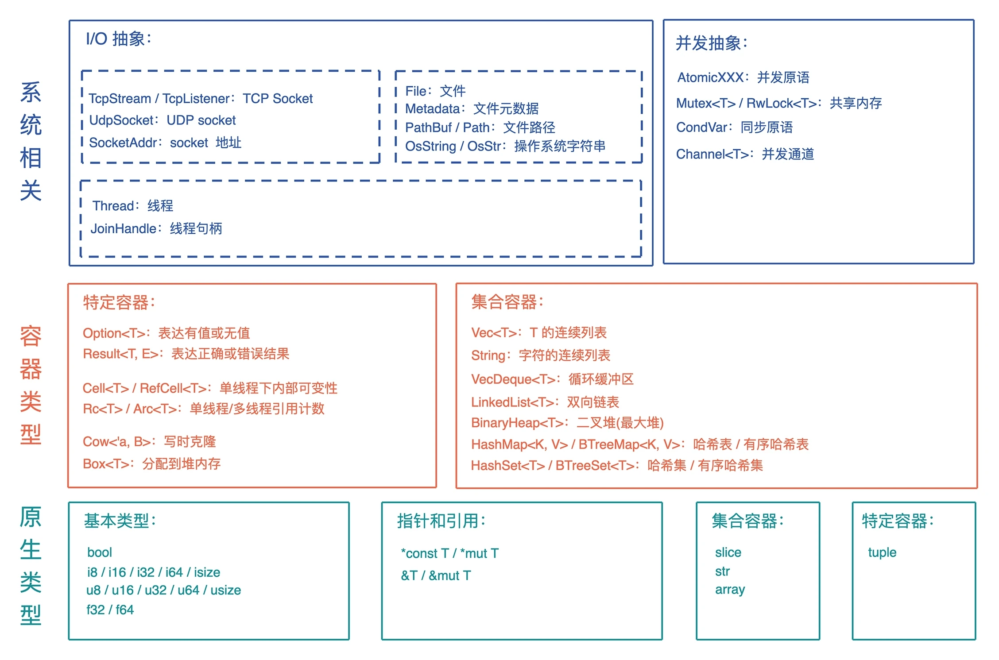

## 值放堆上还是栈上

```rust
let s = "hello world".to_string();
println!("'hello world': {:p}, s: {:p}, len: {}, capacity: {}, size: {}",
        &"hello world", &s, s.len(), s.capacity(), std::mem::size_of_val(&s));
```

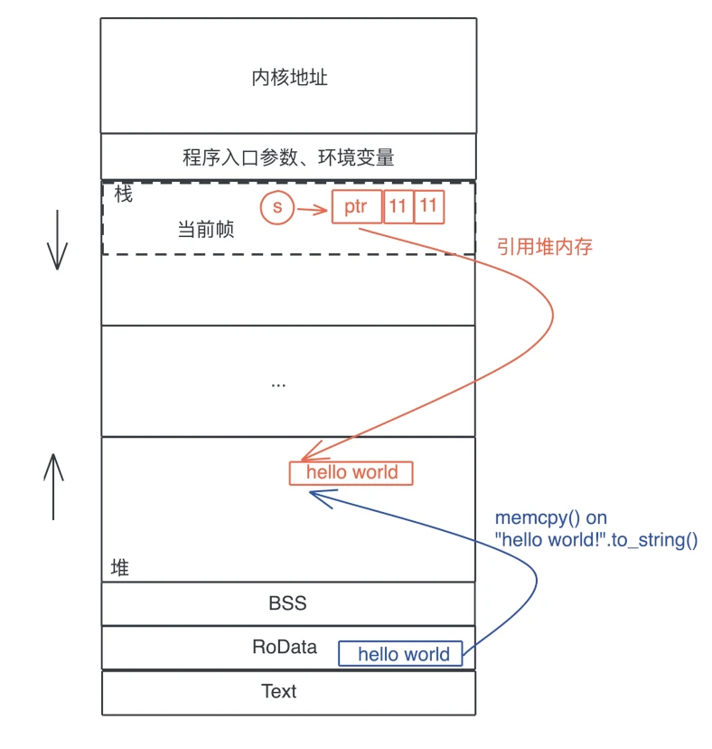

> 栈上存放的数据是静态的，固定大小，固定生命周期；堆上存放的数据是动态的，不固定大小，不固定生命周期。

```rust
static MAX: u32 = 0;
fn foo() {}
let hello = "hello world".to_string();
let data = Box::new(1);

// string literals 指向 RODATA 地址
println!("RODATA: {:p}", "hello world!");
// static 变量在 DATA section
println!("DATA (static var): {:p}", &MAX);
// function 在 TEXT
println!("TEXT (function): {:p}", foo as *const ());
// String 结构体分配在栈上，所以其引用指向一个栈地址
println!("STACK (&hello): {:p}", &hello);
// 需要通过解引用获取其堆上数据，然后取其引用
println!("HEAP (&*hello): {:p}", &*hello);
// Box 实现了 Pointer trait 无需额外解引用
println!("HEAP (box impl Pointer) {:p} {:p}", data, &*data);
```

## move, copy, borrow

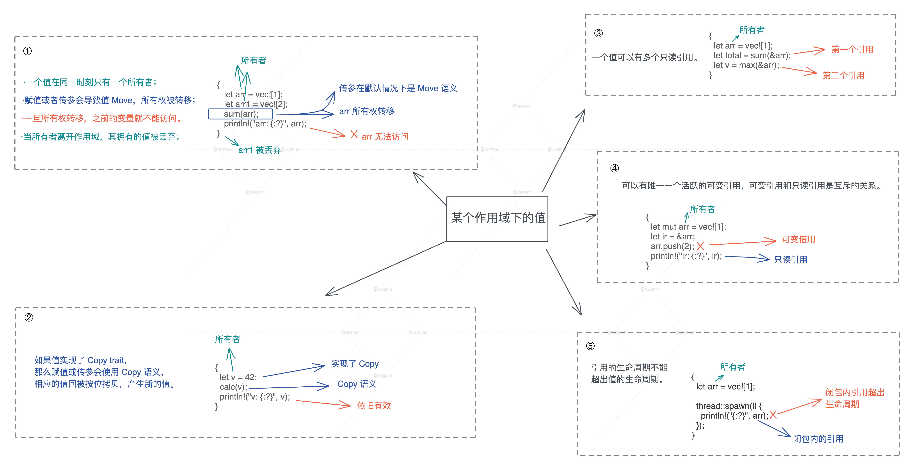

其实 Copy 和 Move 在内部实现上，都是浅层的**按位**做内存复制，只不过 Copy 允许你访问之前的变量，而 Move 不允许。

### 关于内存复制上的误区

如果代码的关键路径中的每次都要复制几百 k 的数据（比如一个大数组），这是很低效的。但是，如果要复制的只是原生类型（Copy）或者栈上的胖指针（Move），不涉及堆内存的复制（即没有做深拷贝（deep copy）），那这个效率是非常高的，不必担心每次赋值或者每次传参带来的性能损失。

Rust 的集合类型会在使用过程中自动扩展。以一个 Vec 为例，当使用完堆内存当前容量后，还继续添加新的内容，就会触发堆内存的自动增长。有时候，集合类型里的数据不断进进出出，导致集合一直增长，但实际只使用了很小部分的容量，导致内存的使用效率很低，这时可以考虑使用 `shrink_to_fit` 方法来节约对内存的使用。

## 所有权

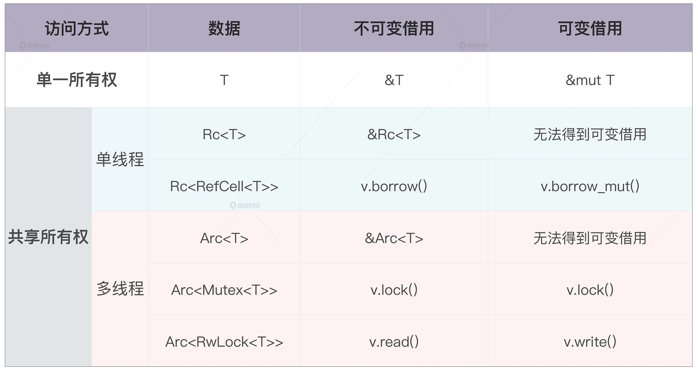

### 所有权的静态检查和动态检查

在所有权模型下，堆内存的生命周期，和创建它的栈内存的生命周期保持一致。编译器可以保证代码符合所有权规则（静态检查）。

动态检查，通过 `Box::leak()` 让堆内存拥有不受限制的生命周期，然后在运行过程中，通过对引用计数的检查，保证这样的堆内存最终会得到释放。

### 外部可变性与内部可变性

| | 使用方法 | 所有权检查 |
| --- | --- | --- |
| 外部可变性 | `let mut` 或者 `&mut` | 编译时，如果不符合规则，产生编译错误 |
| 内部可变性 | 使用 Cell/RefCell | 运行时，如果不符合规则，产生 panic |

```rust
use std::cell::RefCell;

fn main() {
    let data = RefCell::new(1);
    // 根据所有权规则，在同一个作用域下，不能同时有活跃的可变借用和不可变借用
    // 通过这对花括号，我们缩小了可变借用的生命周期
    {
        // 获得 RefCell 内部数据的可变借用
        let mut v = data.borrow_mut();
        *v += 1;
    }
    println!("data: {:?}", data.borrow());
}
```

## 生命周期

```rust
pub fn strtok<'a>(s: &mut &'a str, delimiter: char) -> &'a str {
    if let Some(i) = s.find(delimiter) {
        let prefix = &s[..i];
        // 由于 delimiter 可以是 utf8，所以我们需要获得其 utf8 长度，
        // 直接使用 len 返回的是字节长度，会有问题
        let suffix = &s[(i + delimiter.len_utf8())..];
        *s = suffix;
        prefix
    } else {
        // 如果没找到，返回整个字符串，把原字符串指针 s 指向空串
        let prefix = *s;
        *s = "";
        prefix
    }
}

fn main() {
    let s = String::from("hello world");
    let mut s1 = s.as_str();
    let hello = strtok(&mut s1, ' ');
    println!("hello is: {}, s1: {}, s: {}", hello, s1, s);
}
```

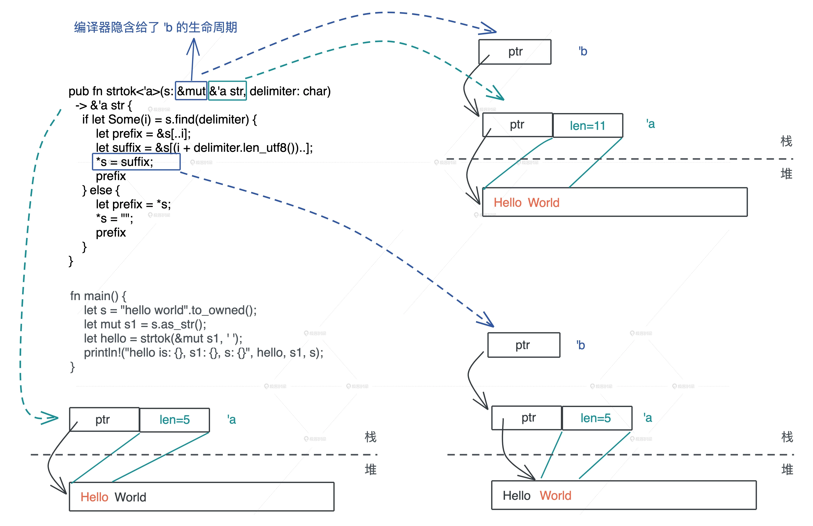

> 注意：当你要返回在函数执行过程中，创建的或者得到的数据，和参数无关，那么无论它是一个有所有权的数据，还是一个引用，你只能返回带所有权的数据。对于引用，这就意味着调用 `clone()` 或者 `to_owned()` 来从引用中得到所有权。

## 结构体成员自动重排

```rust
use std::mem::{align_of, size_of};

struct S1 {
    a: u8,
    b: u16,
    c: u8,
}

struct S2 {
    a: u8,
    c: u8,
    b: u16,
}

#[repr(C)]
struct S3 {
    a: u8,
    b: u16,
    c: u8,
}

fn main() {
    println!(
        "sizeof S1: {}, S2: {}, S3: {}",
        size_of::<S1>(),
        size_of::<S2>(),
        size_of::<S3>()
    );
    println!(
        "alignof S1: {}, S2: {}, S3: {}",
        align_of::<S1>(),
        align_of::<S2>(),
        align_of::<S3>()
    );
}
```

Rust 编译器默会优化结构体的排列，但我们也可以使用 `#[repr]` 宏，强制让 Rust 编译器不做优化，和 C 的行为一致，这样，Rust 代码可以方便地和 C 代码无缝交互。

## enum 的内存布局

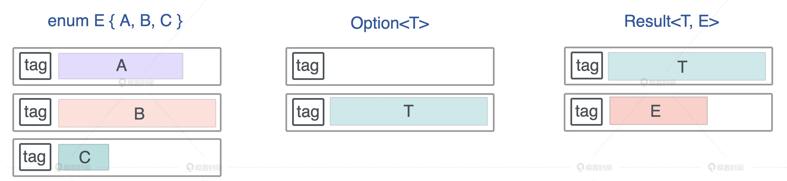

enum 是一个标签联合体（tagged union），它的大小是标签的大小，加上最大类型的长度。所以对于 `Option<u8>`，其长度是 1 + 1 = 2 字节，而 `Option<f64>`，长度是 8 + 8 =16 字节。

```rust
use std::collections::HashMap;
use std::mem::size_of;

enum MyEnum {
    A(f64),
    B(HashMap<String, String>),
    C(Result<Vec<u8>, String>),
}

// 这是一个声明宏，它会打印各种数据结构本身的大小，在 Option 中的大小，以及在 Result 中的大小
macro_rules! show_size {
    (header) => {
        println!(
            "{:<24} {:>4}    {}    {}",
            "Type", "T", "Option<T>", "Result<T, io::Error>"
        );
        println!("{}", "-".repeat(64));
    };
    ($t:ty) => {
        println!(
            "{:<24} {:4} {:8} {:12}",
            stringify!($t),
            size_of::<$t>(),
            size_of::<Option<$t>>(),
            size_of::<Result<$t, std::io::Error>>(),
        )
    };
}

fn main() {
    show_size!(header);
    show_size!(u8);
    show_size!(f64);
    show_size!(&u8);
    show_size!(Box<u8>);
    show_size!(&[u8]);

    show_size!(String);
    show_size!(Vec<u8>);
    show_size!(HashMap<String, String>);
    show_size!(MyEnum);
}
```

但是 Rust 编译器会对 enum 做一些额外的优化，让某些常用结构的内存布局更紧凑。Option 配合带有引用类型的数据结构，比如 &u8、Box、Vec、HashMap ，没有额外占用空间。引用类型的第一个域是个指针，而指针是不可能等于 0 的，通过复用这个指针：当其为 0 时，表示 None，否则是 Some，减少了内存占用。

## 线程安全的全局变量 (lazy_static)

```rust
use lazy_static::lazy_static;
use std::collections::HashMap;
use std::sync::{Arc, Mutex};

lazy_static! {
    static ref HASHMAP: Arc<Mutex<HashMap<u32, &'static str>>> = {
        let mut m = HashMap::new();
        m.insert(0, "foo");
        m.insert(1, "bar");
        m.insert(2, "baz");
        Arc::new(Mutex::new(m))
    };
}

fn main() {
    let mut map = HASHMAP.lock().unwrap();
    map.insert(3, "waz");

    println!("map: {:?}", map);
}
```

## 带关联类型的 trait

```rust
use std::str::FromStr;

use lazy_static::lazy_static;
use regex::Regex;

pub trait ParseFromStr {
    type Error;
    fn parse_from_str(s: &str) -> Result<Self, Self::Error>
    where
        Self: Sized;
}

impl<T> ParseFromStr for T
where
    T: FromStr,
{
    // 定义关联类型 Error 为 String
    type Error = String;

    fn parse_from_str(s: &str) -> Result<Self, Self::Error> {
        // ensure that regular expressions are compiled exactly once.
        lazy_static! {
            static ref RE: Regex = Regex::new(r"^\d+(\.\d+)?").unwrap();
        };
        if let Some(captures) = RE.captures(s) {
            captures
                .get(0)
                .map_or(Err("failed to capture".to_string()), |s| {
                    s.as_str()
                        .parse()
                        .map_err(|_e| "failed to parse captured string".to_string())
                })
        } else {
            Err("failed to parse string".to_string())
        }
    }
}

fn main() {
    println!("result: {}", u8::parse_from_str("255 hello").unwrap());
    println!("result: {}", u8::parse_from_str("001 world").unwrap());
    println!("result: {}", u8::parse_from_str("!").unwrap_or_default());
    println!("result: {}", f64::parse_from_str("123.45abc").unwrap());
}
```

## trait object 的实现机制

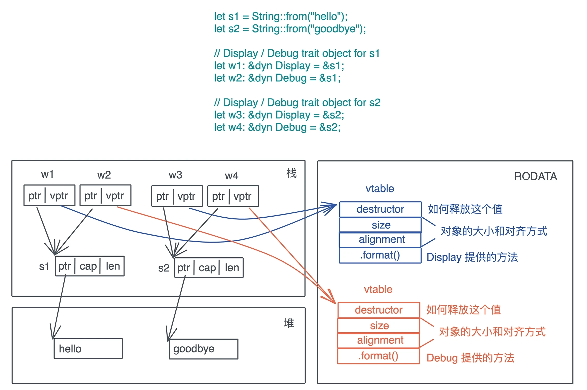

trait object 的底层逻辑就是旁指针，其中一个指针指向数据本身，另一个则指向虚函数表（vtable）。vtable 是一张静态的表，Rust 在编译时会为使用了 trait object 的类型的 trait 实现生成一张表，放在可执行文件中（一般在text或rodata段）。

如果 trait **所有**的方法，返回值是 Self 或者携带泛型参数，那么这个 trait 就不能产生 trait object。trait object 在产生时，原来的类型会被抹去，所以 Self 究竟是谁不知道。Rust 里带泛型的类型在编译时会做**单态化**，而 trait object 是运行时的产物，两者不能兼容。**如果一个 trait 只有部分方法返回 Self 或者携带泛型参数，那么这部分方法在 trait object 中不能被调用**。

## 常用 trait 介绍

### Clone

Clone 是深度拷贝，栈内存和堆内存一起拷贝。

```rust
pub trait Clone {
    // 在 clone 一个数据时只需要有已有数据的只读引用
    fn clone(&self) -> Self;

    fn clone_from(&mut self, source: &Self) {
        *self = source.clone()
    }
}
```

### Copy

Copy trait 没有任何额外的方法，它只是一个标记 trait，可以用作 trait bound 来进行类型安全检查。

```rust
// 如果要实现 Copy trait 的话，必须实现 Clone trait。
pub trait Copy: Clone {}
```

### Drop

```rust
pub trait Drop {
    fn drop(&mut self);
}
```

大部分场景无需为数据结构提供 Drop trait，系统默认会依次对数据结构的每个域做 drop。但有两种情况需要手动实现 Drop:

1. 希望在数据结束生命周期的时候做一些事情，比如记录日志
2. 需要对资源进行回收，比如锁资源的释放

**Copy trait 和 Drop trait 是互斥的，两者不能共存**。因为 Copy 是按位做浅拷贝，它拷贝的数据没有需要释放的资源，而 Drop 恰恰是为了释放额外的资源而生的。

### Sized

Sized trait 用于标记有具体大小的类型。在使用泛型参数时，Rust 编译器会自动为泛型参数加上 Sized 约束。如果开发者显式定义了T: ?Sized，那么 T 就可以是任意大小。

### Send / Sync 用于并发安全

```rust
pub unsafe auto trait Send {}
pub unsafe auto trait Sync {}
```

这里的 `auto` 意味着编译器会在合适的场合，自动为数据结构添加它们的实现。

如果一个类型 T 实现了 Send trait,意味着 T 可以安全地从一个线程移动到另一个线程，即所有权可以在线程间移动。
如果一个类型 T 实现了 Sync trait,意味着 &T 可以安全地在多个线程间共享。

对于 Send/Sync 在线程安全中的作用：如果一个类型 `T: Send`，那么 T 在某个线程中的**独占访问**是线程安全的；如果一个类型 `T: Sync`，那么 T 在线程间的**只读共享**是安全的。

引用计数 `Rc<T>` 不支持 Send 也不支持 Sync。所以 `Rc<T>` 无法跨线程。
`RefCell<T>` 实现了 Send，所以可以在线程间转移所有权。但没有实现 Sync，因此无法跨线程使用 `Arc<RefCell<T>>` 这样的数据（因为 Arc 内部的数据是共享的，需要支持 Sync 的数据结构）。

### From\<T\> / Into\<T\> 用于从值到值的转换

```rust
pub trait From<T> {
    fn from(t: T) -> Self;
}

pub trait Into<T> {
    fn into(self) -> T;
}

// 实现 From 会自动实现 Into
impl<T, U> Into<U> for T where U: From<T> {
    fn into(self) -> U {
        U::from(self)
    }
}

// From（以及 Into）是自反的：把类型 T 的值转换成类型 T,会直接返回
impl<T> From<T> for T {
    fn from(t: T) -> T {
        t
    }
}
```

有了这两个 trait,函数的接口就可以变得灵活，比如函数如果接受一个 IpAddr 为参数，那就可以使用 `Into<IpAddr>` 让更多的类型可以被这个函数使用。

```rust
use std::net::{IpAddr, Ipv4Addr, Ipv6Addr};

fn print(v: impl Into<IpAddr>) {
    println!("{:?}", v.into());
}

fn main() {
    let v4: Ipv4Addr = "2.2.2.2".parse().unwrap();
    let v6: Ipv6Addr = "::1".parse().unwrap();

    // IPAddr 实现了 From<[u8; 4]，转换 IPv4 地址
    print([1, 1, 1, 1]);
    // IPAddr 实现了 From<[u16; 8]，转换 IPv6 地址
    print([0xfe80, 0, 0, 0, 0xaede, 0x48ff, 0xfe00, 0x1122]);
    // IPAddr 实现了 From<Ipv4Addr>
    print(v4);
    // IPAddr 实现了 From<Ipv6Addr>
    print(v6);
}
```

如果数据类型在转换过程中有可能出现错误，就需要使用 TryFrom\<T\> 和 TryInto\<T\>。

### AsRef\<T\> / AsMut\<T\> 用于从引用到引用的转换

```rust
// T 使用大小可变的类型，如 str、[u8] 等
pub trait AsRef<T> where T: ?Sized {
    fn as_ref(&self) -> &T;
}

pub trait AsMut<T> where T: ?Sized {
    fn as_mut(&mut self) -> &mut T;
}
```

标准库中打开文件的接口 `std::fs::File::open`

```rust
pub fn open<P: AsRef<Path>>(path: P) -> io::Result<File>
```

意味着我们可以为这个参数传入 String、&str、PathBuf、Path 等类型，当使用 `path.as_ref()` 时，就能得到一个 `&Path`。

### Deref / DerefMut

Rust 为所有的运算符都提供了 trait，我们可以给自定义类型重载某些操作符。

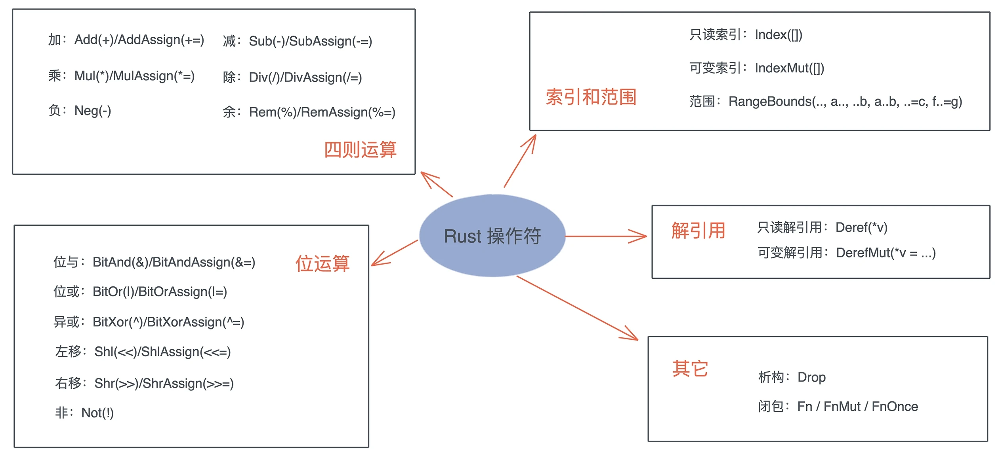

```rust
pub trait Deref {
    // 解引用出来的结果类型
    type Target: ?Sized;
    fn deref(&self) -> &Self::Target;
}

// DerefMut “继承”了 Deref
pub trait DerefMut: Deref {
    fn deref_mut(&mut self) -> &mut Self::Target;
}
```

**Deref 和 DerefMut 是自动调用的，`*b` 会被展开为 `*(b.deref())`**。

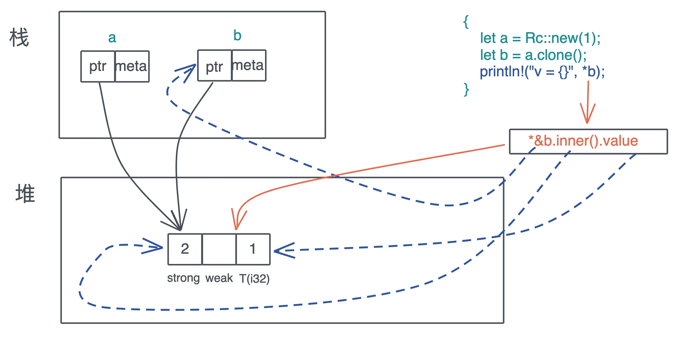

### Debug / Display

```rust
pub trait Debug {
    fn fmt(&self, f: &mut Formatter<'_>) -> Result<(), Error>;
}

pub trait Display {
    fn fmt(&self, f: &mut Formatter<'_>) -> Result<(), Error>;
}
```

Debug 是为开发者调试打印数据结构所设计的，而 Display 是给用户显示数据结构所设计的。Debug trait 的实现可以通过派生宏直接生成，而 **Display 必须手工实现**。在使用的时候，Debug 用 {:?} 来打印，Display 用 {} 打印。

### Default 为类型提供缺省值

```rust
pub trait Default {
    fn default() -> Self;
}
```

可以通过 derive 宏 #[derive(Default)] 来生成实现，前提是类型中的每个字段都实现了 Default trait。注意，enum 不能通过 derive 宏来实现 Default，因为 enum 的每个变体都可能有不同的字段，所以需要手动实现。

在初始化一个数据结构时，我们可以部分初始化，然后剩余的部分使用 `..Default::default()`。

## 智能指针

### 智能指针 vs 胖指针

智能指针一定是胖指针（比如 `String`），但是胖指针不一定是一个智能指针（比如 `&str`），因为 String 对堆上的值有所有权，而 &str 没有所有权。

### 智能指针 vs 结构体

凡是需要做资源回收的数据结构，且实现了 `Deref/DerefMut/Drop`，都是智能指针。

### Box\<T\>

#### `new` 方法

```rust

#[cfg(not(no_global_oom_handling))]
#[inline(always)]
pub fn new(x: T) -> Self {
    // box 是 Rust 的内部关键字，在编译时，会使用内存分配器来分配内存
    box x
}
```

Box::new() 是一个函数，在 debug 模式下，传入它的数据会出现在栈上，再移动到堆上，有可能会引起栈溢出。在 release 模式下，该函数调用会被**inline**优化。

#### 实现 `Drop` trait

```rust
unsafe impl<#[may_dangle] T: ?Sized, A: Allocator> Drop for Box<T, A> {
    fn drop(&mut self) {
        // Do nothing, drop is currently performed by compiler.
    }
}
```

### Cow<'a, B>

```rust
pub enum Cow<'a, B> where B: 'a + ToOwned + ?Sized {
  Borrowed(&'a B),
  Owned(<B as ToOwned>::Owned),
}
```

Cow 包裹了一个只读借用，但如果调用者需要所有权或者需要修改内容，那么它会 clone 借用的数据。这种数据结构可以减少不必要的堆内存分配，提升系统效率。

```rust
pub trait ToOwned {
    type Owned: Borrow<Self>;
    #[must_use = "cloning is often expensive and is not expected to have side effects"]
    fn to_owned(&self) -> Self::Owned;

    fn clone_into(&self, target: &mut Self::Owned) { ... }
}

// Borrow 是个泛型 trait，表明一个类型可以被借用成不同的引用
// 比如 String 可以被借用为 &String 或者 &str
pub trait Borrow<Borrowed> where Borrowed: ?Sized {
    fn borrow(&self) -> &Borrowed;
}
```

str 对 `ToOwned` trait 的实现：

```rust
impl ToOwned for str {
    type Owned = String;
    #[inline]
    fn to_owned(&self) -> String {
        unsafe { String::from_utf8_unchecked(self.as_bytes().to_owned()) }
    }

    fn clone_into(&self, target: &mut String) {
        let mut b = mem::take(target).into_bytes();
        self.as_bytes().clone_into(&mut b);
        *target = unsafe { String::from_utf8_unchecked(b) }
    }
}
```

同时 String 必须要实现 `Borrow<str>` trait，这样能符合 ToOwned 的要求。

```rust
impl Borrow<str> for String {
    #[inline]
    fn borrow(&self) -> &str {
        &self[..]
    }
}
```

给 Cow 实现 Deref

```rust
impl<B: ?Sized + ToOwned> Deref for Cow<'_, B> {
    type Target = B;

    fn deref(&self) -> &B {
        // 我们分别取其内容，生成引用
        match *self {
            Borrowed(borrowed) => borrowed, // 对于 Borrowed，直接就是取出当中的引用
            Owned(ref owned) => owned.borrow(), // 对于 Owned，调用其 borrow() 方法，获得引用
        }
    }
}
```

#### 应用案例

```rust
use std::borrow::Cow;
use url::Url;

fn main() {
    let url = Url::parse("https://tyr.com/rust?page=1024&sort=desc&extra=hello%20world").unwrap();
    let mut pairs = url.query_pairs();

    assert_eq!(pairs.count(), 3);

    let (mut k, v) = pairs.next().unwrap();
    // 因为 k, v 都是 Cow<str> 他们用起来感觉和 &str 或者 String 一样
    // 此刻，他们都是 Borrowed
    println!("key: {}, v: {}", k, v);
    // 当修改发生时，k 变成 Owned
    k.to_mut().push_str("_lala");

    print_pairs((k, v));

    print_pairs(pairs.next().unwrap());
    // 在处理 extra=hello%20world 时，value 被处理成 "hello world"
    // 所以这里 value 是 Owned
    print_pairs(pairs.next().unwrap());
}

fn print_pairs(pair: (Cow<str>, Cow<str>)) {
    println!("key: {}, value: {}", show_cow(pair.0), show_cow(pair.1));
}

fn show_cow(cow: Cow<str>) -> String {
    match cow {
        Cow::Borrowed(v) => format!("Borrowed {}", v),
        Cow::Owned(v) => format!("Owned {}", v),
    }
}
```

```rust
use serde::Deserialize;
use std::borrow::Cow;

#[derive(Debug, Deserialize)]
struct User<'input> {
    #[serde(borrow)]
    name: Cow<'input, str>,
    age: u8,
}

fn main() {
    let input = r#"{ "name": "Tyr", "age": 18 }"#;
    let user: User = serde_json::from_str(input).unwrap();

    match user.name {
        Cow::Borrowed(x) => println!("borrowed {}", x),
        Cow::Owned(x) => println!("owned {}", x),
    }
}
```

### MutexGuard\<T\>

MutexGuard 通过 Drop trait 来确保退出时释放互斥锁，这样用户在使用 Mutex 时，可以不必关心何时释放这个互斥锁。因为无论你在调用栈上怎样传递 MutexGuard ，哪怕在错误处理流程上提前退出，Rust 的所有权机制可以确保只要 MutexGuard 离开作用域，锁就会被释放。

MutexGuard 不允许 Send，只允许 Sync，也就是说，你可以把 MutexGuard 的引用传给另一个线程使用，但你无法把 MutexGuard 整个移动到另一个线程。这样可以避免因加锁和解锁在不同的线程下带来的死锁风险。

```rust
use std::borrow::Cow;
use std::collections::HashMap;
use std::sync::{Arc, Mutex};
use std::thread;
use std::time::Duration;

fn main() {
    // 用 Arc 来提供并发环境下的共享所有权（使用引用计数）
    let metrics: Arc<Mutex<HashMap<Cow<'static, str>, usize>>> =
        Arc::new(Mutex::new(HashMap::new()));
    for _ in 0..32 {
        let m = metrics.clone();
        thread::spawn(move || {
            let mut g = m.lock().unwrap();
            // 此时只有拿到 MutexGuard 的线程可以访问 HashMap
            let data = &mut *g;
            // Cow 实现了很多数据结构的 From trait，
            // 所以我们可以用 "hello".into() 生成 Cow
            let entry = data.entry("hello".into()).or_insert(0);
            *entry += 1;
            // MutexGuard 被 Drop，锁被释放
        });
    }

    thread::sleep(Duration::from_millis(100));

    println!("metrics: {:?}", metrics.lock().unwrap());
}
```

## 内存分配器

### 替换默认的内存分配器

堆上分配内存的 `Box<T>` 有一个缺省的泛型参数 `A`，需要满足 `Allocator`，并且默认是 `Global`，这个 `Global` 就是默认的内存分配器。

```rust
use jemallocator::Jemalloc;

#[global_allocator]
static GLOBAL: Jemalloc = Jemalloc;

fn main() {}
```

### 自定义内存分配器

如果想要编写一个全局分配器，可以实现 `GlobalAlloc` trait，它和 `Allocator` trait 的主要区别在于是否允许分配长度为0的内存。

```rust
use std::alloc::{GlobalAlloc, Layout, System};

struct MyAllocator;

unsafe impl GlobalAlloc for MyAllocator {
    unsafe fn alloc(&self, layout: Layout) -> *mut u8 {
        let data = System.alloc(layout);
        // 这里不能使用 println!()
        // stdout 会打印到一个由 Mutex 互斥锁保护的共享全局 buffer 中，这个过程中会涉及内存的分配
        // 分配的内存又会触发 println!()，最终造成程序崩溃
        // eprintln! 直接打印到 stderr，不会 buffer
        eprintln!("ALLOC: {:p}, size {}", data, layout.size());
        data
    }

    unsafe fn dealloc(&self, ptr: *mut u8, layout: Layout) {
        System.dealloc(ptr, layout);
        eprintln!("FREE: {:p}, size {}", ptr, layout.size());
    }
}

#[global_allocator]
static GLOBAL: MyAllocator = MyAllocator;

#[allow(dead_code)]
struct Matrix {
    // 使用不规则的数字如 505 可以让 dbg! 的打印很容易分辨出来
    data: [u8; 505],
}

impl Default for Matrix {
    fn default() -> Self {
        Self { data: [0; 505] }
    }
}

fn main() {
    // 在这句执行之前已经有好多内存分配
    let data = Box::new(Matrix::default());

    // 输出中有一个 1024 大小的内存分配，是 println! 导致的
    println!(
        "!!! allocated memory: {:p}, len: {}",
        &*data,
        std::mem::size_of::<Matrix>()
    );

    // data 在这里 drop，可以在打印中看到 FREE
    // 之后还有很多其它内存被释放
}
```

Standard Error 中输出的结果如下：

```plain
ALLOC: 0x55c63eb5b940, size 5
ALLOC: 0x55c63eb5b960, size 48
ALLOC: 0x55c63eb5b9d0, size 505
ALLOC: 0x55c63eb5b500, size 1024
FREE: 0x55c63eb5b9d0, size 505
FREE: 0x55c63eb5b500, size 1024
FREE: 0x55c63eb5b940, size 5
FREE: 0x55c63eb5b960, size 48
```

## 切片

> 当我们构建自己的数据结构时，如果它内部也有连续排列的等长的数据结构，可以考虑 AsRef 或者 Deref 到切片。

切片是描述一组属于同一类型、长度不确定的、在内存中连续存放的数据结构，用 [T] 来表述。因为长度不确定，所以切片是个 DST（Dynamically Sized Type）。在使用中主要用以下形式：

* &[T]：表示一个只读的切片引用
* &mut [T]：表示一个可写的切片引用
* Box<[T]>：一个在堆上分配的切片。

```rust
fn main() {
    let arr = [1, 2, 3, 4, 5];
    let vec = vec![1, 2, 3, 4, 5];
    let s1 = &arr[..2];
    let s2 = &vec[..2];
    println!("s1: {:?}, s2: {:?}", s1, s2);

    // &[T] 和 &[T] 是否相等取决于长度和内容是否相等
    assert_eq!(s1, s2);
    // &[T] 可以和 Vec<T>/[T;n] 比较，也会看长度和内容
    // 这是因为它们之间实现了 PartialEq trait
    assert_eq!(&arr[..], vec);
    assert_eq!(&vec[..], arr);
}
```

在使用的时候，支持切片的具体数据类型，可以根据需要，解引用转换成切片类型。比如 Vec 和 [T; n] 会转化成为 &[T]，这是因为 Vec 实现了 Deref trait，而 array 内建了到 &[T] 的解引用。这也就意味着，通过解引用，这几个和切片有关的数据结构都会获得切片的所有能力，包括：`binary_search`、`chunks`、`concat`、`contains`、`start_with`、`end_with`、`group_by`、`iter`、`join`、`sort`、`split`、`swap` 等一系列丰富的功能。

```rust
use std::fmt;
fn main() {
    let v = vec![1, 2, 3, 4];

    // Vec 实现了 Deref，&Vec<T> 会被自动解引用为 &[T]，符合接口定义
    print_slice(&v);
    // 直接是 &[T]，符合接口定义
    print_slice(&v[..]);

    // &Vec<T> 支持 AsRef<[T]>
    print_slice1(&v);
    // &[T] 支持 AsRef<[T]>
    print_slice1(&v[..]);
    // Vec<T> 也支持 AsRef<[T]>
    print_slice1(v);

    let arr = [1, 2, 3, 4];
    // 数组虽没有实现 Deref，但它的解引用就是 &[T]
    print_slice(&arr);
    print_slice(&arr[..]);
    print_slice1(&arr);
    print_slice1(&arr[..]);
    print_slice1(arr);
}

fn print_slice<T: fmt::Debug>(s: &[T]) {
    println!("{:?}", s);
}

fn print_slice1<T, U>(s: T)
where
    T: AsRef<[U]>,
    U: fmt::Debug,
{
    println!("{:?}", s.as_ref());
}
```

### 将 slice 转化成迭代器

```rust
fn main() {
    // 这里 Vec 在调用 iter() 时被解引用成 &[T]，所以可以访问 iter()
    let result: Vec<i32> = vec![1, 2, 3, 4]
        .iter()
        .map(|v| v * v)
        .filter(|v| *v < 16)
        .collect();

    println!("{:?}", result);
}
```

Rust 下的迭代器是个`懒接口（lazy interface）`，也就是说这段代码直到运行到 `collect` 时才真正开始执行，之前的部分不过是在不断地生成新的结构，来累积处理逻辑而已。Rust 大量使用了 inline 等优化技巧，使得迭代器的性能和 C 语言的 for 循环差别不大。

此外，`itertools` crate 还提供了额外的，标准库中没有提供的迭代器。

```rust
use itertools::Itertools;

fn main() {
    let err_str = "bad happened";
    let input = vec![Ok(21), Err(err_str), Ok(7)];
    let it = input
        .into_iter()
        // 对成功的结果进一步做 filter/map 操作
        .filter_map_ok(|i| if i > 10 { Some(i * 2) } else { None });
    // 结果应该是：vec![Ok(42), Err(err_str)]
    println!("{:?}", it.collect::<Vec<_>>());
}
```

### 特殊的切片 &str

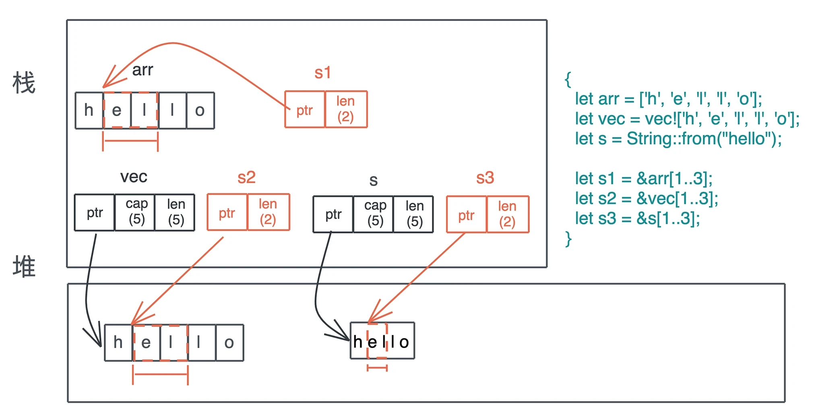

```rust
use std::iter::FromIterator;

fn main() {
    let arr = ['h', 'e', 'l', 'l', 'o'];
    let vec = vec!['h', 'e', 'l', 'l', 'o'];
    let s = String::from("hello");
    let s1 = &arr[1..3];
    let s2 = &vec[1..3];
    // &str 本身就是一个特殊的 slice
    let s3 = &s[1..3];
    println!("s1: {:?}, s2: {:?}, s3: {:?}", s1, s2, s3);

    // &[char] 和 &[char] 是否相等取决于长度和内容是否相等
    assert_eq!(s1, s2);
    // &[char] 和 &str 不能直接对比，我们把 s3 变成 Vec<char>
    assert_eq!(s2, s3.chars().collect::<Vec<_>>());
    // &[char] 可以通过迭代器转换成 String，String 和 &str 可以直接对比
    assert_eq!(String::from_iter(s2), s3);
}
```

字符列表可以通过迭代器转换成 String，String 也可以通过 chars() 函数转换成字符列表，如果不转换，二者不能比较。

### Box<[T]> 堆上的切片

`Box<[T]>` 和切片的引用 `&[T]` 很类似：它们都是在栈上有一个包含长度的胖指针，指向存储数据的内存位置。区别是：`Box<[T]>` 只会指向堆，`&[T]` 指向的位置可以是栈也可以是堆；此外，`Box<[T]>` 对数据具有所有权，而 `&[T]` 只是一个借用。

`Box<[T]>` 和 `Vec<T>` 有一点点差别：`Vec<T>` 有额外的 capacity，可以增长；而 `Box<[T]>` 一旦生成就固定下来，没有 capacity，也无法增长。

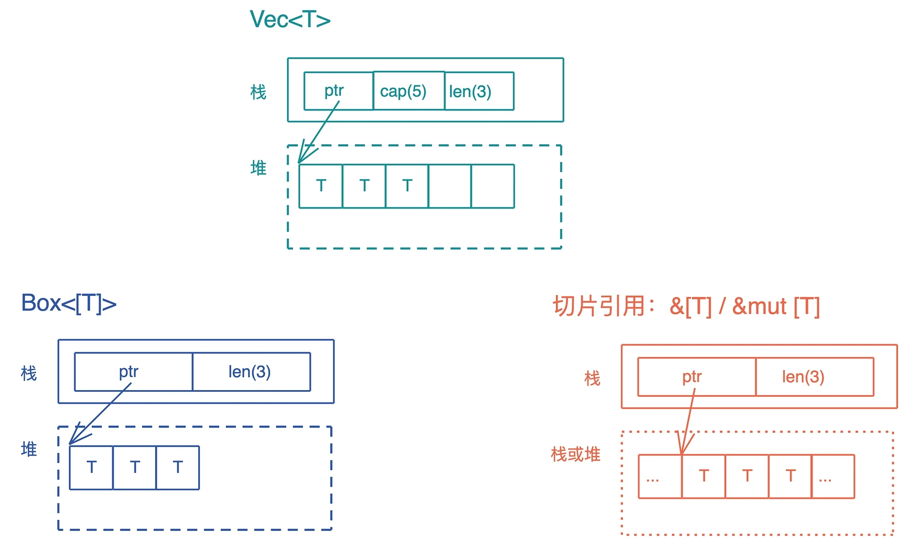

```rust
use std::ops::Deref;

fn main() {
    let mut v1 = vec![1, 2, 3, 4];
    v1.push(5);
    println!("cap should be 8: {}", v1.capacity());

    // 从 Vec<T> 转换成 Box<[T]>，此时会丢弃多余的 capacity
    let b1 = v1.into_boxed_slice();
    let mut b2 = b1.clone();

    let v2 = b1.into_vec();
    println!("cap should be exactly 5: {}", v2.capacity());

    assert!(b2.deref() == v2);

    // Box<[T]> 可以更改其内部数据，但无法 push
    b2[0] = 2;
    // b2.push(6);
    println!("b2: {:?}", b2);

    // 注意 Box<[T]> 和 Box<[T; n]> 并不相同
    let b3 = Box::new([2, 2, 3, 4, 5]);
    println!("b3: {:?}", b3);

    // b2 和 b3 相等，但 b3.deref() 和 v2 无法比较
    assert!(b2 == b3);
    // assert!(b3.deref() == v2);
}
```

`Vec<T>` 可以通过 i`nto_boxed_slice()` 转换成 `Box<[T]>`，`Box<[T]>` 也可以通过 `into_vec()` 转换回 `Vec<T>`。

`Box<[T]>` 有一个很好的特性是，不像 `Box<[T;n]>` 那样在编译时就要确定大小，它可以在运行期生成，以后大小不会再改变。

## 错误处理

### `?` 操作符

? 操作符内部被展开成类似这样的代码：

```rust
match result {
    Ok(v) => v,
    Err(e) => return Err(e.into())
}
```

### 函数式错误处理


### cache_unwind

Rust 标准库提供了`catch_unwind()`函数，能够像异常处理那样将调用栈回溯到 catch_unwind 这一刻，作用和其它语言的 try {…} catch {…} 一样。

```rust
use std::panic;

fn main() {
    let result = panic::catch_unwind(|| {
        println!("hello!");
    });
    assert!(result.is_ok());
    let result = panic::catch_unwind(|| {
        panic!("oh no!");
    });
    assert!(result.is_err());
    println!("panic captured: {:#?}", result);
}
```

### `Error` trait

为了规范代表错误的数据类型的行为，Rust 定义了 Error trait：

```rust
pub trait Error: Debug + Display {
    fn source(&self) -> Option<&(dyn Error + 'static)> { ... }
    fn backtrace(&self) -> Option<&Backtrace> { ... }
    fn description(&self) -> &str { ... }
    fn cause(&self) -> Option<&dyn Error> { ... }
}
```

[thiserror](https://github.com/dtolnay/thiserror) 可以帮助简化错误类型的定义。

```rust
use thiserror::Error;
#[derive(Error, Debug)]
#[non_exhaustive]
pub enum DataStoreError {
    #[error("data store disconnected")]
    Disconnect(#[from] io::Error),
    #[error("the data for key `{0}` is not available")]
    Redaction(String),
    #[error("invalid header (expected {expected:?}, found {found:?})")]
    InvalidHeader {
        expected: String,
        found: String,
    },
    #[error("unknown data store error")]
    Unknown,
}
```

[anyhow](https://github.com/dtolnay/anyhow) 实现了 `anyhow::Error` 和任意符合 Error trait 的错误类型之间的转换，让你可以使用 `?` 操作符，不必再手工转换错误类型。

## 闭包

闭包是一种匿名类型，一旦声明，就会产生一个新的类型，但这个类型无法被其它地方使用。这个类型就像一个结构体，会包含所有捕获的变量。闭包是存储在**栈**上，并且除了捕获的数据外，闭包本身不包含任何额外函数指针指向闭包的代码。

```rust
use std::{collections::HashMap, mem::size_of_val};

// 长度为 0
let c1 = || println!("hello world!");
// 和参数无关，长度也为 0
let c2 = |i: i32| println!("hello: {}", i);
let name = String::from("tyr");
let name1 = name.clone();
let mut table = HashMap::new();
table.insert("hello", "world");
// 如果捕获一个引用，长度为 8
let c3 = || println!("hello: {}", name);
// 捕获移动的数据 name1(长度 24) + table(长度 48)，因此 closure 长度 72
let c4 = move || println!("hello: {}, {:?}", name1, table);
let name2 = name.clone();
// 和局部变量无关，捕获了一个 String name2，因此 closure 长度 24
let c5 = move || {
    let x = 1;
    let name3 = String::from("lindsey");
    println!("hello: {}, {:?}, {:?}", x, name2, name3);
};

println!(
    "c1: {}, c2: {}, c3: {}, c4: {}, c5: {}, main: {}",
    size_of_val(&c1),
    size_of_val(&c2),
    size_of_val(&c3),
    size_of_val(&c4),
    size_of_val(&c5),
    size_of_val(&main),
);
```

**不带 move 时，闭包捕获的是对应自由变量的引用；带 move 时，对应自由变量的所有权会被移动到闭包结构中**。

### 闭包的类型


```rust
pub trait FnOnce<Args> {
    type Output;
    // 会转移 self 的所有权到 call_once 函数中
    extern "rust-call" fn call_once(self, args: Args) -> Self::Output;
}
```

```rust
// 一个 FnMut 闭包，可以被传给一个需要 FnOnce 的上下文，此时调用闭包相当于调用了 call_once()
pub trait FnMut<Args>: FnOnce<Args> {
    extern "rust-call" fn call_mut(
        &mut self,
        args: Args
    ) -> Self::Output;
}
```

```rust
// 任何需要 FnOnce 或者 FnMut 的场合，都可以传入满足 Fn 的闭包
pub trait Fn<Args>: FnMut<Args> {
    extern "rust-call" fn call(&self, args: Args) -> Self::Output;
}
```

### 将闭包作为参数传递

```rust
fn main() {
    let v = vec![0u8; 1024];
    let v1 = vec![0u8; 1023];

    // Fn，不移动所有权
    let mut c = |x: u64| v.len() as u64 * x;
    // Fn，移动所有权
    let mut c1 = move |x: u64| v1.len() as u64 * x;

    println!("direct call: {}", c(2));
    println!("direct call: {}", c1(2));

    println!("call: {}", call(3, &c));
    println!("call: {}", call(3, &c1));

    println!("call_mut: {}", call_mut(4, &mut c));
    println!("call_mut: {}", call_mut(4, &mut c1));

    println!("call_once: {}", call_once(5, c));
    println!("call_once: {}", call_once(5, c1));
}

fn call(arg: u64, c: &impl Fn(u64) -> u64) -> u64 {
    c(arg)
}

fn call_mut(arg: u64, c: &mut impl FnMut(u64) -> u64) -> u64 {
    c(arg)
}

fn call_once(arg: u64, c: impl FnOnce(u64) -> u64) -> u64 {
    c(arg)
}
```

### 返回闭包

```rust
use std::ops::Mul;

fn main() {
    let c1 = curry(5);
    println!("5 multiply 2 is: {}", c1(2));

    let adder2 = curry(3.14);
    println!("pi multiply 4^2 is: {}", adder2(4. * 4.));
}

fn curry<T>(x: T) -> impl Fn(T) -> T
where
    T: Mul<Output = T> + Copy,
{
    move |y| x * y
}
```

### 给闭包实现其他 trait

有些接口既可以传入一个结构体，又可以传入一个函数或者闭包。

```rust
pub trait Executor {
    fn execute(&self, cmd: &str) -> Result<String, &'static str>;
}

struct BashExecutor {
    env: String,
}

impl Executor for BashExecutor {
    fn execute(&self, cmd: &str) -> Result<String, &'static str> {
        Ok(format!(
            "fake bash execute: env: {}, cmd: {}",
            self.env, cmd
        ))
    }
}

impl<T> Executor for T
where
    T: Fn(&str) -> Result<String, &'static str>,
{
    fn execute(&self, cmd: &str) -> Result<String, &'static str> {
        self(cmd)
    }
}

fn main() {
    let env = "PATH=/usr/bin".to_string();

    let cmd = "cat /etc/passwd";
    let r1 = execute(cmd, BashExecutor { env: env.clone() });
    println!("{:?}", r1);

    let r2 = execute(cmd, |cmd: &str| {
        Ok(format!("fake fish execute: env: {}, cmd: {}", env, cmd))
    });
    println!("{:?}", r2);
}

fn execute(cmd: &str, exec: impl Executor) -> Result<String, &'static str> {
    exec.execute(cmd)
}
```

## 参考资料

* [cheats.rs](https://cheats.rs/)
