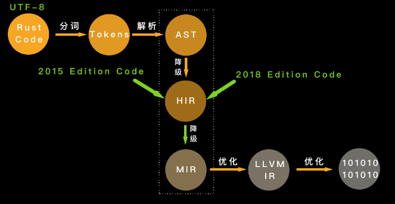

# Rust 知识碎片

## 编译过程



1. 分词：把词法结构处理成词条流
2. 词条流经过语法解析形成抽象语法树
3. 抽象语法树简化成高级中间语言 (HIR)，编译器对 HIR 进行类型检查、方法查找等工作
4. HIR 进一步简化形成中级中间语言 (MIR)，编译器对 MIR 进行借用检查、优化等工作，在 MIR 中已经看不到 Rust 各版次的差异了
5. 产生 LLVM 中间语言
6. LLVM 后端会对 LLVM 中间语言进行优化，最终生成机器代码

## 值放堆上还是栈上

```rust
let s = "hello world".to_string();
println!("'hello world': {:p}, s: {:p}, len: {}, capacity: {}, size: {}",
        &"hello world", &s, s.len(), s.capacity(), std::mem::size_of_val(&s));
```


> 栈上存放的数据是静态的，固定大小，固定生命周期；堆上存放的数据是动态的，不固定大小，不固定生命周期。

```rust
static MAX: u32 = 0;
fn foo() {}
let hello = "hello world".to_string();
let data = Box::new(1);

// string literals 指向 RODATA 地址
println!("RODATA: {:p}", "hello world!");
// static 变量在 DATA section
println!("DATA (static var): {:p}", &MAX);
// function 在 TEXT
println!("TEXT (function): {:p}", foo as *const ());
// String 结构体分配在栈上，所以其引用指向一个栈地址
println!("STACK (&hello): {:p}", &hello);
// 需要通过解引用获取其堆上数据，然后取其引用
println!("HEAP (&*hello): {:p}", &*hello);
// Box 实现了 Pointer trait 无需额外解引用
println!("HEAP (box impl Pointer) {:p} {:p}", data, &*data);
```

## move, copy, borrow


其实 Copy 和 Move 在内部实现上，都是浅层的**按位**做内存复制，只不过 Copy 允许你访问之前的变量，而 Move 不允许。

### 关于内存复制上的误区

如果代码的关键路径中的每次都要复制几百 k 的数据（比如一个大数组），这是很低效的。但是，如果要复制的只是原生类型（Copy）或者栈上的胖指针（Move），不涉及堆内存的复制（即没有做深拷贝（deep copy）），那这个效率是非常高的，不必担心每次赋值或者每次传参带来的性能损失。

Rust 的集合类型会在使用过程中自动扩展。以一个 Vec 为例，当使用完堆内存当前容量后，还继续添加新的内容，就会触发堆内存的自动增长。有时候，集合类型里的数据不断进进出出，导致集合一直增长，但实际只使用了很小部分的容量，导致内存的使用效率很低，这时可以考虑使用 `shrink_to_fit` 方法来节约对内存的使用。

## 所有权


### 所有权的静态检查和动态检查

在所有权模型下，堆内存的生命周期，和创建它的栈内存的生命周期保持一致。编译器可以保证代码符合所有权规则（静态检查）。

动态检查，通过 `Box::leak()` 让堆内存拥有不受限制的生命周期，然后在运行过程中，通过对引用计数的检查，保证这样的堆内存最终会得到释放。

### 外部可变性与内部可变性

| | 使用方法 | 所有权检查 |
| --- | --- | --- |
| 外部可变性 | `let mut` 或者 `&mut` | 编译时，如果不符合规则，产生编译错误 |
| 内部可变性 | 使用 Cell/RefCell | 运行时，如果不符合规则，产生 panic |

```rust
use std::cell::RefCell;

fn main() {
    let data = RefCell::new(1);
    // 根据所有权规则，在同一个作用域下，不能同时有活跃的可变借用和不可变借用
    // 通过这对花括号，我们缩小了可变借用的生命周期
    {
        // 获得 RefCell 内部数据的可变借用
        let mut v = data.borrow_mut();
        *v += 1;
    }
    println!("data: {:?}", data.borrow());
}
```

## 生命周期

```rust
pub fn strtok<'a>(s: &mut &'a str, delimiter: char) -> &'a str {
    if let Some(i) = s.find(delimiter) {
        let prefix = &s[..i];
        // 由于 delimiter 可以是 utf8，所以我们需要获得其 utf8 长度，
        // 直接使用 len 返回的是字节长度，会有问题
        let suffix = &s[(i + delimiter.len_utf8())..];
        *s = suffix;
        prefix
    } else {
        // 如果没找到，返回整个字符串，把原字符串指针 s 指向空串
        let prefix = *s;
        *s = "";
        prefix
    }
}

fn main() {
    let s = String::from("hello world");
    let mut s1 = s.as_str();
    let hello = strtok(&mut s1, ' ');
    println!("hello is: {}, s1: {}, s: {}", hello, s1, s);
}
```


> 注意：当你要返回在函数执行过程中，创建的或者得到的数据，和参数无关，那么无论它是一个有所有权的数据，还是一个引用，你只能返回带所有权的数据。对于引用，这就意味着调用 `clone()` 或者 `to_owned()` 来从引用中得到所有权。

## 结构体成员自动重排

```rust
use std::mem::{align_of, size_of};

struct S1 {
    a: u8,
    b: u16,
    c: u8,
}

struct S2 {
    a: u8,
    c: u8,
    b: u16,
}

#[repr(C)]
struct S3 {
    a: u8,
    b: u16,
    c: u8,
}

fn main() {
    println!(
        "sizeof S1: {}, S2: {}, S3: {}",
        size_of::<S1>(),
        size_of::<S2>(),
        size_of::<S3>()
    );
    println!(
        "alignof S1: {}, S2: {}, S3: {}",
        align_of::<S1>(),
        align_of::<S2>(),
        align_of::<S3>()
    );
}
```

Rust 编译器默会优化结构体的排列，但我们也可以使用 `#[repr]` 宏，强制让 Rust 编译器不做优化，和 C 的行为一致，这样，Rust 代码可以方便地和 C 代码无缝交互。

## enum 的内存布局


enum 是一个标签联合体（tagged union），它的大小是标签的大小，加上最大类型的长度。所以对于 `Option<u8>`，其长度是 1 + 1 = 2 字节，而 `Option<f64>`，长度是 8 + 8 =16 字节。

```rust
use std::collections::HashMap;
use std::mem::size_of;

enum MyEnum {
    A(f64),
    B(HashMap<String, String>),
    C(Result<Vec<u8>, String>),
}

// 这是一个声明宏，它会打印各种数据结构本身的大小，在 Option 中的大小，以及在 Result 中的大小
macro_rules! show_size {
    (header) => {
        println!(
            "{:<24} {:>4}    {}    {}",
            "Type", "T", "Option<T>", "Result<T, io::Error>"
        );
        println!("{}", "-".repeat(64));
    };
    ($t:ty) => {
        println!(
            "{:<24} {:4} {:8} {:12}",
            stringify!($t),
            size_of::<$t>(),
            size_of::<Option<$t>>(),
            size_of::<Result<$t, std::io::Error>>(),
        )
    };
}

fn main() {
    show_size!(header);
    show_size!(u8);
    show_size!(f64);
    show_size!(&u8);
    show_size!(Box<u8>);
    show_size!(&[u8]);

    show_size!(String);
    show_size!(Vec<u8>);
    show_size!(HashMap<String, String>);
    show_size!(MyEnum);
}
```

但是 Rust 编译器会对 enum 做一些额外的优化，让某些常用结构的内存布局更紧凑。Option 配合带有引用类型的数据结构，比如 &u8、Box、Vec、HashMap ，没有额外占用空间。引用类型的第一个域是个指针，而指针是不可能等于 0 的，通过复用这个指针：当其为 0 时，表示 None，否则是 Some，减少了内存占用。

## 线程安全的全局变量 (lazy_static)

```rust
use lazy_static::lazy_static;
use std::collections::HashMap;
use std::sync::{Arc, Mutex};

lazy_static! {
    static ref HASHMAP: Arc<Mutex<HashMap<u32, &'static str>>> = {
        let mut m = HashMap::new();
        m.insert(0, "foo");
        m.insert(1, "bar");
        m.insert(2, "baz");
        Arc::new(Mutex::new(m))
    };
}

fn main() {
    let mut map = HASHMAP.lock().unwrap();
    map.insert(3, "waz");

    println!("map: {:?}", map);
}
```

## 带关联类型的 trait

```rust
use std::str::FromStr;

use lazy_static::lazy_static;
use regex::Regex;

pub trait ParseFromStr {
    type Error;
    fn parse_from_str(s: &str) -> Result<Self, Self::Error>
    where
        Self: Sized;
}

impl<T> ParseFromStr for T
where
    T: FromStr,
{
    // 定义关联类型 Error 为 String
    type Error = String;

    fn parse_from_str(s: &str) -> Result<Self, Self::Error> {
        // ensure that regular expressions are compiled exactly once.
        lazy_static! {
            static ref RE: Regex = Regex::new(r"^\d+(\.\d+)?").unwrap();
        };
        if let Some(captures) = RE.captures(s) {
            captures
                .get(0)
                .map_or(Err("failed to capture".to_string()), |s| {
                    s.as_str()
                        .parse()
                        .map_err(|_e| "failed to parse captured string".to_string())
                })
        } else {
            Err("failed to parse string".to_string())
        }
    }
}

fn main() {
    println!("result: {}", u8::parse_from_str("255 hello").unwrap());
    println!("result: {}", u8::parse_from_str("001 world").unwrap());
    println!("result: {}", u8::parse_from_str("!").unwrap_or_default());
    println!("result: {}", f64::parse_from_str("123.45abc").unwrap());
}
```

## trait object 的实现机制


trait object 的底层逻辑就是旁指针，其中一个指针指向数据本身，另一个则指向虚函数表（vtable）。vtable 是一张静态的表，Rust 在编译时会为使用了 trait object 的类型的 trait 实现生成一张表，放在可执行文件中（一般在text或rodata段）。

如果 trait **所有**的方法，返回值是 Self 或者携带泛型参数，那么这个 trait 就不能产生 trait object。trait object 在产生时，原来的类型会被抹去，所以 Self 究竟是谁不知道。Rust 里带泛型的类型在编译时会做**单态化**，而 trait object 是运行时的产物，两者不能兼容。**如果一个 trait 只有部分方法返回 Self 或者携带泛型参数，那么这部分方法在 trait object 中不能被调用**。

## 常用 trait 介绍

### Clone

Clone 是深度拷贝，栈内存和堆内存一起拷贝。

```rust
pub trait Clone {
    // 在 clone 一个数据时只需要有已有数据的只读引用
    fn clone(&self) -> Self;

    fn clone_from(&mut self, source: &Self) {
        *self = source.clone()
    }
}
```

### Copy

Copy trait 没有任何额外的方法，它只是一个标记 trait，可以用作 trait bound 来进行类型安全检查。

```rust
// 如果要实现 Copy trait 的话，必须实现 Clone trait。
pub trait Copy: Clone {}
```

### Drop

```rust
pub trait Drop {
    fn drop(&mut self);
}
```

大部分场景无需为数据结构提供 Drop trait，系统默认会依次对数据结构的每个域做 drop。但有两种情况需要手动实现 Drop:

1. 希望在数据结束生命周期的时候做一些事情，比如记录日志
2. 需要对资源进行回收，比如锁资源的释放

**Copy trait 和 Drop trait 是互斥的，两者不能共存**。因为 Copy 是按位做浅拷贝，它拷贝的数据没有需要释放的资源，而 Drop 恰恰是为了释放额外的资源而生的。

### Sized

Sized trait 用于标记有具体大小的类型。在使用泛型参数时，Rust 编译器会自动为泛型参数加上 Sized 约束。如果开发者显式定义了T: ?Sized，那么 T 就可以是任意大小。

### Send / Sync 用于并发安全

```rust
pub unsafe auto trait Send {}
pub unsafe auto trait Sync {}
```

这里的 `auto` 意味着编译器会在合适的场合，自动为数据结构添加它们的实现。

如果一个类型 T 实现了 Send trait,意味着 T 可以安全地从一个线程移动到另一个线程，即所有权可以在线程间移动。
如果一个类型 T 实现了 Sync trait,意味着 &T 可以安全地在多个线程间共享。

对于 Send/Sync 在线程安全中的作用：如果一个类型 `T: Send`，那么 T 在某个线程中的**独占访问**是线程安全的；如果一个类型 `T: Sync`，那么 T 在线程间的**只读共享**是安全的。

引用计数 `Rc<T>` 不支持 Send 也不支持 Sync。所以 `Rc<T>` 无法跨线程。
`RefCell<T>` 实现了 Send，所以可以在线程间转移所有权。但没有实现 Sync，因此无法跨线程使用 `Arc<RefCell<T>>` 这样的数据（因为 Arc 内部的数据是共享的，需要支持 Sync 的数据结构）。

### From\<T\> / Into\<T\> 用于从值到值的转换

```rust
pub trait From<T> {
    fn from(t: T) -> Self;
}

pub trait Into<T> {
    fn into(self) -> T;
}

// 实现 From 会自动实现 Into
impl<T, U> Into<U> for T where U: From<T> {
    fn into(self) -> U {
        U::from(self)
    }
}

// From（以及 Into）是自反的：把类型 T 的值转换成类型 T,会直接返回
impl<T> From<T> for T {
    fn from(t: T) -> T {
        t
    }
}
```

有了这两个 trait,函数的接口就可以变得灵活，比如函数如果接受一个 IpAddr 为参数，那就可以使用 `Into<IpAddr>` 让更多的类型可以被这个函数使用。

```rust
use std::net::{IpAddr, Ipv4Addr, Ipv6Addr};

fn print(v: impl Into<IpAddr>) {
    println!("{:?}", v.into());
}

fn main() {
    let v4: Ipv4Addr = "2.2.2.2".parse().unwrap();
    let v6: Ipv6Addr = "::1".parse().unwrap();

    // IPAddr 实现了 From<[u8; 4]，转换 IPv4 地址
    print([1, 1, 1, 1]);
    // IPAddr 实现了 From<[u16; 8]，转换 IPv6 地址
    print([0xfe80, 0, 0, 0, 0xaede, 0x48ff, 0xfe00, 0x1122]);
    // IPAddr 实现了 From<Ipv4Addr>
    print(v4);
    // IPAddr 实现了 From<Ipv6Addr>
    print(v6);
}
```

如果数据类型在转换过程中有可能出现错误，就需要使用 TryFrom\<T\> 和 TryInto\<T\>。

### AsRef\<T\> / AsMut\<T\> 用于从引用到引用的转换

```rust
// T 使用大小可变的类型，如 str、[u8] 等
pub trait AsRef<T> where T: ?Sized {
    fn as_ref(&self) -> &T;
}

pub trait AsMut<T> where T: ?Sized {
    fn as_mut(&mut self) -> &mut T;
}
```

标准库中打开文件的接口 `std::fs::File::open`

```rust
pub fn open<P: AsRef<Path>>(path: P) -> io::Result<File>
```

意味着我们可以为这个参数传入 String、&str、PathBuf、Path 等类型，当使用 `path.as_ref()` 时，就能得到一个 `&Path`。

### Deref / DerefMut

Rust 为所有的运算符都提供了 trait，我们可以给自定义类型重载某些操作符。


```rust
pub trait Deref {
    // 解引用出来的结果类型
    type Target: ?Sized;
    fn deref(&self) -> &Self::Target;
}

// DerefMut “继承”了 Deref
pub trait DerefMut: Deref {
    fn deref_mut(&mut self) -> &mut Self::Target;
}
```

**Deref 和 DerefMut 是自动调用的，`*b` 会被展开为 `*(b.deref())`**。


### Debug / Display

```rust
pub trait Debug {
    fn fmt(&self, f: &mut Formatter<'_>) -> Result<(), Error>;
}

pub trait Display {
    fn fmt(&self, f: &mut Formatter<'_>) -> Result<(), Error>;
}
```

Debug 是为开发者调试打印数据结构所设计的，而 Display 是给用户显示数据结构所设计的。Debug trait 的实现可以通过派生宏直接生成，而 **Display 必须手工实现**。在使用的时候，Debug 用 {:?} 来打印，Display 用 {} 打印。

### Default 为类型提供缺省值

```rust
pub trait Default {
    fn default() -> Self;
}
```

可以通过 derive 宏 #[derive(Default)] 来生成实现，前提是类型中的每个字段都实现了 Default trait。注意，enum 不能通过 derive 宏来实现 Default，因为 enum 的每个变体都可能有不同的字段，所以需要手动实现。

在初始化一个数据结构时，我们可以部分初始化，然后剩余的部分使用 `..Default::default()`。

## 智能指针

### 智能指针 vs 胖指针

智能指针一定是胖指针（比如 `String`），但是胖指针不一定是一个智能指针（比如 `&str`），因为 String 对堆上的值有所有权，而 &str 没有所有权。

### 智能指针 vs 结构体

凡是需要做资源回收的数据结构，且实现了 `Deref/DerefMut/Drop`，都是智能指针。

## 替换默认的内存分配器

堆上分配内存的 `Box<T>` 有一个缺省的泛型参数 `A`，需要满足 `Allocator`，并且默认是 `Global`，这个 `Global` 就是默认的内存分配器。

```rust
use jemallocator::Jemalloc;

#[global_allocator]
static GLOBAL: Jemalloc = Jemalloc;

fn main() {}
```

如果想要编写一个全局分配器，可以实现 `GlobalAlloc` trait，它和 `Allocator` trait 的主要区别在于是否允许分配长度为0的内存。

## 参考资料

- [cheats.rs](https://cheats.rs/)
