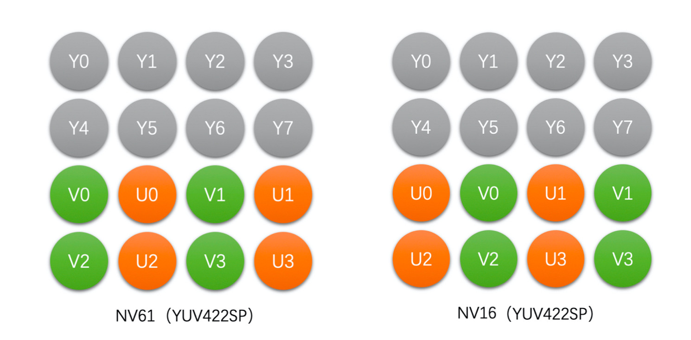
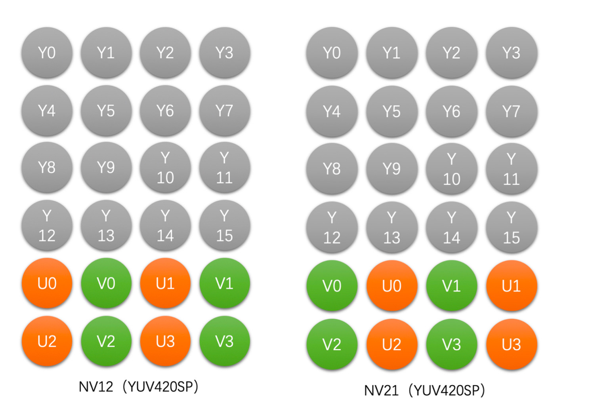

# 视频处理

## 图像的基本概念

* 存取一幅图像需要特别注意 Stride 这个参数，它跟分辨率中的 Width 是不一样的。为了快速存取，往往会选择以内存对齐的方式存储一行像素（比如 16 字节）。

### Color Range

对于一个 8bit 的 RGB 图像，**Full Range** 的 R、G、B 取值范围是 0~255， 而 **Limited Range** 的 R、G、B 取值范围是 16~235。

## 颜色空间

### RGB

* OpenCV 使用的是 BGR 格式，而不是 RGB。
* RGB 三个颜色是有**相关性**的，所以不太方便做图像压缩编码。

### YUV

YUV 图像将亮度信息 Y 与色彩信息 U、V 分离开来。Y 表示亮度(Luma)，是图像的总体轮廓，U、V 表示色度(Chroma)，主要描绘图像的色彩等信息。

根据采样方式的不同，YUV 主要分为 YUV 4:4:4、YUV 4:2:2、YUV 4:2:0 三种。

根据存储方式的不同，YUV 还可以分成两大类：**Planar** 和 **Packed**。Planar 格式的 YUV 是先连续存储所有像素点的 Y，然后存储所有像素点的 U（或者 V），之后再存储所有像素点的 V（或者 U）。Packed 格式的 YUV 是先存储完所有像素的 Y，然后 U、V 连续地交错存储。

#### YUV444

Planar 存储格式:

#### YUV422

Planar 存储格式:

Packed 存储格式:

#### YUV420 (最常用)

Planar 存储格式:

Packed 存储格式:

### RGB 与 YUV 转换

**RGB 和 YUV 格式转换需要双方确定好转换标准和 Color Range**。

#### BT601 标准（标清）

**Limited Range**:

RGB->YUV 转换公式

$$
\begin{cases}
Y &= 0.299 * R + 0.587 * G + 0.114 * B \\\\
U &= -0.172 * R - 0.339 * G + 0.511 * B + 128 \\\\
V &= 0.511 * R - 0.428 * G - 0.083 * B + 128
\end{cases}
$$

YUV->RGB 转换公式

$$
\begin{cases}
R &= Y + 1.371 * (V - 128) \\\\
G &= Y - 0.336 * (U - 128) - 0.698 * (V - 128) \\\\
B &= Y + 1.732 * (U - 128)
\end{cases}
$$

**Full Range**:

RGB->YUV 转换公式

$$
\begin{cases}
Y &= 16 + 0.257 * R + 0.504 * G + 0.098 * B \\\\
U &= 128 - 0.148 * R - 0.291 * G + 0.439 * B \\\\
V &= 128 + 0.439 * R - 0.368 * G - 0.071 * B
\end{cases}
$$

YUV->RGB 转换公式

$$
\begin{cases}
R &= 1.164 * (Y - 16) + 1.596 * (V - 128) \\\\
G &= 1.164 * (Y - 16) - 0.392 * (U - 128) - 0.812 * (V - 128) \\\\
B &= 1.164 * (Y - 16) + 2.016 * (U - 128)
\end{cases}
$$

#### BT709 标准（高清）

**Limited Range**:

RGB->YUV 转换公式

$$
\begin{cases}
Y &= 0.213 * R + 0.715 * G + 0.072 * B \\\\
U &= -0.117 * R - 0.394 * G + 0.511 * B + 128 \\\\
V &= 0.511 * R - 0.464 * G - 0.047 * B + 128
\end{cases}
$$

YUV->RGB 转换公式

$$
\begin{cases}
R &= Y + 1.540 * (V - 128) \\\\
G &= Y - 0.183 * (U - 128) - 0.459 * (V - 128) \\\\
B &= Y + 1.816 * (U - 128)
\end{cases}
$$

**Full Range**:

RGB->YUV 转换公式

$$
\begin{cases}
Y &= 16 + 0.183 * R + 0.614 * G + 0.062 * B \\\\
U &= 128 - 0.101 * R - 0.339 * G + 0.439 * B \\\\
V &= 128 + 0.439 * R - 0.339 * G - 0.040 * B
\end{cases}
$$

YUV->RGB 转换公式

$$
\begin{cases}
R &= 1.164 * (Y - 16) + 1.792 * (V - 128) \\\\
G &= 1.164 * (Y - 16) - 0.213 * (U - 128) - 0.534 * (V - 128) \\\\
B &= 1.164 * (Y - 16) + 2.114 * (U - 128)
\end{cases}
$$
