# 视频处理

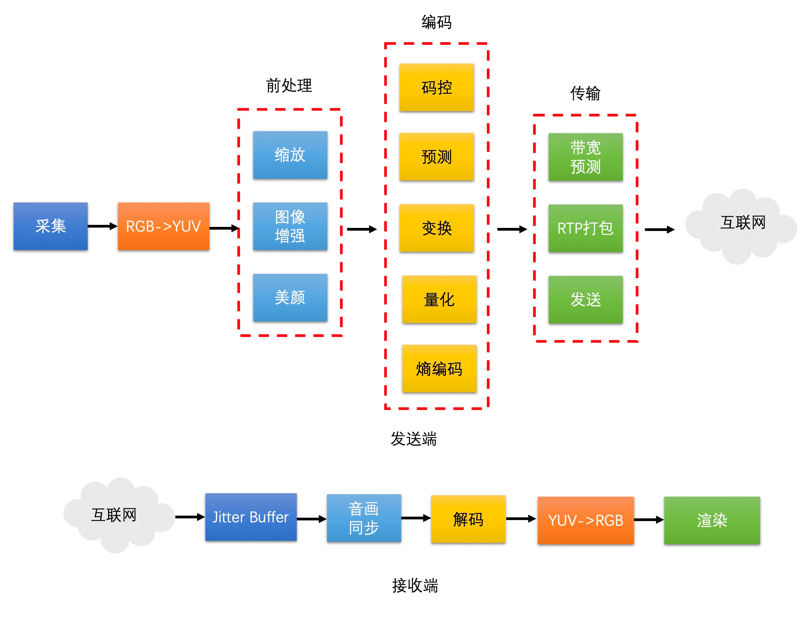

## 视频与图像的基本概念

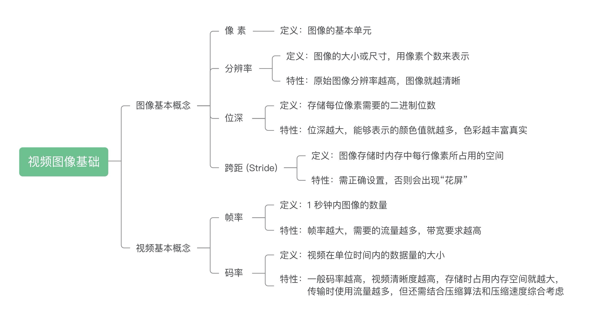

* 存取一幅图像需要特别注意 Stride 这个参数，它跟分辨率中的 Width 是不一样的。为了快速存取，往往会选择以内存对齐的方式存储一行像素（比如 16 字节）。有的时候即便图像的 Width 是一个规则的值，图像存储在内存中有可能 Stride 和 Width 也是不一样的，尤其是不同的视频解码器内部实现的不同，会导致输出的图像的 Stride 不一样。
* 我们在电影院看的电影帧率一般是 24fps（帧每秒），监控行业常用 25fps。
* 我们存储视频的时候需要对图像进行压缩之后再存储。码率是指视频在单位时间内的数据量的大小，单位一般是 Kb/s 或者 Mb/s。
* 视频压缩之后的清晰度还跟压缩时选用的压缩算法，以及压缩时使用的压缩速度有关。压缩算法越先进，压缩率就会越高，码率自然就会越小。压缩速度越慢，压缩的时候压缩算法就会越精细，最后压缩率也会有提高，相同的清晰度码率也会更小。

### Color Range

对于一个 8bit 的 RGB 图像，**Full Range** 的 R、G、B 取值范围是 0~255， 而 **Limited Range** 的 R、G、B 取值范围是 16~235。

## 颜色空间

### RGB

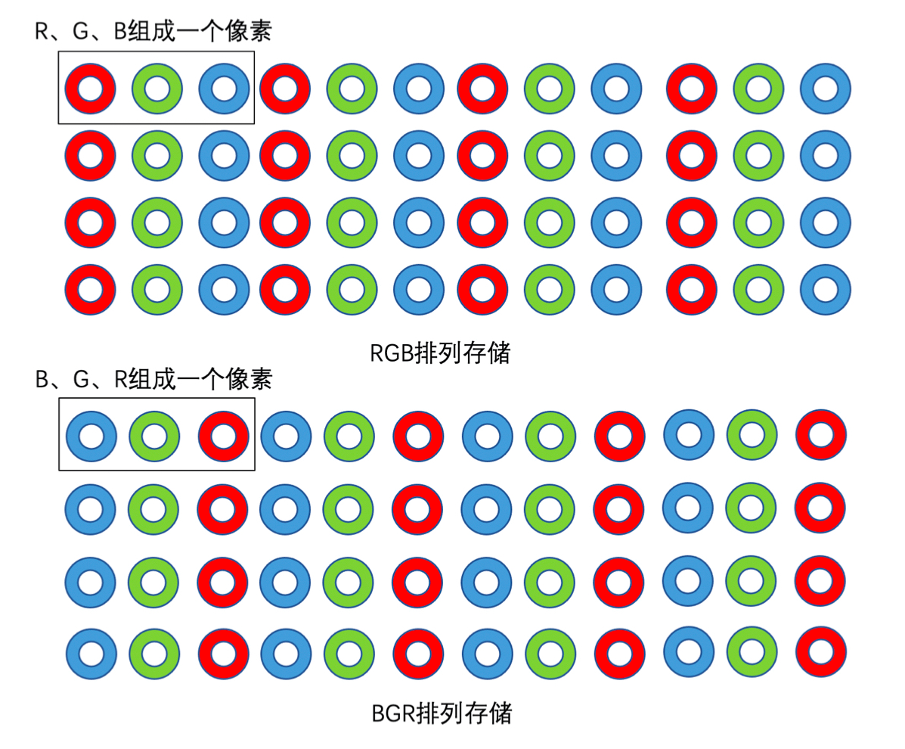

* OpenCV 使用的是 BGR 格式，而不是 RGB。
* RGB 三个颜色是有**相关性**的，所以不太方便做图像压缩编码。
* RGB 颜色空间更适合图像采集和显示。

### YUV

YUV 图像将亮度信息 Y 与色彩信息 U、V 分离开来。Y 表示亮度(Luma)，是图像的总体轮廓，U、V 表示色度(Chroma)，主要描绘图像的色彩等信息。YUV 颜色空间更适合于编码和存储。

根据采样方式的不同，YUV 主要分为 YUV 4:4:4、YUV 4:2:2、YUV 4:2:0 三种。

根据存储方式的不同，YUV 还可以分成三大类：**Planar**， **Semi-Planar** 和 **Packed**。Planar 格式的 YUV 是先连续存储所有像素点的 Y，然后存储所有像素点的 U（或者 V），之后再存储所有像素点的 V（或者 U）。Semi-planar 格式的 YUV 是先存储完所有像素的 Y，然后 U、V 连续地交错存储。packed 格式的 YUV 是连续交错存储的。

#### YUV444

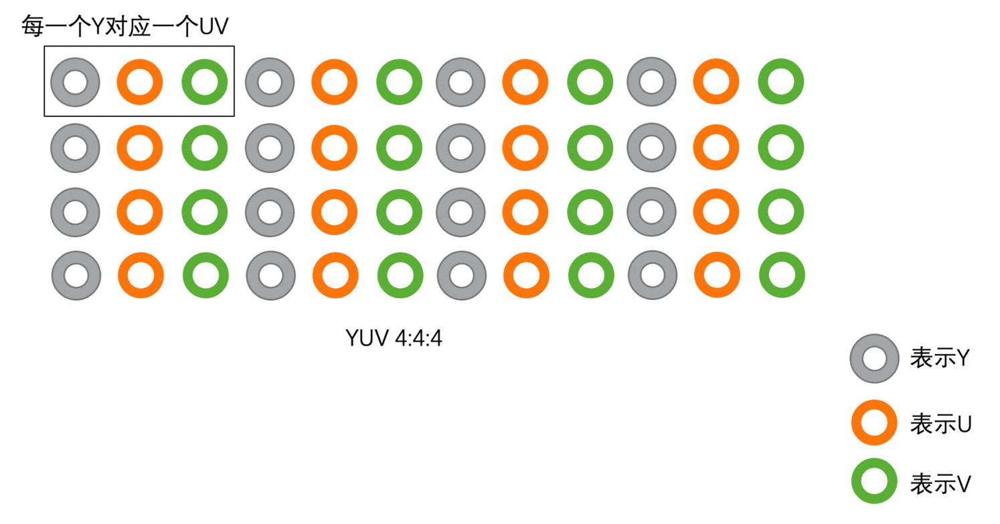

Planar 存储格式:
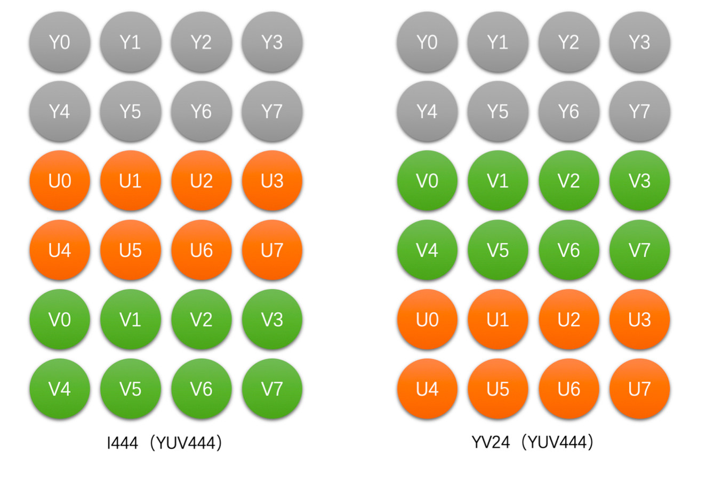

#### YUV422

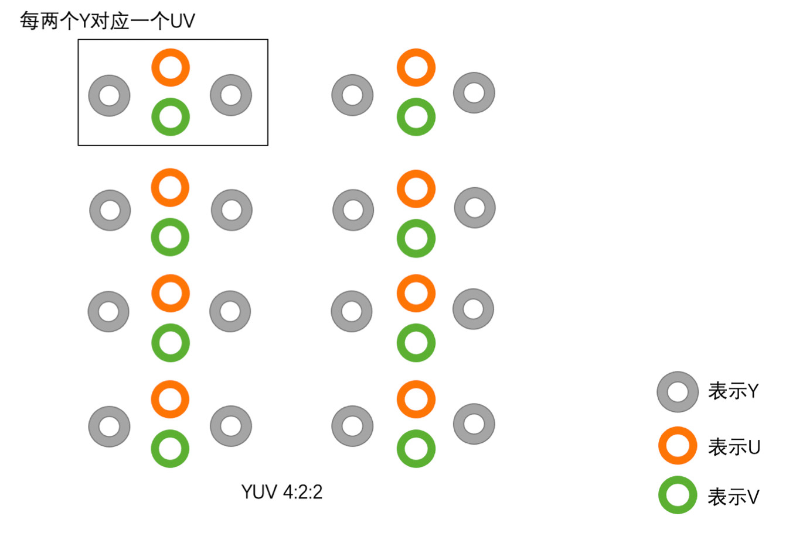

Planar 存储格式:
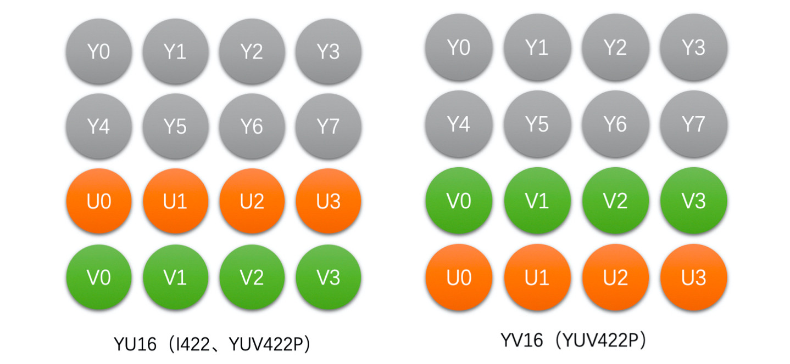

Semi-Planar 存储格式:
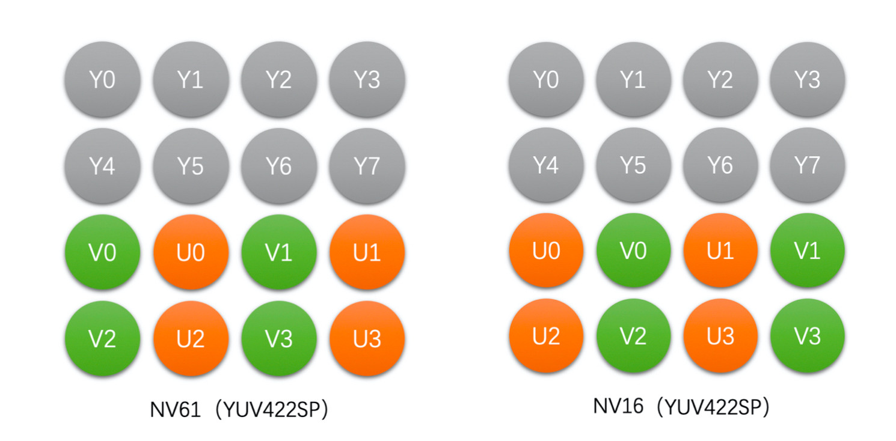

#### YUV420 (最常用)

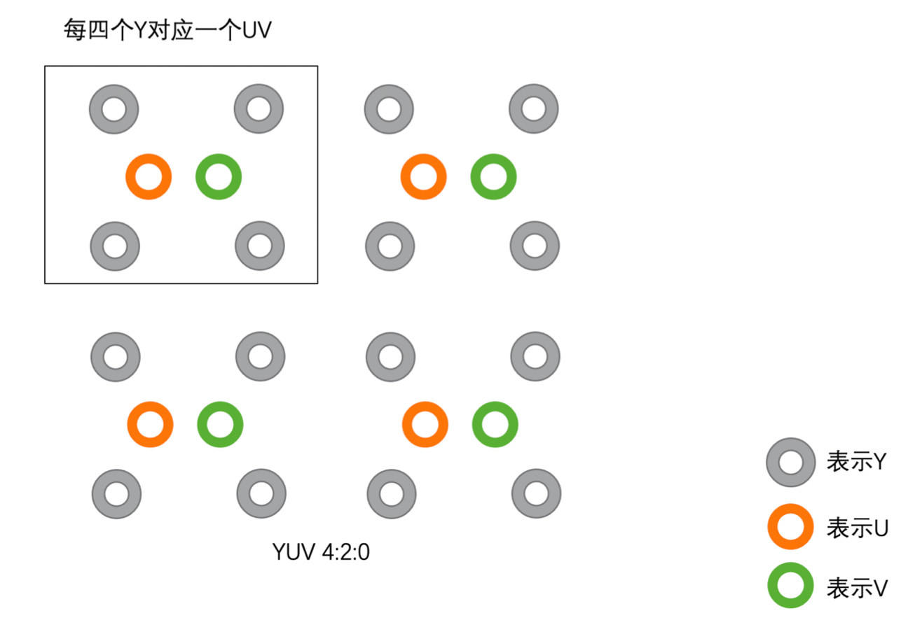

Planar 存储格式:


Semi-Planar 存储格式:
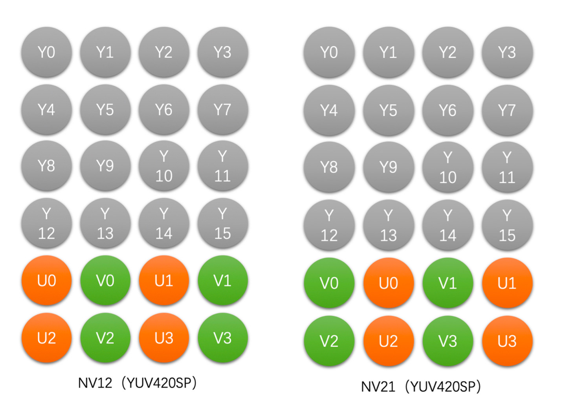

### RGB 与 YUV 转换

**RGB 和 YUV 格式转换需要双方确定好转换标准和 Color Range**。

#### BT601 标准（标清）

**Limited Range**:

RGB->YUV 转换公式

$$
\begin{cases}
Y &= 0.299 * R + 0.587 * G + 0.114 * B \\\\
U &= -0.172 * R - 0.339 * G + 0.511 * B + 128 \\\\
V &= 0.511 * R - 0.428 * G - 0.083 * B + 128
\end{cases}
$$

YUV->RGB 转换公式

$$
\begin{cases}
R &= Y + 1.371 * (V - 128) \\\\
G &= Y - 0.336 * (U - 128) - 0.698 * (V - 128) \\\\
B &= Y + 1.732 * (U - 128)
\end{cases}
$$

**Full Range**:

RGB->YUV 转换公式

$$
\begin{cases}
Y &= 16 + 0.257 * R + 0.504 * G + 0.098 * B \\\\
U &= 128 - 0.148 * R - 0.291 * G + 0.439 * B \\\\
V &= 128 + 0.439 * R - 0.368 * G - 0.071 * B
\end{cases}
$$

YUV->RGB 转换公式

$$
\begin{cases}
R &= 1.164 * (Y - 16) + 1.596 * (V - 128) \\\\
G &= 1.164 * (Y - 16) - 0.392 * (U - 128) - 0.812 * (V - 128) \\\\
B &= 1.164 * (Y - 16) + 2.016 * (U - 128)
\end{cases}
$$

#### BT709 标准（高清）

**Limited Range**:

RGB->YUV 转换公式

$$
\begin{cases}
Y &= 0.213 * R + 0.715 * G + 0.072 * B \\\\
U &= -0.117 * R - 0.394 * G + 0.511 * B + 128 \\\\
V &= 0.511 * R - 0.464 * G - 0.047 * B + 128
\end{cases}
$$

YUV->RGB 转换公式

$$
\begin{cases}
R &= Y + 1.540 * (V - 128) \\\\
G &= Y - 0.183 * (U - 128) - 0.459 * (V - 128) \\\\
B &= Y + 1.816 * (U - 128)
\end{cases}
$$

**Full Range**:

RGB->YUV 转换公式

$$
\begin{cases}
Y &= 16 + 0.183 * R + 0.614 * G + 0.062 * B \\\\
U &= 128 - 0.101 * R - 0.339 * G + 0.439 * B \\\\
V &= 128 + 0.439 * R - 0.339 * G - 0.040 * B
\end{cases}
$$

YUV->RGB 转换公式

$$
\begin{cases}
R &= 1.164 * (Y - 16) + 1.792 * (V - 128) \\\\
G &= 1.164 * (Y - 16) - 0.213 * (U - 128) - 0.534 * (V - 128) \\\\
B &= 1.164 * (Y - 16) + 2.114 * (U - 128)
\end{cases}
$$

### 使用 ffmpeg 将 png 图片转成 YUV 格式

[获取 png 图片](https://fakeimg.pl/320x320/448aff/fff/?text=hello&font=lobster)

```bash
ffmpeg -i hello.png -pix_fmt yuv420p hello-yuv420p.yuv
```

转换得到的 yuv 图像可以使用 [YUView](https://github.com/IENT/YUView) 软件打开（注意，需要自行设置图片的分辨率等参数，否则不能正确显示）。

由于 yuv 图片除了原始的像素数据，没有保存额外的数据，因此转换得到的图像大小为：320\*320\*3/2 = 153600 字节。

## 图像的缩放

图像的缩放就是将原图像的已有像素经过加权运算得到目标图像的目标像素。

假设原图像的分辨率是 `w0 * h0`，我们需要缩放到 `w1 * h1`。那我们只需要将目标图像中的像素位置`（x，y）`映射到原图像的`（x * w0 / w1，y * h0 / h1）`，再插值得到这个像素值就可以了，这个插值得到的像素值就是目标图像像素点`（x，y）`的像素值。注意，`（x * w0 / w1，y * h0 / h1）`绝大多数时候是小数。

### 图像缩放的场景

1. 播放窗口与原始图像分辨率不匹配的时候需要缩放
2. 在线观看视频时会有多种分辨率可以选择，即需要在一个图像分辨率的基础上缩放出多种不同尺寸的图像出来做编码，并保存多个不同分辨率的视频文件
3. RTC 场景，有的时候我们需要根据网络状况实时调节视频通话的分辨率

### 插值算法

使用周围已有的像素值通过一定的加权运算得到“插值像素值”。插值算法主要包括：最近邻插值算法（Nearest）、双线性插值算法（Bilinear）、双三次插值算法（BiCubic）等。

#### 最近邻插值算法

> 选择待插值像素周围的 4 个像素，并取离待插值像素位置最近的像素点权重为 1，其余 3 个点权重为 0

1. 将目标图像中的目标像素位置，映射到原图像的映射位置
2. 找到原图像中映射位置周围的 4 个像素
3. 取离映射位置最近的像素点的像素值作为目标像素

**缺点**: 它直接使用离插值位置最近的整数位置的像素作为插值像素，导致相邻两个插值像素有很大的概率是相同的。这样得到的放大图像大概率会出现**块状效应**，而缩小图像容易出现锯齿。

#### 双线性插值算法

> 选择待插值像素周围的 4 个像素，并且每个像素以距离作为权重，距离越近权重越大，距离越远权重越小

双线性插值其实就是三次线性插值的过程，我们先通过两次线性插值得到两个中间值，然后再通过对这两个中间值进行一次插值得到最终的结果。

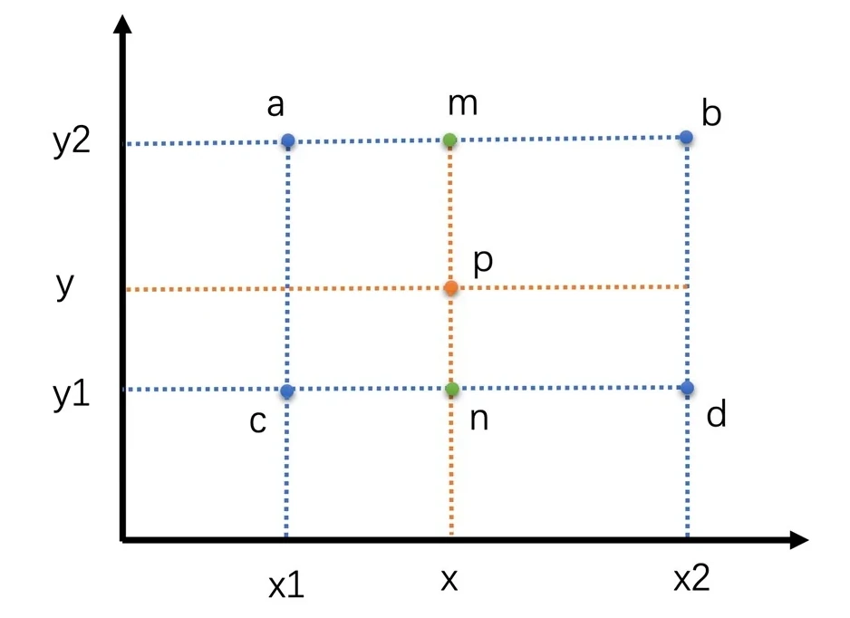

$$
val(m) = \frac{x - x_1}{x_2 - x_1} * val(b) + \frac{x_2 - x}{x_2 - x_1} * val(a) \\\\
val(n) = \frac{x - x_1}{x_2 - x_1} * val(d) + \frac{x_2 - x}{x_2 - x_1} * val(c) \\\\
val(p) = \frac{y - y_1}{y_2 - y_1} * val(m) + \frac{y_2 - y}{y_2 - y_1} * val(n)
$$

其中的 `val()` 表示该像素的像素值。

#### 双三次插值算法

1. 双三次插值选取的是周围的 16 个像素，比前两种插值算法多了 3 倍
2. 周围像素的权重计算是使用一个特殊的 **BiCubic** 基函数来计算的

先通过这个 BiCubic 基函数计算得到待插值像素周围 16 个像素的权重，然后将 16 个像素加权平均就可以得到最终的待插值像素了。

BiCubic 函数的计算公式如下：

$$
f(x) = \begin{cases}
(a+2)|x|^3 - (a+3)|x|^2 + 1 & 0 \le |x| < 1 \\\\
a|x|^3 - 5a|x|^2 + 8a|x| - 4a & 1 \le |x| < 2 \\\\
0 & 2 \le |x|
\end{cases}
$$

其中 a 的取值范围是 [-1, 0]，一般取 -0.5。

对于周围 16 个点中的每一个点，其坐标值为（x，y），而目标图像中的目标像素在原图像中的映射坐标为 p（u，v）。那么通过上面公式可以求得其水平权重 W（u - x），垂直权重 W（v - y）。将 W（u - x）乘以 W（v - y）得到最终权重值，然后再用最终权重值乘以该点的像素值，并对 16 个点分别做同样的操作并求和，就得到待插值的像素值了。

## 视频编码

人眼对于亮度信息更加敏感，而对于色度信息稍弱，所以视频编码是将 Y 分量和 UV 分量分开来编码的。对于每一帧图像，又是划分成一个个块来进行编码的，这一个个块在 H264 中叫做宏块。宏块的大小一般是 16x16。

### 图像的数据冗余

* **空间冗余**：一幅图像中相邻像素的亮度和色度信息是比较接近的，并且亮度和色度信息也是逐渐变化的，不太会出现突变。
* **时间冗余**：相邻两帧图像的变化比较小，相似性很高
* **视觉冗余**：人眼对于图像中高频信息的敏感度要小于低频信息的，去除图像中的一些高频信息对于人眼来说差别不大
* **信息熵冗余**：图像中的一些像素值出现的概率比较大，而另一些像素值出现的概率比较小，因此可以通过合理的编码来压缩数据

### 编码原理

在每一个宏块中，从左上角开始**之**字形扫描每一个像素值，可以得到一个“像素串”。为了能够在最后熵编码的时候压缩率更高，我们希望送到熵编码（以**行程编码**为例）的“像素串”，是一串含有很多 0，并且最好连续为 0 的“像素串”。

#### **帧内预测**减小图像块的空间冗余

帧内预测就是在当前编码图像内部已经编码完成的块中找到与将要编码的块相邻的块。一般就是即将编码块的左边块、上边块、左上角块和右上角块，通过将这些块与编码块相邻的像素经过**多种不同的算法**得到多个不同的**预测块**。然后我们再用编码块减去每一个预测块得到一个个**残差块**。最后，我们取这些算法得到的残差块中像素的绝对值加起来最小的块为预测块。而得到这个预测块的算法为帧内预测模式。帧内预测是根据块的大小分为不同的预测模式的。在 H264 标准里面，块分为宏块和子块。宏块的大小是 16 x 16（YUV 4:2:0 图像亮度块为 16 x 16，色度块为 8 x 8）。在帧内预测中，亮度宏块可以继续划分成 16 个 4 x 4 的子块。因为图像中有的地方细节很多，我们需要划分成更小的块来做预测会更精细，所以会将宏块再划分成 4 x 4 的子块。帧内预测中亮度块和色度块是分开独立进行预测的，即亮度块参考已编码亮度块的像素，而色度块参考已编码色度块的像素。

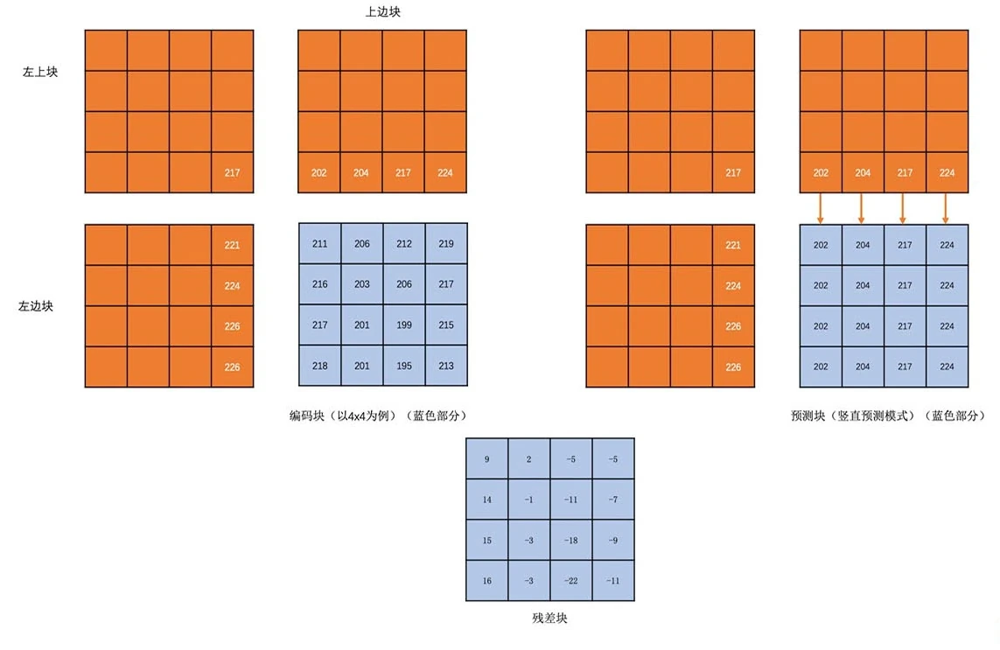

##### 4 x 4 亮度块的帧内预测模式

1. Vertical 模式

    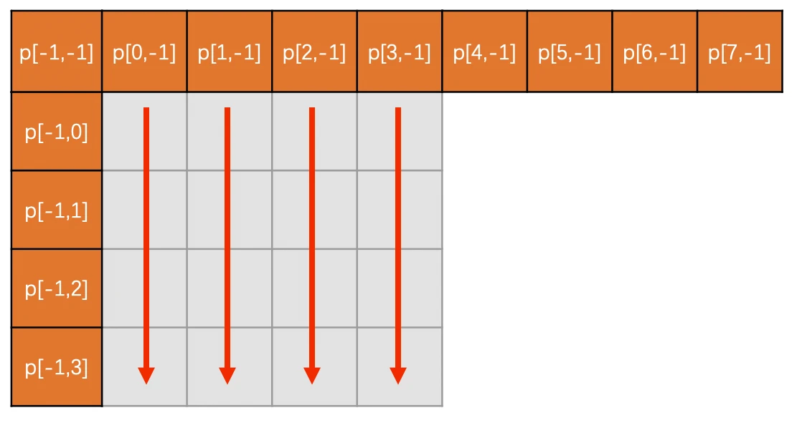

2. Horizontal 模式

    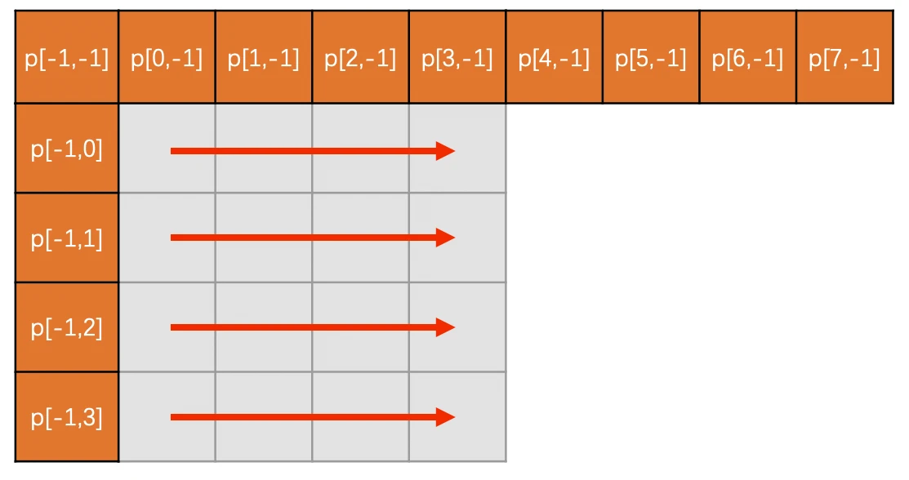

3. DC 模式

    DC 模式就是指，当前编码亮度块的每一个像素值，是上边已经编码块的最下面那一行和左边已编码块右边最后一列的所有像素值的平均值。注意，DC 模式预测得到的块中每一个像素值都是一样的。

    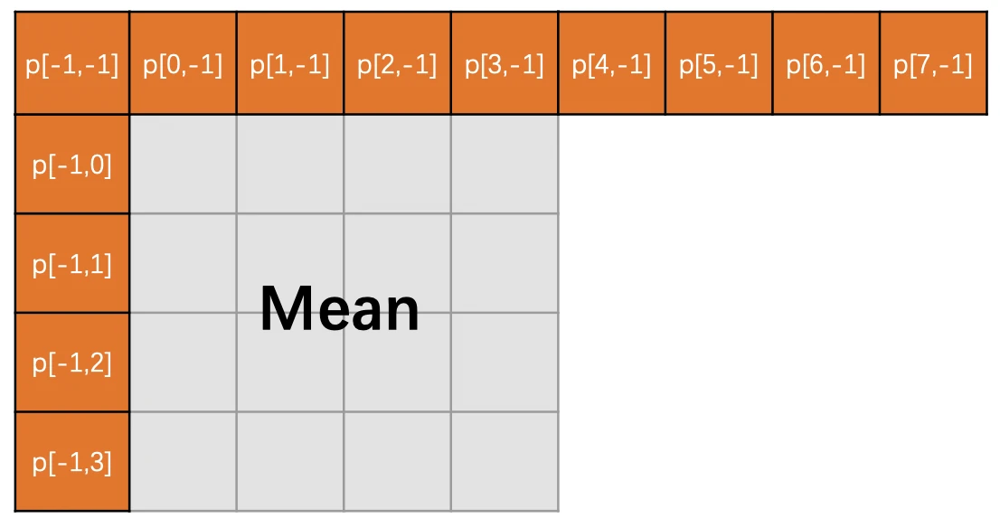

4. Diagonal Down-Left 模式

    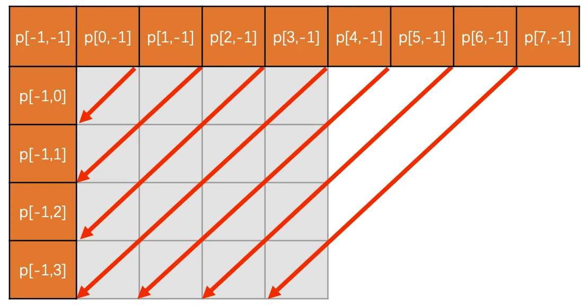

5. Diagonal Down-Right 模式

    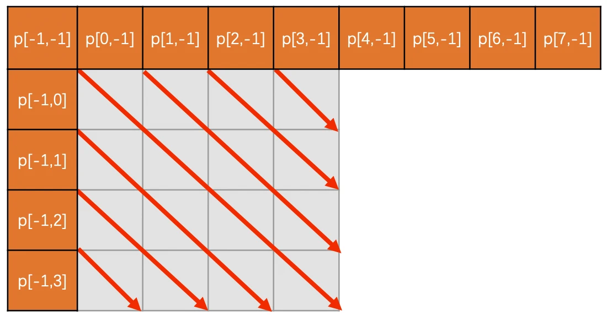

6. Vertical-Right 模式

    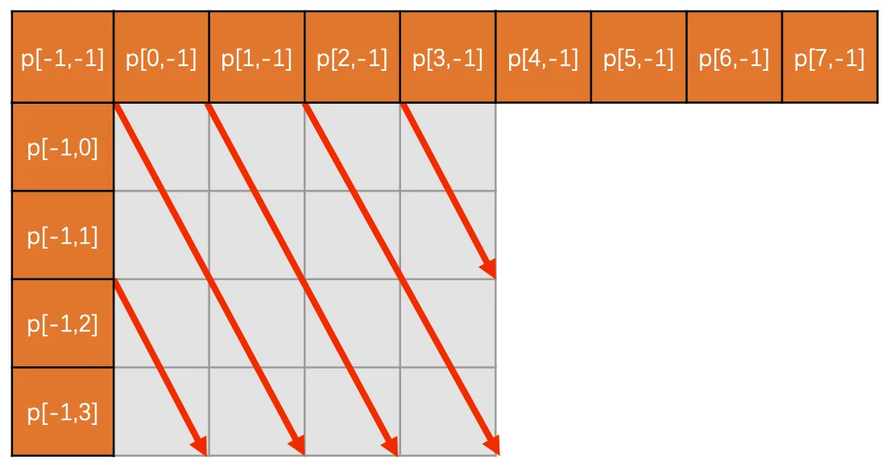

7. Horizontal-Down 模式

    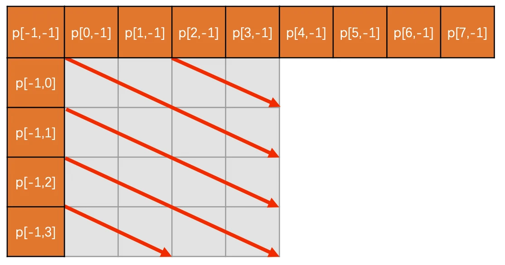

8. Vertical-Left 模式

    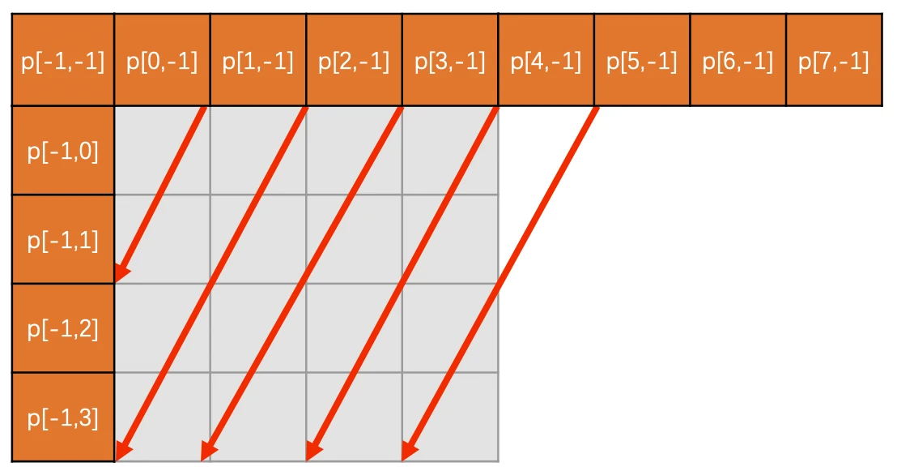

9. Horizontal-Up 模式

    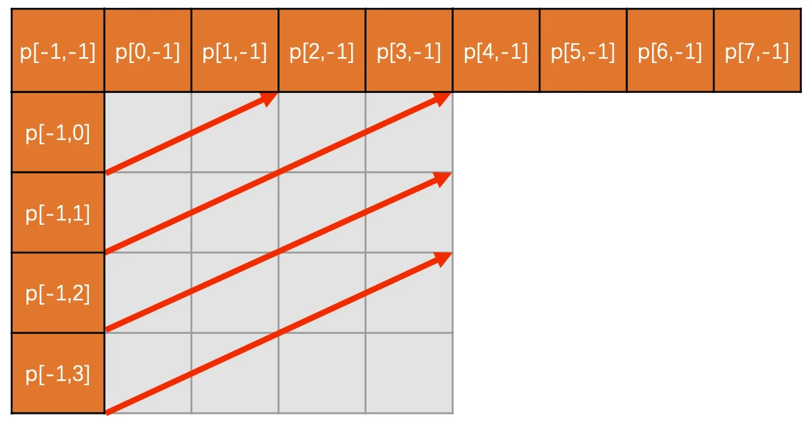

对于每一个块或者子块，我们可以得到预测块，再用实际待编码的块减去预测块就可以得到残差块。主要有下面 3 种方案来得到最优预测模式：

第一种方案，先对每一种预测模式的残差块的像素值求绝对值再求和，称之为 cost，然后取其中残差块绝对值之和也就是 cost 最小的预测模式为最优预测模式。

第二种方案，对残差块先进行 Hadamard 变换（在 DCT 变换和量化那节课中会介绍），变换到频域之后再求绝对值求和，同样称为 cost，然后取 cost 最小的预测模式为最优预测模式。

第三种方案，也可以对残差块直接进行 DCT 变换量化熵编码，计算得到失真大小和编码后的码流大小，然后通过**率失真优化**的方法来选择最优预测模式。

通过上面讲的这些方法我们找到了每一个 4 x 4 块的最优模式之后，将这 16 个 4 x 4 块的 cost 加起来，与 16 x 16 块的最小 cost 对比，选择 cost 最小的块划分方式和预测模式作为帧内预测模式。

**在 H264 标准里面，视频的第一帧的第一个块的左和上都是空，没法预测，所以设置成了一个约定值128，方便编码**。

#### **帧间预测**减小图像块的时间冗余

在前面已经编码完成的图像中，循环遍历每一个块，将它作为预测块，用当前的编码块与这个块做差值，得到残差块，取残差块中像素值的绝对值加起来最小的块为预测块，预测块所在的已经编码的图像称为参考帧。预测块在参考帧中的坐标值 (x0, y0) 与编码块在编码帧中的坐标值 (x1, y1) 的差值 (x0 - x1, y0 - y1) 称之为运动矢量。在参考帧中去寻找预测块的过程称之为运动搜索。帧间预测既可以参考前面的图像也可以参考后面的图像。只参考前面图像的帧我们称为前向参考帧，也叫 P 帧；参考后面的图像或者前面后面图像都参考的帧，我们称之为双向参考帧，也叫做 B 帧。B 帧相比 P 帧主要是需要先编码后面的帧，并且 B 帧一个编码块可以有两个预测块，这两个预测块分别由两个参考帧预测得到，最后加权平均得到最终的预测块。

帧间预测的宏块大小 16 x 16，可以划分为 16 x 8，8 x 16， 8 x 8 三种，其中 8 x 8 可以继续划分成 8 x 4，4 x 8 和 4 x 4，这是亮度块的划分。在 YUV 4:2:0 中，色度块宽高大小都是亮度块的一半。

在 H264 标准中，P 帧最多支持从 16 个参考帧中选出一个作为编码块的参考帧，但是同一个帧中的不同块可以选择不同的参考帧，这就是多参考。

##### 运动搜索

* 钻石搜索


* 六边形搜索

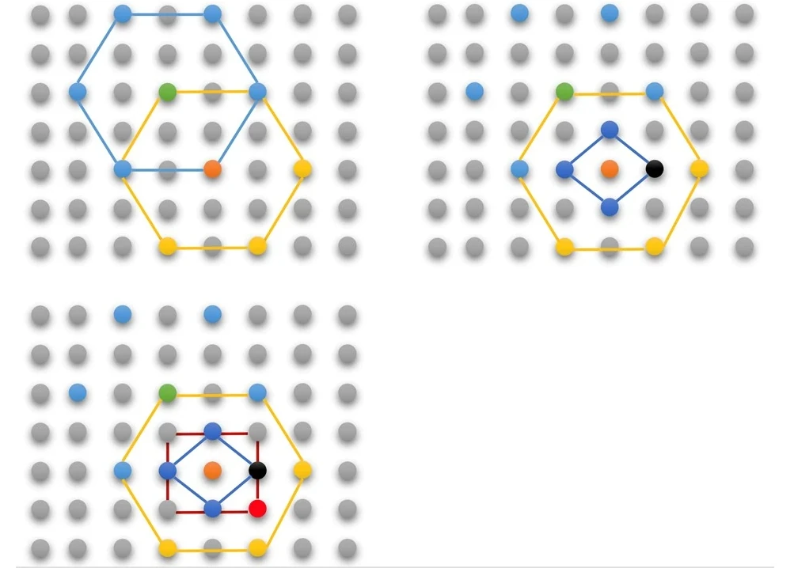

#### **DCT**变换和量化减小图像块的视觉冗余

在H264中，如果一个块大小是16x16，一般会划分成16个4x4的块，然后对每个 4x4 的块做 DCT 变换得到相应的 4x4 的变换块。变换块的每一个“像素值”我们称为系数。变换块**左上角**的系数值就是图像的**低频**信息，其余的就是图像的高频信息，并且高频信息占大部分。低频信息表示的是一张图的总体样貌。一般低频系数的值也比较大。而高频信息主要表示的是图像中人物或物体的轮廓边缘等变化剧烈的地方。高频系数的数量多，但高频系数的值一般比较小。

让变换块的系数都同时除以一个值，这个值我们称之为量化步长，也就是 QStep（QStep 是编码器内部的概念，用户一般使用量化参数 QP 这个值，QP 和 QStep 一一对应），得到的结果就是量化后的系数。QStep 越大，得到量化后的系数就会越小。同时，相同的 QStep 值，高频系数值相比低频系数值更小，量化后就更容易变成 0。这样一来，我们就可以将大部分高频系数变成 0。

QP 值越大，损失就越大，从而画面的清晰度就会越低。同时，QP 值越大系数被量化成 0 的概率就越大，这样编码之后码流大小就会越小，压缩就会越高。

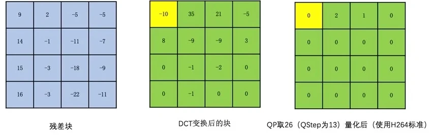

## 码流结构 (H264)

### 帧类型

| | 帧类型 | 预测方式 | 参考帧 | 优缺点 |
| --- | --- | --- | --- | --- |
| I 帧 | 帧内编码帧 | 只进行帧内预测 | 无 | 自身能独立完成编码解码，压缩率小 |
| P 帧 | 前向编码帧 | 可以进行帧内预测和帧间预测 | 前面的 I 帧和 P 帧 | 压缩率比 I 帧高，必须要参考帧才能正确编解码 |
| B 帧 | 双向编码帧 | 可以进行帧内预测和帧间预测 | 前面或者后面的 I 帧和 P 帧 | 压缩率最高，需要缓存帧，延时高，RTC 场景不适合 |

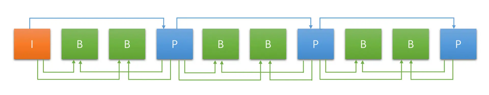

为了防止某个参考帧出错而导致错误的不断传递，H264 规定了一个特殊的 I 帧叫 **IDR**帧，也叫立即刷新帧。**IDR 帧之后的帧不能再参考 IDR 帧之前的帧**。

### 视频图像的序列结构

从一个 IDR 帧开始到下一个 IDR 帧的前一帧为止，这里面包含的 IDR 帧、普通 I 帧、P 帧和 B 帧，我们称为一个 GOP (Group of Pictures) 图像组。


GOP 越大，编码的 I 帧就越少，相比而言，P帧和B帧的压缩率更高，因此整个视频的编码效率越高。但是 GOP 太大，会导致 IDR 帧距离太大，点播场景时进行视频的 seek 操作不方便。并且，在 RTC 和直播场景中，可能会因为网络原因导致丢包而引起接收端的丢帧，大的 GOP 最终可能导致参考帧丢失而出现解码错误，从而引起长时间花屏和卡顿。

### 图像内部的层次结构

**Slice 其实是为了并行编码设计的**。将一帧图像划分成几个 Slice，并且 Slice 之间相互独立、互不依赖、独立编码。并行对多个 Slice 进行编码可以提升速度，但是帧内预测不能跨 Slice 进行，因此编码性能会差一些。一个 Slice 会包含整数个宏块。在做帧内和帧间预测的时候，我们又可以将宏块继续划分成不同大小的子块，用来给复杂区域做精细化编码。

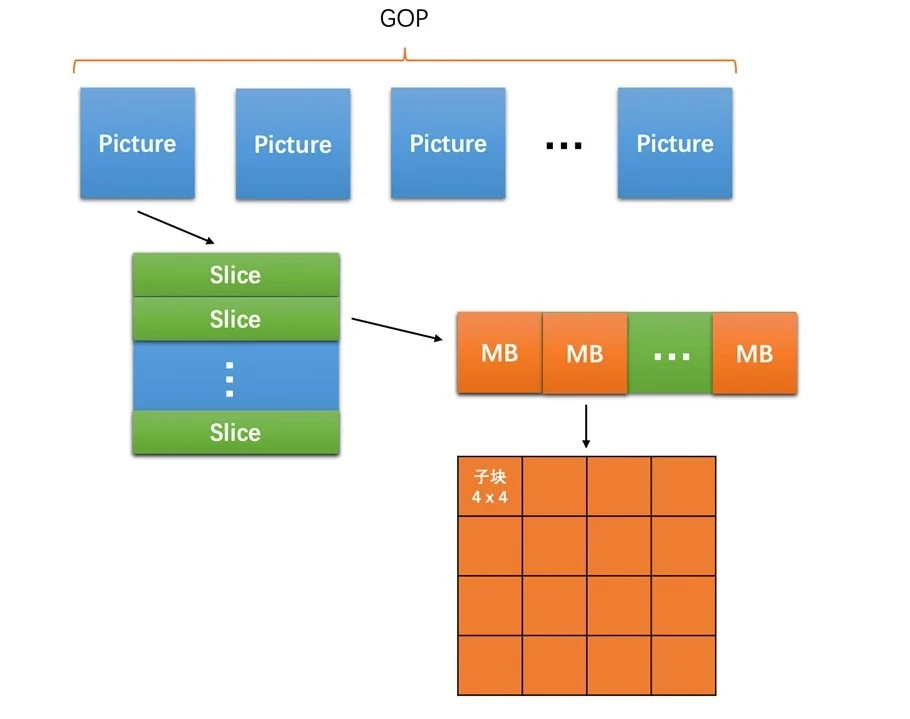

### 码流格式

H264 码流有两种格式：一种是 **Annexb** 格式；一种是 **MP4** 格式。


Annexb 格式使用**起始码**来表示一个编码数据的开始。起始码本身不是图像编码的内容，只是用来分隔用的。


MP4 格式在图像编码数据的开始使用了 4 个字节作为长度标识，用来表示编码数据的长度。

### NALU (网络抽象层单元)

编码数据中除了图像数据，还有一些编码参数数据，为了能够将一些通用的编码参数提取出来，不在图像编码数据中重复，H264 设计了**两个重要的参数集：一个是 SPS（序列参数集）；一个是 PPS（图像参数集）**。

SPS 主要包含的是图像的宽、高、YUV 格式和位深等基本信息。

PPS 主要包含熵编码类型、基础 QP 和最大参考帧数量等基本编码信息。

**H264 的码流主要是由 SPS、PPS、I Slice、P Slice和B Slice 组成的**。


SPS 是一个 NALU、PPS 是一个 NALU、每一个 Slice 也是一个 NALU。每一个 NALU 又都是由一个 1 字节的 NALU Header 和若干字节的 NALU Data 组成的。而对于每一个 Slice NALU，其 NALU Data 又是由 Slice Header 和 Slice Data 组成，并且 Slice Data 又是由一个个 MB Data 组成。

#### NALU Header

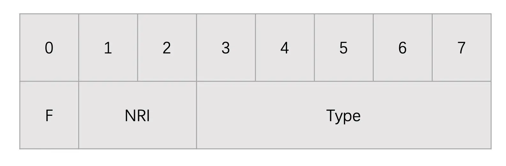

* F: 禁止位，H264 码流必须为 0
* NRI： nal_ref_idc，表示当前 NALU 的重要性。参考帧、SPS 和 PPS 对应的 NALU 必须要大于 0
* Type： nal_unit_type，表示 NALU 的类型

NALU 类型表格：

| NALU 类型 | 描述 |
| --- | --- |
| 0 | 未使用 |
| 1 | 非 IDR 图像中的 Slice |
| 2 | 片分区 A |
| 3 | 片分区 B |
| 4 | 片分区 C |
| 5 | IDR 图像中的 Slice |
| 6 | 补充增强信息单元 SEI |
| 7 | 序列参数集 SPS |
| 8 | 图像参数集 PPS |
| 9 | 分解符 |
| 10 | 序列结束 |
| 11 | 码流结束 |
| 12 | 填充 |
| 13...23 | 保留 |
| 24...31 | 未使用 |

NALU 类型只区分了 IDR Slice 和非 IDR Slice，至于非 IDR Slice 是普通 I Slice、P Slice 还是 B Slice，则需要继续解析 Slice Header 中的 Slice Type 字段得到。

### 如何从码流中判断哪几个 Slice 是同一帧的

H264 码流中没有字段表示一帧包含几个 Slice，但是 Slice Header 中有一个 **first_mb_in_slice** 的字段，表示当前 Slice 的第一个宏块在当前编码图像中的序号。如果 first_mb_in_slice 的值等于 0，就代表了当前 Slice 的第一个宏块是一帧的第一个宏块，也就是说当前 Slice 就是一帧的第一个 Slice。first_mb_in_slice 是以**无符号指数哥伦布**编码的，需要使用对应的解码方式才能解码出来。但是有一个小技巧，如果 **slice_header[0] & 0x80 == 1**， 则first_mb_in_slice 等于 0。

### 如何从码流中获取 QP 值

在 PPS 中有一个全局基础 QP，字段是 pic_init_qp_minus26。当前序列中所有依赖该 PPS 的 Slice 共用这个基础 QP，且每一个 Slice 在这个基础 QP 的基础上做调整。在 Slice Header 中有一个 slice_qp_delta 字段来描述这个调整偏移值。更进一步，H264 允许在宏块级别对 QP 做更进一步的精细化调节。这个字段在宏块数据里面，叫做 mb_qp_delta。

### 使用 ffmpeg 从视频文件中提取 H264 码流

```bash
ffmpeg -i input.mp4 -c:v copy -bsf:v h264_mp4toannexb -an output.h264
```

## 不同的编码器标准比较

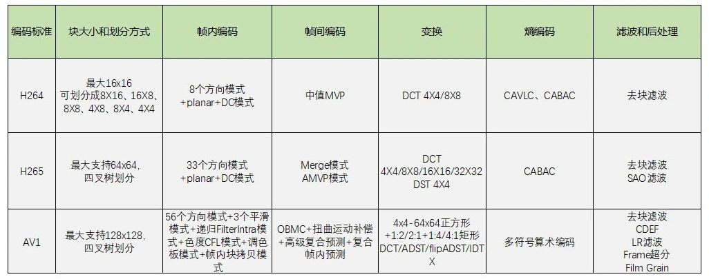
