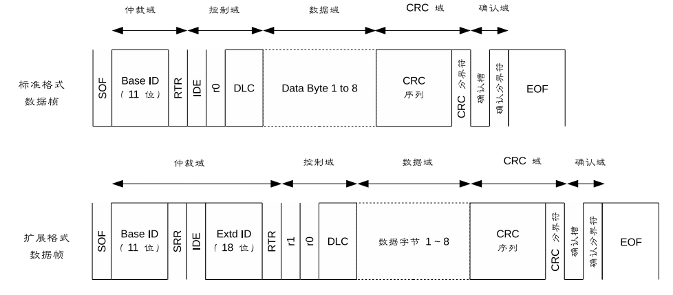

# CAN 基础

## 拓扑结构


CAN总线有两个 ISO 国际标准：ISO11898 和 ISO11519。

* ISO11898 定义了通信速率为 125 Kbps～1 Mbps 的高速 CAN 通信标准，属于闭环总线，总线长度 ≤ 40 米。
* ISO11519 定义了通信速率为 10～125 Kbps 的低速 CAN 通信标准，属于开环总线，总线长度可达 1000 米。
* 在同一条总线上，所有节点的通信速度必须相同；如果两条不同通信速度的总线上的节点想要实现信息交互，必须通过网关或者中继器转发信息。

## 信号表示


## 通信特点

### 多主多从结构

* CAN 总线上的所有节点没有主从之分，在总线空闲状态，任意节点都可以向总线上发送消息
* 当总线上出现连续的 11 位隐形电平，那么总线就处于空闲状态
* 最先向总线发送消息的节点获得总线的发送权，当多个节点同时向总线发送消息时，所发送消息的优先级高的那个节点获得总线的发送权
* 依赖于**硬件**的验收滤波技术，CAN 总线可以实现一对一，一对多以及广播的数据传输方式。

### 非破坏性位仲裁机制

当多个节点同时向总线发送消息时，对各个消息的标识符（即ID号）进行逐位仲裁，如果某个节点发送的消息仲裁获胜，那么这个节点将获取总线的发送权，仲裁失败的节点则立即停止发送并转变为监听（接收）状态。

这种仲裁机制既不会造成已发送数据的延迟，也不会破坏已经发送的数据。

### 报文过滤

CAN 总线中没有地址的概念，CAN 总线是通过报文 ID 来实现收发数据的。每个节点上都会有一个验收滤波 ID 表，其位于 CAN 节点的验收滤波器中，如果总线上的报文的 ID 号在某个节点的验收滤波 ID 表中，那么这一帧报文就能通过该节点验收滤波器的验收，该节点就会接收这一帧报文。

### 远程数据请求

某个节点 Node_A 可以通过发送`遥控帧`到总线上的方式，请求某个节点 Node_B 来发送由该遥控帧所指定的报文。

### 出错处理

* 所有的节点都可以检测出错误
* 检测出错误的节点会立即通知总线上其它所有的节点
* 正在发送消息的节点，如果检测到错误，会立即停止当前的发送，同时不断地重复发送此消息，直到该消息发送成功为止

### 故障封闭

节点能够判断错误的类型，判断是暂时性的数据错误（如噪声干扰）还是持续性的数据错误（如节点内部故障），如果判断是严重的持续性错误，那么节点就会切断自己与总线的联系，从而避免影响总线上其他节点的正常工作。

### 位填充


CAN 协议中规定，当相同极性的电平持续五位时，则添加一个极性相反的位。

## 网络分层架构


## 帧结构

### 数据帧和遥控帧




* RTR(Remote Transmission Request) 位保证了数据帧的优先级高于遥控帧
* SRR(Substitutes Remote Requests) 位保证了标准数据帧的优先级高于扩展数据帧
* IDE(Identifier Extension) 位保证了标准遥控帧的优先级高于扩展遥控帧
* DLC(Data Length Code) 位指示了数据段中的字节数，对于遥控帧而言，DLC 表示该遥控帧对应的数据帧的数据段的字节数
* 数据段从 MSB 开始输出
* CRC 校验序列(15bit)的计算范围包括：SOF,仲裁段，控制段和数据段
* ACK 包括 ACK 槽和 ACK 分界符：
  * 发送节点发出的报文中 ACK 槽为`隐性1`
  * 接收节点在接收到正确的报文之后会在 ACK 槽发送`显性0`，通知发送节点正常接收结束
* EOF(End Of Frame) 表示该帧报文的结束，由7个隐性位构成

### 错误帧

在 CAN 总线通信中，一共有五种错误，分别是：位错误、ACK错误、填充错误、CRC错误、格式错误。


* 主动错误标志：6个连续的显性位0
* 被动错误标志：6个连续的隐性位1
* 错误分界符：8个连续的隐性位1

### 过载帧


* 接受单元会发从此帧来通知总线自己还没有做好接收准备

### 帧间隔


* 数据帧和遥控帧可通过插入帧间隔将本帧与前面的任何帧（数据帧、遥控帧、错误帧、过载帧）分开，过载帧和错误帧前不能插入帧间隔

## 错误通知

### 节点错误状态

按照 CAN 协议的规定，CAN 总线上的节点始终处于以下三种状态之一：

* 主动错误状态
  * 可以正常通信
  * 在检测出错误时，发出主动错误标志

* 被动错误状态
  * 可以正常通信
  * 在检测出错误时，发出被动错误标志

* 总线关闭状态
  * 节点不能收发报文
  * 在满足一定条件的时候，再次进入到主动错误状态

### 错误状态的转换

在 CAN 节点内，有两个计数器：发送错误计数器（TEC）和接收错误计数器（REC）。TEC 和 REC 计数值的变化，是根据下表的规定来进行的


CAN节点错误状态的转换，就是基于这两个计数器来进行的


### 错误帧的发送


1. 发送节点 Node\_A 发送一个显性位，但是却从总线上听到一个隐形位，于是 Node\_A 节点就会检测到一个位错误
2. Node\_A 检测到位错误之后，立即在下一位开始发送主动错误帧：6个连续显性位的主动错误标志+8个连续隐性位的错误界定符
3. 对应 Node\_A 发出的主动错误标志，总线上电平为6个连续显性位
4. 接收节点 Node\_B 和 Node\_C 从总线上听到连续6个显性位，那么就会检测到一个**填充错误**，于是这两个节点都会发送主动错误帧
5. 对应 Node\_B 和 Node\_C 发出的主动错误标志，总线电平又有6个连续显性电平，对应 Node\_B 和 Node\_C 发出的错误界定符，总线电平有8个连续的隐性电平
6. 在间歇域之后，Node\_A 节点重新发送刚刚出错的报文

## Socket CAN

### 命令行工具

#### ip 命令

```bash
ip link set can0 type can help
```

##### 设置 CAN 设备的波特率

```bash
ip link set can0 type can bitrate 500000
ip link set can0 type can bitrate 500000 dbitrate 2000000 fd on
ip link set can0 type can bitrate 500000 sample-point 0.875
```

##### 启动/关闭 CAN 设备

```bash
ip link set can0 up
ip link set can0 down
```

##### 设置 CAN 设备的模式

```bash
ip link set can0 type can loopback on
ip link set can0 type can listen-only on
```

##### 查看详细的配置信息

```bash
ip -details link show can0
```

#### can-utils 程序

##### candump

```bash
candump can0,0x123:0x7FF # 仅显示can0上收到的ID为0x123的消息
```

##### cansend

```bash
cansend can0 123#1122334455667788 # 发送一个ID为0x123的报文
```

##### cangen

```bash
cangen can0 -g 0x123 -I 1000 -L 8 -D 0x1122334455667788 # 每1000ms发送一个ID为0x123的报文
```

##### cansniffer

```bash
cansniffer can0 # 抓取can0上的所有报文，可以过滤掉数据不变的帧
```

## python-can

### 安装

```bash
pip install python-can
```

### 使用

```python
# import the library
import can

# create a bus instance
# many other interfaces are supported as well (see documentation)
bus = can.Bus(interface='socketcan',
              channel='vcan0',
              receive_own_messages=True)

# send a message
message = can.Message(arbitration_id=123, is_extended_id=True,
                      data=[0x11, 0x22, 0x33])
bus.send(message, timeout=0.2)

# iterate over received messages
for msg in bus:
    print(f"{msg.arbitration_id:X}: {msg.data}")

# or use an asynchronous notifier
notifier = can.Notifier(bus, [can.Logger("recorded.log"), can.Printer()])
```
