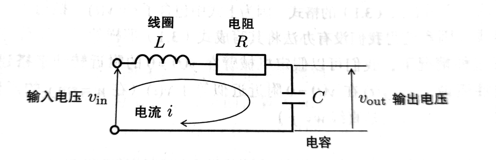
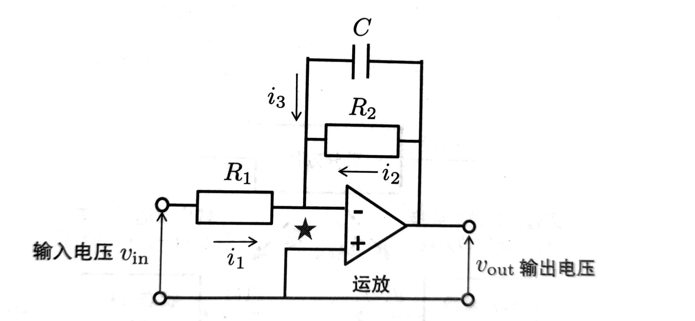
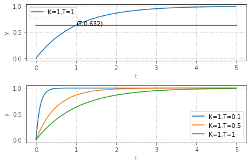
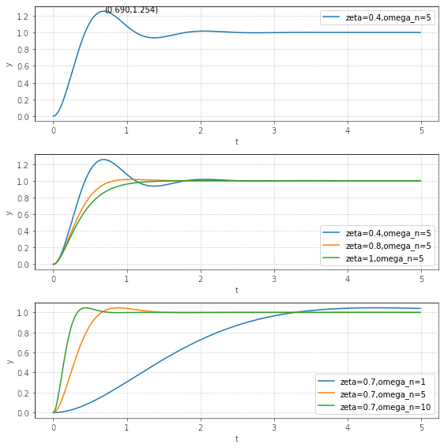

# 控制系统基础

## 控制系统建模

对于一个输入为 \\(u\\)，输出为 \\(y\\) 的动态系统，当 \\(t\\) 时刻的输出 \\(y(t)\\) 由直到 \\(t\\) 时刻为止的输入和输出来决定的时候，这个系统可以用下面的微分方程来表示：

$$
\frac{d^n}{dt^n}y(t) + a_{n-1}\frac{d^{n-1}}{dt^{n-1}}y(t) + \cdots + a_1\frac{d}{dt}y(t) + a_0y(t) \\\\
= b_m\frac{d^m}{dt^m}u(t) + b_{m-1}\frac{d^{m-1}}{dt^{m-1}}u(t) + \cdots + b_1\frac{d}{dt}u(t) + b_0u(t)
$$

微分方程很难求解以及分析系统行为，所以通常会将微分方程转换成**传递函数模型**或者**状态空间模型**。

### 传递函数

传递函数模型使用复变函数来表现系统模型，可以通过将微分方程两边进行初始值为0的拉普拉斯变换得到。

拉普拉斯变换的定义：\\(g(s) = \mathcal{L}[g(t)] = \int_0^{\infty}g(\tau)e^{-s\tau}d\tau\\)

---

微分的拉普拉斯变换

$$
\begin{align}
\mathcal{L}[\dot y(t)] &= \int_0^{\infty}\dot y(\tau)e^{-s\tau}d\tau \\\\
&= [y(\tau)e^{-s\tau}]_0^{\infty} - \int_0^{\infty}-sy(\tau)e^{-s\tau}d\tau \\\\
&= [y(\tau)e^{-s\tau}]_0^{\infty} + s\int_0^{\infty}y(\tau)e^{-s\tau}d\tau \\\\
&= y(\infty) -y(0) + s\mathcal{L}[y(t)] \\\\
&= sy(s) - y(0)
\end{align}
$$

令 \\(y(0) = 0\\)，则得到 \\(\mathcal{L}[\dot y(t)] = sy(s)\\)

---

积分的拉普拉斯变换

令 \\(f(t) = \int_0^ty(\tau)d\tau\\), 则 \\(\dot f(t) = y(t)\\)

$$
\begin{align}
\mathcal{L}[\dot f(t)] &= sf(s) - f(0) \\\\
                       &= sf(s) - \int_0^0y(\tau)d\tau \\\\
                       &= sf(s)
\end{align}
$$

$$
\mathcal{L}[\int_0^ty(\tau)d\tau] = \mathcal{L}[f(t)] = f(s) = \frac{1}{s}\mathcal{L}[\dot f(t)] = \frac{1}{s}\mathcal{L}[y(t)] = \frac{1}{s}y(s)
$$

### 状态空间

状态空间模型通过矩阵的形式将多元高阶微分方程表示成一阶微分方程的形式。传递函数模型表达的是输入和输出的关系，而状态空间模型表达的是输入->状态->输出的关系。我们可以自由地选择状态变量。此外，状态空间模型也可以处理初始值不为0的情况。

$$
\mathcal{P}:
\begin{cases}
\mathbf{\dot x}(t) &= \mathbf{A} \mathbf{x}(t) + \mathbf{B} \mathbf{u}(t) \\\\
\mathbf{y}(t)      &= \mathbf{C} \mathbf{x}(t) + \mathbf{D} \mathbf{u}(t)
\end{cases}
$$

这里的\\(\mathbf{x}\\)为状态，\\(\mathbf{u}\\)为输入，\\(\mathbf{y}\\)为输出，\\(\mathbf{A}\\), \\(\mathbf{B}\\), \\(\mathbf{C}\\), \\(\mathbf{D}\\)为常数矩阵。

### RLC 电路

根据欧姆定律，
$$
v_{in}(t) = L\frac{d}{dt}i(t) + Ri(t) + \frac{1}{C}\int_{0}^{t}i(\tau) d\tau
$$

设定输出为 \\(y(t) = v_{out}(t) = \frac{1}{C}\int_{0}^{t}i(\tau) d\tau\\), 则 \\(C\dot y(t) = i(t)\\)

设定输入为 \\(u(t) = v_{in}(t)\\)

可以得到
$$
LC\ddot y(t) + RC\dot y(t) + y(t) = u(t)
$$

#### 传递函数模型

对微分方程两边做拉普拉斯变换，得到
$$
LCs^2y(s) + RCsy(s) + y(s) = u(s)
$$

于是传递函数模型等于
$$
\mathcal{P} = \frac{y(s)}{u(s)} = \frac{1}{LCs^2 + RCs + 1}
$$

#### 状态空间模型

设 \\(\mathbf{x}(t) = \left[ \begin{matrix}
\int_0^t i(\tau)d\tau \\\\
i(t) \\\\
\end{matrix} \right] \\)， \\(u(t) = v_{in}\\)，\\(y(t) = \frac{1}{C}\int_0^t i(\tau)d\tau\\)

则状态方程为
$$
\mathbf{\dot x}(t) = \left[ \begin{matrix}
0& 1 \\\\
-\frac{1}{LC}& -\frac{R}{L} \\\\
\end{matrix}\right] \mathbf{x}(t) + \left[ \begin{matrix}
0 \\\\
\frac{1}{L} \\\\
\end{matrix} \right] u(t)
$$

而输出方程为
$$
y(t) = \left[ \begin{matrix}
\frac{1}{C} \quad 0
\end{matrix}\right] \mathbf{x}(t)
$$

### 运放电路

根据运放的"虚短"特性，可以得到 \\(i_1(t) = \frac{v_{in}(t)}{R_1}\\), \\(i_2(t) = \frac{v_{out}(t)}{R_2}\\)

以及 \\(v_{out}(t) = \frac{1}{C}\int_{0}^{\tau}i_3(\tau) d\tau\\)， 即 \\(i_3(t) = C\dot v_{out}\\)

根据运放的"虚断"特性，\\(i_1(t) + i_2(t) + i_3(t) = 0\\)

代入方程得到
$$
\frac{v_{in}(t)}{R_1} + \frac{v_{out}(t)}{R_2} + C\dot v_{out}(t) = 0
$$

设定输出 \\(y(t)=v_{out}(t)\\), 设定输入 \\(u(t)=v_{in}(t)\\)

因此可以得到
$$R_1R_2C\dot y(t) + R_1y(t) = -R_2u(t)$$

#### 传递函数模型

对微分方程两边做拉普拉斯变换，得到 \\(R_1R_2Csy(s) + R_1y(s) = -R_2u(s)\\), 于是传递函数模型等于
$$
\mathcal{P} = \frac{y(s)}{u(s)} = \frac{-R_2}{R_1R_2Cs + R_1}
$$

#### 状态空间模型

设 \\(x(t) = v_{out}(t), u(t)=v_{in}(t),y(t)=v_{out}(t)\\)，则可得到状态方程
$$
\dot x(t) = -\frac{1}{CR_2}x(t) - \frac{1}{CR_1}u(t)
$$
输出方程为
$$
y(t)=x(t)
$$

## 一阶滞后系统的阶跃响应

一阶滞后系统的传递函数模型可以表示为：
$$
\mathcal{P}(s) = \frac{K}{Ts + 1}
$$
\\(K\\) 是滞后系统的**增益**，\\(T\\) 是滞后系统的**时间常数**。
时间常数指的是达到稳定值的 63.2% 时所需的时间，它决定了系统的响应速度。

### 推导一阶滞后系统在时域上的阶跃响应

$$
y(s) = \frac{K}{Ts+1}\frac{1}{s} = K(\frac{1}{s} - \frac{T}{Ts+1}) = K(\frac{1}{s} - \frac{1}{s+\frac{1}{T}})
$$

对其进行拉普拉斯逆变换得到
$$
y(t) = K(1-e^{-\frac{1}{T}t})
$$

当 T > 0 时，\\(y(\infty)=K, y(T)=1-e^{-1}=0.632\\)

## 二阶滞后系统的阶跃响应

二阶滞后系统的传递函数模型可以表示为：
$$
\mathcal{P}(s) = \frac{K\omega_n^2}{s^2+2\zeta\omega_ns+\omega_n^2}
$$
\\(\zeta\\)称为**阻尼系数**，\\(\omega_n\\)称为**无阻尼自然振荡频率**。

阻尼系数是确定阻尼特性（稳定度）的参数:

* 当\\(\zeta\\) 为负值时，输出会发散
* 当\\(\zeta\\) 为正值时，输出会收敛于稳定值:
  * 当\\(0<\zeta<1\\)时，系统振荡而收敛，在 \\(T_p = \frac{\pi}{\omega_n \sqrt{1-\zeta^2}}\\)处取得最大值 \\(y_{max}=K(1+e^{-\zeta\omega_nT_p})\\)
  * 当\\(\zeta \geq 1\\)时系统不振荡而收敛

无阻尼自然振荡频率\\(\omega_n\\)类似于一阶滞后系统中的时间常数T,决定了响应速度的快慢。
