# MIPI 基础

## MIPI 层次结构

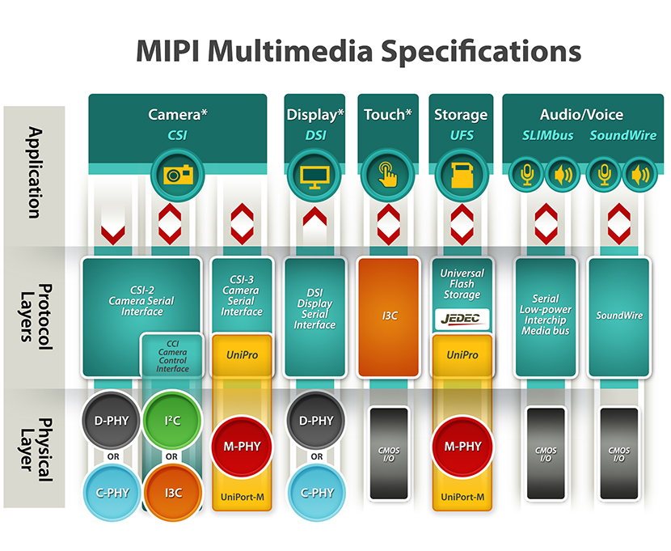

### DSI

MIPI DSI 是基于字节的协议，应用层完成各种操作下相关命令的选择、各像素点图像数据的字节映射处理。MIPI 定义了**命令模式**和**视频模式**两种传输模式。视频模式以实时像素数据流的方式从处理器向外设传输数据，而命令模式可以做到按需传输，只需要在图像内容发生变化时再进行新图像数据的传输。命令模式需要显示模组中的帧缓存存储器的支持。*这两种传输模式的支持，由模组硬件结构决定*。

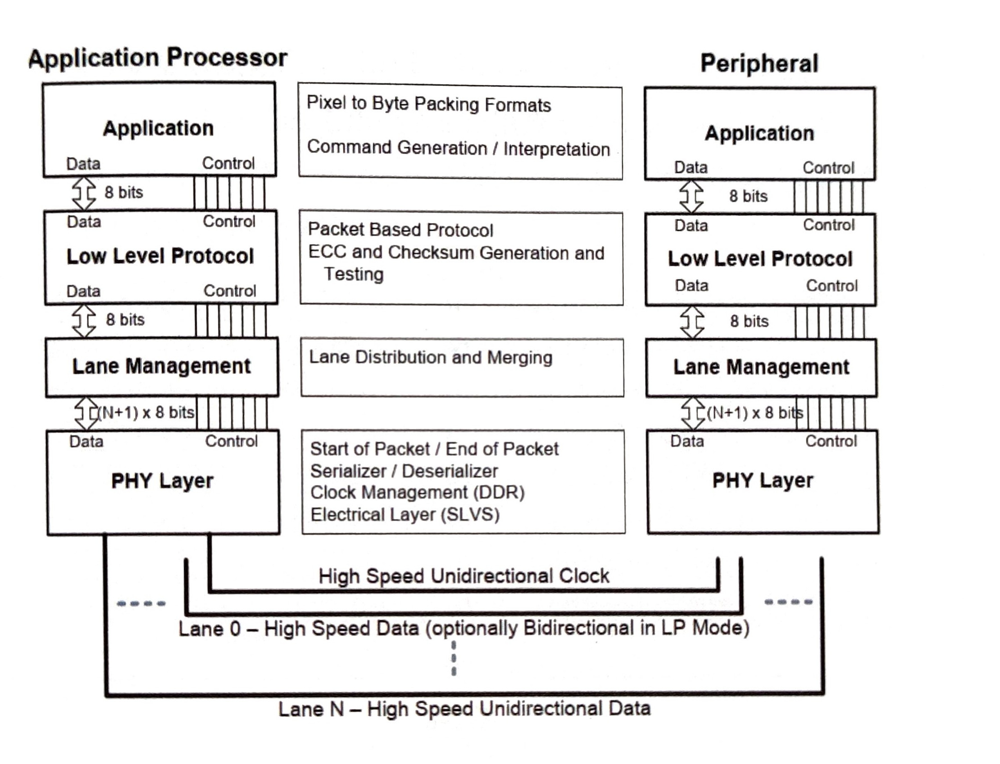

MIPI DSI 的高速数据传输采用差分信号来传输，在时钟通道和各个数据通道上都会有高速数据传输。

MIPI DSI 的低功耗数据传输并不需要时钟传输，这时 D-PHY 采用**归零码**的方式来表示逻辑数据“0” “1”，并且低功耗数据只会在数据通道**0**上进行传输，对通道**0**的P端和N端进行**异或**操作就可以恢复出数据比特流的“同步时钟”。

#### 视频模式

视频模式下，图像数据的传输是用**低阶协议层**包结构中的数据类型标识符（DT,Data Type）字段区分，用不同的 DT 来构造视频模式传输所需要的各种数据包。视频模式下，应用层只提供图像数据的净荷，利用低阶协议层进行组包处理。在 MIPI DSI 中，同步信号分为以下几个命令：

| 同步信号命令 | 功能        |
|--------------|-------------|
| HSS          | HSA开始命令 |
| HSE          | HSA结束命令 |
| VSS          | VSA开始命令 |
| VSE          | VSA结束命令 |

##### 非突发同步脉冲模式

##### 非突发同步事件模式

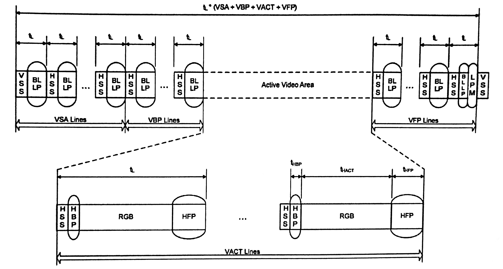

在这个模式下，不再向显示模组传输 HSE、VSE 命令，而仅仅传输 HSS、VSS 命令。

##### 突发模式

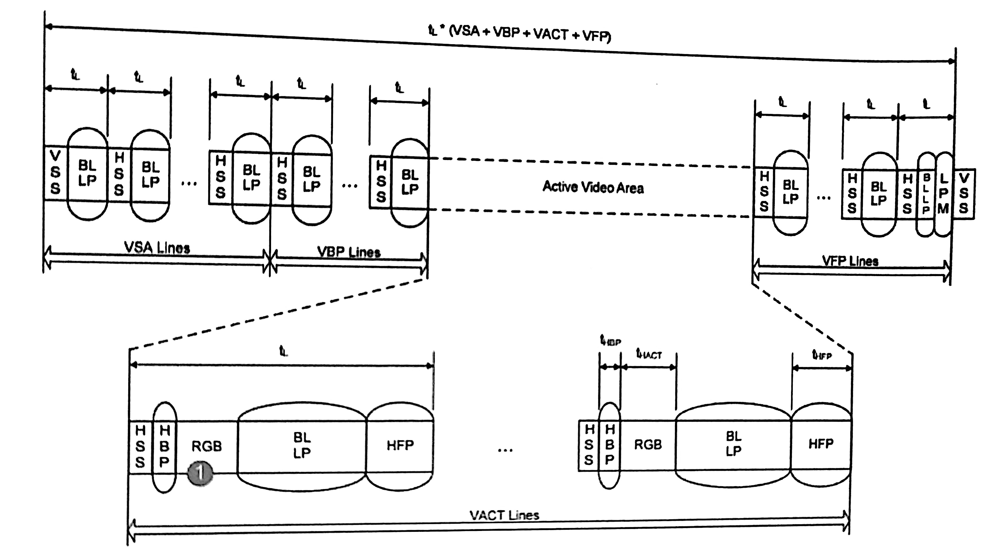

突发模式是指传输 RGB 图像数据时，充分利用 MIPI 提供的带宽，采用突发方式先把图像数据传输给显示模组进行缓存，然后切换到低功耗模式。**这种模式需要显示模组有行缓存区或类似的存储区域**。

常用的数据命令传输方式：

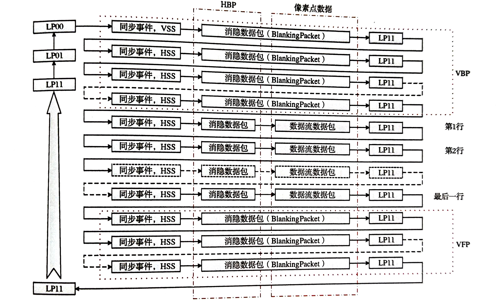

在有效显示行、行同步信号和有效数据之间，需要使用消隐包（blanking packet) 来填充相应的时间，在消隐行期间，没有图像数据传输，也用消隐包来替代。采用这种结构，一帧中的每一行，处于发送的时间都是相同的。

##### 图像数据包格式(DT=0x3E)

视频模式下，在应用层，只提供实时图像数据流，LLP层提供一定开销，通过所组数据包中的DI字段，形成VSS、HSS等时序命令，向从设备传递时序信息。RGB图像数据也通过 DI 字段的不同命令来传输。

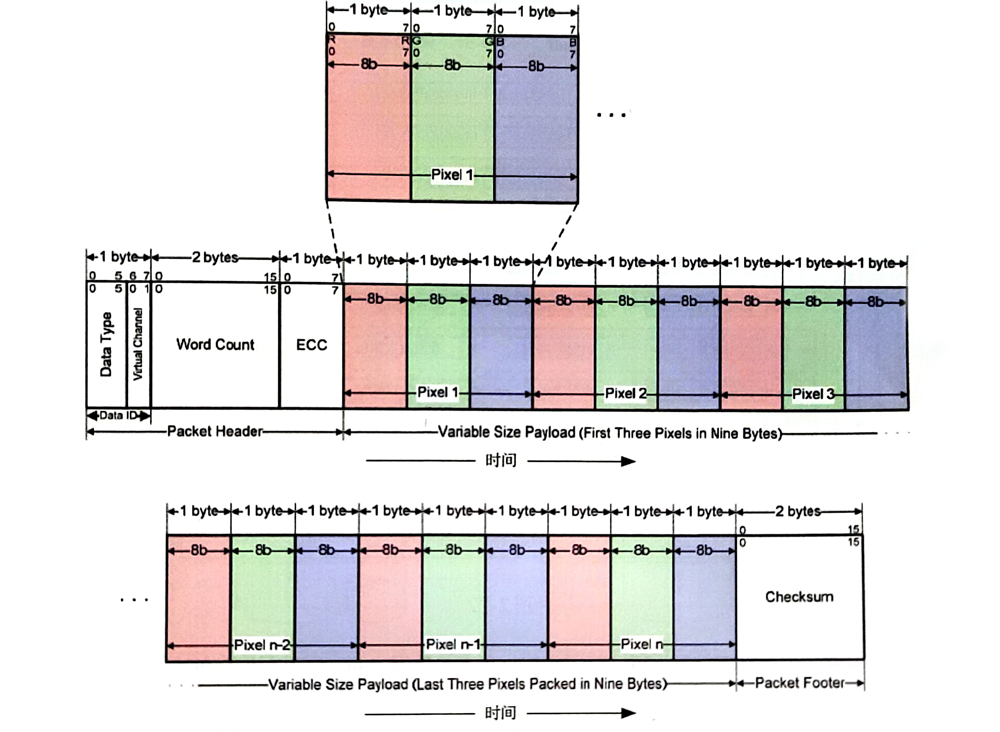

#### 低阶协议层 （LLP）

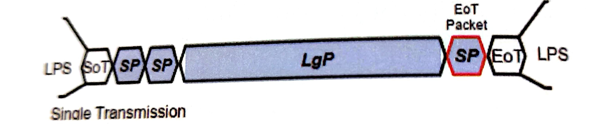

基于 MIPI DSI 物理层 D-PHY 的特殊结构，每个包在开始传输前，一定处于一个被称为低功耗模式的状态（LPS）。开始数据传输时，最先传输的是一种特殊的包结构——包开始指示（SoT, Start of Transmission）。SOT之后才传输 MIPI DSI 数据包。为了增加接口处理带宽，MIPI DSI 允许一次数据传输支持多个数据包，且长包和短包可以**任意顺序**出现。在同一次传输中，这些数据包要么都用高速传输模式，要么都用低功耗传输模式。

#### DSI 包结构

* 长包结构(最大65535字节的payload)
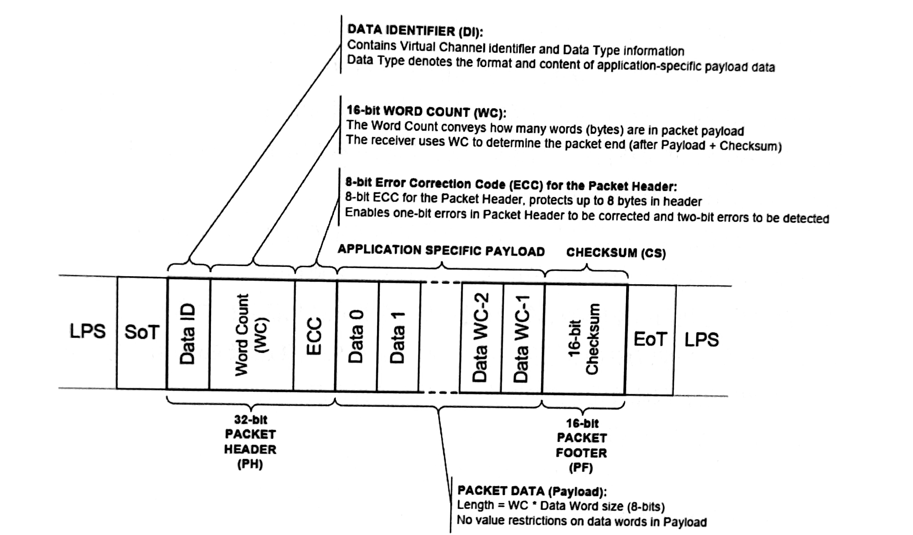

* 短包结构(固定传输两个字节)
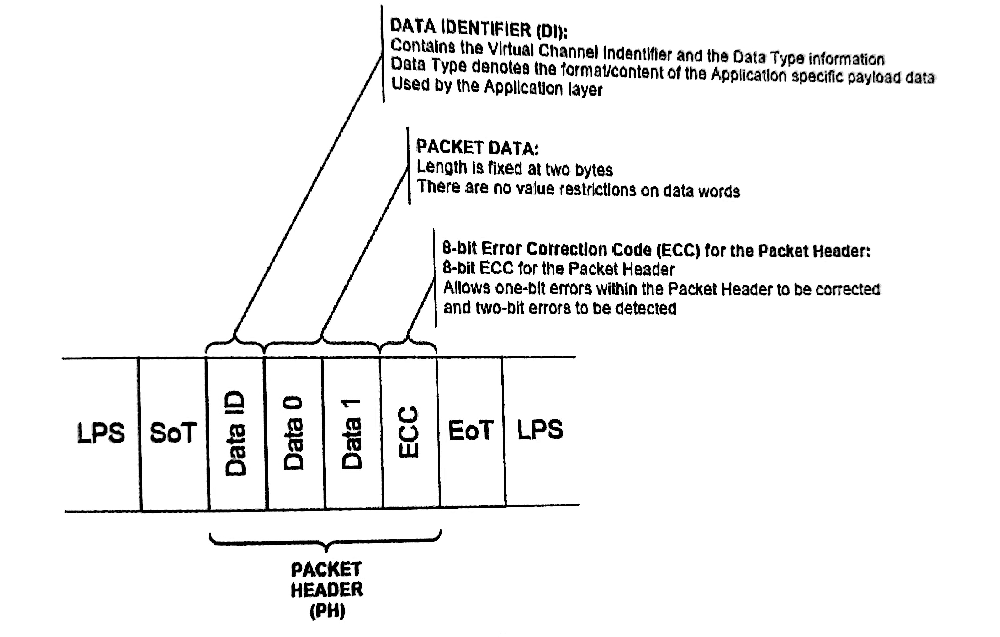

#### DSI 数据传输字节序

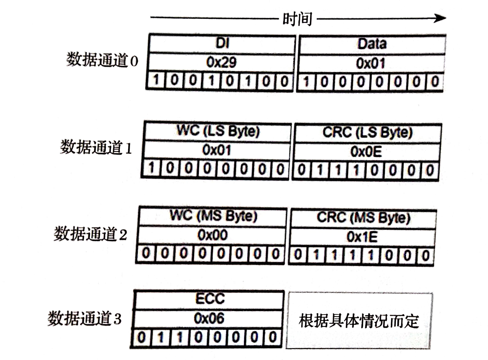

一个数据包内的各个字节按照低字节，低比特位先传。

#### 数据包类型标识符（DT）

* 正向数据传输的 DT

| DT 编码值 | DT 含义                       | 说明             | 长短包类型 |
|--------|-----------------------------|----------------|-------|
| 01h    | VSS ( V Sync Start )        | 帧同步开始数据包       | 短包    |
| 11h    | VSE ( V Sync End )          | 帧同步结束数据包       | 短包    |
| 21h    | HSS (H Sync Start )         | 行同步开始数据包       | 短包    |
| 31h    | HSE (H Sync End )           | 行同步结束数据包       | 短包    |
| 08h    | EoTp ( EoT Packet )         | 传输结束指示数据包      | 短包    |
| 02h    | Color Mode On Command       | 显示模组进入浅色显示模式   | 短包    |
| 12h    | Color Mode Off Command      | 显示模组恢复正常显示模式   | 短包    |
| 22h    | Shutdown Peripheral Command | 关闭显示模组命令       | 短包    |
| 32h    | Turn On Peripheral Command  | 激活显示模组命令       | 短包    |
| 03h    | Generic Short Write         | 通用短包写命令，不带参数   | 短包    |
| 13h    | Generic Short Write         | 通用短包写命令，带1字节参数 | 短包    |
| 23h    | Generic Short Write         | 通用短包写命令，带2字节参数 | 短包    |
| 04h    | Generic Read                | 通用读命令，不带参数     | 短包    |
| 14h    | Generic Read                | 通用读命令，带1字节参数   | 短包    |
| 24h    | Generic Read                | 通用读命令，带2字节参数   | 短包    |
| 05h    | DCS Short Write             | DCS短包写命令，不带参数   | 短包    |
| 15h    | DCS Short Write             | DCS短包写命令，带1字节参数 | 短包    |
| 06h    | DCS Read                    | DCS读命令，不带参数     | 短包    |
| 37h    | Set Maximum Return Packet   | 设置最大返回包长度      | 短包    |
| 09h    | Null Packet                 | 空包，不带数据         | 短包    |
| 19h    | Blanking Packet             | 消隐包，不带数据        | 长包    |
| 29h    | Generic Long Write          | 通用长包写命令          | 长包    |
| 39h    | DCS Long Write              | DCS长包写命令          | 长包    |
| 0Ch    | Loosely Packet Pixel Stream | 20比特4:2:2格式YUV像素流  | 长包    |
| 1Ch    | Packed Pixel Stream         | 24比特4:2:2格式YUV像素流  | 长包    |
| 2Ch    | Packed Pixel Stream         | 16比特4:2:2格式YUV像素流  | 长包    |
| 0Dh    | Packed Pixel Stream         | 30比特10:10:10格式RGB像素流  | 长包    |
| 1Dh    | Packed Pixel Stream         | 36比特12:12:12格式RGB像素流  | 长包    |
| 3Dh    | Packed Pixel Stream         | 12比特4:2:0格式YUV像素流   | 长包    |
| 0Eh    | Packed Pixel Stream         | 16比特5:6:7格式RGB像素流   | 长包    |
| 1Eh    | Packed Pixel Stream         | 18比特6:6:6格式RGB像素流   | 长包    |
| 2Eh    | Loosely Packet Pixel Stream | 18比特6:6:6格式RGB像素流   | 长包    |
| 3Eh    | Packed Pixel Stream         | 24比特8:8:8格式RGB像素流   | 长包    |

* 反向数据传输的 DT

| DT 编码值 | DT 含义                       | 说明             | 长短包类型 |
|--------|-----------------------------|----------------|-------|
| 02h    | Acknowledge Error Report    | 错误应答报告       | 短包    |
| 08h    | EoTp ( EoT Packet )         | 传输结束指示数据包      | 短包    |
| 11h    | Generic Short Read Response | 通用短包读响应，返回1字节数据  | 短包    |
| 12h    | Generic Short Read Response | 通用短包读响应，返回2字节数据  | 短包    |
| 21h    | DCS Short Read Response     | DCS短包读响应，返回1字节数据  | 短包    |
| 22h    | DCS Short Read Response     | DCS短包读响应，返回2字节数据  | 短包    |
| 1Ah    | Generic Long Read Response  | 通用长包读响应              | 长包    |
| 1Ch    | DCS Long Read Response      | DCS长包读响应              | 长包    |

其中的错误应答报告数据包的各个比特的含义如下：

| 比特位 | 含义      |
|----|-------------|
| 0  | 传输开始错误   |
| 1  | 传输开始同步错误 |
| 2  | 传输结束同步错误 |
| 3  | 逃逸模式进入命令错误 |
| 4  | 低功耗传输同步错误  |
| 5  | 外设超时错误     |
| 6  | 错误控制错误     |
| 7  | 冲突检测错误     |
| 8  | 单比特ECC错误 （检测到，且已纠正） |
| 9  | 多比特ECC错误 （检测到，但未纠正） |
| 10 | CRC错误       |
| 11 | 无法识别的DSI数据类型 |
| 12 | 无效的虚拟通道号  |
| 13 | 无效的数据长度    |
| 14 | 保留位 |
| 15 | DSI协议违例 |

不管是正向数据传输还是反向数据传输，都有 EoTp 的数据类型，DT 值为08h，虚拟通道号**固定为0**。

当从设备同时有其他数据包需要传输回主处理器时，应答和错误报告数据包必须是**最后一个**传输的数据包。如果没有检测到任何错误，应该和错误数据包也可以不传输。

#### 链路管理层

MIPI DSI 是一个数据通道灵活可变的数据传输系统，对于一个指定的系统，一旦上电后，支持的通道数量也就固定下来了，不能在工作过程中进行修改。MIPI DSI 数据包传输使用多个数据通道时，每个通道发起各自的 SoT,所以每个通道的第一个字节发送时间是相同的，但是EoT却不尽然。接收端必须等全部通道的数据收集完毕后才能把数据送给低阶协议层。

#### MIPI D-PHY

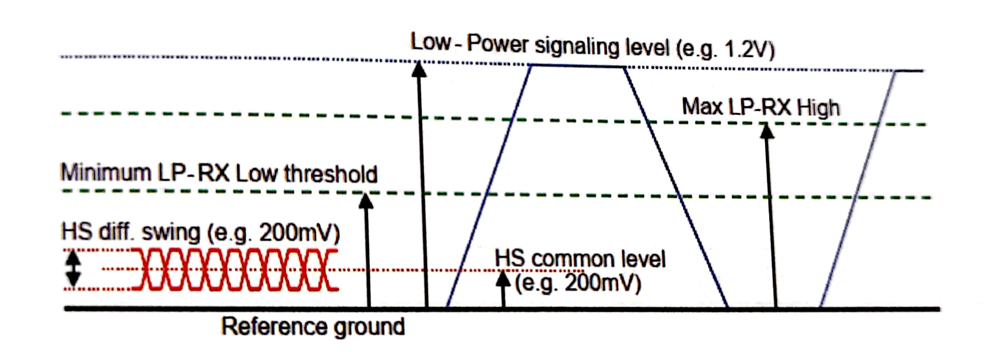

一个通道两根信号的电平值确定了 D-PHY 的工作状态。分别把两个信号线用 Dp、Dn来表示，MIPI 通道的电平状态有以下几种：

* HS-0: 高速模式下的逻辑0，Dp=差分低电平（100mV），Dn=差分高电平（300mV）
* HS-1: 高速模式下的逻辑1，Dp=差分高电平（300mV），Dn=差分低电平（100mV）
* LP-00: Dp 和 Dn 都是低功耗信令低电平
* LP-11: Dp 和 Dn 都是低功耗信令高电平。也称为停止状态，MIPI 主机和设备之间无法进行任何数据通信。
* LP-01: Dp 是低功耗信令低电平，Dn 是低功耗信令高电平
* LP-10: Dp 是低功耗信令高电平，Dn 是低功耗信令低电平

处于停止状态时，需要Dp、Dn上的特定电平序列才能进入允许数据/命令传输的状态，这些特定的电平序列被称为**传输请求**。

| Dp Dn 电平序列 | 传输请求类型 |
|------------|---------|
| LP11 -> LP01 -> LP00 | 高速数据传输请求 |
| LP11 -> LP10 -> LP00 -> LP01 -> LP00 | 逃逸模式请求 |
| LP11 -> LP10 -> LP00 -> LP10 -> LP00 | （总线方向）反转请求 |

##### 总线方向反转（Bus Turn Around）

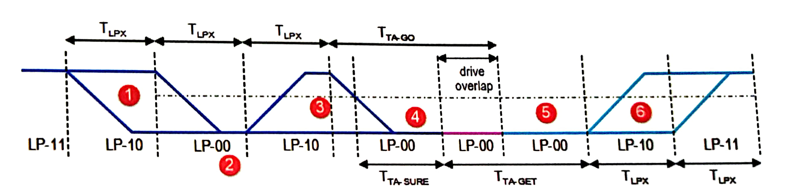

图中1号区域代表**低功耗请求**，3号区域代表**反转请求**，6号区域代表**反转应答**

##### 逃逸模式

逃逸模式是低功耗模式下的一种特殊场景，用来实现一些特定功能。进入逃逸模式后传输的第一个字节被称为**Entry Command**或**逃逸命令**，它确定了进入逃逸模式后实现什么样的功能。

| 字节值 | 命令名称 | 含义 |
|----|------|----|
| 87h | 低功耗数据传输命令 | 模式命令，表示后面需要进行低功耗数据传输 |
| 78h | 超低功耗状态命令 | 模式命令，表示后面需要进行超低功耗状态 |
| 46h | 复位触发（远端应用）命令 | 触发类型命令 |

低功耗数据传输示例：
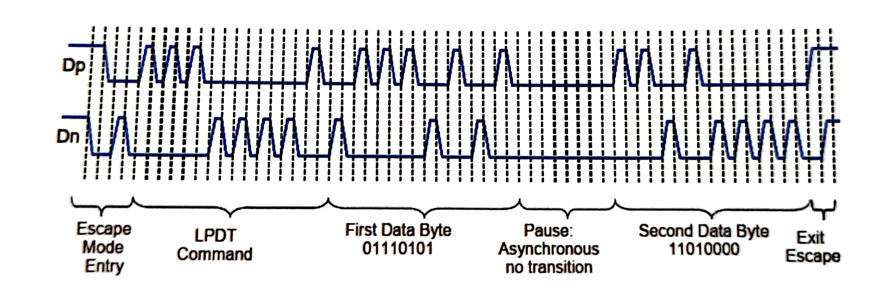

低功耗模式下的传输速率上限是10Mbps,且只能在数据通道0上进行数据传输。

##### 高速模式

高速模式传输数据时，时钟通道必须要**先**进入高速模式，反之，退出高速模式时，时钟通道要在数据通道退出高速模式之后一定时间才能退出高速模式。

* 时钟通道进入高速模式：
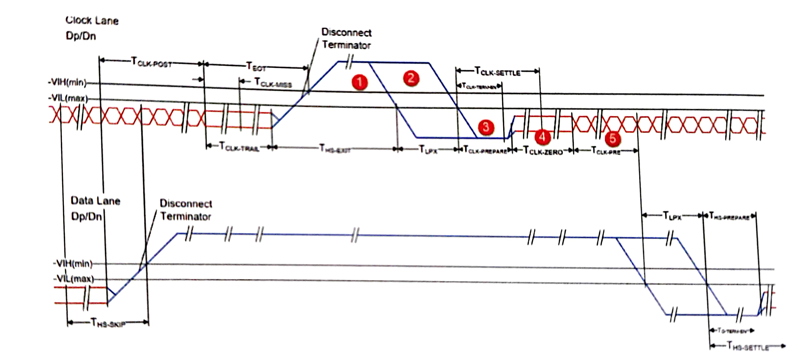
  * 图中的1,2,3部分是高速模式请求序列
  * 第4段表示，时钟进入高速模式时，先驱动一定时间的信号`0`
  * 第5段表示最后输出的高速差分时钟信号

* 数据通道进入高速模式：
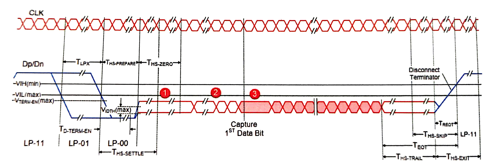
  * 与时钟通道进入高速模式不同，数据通道需要额外的**高速同步序列**，图中的第2段，该同步序列为一个字节：0xB8
