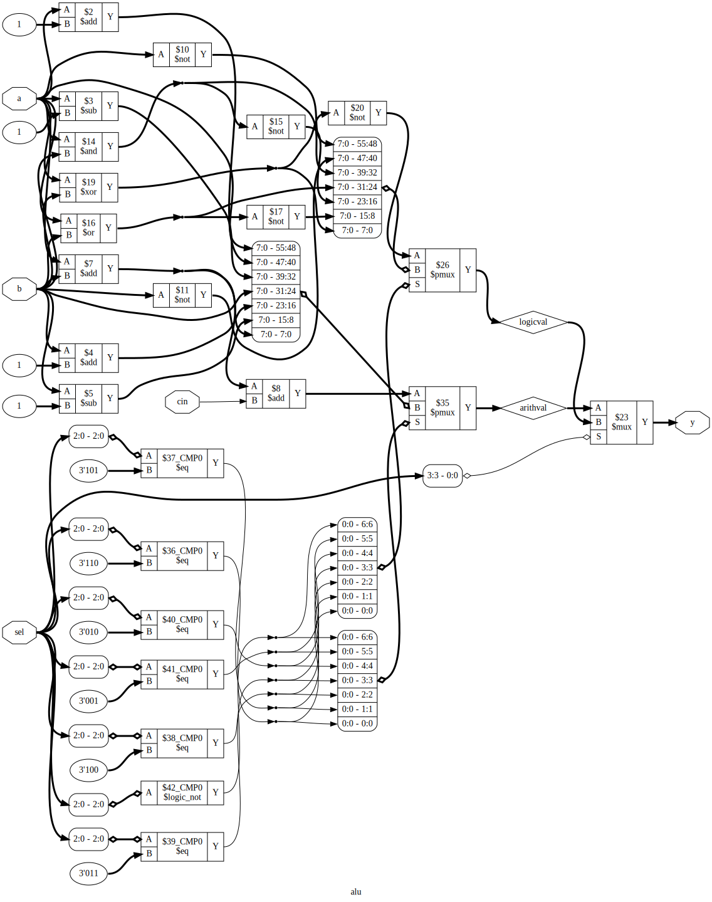

# Yosys 基础

> 建议使用 pip 安装 WebAssembly 打包后的 Yosys 开源工具链： <https://yowasp.org/>

## 测试用例代码

```verilog
module alu(a, b, cin, sel, y);
  input [7:0] a, b;
  input cin;
  input [3:0] sel;
  output [7:0] y;

  reg [7:0] y;
  reg [7:0] arithval;
  reg [7:0] logicval;

  // 算术执行单元
  always @(a or b or cin or sel) begin
    case (sel[2:0])
      3'b000  : arithval = a;
      3'b001  : arithval = a + 1;
      3'b010  : arithval = a - 1;
      3'b011  : arithval = b;
      3'b100  : arithval = b + 1;
      3'b101  : arithval = b - 1;
      3'b110  : arithval = a + b;
      default : arithval = a + b + cin;
    endcase
  end

  // 逻辑处理单元
  always @(a or b or sel) begin
    case (sel[2:0])
      3'b000  : logicval =  ~a;
      3'b001  : logicval =  ~b;
      3'b010  : logicval = a & b;
      3'b011  : logicval = a | b;
      3'b100  : logicval =  ~((a & b));
      3'b101  : logicval =  ~((a | b));
      3'b110  : logicval = a ^ b;
      default : logicval =  ~(a ^ b);
    endcase
  end

  // 输出选择单元
  always @(arithval or logicval or sel) begin
    case (sel[3])
      1'b0    : y = arithval;
      default : y = logicval;
    endcase
  end

endmodule
```

## 使用 Yosys 进行综合

1. 启动 Yosys：`yosys`
2. 读取 Verilog 文件： `read_verilog alu.v`
3. 检查模块例化结构： `hierarchy -check`
4. 逻辑综合于优化：`proc; opt; opt; fsm; memory; opt`
5. 生成网表文件：`write_verilog alu_synth.v`
6. 输出综合后的逻辑图：`show -format dot -prefix ./alu`


